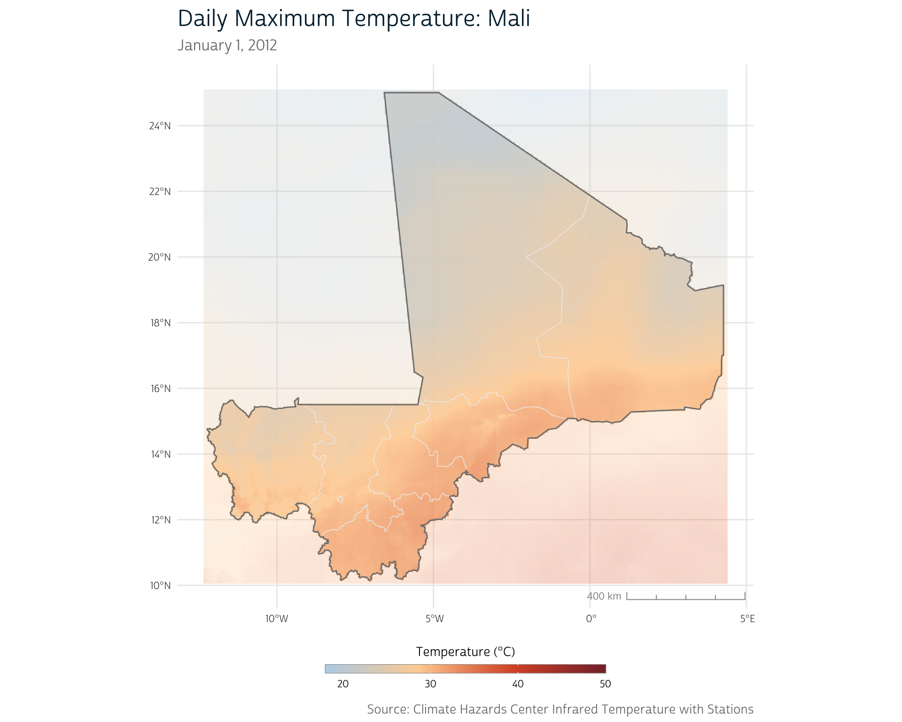
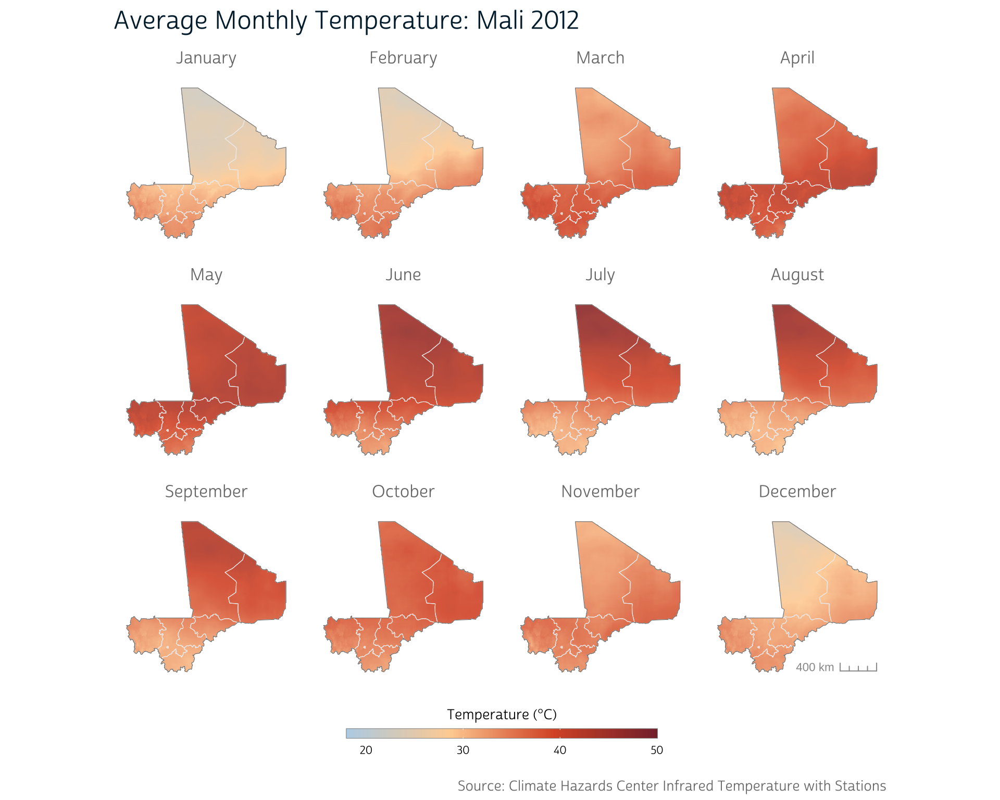
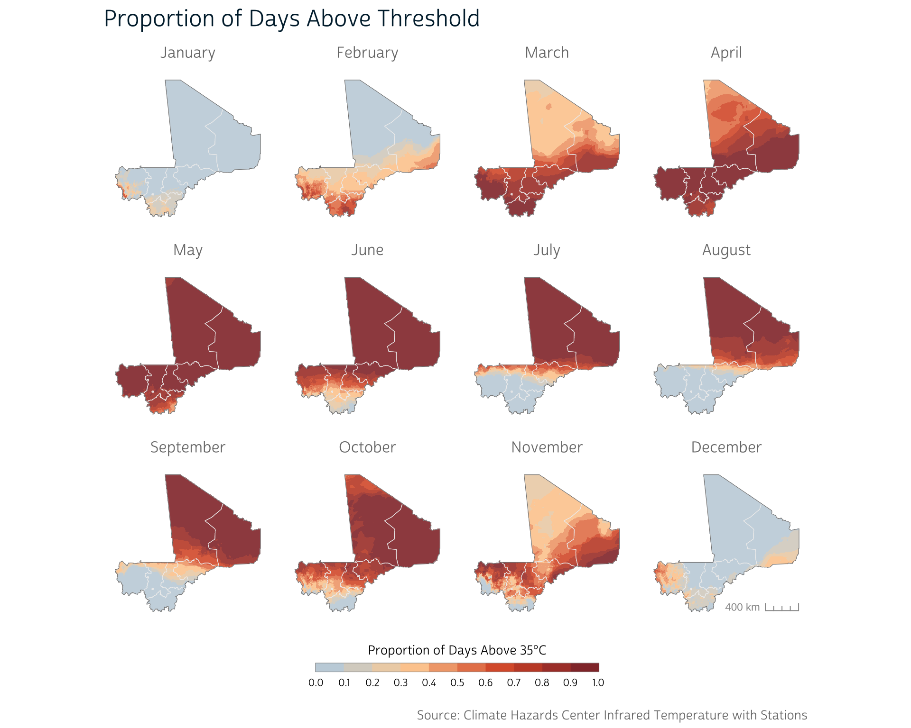
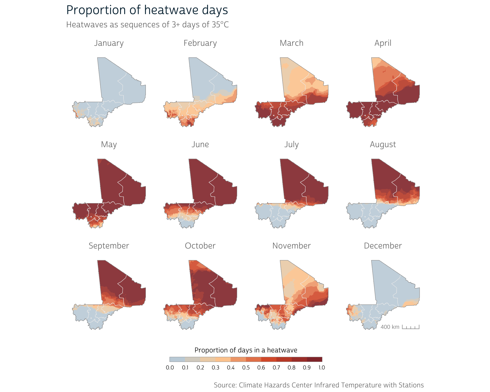
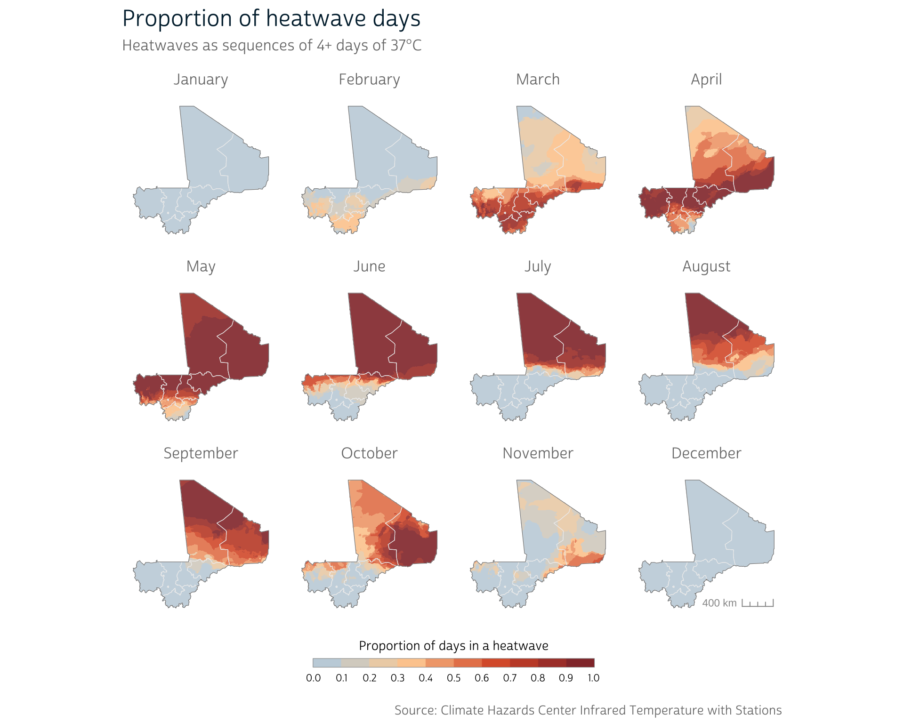
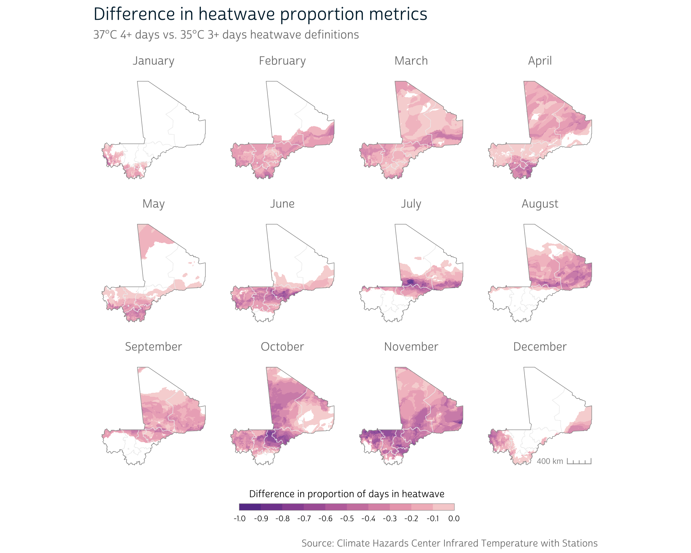

```{r setup}
#| echo: false
# save the built-in output hook
hook_output <- knitr::knit_hooks$get("output")

# set a new output hook to truncate text output
knitr::knit_hooks$set(output = function(x, options) {
  if (!is.null(n <- options$out.lines)) {
    x <- xfun::split_lines(x)
    if (length(x) > n) {
      # truncate the output
      x <- c(head(x, n), "....\n")
    }
    x <- paste(x, collapse = "\n")
  }
  hook_output(x, options)
})
```

In our [previous technical post](../2024-02-04-dhs-chirps/index.html),
we showed how to reduce a daily time series of environmental data for an
entire country into a single digestible metric that can be attached to
[DHS survey](https://www.dhsprogram.com/) data for use in an analysis.

However, as we mentioned then, a long-run average isn't always the most
appropriate way to aggregate raster values across time. As an example,
imagine we were interested in the impacts of **extreme heat** on child
**birth weight**. The proximate conditions in the several months
preceding each child's birth are likely to be more consequential for
that child's health than the average conditions over many
years.[@Grace2021]

# A new approach

To explore this idea, we could instead aggregate temperature data to the
a more fine-grained temporal level and selectively consider the
temperature in a specified time range before each child's birth.

Fortunately, DHS surveys do record some temporal information, including
the timing of the survey interview as well as birth dates for survey
respondents and children. But these details are recorded at the
**monthly** level. To account for the uncertainty in the dates reported
in DHS surveys, we need to aggregate our CHIRTS data to the monthly
level as well.

This approach adds three key dimensions to the techniques introduced in
our precipitation post. We need to:

1.  calculate a temperature exposure metric at the monthly level
2.  identify the relevant months of temperature data for each child
    based on their recorded birth month
3.  summarize each child's temperature exposure using their individual
    monthly time series of temperature data

This post focuses on the first item; our next post in this series will
consider the other two. First, we'll show how to obtain the necessary
data for this demonstration, which come from [IPUMS
DHS](https://www.idhsdata.org/idhs/) and the [Climate Hazards
Center](https://chc.ucsb.edu/) (CHC). Then, we'll build on some of the
tools and techniques presented in our [first technical
post](../2024-02-04-dhs-chirps/index.html) to demonstrate several ways
to operationalize and calculate temperature exposure at the monthly
level.

Before we get started, we'll load the main packages that we'll use in
this post:

```{r}
#| message: false
library(ipumsr)
library(terra)
library(sf)
library(ggplot2)
library(ggspatial)
```

# Data preparation

## DHS boundaries

For this series, we'll use the 2012 DHS sample for Mali. We won't be
working with the survey data until our next post, but we will be using
the integrated administrative boundary files from IPUMS in our maps.

You can download the boundary data directly from IPUMS DHS by clicking
the **shapefile** link under the Mali section of [this
table](https://www.idhsdata.org/idhs/gis.shtml). We’ve placed this
shapefile in the `data/gps` directory within our project.

[Previously](../2024-02-04-dhs-chirps/#loading-cluster-coordinates), we
unzipped the shapefile and loaded it with `st_read()` from the sf
package. However, since IPUMS often distributes shapefiles in zip
archives, ipumsr provides `read_ipums_sf()` as a way to read a shapefile
directly without manually extracting the compressed files. We'll use
this convenience to load our boundary data into an `sf` object:

```{r}
ml_borders <- read_ipums_sf("data/gps/geo_ml1995_2018.zip")

ml_borders
```

Our boundary file includes borders for individual administrative units
within Mali. However, it's often useful to have a single external border
for spatial operations and mapping.

To combine internal borders, we can use `st_union()` from `{sf}`.
However, in this case, we first need to simplify our file so that
`st_union()` works properly.

::: callout-tip
For some spatial files, small misalignments may cause problems for
certain spatial operations. Often, you'll notice these issues in your
maps if errant lines or points appear in unexpected places. You can
check whether a file is topologically valid with `st_is_valid()`.
:::

We use `st_make_valid()` to correct some of these issues. Then, we can
combine our internal geometries with `st_union()` and simplify our
external border slightly.

```{r}
# Validate internal borders
ml_borders_neat <- st_make_valid(ml_borders)

# Collapse internal borders to get single country border
ml_borders_out <- ml_borders_neat |> 
  st_union() |> 
  st_simplify(dTolerance = 1000) |> 
  st_as_sf()
```

Now, we have both detailed internal borders as well as a single country
border.

## CHIRTS

For our temperature data, we'll use the [Climate Hazards Center Infrared
Temperature with Stations](https://www.chc.ucsb.edu/data/chirtsdaily)
(CHIRTS) dataset.[@Funk2019] CHIRTS provides daily estimates for several
temperature metrics at a 0.05° (\~5 kilometer) raster resolution. CHIRTS
provides estimates of the following measures:

-   Daily maximum air temperature (2 meters above ground)
-   Daily minimum air temperature (2 meters above ground)
-   Daily average relative humidity
-   Daily average heat index

The most appropriate metric will depend on the nature of your research.
For instance, relevant temperature metrics for studying the effects of
heat on the human body are likely different from those used for studying
agricultural productivity.

For health research, it's also worth considering the specifics of the
population of interest, as they may employ adaptive strategies or be at
increased risk of heat exposure due to common pre-existing conditions or
lifestyle features.[@Vanos2020]

Since this post focuses specifically on R techniques (and not on
methodological considerations), we'll keep it simple and use **daily
maximum air temperature**.

There are two ways to go about obtaining the CHIRTS data: either via
manual download or via the `{chirps}` R package.

### Manual download

CHIRTS data for Africa can be [downloaded
directly](http://data.chc.ucsb.edu/products/CHIRTSdaily/v1.0/africa_netcdf_p05/)
from the Climate Hazards Center.

Data are distributed as
[NetCDF](https://www.unidata.ucar.edu/software/netcdf/) files, a common
format for distributing scientific raster data structures. NetCDF files
contain metadata about the file contents (for instance, about the
temporal or spatial dimensions of the data), which will be useful later
when we aggregate data to the monthly level.

You'll notice that the files—each of which contains a full year's worth
of data for the entire continent of Africa—contain 3.3 *Giga*bytes of
data apiece. For this demonstration, we'll therefore only download a
single year of data.

::: callout-note
## Climatological Normals

When dealing with environmental data, it's often necessary to have a
long time series of data to establish a stable *climatological normal*,
or baseline, to which to compare current observations. 30-year normals
are commonly used, but their use has recently been questioned due to the
acceleration of extreme weather frequency.[@Livezey2007]

Because of the space and time required to obtain data to calculate
normals at a high resolution, we won't be creating normals from CHIRTS
in this post, but you may see them in the literature.
:::

We're working with the 2012 Mali sample from IPUMS DHS for this example,
so we'll download the `Tmax.2012.nc` file from the [CHC
listing](http://data.chc.ucsb.edu/products/CHIRTSdaily/v1.0/africa_netcdf_p05/).
We've placed this file in the `data` directory.

Fortunately, we don't need to learn any new tools to handle this file,
as support for NetCDF is already built into `{terra}`. We can easily
load the raster with `rast()`:

<div class="cell">
<div class="code-copy-outer-scaffold"><div class="sourceCode" id="cb4"><pre class="downlit sourceCode r code-with-copy"><code class="sourceCode R"><span><span class="va">ml_chirts</span> <span class="op">&lt;-</span> <span class="fu"><a href="https://rspatial.github.io/terra/reference/rast.html">rast</a></span><span class="op">(</span><span class="st">"data/Tmax.2012.nc"</span><span class="op">)</span></span></code></pre></div><button title="Copy to Clipboard" class="code-copy-button"><i class="bi"></i></button></div>
</div>

In this post we'll be particularly interested in the temporal dimension
of our raster data. Typically, a raster stack will represent time in
layers, where each layer represents the recorded values at a particular
point in time. terra's `SpatRaster` objects have a built-in
representation of time, which can be accessed with the `time()`
function:

<div class="cell" data-out.lines="3">
<div class="code-copy-outer-scaffold"><div class="sourceCode" id="cb5"><pre class="downlit sourceCode r code-with-copy"><code class="sourceCode R"><span><span class="fu"><a href="https://rspatial.github.io/terra/reference/time.html">time</a></span><span class="op">(</span><span class="va">ml_chirts</span><span class="op">)</span></span>
<span><span class="co">#&gt;   [1] "2012-01-01" "2012-01-02" "2012-01-03" "2012-01-04" "2012-01-05"</span></span>
<span><span class="co">#&gt;   [6] "2012-01-06" "2012-01-07" "2012-01-08" "2012-01-09" "2012-01-10"</span></span>
<span><span class="co">#&gt;  [11] "2012-01-11" "2012-01-12" "2012-01-13" "2012-01-14" "2012-01-15"</span></span>
<span><span class="va">....</span></span></code></pre></div><button title="Copy to Clipboard" class="code-copy-button"><i class="bi"></i></button></div>
</div>

We can see that the temporal information contained in the NetCDF file
was automatically included when we loaded this raster into R. Each of
these dates correspond to a layer in the `SpatRaster`. This temporal
representation will become useful when we aggregate temperature to the
monthly level.

#### Crop CHIRTS raster

Downloading data from the CHC provides a raster for the entire African
continent. We can greatly speed up our future processing by cropping
this raster to our area of interest using the Mali borders that we
loaded above.

First, we'll add a 10 kilometer buffer around the country border so that
we retain the CHIRTS data just outside of the country as well. That way,
if any DHS clusters fall in the border regions of the country, we will
still be able to calculate temperature metrics in their general
vicinity.

We've covered buffering [in the
past](../2024-02-04-dhs-chirps/#cluster-buffers) if you need to refresh
your memory on this process.

```{r}
# Transform to UTM 29N coordinates, buffer, and convert back to WGS84
ml_borders_buffer <- ml_borders_out |> 
  st_transform(crs = 32629) |> 
  st_buffer(dist = 10000) |>
  st_transform(crs = 4326)
```

Finally, we can crop the CHIRTS raster to our buffered border region
with terra's `crop()`:

<div class="cell">
<div class="code-copy-outer-scaffold"><div class="sourceCode" id="cb7"><pre class="downlit sourceCode r code-with-copy"><code class="sourceCode R"><span><span class="va">ml_chirts</span> <span class="op">&lt;-</span> <span class="fu"><a href="https://rspatial.github.io/terra/reference/crop.html">crop</a></span><span class="op">(</span><span class="va">ml_chirts</span>, <span class="va">ml_borders_buffer</span>, snap <span class="op">=</span> <span class="st">"out"</span><span class="op">)</span></span></code></pre></div><button title="Copy to Clipboard" class="code-copy-button"><i class="bi"></i></button></div>
</div>

### Access via the chirps package

You may recall from our [previous technical
post](../2024-02-04-dhs-chirps/#option-2-the-chirps-package) that CHC
data can be obtained via the `{chirps}` package in R. This package
provides access to CHIRTS data as well.

You can obtain CHIRTS from the chirps package by providing a spatial
boundary representing the area of interest for which the CHIRTS raster
data should be obtained. You'll also need to specify a temporal range
and temperature variable.

In this case, we'll use the buffered administrative borders for Mali
that we downloaded earlier, specify the 2012 time range, and select the
`"Tmax"` variable:

```{r}
#| eval: false
ml_chirts2 <- chirps::get_chirts(
  vect(ml_borders_buffer), 
  dates = c("2012-01-01", "2012-12-31"),
  var = "Tmax"
)
```

::: column-margin
We convert our administrative borders to a terra `SpatVector` object
with `vect()` because this is the spatial structure expected by
`get_chirts()`.
:::

In contrast to the NetCDF files provided when downloading CHIRTS data
directly, obtaining data via the chirps package does not provide any
temporal metadata:

<div class="cell" data-out.lines="3">
<div class="code-copy-outer-scaffold"><div class="sourceCode" id="cb9"><pre class="downlit sourceCode r code-with-copy"><code class="sourceCode R"><span><span class="fu"><a href="https://rspatial.github.io/terra/reference/time.html">time</a></span><span class="op">(</span><span class="va">ml_chirts2</span><span class="op">)</span></span>
<span><span class="co">#&gt;   [1] NA NA NA NA NA NA NA NA NA NA NA NA NA NA NA NA NA NA NA NA NA NA NA NA NA</span></span>
<span><span class="co">#&gt;  [26] NA NA NA NA NA NA NA NA NA NA NA NA NA NA NA NA NA NA NA NA NA NA NA NA NA</span></span>
<span><span class="co">#&gt;  [51] NA NA NA NA NA NA NA NA NA NA NA NA NA NA NA NA NA NA NA NA NA NA NA NA NA</span></span>
<span><span class="va">....</span></span></code></pre></div><button title="Copy to Clipboard" class="code-copy-button"><i class="bi"></i></button></div>
</div>

Since we know that we have a full year of data, we can construct the
temporal metadata manually. We'll use the `{lubridate}` package to make
this a little easier:

<div class="cell" data-out.lines="3">
<div class="code-copy-outer-scaffold"><div class="sourceCode" id="cb10"><pre class="downlit sourceCode r code-with-copy"><code class="sourceCode R"><span><span class="co"># Convert strings to Date objects specifying year-month-day (ymd) format:</span></span>
<span><span class="va">start</span> <span class="op">&lt;-</span> <span class="fu">lubridate</span><span class="fu">::</span><span class="fu"><a href="https://lubridate.tidyverse.org/reference/ymd.html">ymd</a></span><span class="op">(</span><span class="st">"2012-01-01"</span><span class="op">)</span></span>
<span><span class="va">end</span> <span class="op">&lt;-</span> <span class="fu">lubridate</span><span class="fu">::</span><span class="fu"><a href="https://lubridate.tidyverse.org/reference/ymd.html">ymd</a></span><span class="op">(</span><span class="st">"2012-12-31"</span><span class="op">)</span></span>
<span></span>
<span><span class="co"># Set time as a daily sequence of dates for all of 2012</span></span>
<span><span class="fu"><a href="https://rspatial.github.io/terra/reference/time.html">time</a></span><span class="op">(</span><span class="va">ml_chirts2</span><span class="op">)</span> <span class="op">&lt;-</span> <span class="fu"><a href="https://rdrr.io/r/base/seq.html">seq</a></span><span class="op">(</span><span class="va">start</span>, <span class="va">end</span>, by <span class="op">=</span> <span class="st">"days"</span><span class="op">)</span></span>
<span></span>
<span><span class="fu"><a href="https://rspatial.github.io/terra/reference/time.html">time</a></span><span class="op">(</span><span class="va">ml_chirts2</span><span class="op">)</span></span>
<span><span class="co">#&gt;   [1] "2012-01-01" "2012-01-02" "2012-01-03" "2012-01-04" "2012-01-05"</span></span>
<span><span class="co">#&gt;   [6] "2012-01-06" "2012-01-07" "2012-01-08" "2012-01-09" "2012-01-10"</span></span>
<span><span class="co">#&gt;  [11] "2012-01-11" "2012-01-12" "2012-01-13" "2012-01-14" "2012-01-15"</span></span>
<span><span class="va">....</span></span></code></pre></div><button title="Copy to Clipboard" class="code-copy-button"><i class="bi"></i></button></div>
</div>

::: callout-caution
Manually attaching time units works in this case because we know the
CHIRTS data have no gaps. However, there's no built-in check to ensure
that you're attaching the correct date to each layer of the raster
stack, so you'll want to be sure you know what time units are truly
represented by each layer before assigning them manually.
:::

At this point, we should have a daily raster for the region around Mali.
We can take a peek by mapping the temperature distribution on a single
day of our CHIRTS time series:

::: column-margin
We're not going to explicitly demonstrate how we produce our maps in
this post since some are fairly complicated to set up. If you're
curious, you can peek at the collapsed code blocks to see how each of
our maps are produced.
:::

{fig-alt="Mali daily maximum temperature on January 1, 2012." .column-page width="100%"}

# Calculating monthly temperature metrics

As we mentioned in the introduction, our ultimate goal is to identify
the temperature trends prior to each birth in our DHS sample. However,
DHS survey data record temporal information about interviews and births
at the **monthly** level. Thus, the most accurate we can be is to
identify temperature running up to the **month** immediately prior to a
child's birth.

We therefore need to aggregate our daily CHIRTS data to the monthly
level. In the rest of the post, we'll demonstrate how to calculate
several possible monthly metrics in R. Then, in a future post, we'll
demonstrate how to attach the monthly CHIRTS data to each record in our
DHS sample.

::: callout-note
## Defining Heat Exposure

A vast array of methods to identify extreme temperature and heatwave
exposure exist in the literature, and we can't demonstrate the
processing required for each and every one. However, the approaches we
demonstrate should give you a sense of the tools and techniques
available for you when working with temperature data in your own
research.
:::

## 1. Average monthly temperature

For our first metric, we'll take a simple approach and calculate an
average monthly temperature.

[Previously](../2024-02-04-dhs-chirps/#summarize-precipitation-values),
we introduced terra's `mean()` method, which allows you to calculate a
single mean across all layers of a `SpatRaster` object. In this case, we
also want to calculate a mean, but we need to adapt our approach so we
can do so for each month independently.

Enter terra's `tapp()` function. `tapp()` allows you to apply a function
to **groups of raster layers**. You can indicate which layers should be
grouped together with the `index` argument. For instance, to
independently calculate the mean of the first three layers and the
second three layers, we could use the following `index`:

<div class="cell">
<div class="code-copy-outer-scaffold"><div class="sourceCode" id="cb13"><pre class="downlit sourceCode r code-with-copy"><code class="sourceCode R"><span><span class="fu"><a href="https://rspatial.github.io/terra/reference/tapp.html">tapp</a></span><span class="op">(</span></span>
<span>  <span class="va">ml_chirts</span><span class="op">[[</span><span class="fl">1</span><span class="op">:</span><span class="fl">6</span><span class="op">]</span><span class="op">]</span>, <span class="co"># Select the first 6 layers to demo</span></span>
<span>  fun <span class="op">=</span> <span class="va">mean</span>, </span>
<span>  index <span class="op">=</span> <span class="fu"><a href="https://rdrr.io/r/base/c.html">c</a></span><span class="op">(</span><span class="fl">1</span>, <span class="fl">1</span>, <span class="fl">1</span>, <span class="fl">2</span>, <span class="fl">2</span>, <span class="fl">2</span><span class="op">)</span></span>
<span><span class="op">)</span></span>
<span><span class="co">#&gt; class       : SpatRaster </span></span>
<span><span class="co">#&gt; dimensions  : 301, 335, 2  (nrow, ncol, nlyr)</span></span>
<span><span class="co">#&gt; resolution  : 0.05, 0.05  (x, y)</span></span>
<span><span class="co">#&gt; extent      : -12.35, 4.399999, 10.05, 25.1  (xmin, xmax, ymin, ymax)</span></span>
<span><span class="co">#&gt; coord. ref. : lon/lat WGS 84 </span></span>
<span><span class="co">#&gt; source(s)   : memory</span></span>
<span><span class="co">#&gt; names       :       X1,       X2 </span></span>
<span><span class="co">#&gt; min values  : 20.32146, 21.20080 </span></span>
<span><span class="co">#&gt; max values  : 35.77333, 35.86034</span></span></code></pre></div><button title="Copy to Clipboard" class="code-copy-button"><i class="bi"></i></button></div>
</div>

Notice that this produces an output `SpatRaster` with 2 layers: the
first represents the mean of the first 3 layers in the input, and the
second represents the mean of the next 3 layers.

However, manually identifying the index layers for each month of the
year would be tedious and error-prone. Not only would we have to type
out code to handle 366 days of data, but we would also have to contend
with the fact that months vary in length. And depending on your time
frame and region of interest, you may also need to account for leap
years or entirely different calendars!

Fortunately, terra provides us with an easier way. Because we have a
`time` component to our data, we can use the temporal metadata already
attached to our raster as the index. For instance, to aggregate by
month, simply use `index = "months"`:

<div class="cell">
<div class="code-copy-outer-scaffold"><div class="sourceCode" id="cb14"><pre class="downlit sourceCode r code-with-copy"><code class="sourceCode R"><span><span class="va">ml_chirts_mean</span> <span class="op">&lt;-</span> <span class="fu"><a href="https://rspatial.github.io/terra/reference/tapp.html">tapp</a></span><span class="op">(</span><span class="va">ml_chirts</span>, fun <span class="op">=</span> <span class="va">mean</span>, index <span class="op">=</span> <span class="st">"months"</span><span class="op">)</span></span>
<span></span>
<span><span class="va">ml_chirts_mean</span></span>
<span><span class="co">#&gt; class       : SpatRaster </span></span>
<span><span class="co">#&gt; dimensions  : 301, 335, 12  (nrow, ncol, nlyr)</span></span>
<span><span class="co">#&gt; resolution  : 0.05, 0.05  (x, y)</span></span>
<span><span class="co">#&gt; extent      : -12.35, 4.399999, 10.05, 25.1  (xmin, xmax, ymin, ymax)</span></span>
<span><span class="co">#&gt; coord. ref. : lon/lat WGS 84 (CRS84) (OGC:CRS84) </span></span>
<span><span class="co">#&gt; source(s)   : memory</span></span>
<span><span class="co">#&gt; names       :      m_1,      m_2,      m_3,      m_4,      m_5,      m_6, ... </span></span>
<span><span class="co">#&gt; min values  : 20.13009, 21.27224, 27.66812, 29.93578, 29.76501, 26.91157, ... </span></span>
<span><span class="co">#&gt; max values  : 35.44701, 38.60472, 40.72202, 42.85499, 44.10707, 47.46994, ... </span></span>
<span><span class="co">#&gt; time (mnts) : Jan to Dec</span></span></code></pre></div><button title="Copy to Clipboard" class="code-copy-button"><i class="bi"></i></button></div>
</div>

As expected, we now have 12 layers in our output `SpatRaster` (see the
`dimensions` component of the output above). Each layer contains the
average daily maximum temperature (in degrees Celsius) for the given
month, as shown below.

{fig-alt="Average monthly maximum temperature, Mali 2012." .column-page width="100%"}

Note that the CHC does provide a [CHIRTS
product](https://chc.ucsb.edu/data/chirtsmonthly) that has been
pre-aggregated to the monthly level. For projects relying on average
monthly temperature, this is likely a better option than manually
aggregating more fine-grained CHIRTS data.

However, the advantage to working with *daily* CHIRTS data is that we
have the flexibility to calculate our own custom monthly temperature
metrics that aren't necessarily provided out-of-the-box. We'll
demonstrate one in the next section.

## 2. Days above a temperature threshold {#days-above}

Average temperature may be a straightforward monthly temperature metric,
but it doesn't do a very good job of capturing acute temperature
**anomalies**. When it comes to human health, evidence suggests that
temperatures above certain thresholds are associated with physiological
impairments, though the precise threshold depends on several
factors.[@Vanos2020] Regardless, these extreme events may be masked when
we average across an entire month.

To explore this possibility, we'll calculate the proportion of days in
each month that exceed a certain raw temperature threshold. We'll use
35°C as our threshold, which represents a value near the upper end of
Mali's temperature distribution[@Grace2021] and is similar to other
commonly used (though occasionally questionable) thresholds.[@Vanos2020]

::: column-margin
Typically, you would want a more thorough justification of your
threshold temperature. This post is not intended to represent a real
analysis, so we select 35°C for the purposes of demonstration.
:::

### Logical raster operations

We can exploit the fact that terra supports logical operations on
`SpatRaster` objects to help us calculate this metric. For instance, we
can compare the entire raster to a set value with the familiar `>`
operator:

<div class="cell">
<div class="code-copy-outer-scaffold"><div class="sourceCode" id="cb16"><pre class="downlit sourceCode r code-with-copy"><code class="sourceCode R"><span><span class="va">ml_bin</span> <span class="op">&lt;-</span> <span class="va">ml_chirts</span> <span class="op">&gt;</span> <span class="fl">35</span></span></code></pre></div><button title="Copy to Clipboard" class="code-copy-button"><i class="bi"></i></button></div>
</div>

This produces a binary raster, where each pixel in each layer receives a
logical value based on whether it is above or below 35 degrees Celsius
(note that the `min values` and `max values` for each layer are now
`TRUE` or `FALSE`):

<div class="cell">
<div class="code-copy-outer-scaffold"><div class="sourceCode" id="cb17"><pre class="downlit sourceCode r code-with-copy"><code class="sourceCode R"><span><span class="va">ml_bin</span></span>
<span><span class="co">#&gt; class       : SpatRaster </span></span>
<span><span class="co">#&gt; dimensions  : 301, 335, 366  (nrow, ncol, nlyr)</span></span>
<span><span class="co">#&gt; resolution  : 0.05, 0.05  (x, y)</span></span>
<span><span class="co">#&gt; extent      : -12.35, 4.399999, 10.05, 25.1  (xmin, xmax, ymin, ymax)</span></span>
<span><span class="co">#&gt; coord. ref. : lon/lat WGS 84 (CRS84) (OGC:CRS84) </span></span>
<span><span class="co">#&gt; source      : spat_d3403e6edae9_54080_GdaPwXHptgIOPSx.tif </span></span>
<span><span class="co">#&gt; varname     : Tmax (Climate Hazards Center Tmax) </span></span>
<span><span class="co">#&gt; names       : Tmax_1, Tmax_2, Tmax_3, Tmax_4, Tmax_5, Tmax_6, ... </span></span>
<span><span class="co">#&gt; min values  :  FALSE,  FALSE,  FALSE,  FALSE,  FALSE,  FALSE, ... </span></span>
<span><span class="co">#&gt; max values  :   TRUE,   TRUE,   TRUE,   TRUE,   TRUE,   TRUE, ... </span></span>
<span><span class="co">#&gt; time (days) : 2012-01-01 to 2012-12-31</span></span></code></pre></div><button title="Copy to Clipboard" class="code-copy-button"><i class="bi"></i></button></div>
</div>

We can use this to count the number of days above the 35°C threshold for
each pixel in our raster. We simply need to sum the binary raster layers
within each month to count the number of days that exceed the threshold
at each pixel location.

::: column-margin
When treating logical values as numeric, `TRUE` is treated as a `1` and
`FALSE` is treated as a `0`.
:::

However, we also need to account for the fact that not all months
contain the same number of days. We therefore produce a *proportion* of
each month's days that meet our temperature threshold by dividing by the
number of days in each month.

For binary data, this turns out to be the same as calculating a mean, so
we can use a similar approach as we did when calculating average monthly
temperature. The difference is that we now provide our binary raster
(`ml_bin`) to the `tapp()` function:

<div class="cell">
<div class="code-copy-outer-scaffold"><div class="sourceCode" id="cb18"><pre class="downlit sourceCode r code-with-copy"><code class="sourceCode R"><span><span class="va">ml_prop</span> <span class="op">&lt;-</span> <span class="fu"><a href="https://rspatial.github.io/terra/reference/tapp.html">tapp</a></span><span class="op">(</span><span class="va">ml_bin</span>, fun <span class="op">=</span> <span class="va">mean</span>, index <span class="op">=</span> <span class="st">"months"</span><span class="op">)</span></span></code></pre></div><button title="Copy to Clipboard" class="code-copy-button"><i class="bi"></i></button></div>
</div>

Once again, we end up with a `SpatRaster` with 12 layers. However, in
this case, each raster pixel reflects the proportion of days above 35°
in that month.

{fig-alt="Proportion of days above 35 degrees Celsius by month, Mali 2012." .column-page width="100%"}

This approach reveals a bit more detail about the *consistency* of the
temperature exposure during certain months. As we can see, some months
are spent almost entirely above 35°C across the country. This continual
exposure may be more strongly related to health than the averages we
calculated in the section above.

## 3. Heatwaves: Consecutive days above a temperature threshold

Continual exposure to high temperatures likely has a more pronounced
health impact than isolated hot days. Accordingly, most heatwave
definitions attempt to identify **sequences** of days that meet certain
temperature criteria.

We can build upon our previous temperature metric to produce a simple
heatwave definition that identifies all days that belong to a sequence
of 3+ days in a row that all meet the 35°C threshold used earlier.

How should we go about identifying sequences of days? To simplify
things, let's pull out the daily CHIRTS values for a single pixel in our
raster to use as an example:

<div class="cell" data-out.lines="3">
<div class="code-copy-outer-scaffold"><div class="sourceCode" id="cb20"><pre class="downlit sourceCode r code-with-copy"><code class="sourceCode R"><span><span class="co"># Extract values from a single pixel of CHIRTS data</span></span>
<span><span class="va">px1</span> <span class="op">&lt;-</span> <span class="fu"><a href="https://rdrr.io/r/base/numeric.html">as.numeric</a></span><span class="op">(</span><span class="va">ml_chirts</span><span class="op">[</span><span class="fl">1</span>, <span class="fl">1</span><span class="op">]</span><span class="op">)</span></span>
<span></span>
<span><span class="va">px1</span></span>
<span><span class="co">#&gt;   [1] 22.08196 22.25259 24.63318 25.46410 25.11430 24.69748 25.71723 27.64781</span></span>
<span><span class="co">#&gt;   [9] 25.00261 22.27929 24.83206 22.42412 24.87811 28.53550 27.20606 26.75240</span></span>
<span><span class="co">#&gt;  [17] 22.12105 22.98229 20.55801 19.10251 20.74286 22.91010 22.37615 22.23903</span></span>
<span><span class="va">....</span></span></code></pre></div><button title="Copy to Clipboard" class="code-copy-button"><i class="bi"></i></button></div>
</div>

As we demonstrated above, it's easy to identify the layers that are
above a given threshold:

<div class="cell" data-out.lines="3">
<div class="code-copy-outer-scaffold"><div class="sourceCode" id="cb21"><pre class="downlit sourceCode r code-with-copy"><code class="sourceCode R"><span><span class="va">px1_bin</span> <span class="op">&lt;-</span> <span class="va">px1</span> <span class="op">&gt;</span> <span class="fl">35</span></span>
<span></span>
<span><span class="va">px1_bin</span></span>
<span><span class="co">#&gt;   [1] FALSE FALSE FALSE FALSE FALSE FALSE FALSE FALSE FALSE FALSE FALSE FALSE</span></span>
<span><span class="co">#&gt;  [13] FALSE FALSE FALSE FALSE FALSE FALSE FALSE FALSE FALSE FALSE FALSE FALSE</span></span>
<span><span class="co">#&gt;  [25] FALSE FALSE FALSE FALSE FALSE FALSE FALSE FALSE FALSE FALSE FALSE FALSE</span></span>
<span><span class="va">....</span></span></code></pre></div><button title="Copy to Clipboard" class="code-copy-button"><i class="bi"></i></button></div>
</div>

But how do we extract *sequences* from this vector? One option is to
exploit the features of [run-length
encoding](https://en.wikipedia.org/wiki/Run-length_encoding). Run-length
encoding represents a vector of values as a sequence of *runs* of a
single value and the *length* of that run.

We can use the `rle()` function from base R to convert to run-length
encoding:

<div class="cell">
<div class="code-copy-outer-scaffold"><div class="sourceCode" id="cb22"><pre class="downlit sourceCode r code-with-copy"><code class="sourceCode R"><span><span class="va">px1_rle</span> <span class="op">&lt;-</span> <span class="fu"><a href="https://rdrr.io/r/base/rle.html">rle</a></span><span class="op">(</span><span class="va">px1_bin</span><span class="op">)</span></span>
<span></span>
<span><span class="va">px1_rle</span></span>
<span><span class="co">#&gt; Run Length Encoding</span></span>
<span><span class="co">#&gt;   lengths: int [1:23] 81 1 16 1 30 11 3 3 7 1 ...</span></span>
<span><span class="co">#&gt;   values : logi [1:23] FALSE TRUE FALSE TRUE FALSE TRUE ...</span></span></code></pre></div><button title="Copy to Clipboard" class="code-copy-button"><i class="bi"></i></button></div>
</div>

The output shows us that the `px1_bin` vector starts with a run of 81
`FALSE` values, then has a run of 1 `TRUE` value, then 16 `FALSE`
values, and so on. As you can see, run-length encoding provides us both
with information about the *values* and the *sequencing* of our input
vector.

If we define a heatwave as any sequence of 3+ days above the temperature
threshold, each heatwave will be represented by entries with a *value*
of `TRUE` (days that exceeded the threshold) **and** a *length* (number
of days in a row) of 3 or more. We can use logical operations to
identify whether each run is a heatwave or not:

<div class="cell" data-out.lines="3">
<div class="code-copy-outer-scaffold"><div class="sourceCode" id="cb23"><pre class="downlit sourceCode r code-with-copy"><code class="sourceCode R"><span><span class="co"># Identify days that were above threshold and belonged to a 3+ day sequence</span></span>
<span><span class="va">is_heatwave</span> <span class="op">&lt;-</span> <span class="va">px1_rle</span><span class="op">$</span><span class="va">values</span> <span class="op">&amp;</span> <span class="op">(</span><span class="va">px1_rle</span><span class="op">$</span><span class="va">lengths</span> <span class="op">&gt;=</span> <span class="fl">3</span><span class="op">)</span></span>
<span></span>
<span><span class="va">is_heatwave</span></span>
<span><span class="co">#&gt;  [1] FALSE FALSE FALSE FALSE FALSE  TRUE FALSE  TRUE FALSE FALSE FALSE  TRUE</span></span>
<span><span class="co">#&gt; [13] FALSE  TRUE FALSE  TRUE FALSE  TRUE FALSE  TRUE FALSE  TRUE FALSE</span></span></code></pre></div><button title="Copy to Clipboard" class="code-copy-button"><i class="bi"></i></button></div>
</div>

Summing this vector will give us the number of unique *heatwave events*
during the year for this sample pixel:

<div class="cell">
<div class="code-copy-outer-scaffold"><div class="sourceCode" id="cb24"><pre class="downlit sourceCode r code-with-copy"><code class="sourceCode R"><span><span class="fu"><a href="https://rdrr.io/r/base/sum.html">sum</a></span><span class="op">(</span><span class="va">is_heatwave</span><span class="op">)</span></span>
<span><span class="co">#&gt; [1] 8</span></span></code></pre></div><button title="Copy to Clipboard" class="code-copy-button"><i class="bi"></i></button></div>
</div>

We could also get the proportion of days that are within those heatwaves
by summing the lengths of all the heatwave events and dividing by the
number of total days:

<div class="cell">
<div class="code-copy-outer-scaffold"><div class="sourceCode" id="cb25"><pre class="downlit sourceCode r code-with-copy"><code class="sourceCode R"><span><span class="co"># Extract lengths for each heatwave event</span></span>
<span><span class="va">heatwave_lengths</span> <span class="op">&lt;-</span> <span class="va">px1_rle</span><span class="op">$</span><span class="va">lengths</span><span class="op">[</span><span class="va">is_heatwave</span><span class="op">]</span></span>
<span></span>
<span><span class="va">heatwave_lengths</span></span>
<span><span class="co">#&gt; [1]  11   3   4 101   4   8   3   7</span></span>
<span></span>
<span><span class="co"># Proportion of days belonging to a heatwave</span></span>
<span><span class="fu"><a href="https://rdrr.io/r/base/sum.html">sum</a></span><span class="op">(</span><span class="va">heatwave_lengths</span><span class="op">)</span> <span class="op">/</span> <span class="fu"><a href="https://rdrr.io/r/base/length.html">length</a></span><span class="op">(</span><span class="va">px1</span><span class="op">)</span></span>
<span><span class="co">#&gt; [1] 0.3852459</span></span></code></pre></div><button title="Copy to Clipboard" class="code-copy-button"><i class="bi"></i></button></div>
</div>

### Custom functions

If we want to calculate the proportion of heatwave days across our
entire raster, we can again return to `tapp()`. However, there's no
built-in function (like `mean`) that we can use to do the processing we
walked through above.

Instead, we must provide our own **custom function** to indicate the
processing that `tapp()` should perform on each set of layers. To define
a function, we use the `function()` keyword along with several
*arguments*.

::: callout-note
## Note

A function's arguments are the input parameters that the user can set
when calling the function.
:::

At its simplest, all this requires is copying the code we've already
written above (we've consolidated the code into single lines in some
cases):

<div class="cell">
<div class="code-copy-outer-scaffold"><div class="sourceCode" id="cb26"><pre class="downlit sourceCode r code-with-copy"><code class="sourceCode R"><span><span class="va">prop_heatwave</span> <span class="op">&lt;-</span> <span class="kw">function</span><span class="op">(</span><span class="va">temps</span><span class="op">)</span> <span class="op">{</span></span>
<span>  <span class="co"># Convert to RLE of days above threshold</span></span>
<span>  <span class="va">bin_rle</span> <span class="op">&lt;-</span> <span class="fu"><a href="https://rdrr.io/r/base/rle.html">rle</a></span><span class="op">(</span><span class="va">temps</span> <span class="op">&gt;=</span> <span class="fl">35</span><span class="op">)</span></span>
<span>  </span>
<span>  <span class="co"># Identify heatwave events based on sequence length</span></span>
<span>  <span class="va">is_heatwave</span> <span class="op">&lt;-</span> <span class="va">bin_rle</span><span class="op">$</span><span class="va">values</span> <span class="op">&amp;</span> <span class="op">(</span><span class="va">bin_rle</span><span class="op">$</span><span class="va">lengths</span> <span class="op">&gt;=</span> <span class="fl">3</span><span class="op">)</span></span>
<span>  </span>
<span>  <span class="co"># Count heatwave days and divide by total number of days</span></span>
<span>  <span class="fu"><a href="https://rdrr.io/r/base/sum.html">sum</a></span><span class="op">(</span><span class="va">bin_rle</span><span class="op">$</span><span class="va">lengths</span><span class="op">[</span><span class="va">is_heatwave</span><span class="op">]</span><span class="op">)</span> <span class="op">/</span> <span class="fu"><a href="https://rdrr.io/r/base/length.html">length</a></span><span class="op">(</span><span class="va">temps</span><span class="op">)</span></span>
<span><span class="op">}</span></span></code></pre></div><button title="Copy to Clipboard" class="code-copy-button"><i class="bi"></i></button></div>
</div>

Note that we do the exact same processing as we did in our step-by-step
walkthrough. The only difference is that instead of using the `px1`
variable (which contains the values for a single pixel), we instead use
a more general argument, which we call `temps`. `temps` stands in for
any arbitrary input vector that the function user can provide (we've
named it `temps` to help make it clear that this should be a vector of
temperature values). This means that we can easily run the same
calculation on different vectors:

<div class="cell">
<div class="code-copy-outer-scaffold"><div class="sourceCode" id="cb27"><pre class="downlit sourceCode r code-with-copy"><code class="sourceCode R"><span><span class="co"># Extract 2 pixels for demonstration</span></span>
<span><span class="va">px1</span> <span class="op">&lt;-</span> <span class="fu"><a href="https://rdrr.io/r/base/numeric.html">as.numeric</a></span><span class="op">(</span><span class="va">ml_chirts</span><span class="op">[</span><span class="fl">1</span>, <span class="fl">1</span><span class="op">]</span><span class="op">)</span></span>
<span><span class="va">px2</span> <span class="op">&lt;-</span> <span class="fu"><a href="https://rdrr.io/r/base/numeric.html">as.numeric</a></span><span class="op">(</span><span class="va">ml_chirts</span><span class="op">[</span><span class="fl">1</span>, <span class="fl">2</span><span class="op">]</span><span class="op">)</span></span>
<span></span>
<span><span class="co"># Calculate heatwave proportions for each pixel</span></span>
<span><span class="fu">prop_heatwave</span><span class="op">(</span><span class="va">px1</span><span class="op">)</span></span>
<span><span class="co">#&gt; [1] 0.3852459</span></span>
<span></span>
<span><span class="fu">prop_heatwave</span><span class="op">(</span><span class="va">px2</span><span class="op">)</span></span>
<span><span class="co">#&gt; [1] 0.3852459</span></span></code></pre></div><button title="Copy to Clipboard" class="code-copy-button"><i class="bi"></i></button></div>
</div>

#### Writing a more flexible function

Right now, the user of the function has no way to modify the temperature
threshold or sequence length used in the heatwave definition, because
those values (`35` and `3`) are **hard-coded** into our function.

If we move these values to the function arguments, we allow the *user*
to decide what values these parameters should take. Here is a modified
version of `prop_heatwave()` that does this:

<div class="cell">
<div class="code-copy-outer-scaffold"><div class="sourceCode" id="cb28"><pre class="downlit sourceCode r code-with-copy"><code class="sourceCode R"><span><span class="va">prop_heatwave</span> <span class="op">&lt;-</span> <span class="kw">function</span><span class="op">(</span><span class="va">temps</span>, <span class="va">thresh</span>, <span class="va">n_seq</span><span class="op">)</span> <span class="op">{</span></span>
<span>  <span class="co"># Convert to RLE of days above threshold</span></span>
<span>  <span class="va">bin_rle</span> <span class="op">&lt;-</span> <span class="fu"><a href="https://rdrr.io/r/base/rle.html">rle</a></span><span class="op">(</span><span class="va">temps</span> <span class="op">&gt;=</span> <span class="va">thresh</span><span class="op">)</span></span>
<span>  </span>
<span>  <span class="co"># Identify heatwave events based on sequence length</span></span>
<span>  <span class="va">is_heatwave</span> <span class="op">&lt;-</span> <span class="va">bin_rle</span><span class="op">$</span><span class="va">values</span> <span class="op">&amp;</span> <span class="op">(</span><span class="va">bin_rle</span><span class="op">$</span><span class="va">lengths</span> <span class="op">&gt;=</span> <span class="va">n_seq</span><span class="op">)</span></span>
<span>  </span>
<span>  <span class="co"># Count heatwave days and divide by total number of days</span></span>
<span>  <span class="fu"><a href="https://rdrr.io/r/base/sum.html">sum</a></span><span class="op">(</span><span class="va">bin_rle</span><span class="op">$</span><span class="va">lengths</span><span class="op">[</span><span class="va">is_heatwave</span><span class="op">]</span><span class="op">)</span> <span class="op">/</span> <span class="fu"><a href="https://rdrr.io/r/base/length.html">length</a></span><span class="op">(</span><span class="va">temps</span><span class="op">)</span></span>
<span><span class="op">}</span></span></code></pre></div><button title="Copy to Clipboard" class="code-copy-button"><i class="bi"></i></button></div>
</div>

Our function now has a `thresh` argument and an `n_seq` argument. Where
we previously would have compared our input `temps` vector to the
threshold of `35`, we now compare it to the value the user provides to
`thresh`. Similarly, where we previously would have used sequences of
length `3` or more, we now use the sequence length the user provides to
`n_seq`.

Using the values of 35 and 3 produces the same heatwave proportion as
above:

<div class="cell">
<div class="code-copy-outer-scaffold"><div class="sourceCode" id="cb29"><pre class="downlit sourceCode r code-with-copy"><code class="sourceCode R"><span><span class="fu">prop_heatwave</span><span class="op">(</span><span class="va">px1</span>, thresh <span class="op">=</span> <span class="fl">35</span>, n_seq <span class="op">=</span> <span class="fl">3</span><span class="op">)</span></span>
<span><span class="co">#&gt; [1] 0.3852459</span></span></code></pre></div><button title="Copy to Clipboard" class="code-copy-button"><i class="bi"></i></button></div>
</div>

But now we can easily change our inputs to calculate modified heatwave
definitions. For instance, to find the proportion of days in 4+ day
heatwaves of at least 37°C:

<div class="cell">
<div class="code-copy-outer-scaffold"><div class="sourceCode" id="cb30"><pre class="downlit sourceCode r code-with-copy"><code class="sourceCode R"><span><span class="fu">prop_heatwave</span><span class="op">(</span><span class="va">px1</span>, thresh <span class="op">=</span> <span class="fl">37</span>, n_seq <span class="op">=</span> <span class="fl">4</span><span class="op">)</span></span>
<span><span class="co">#&gt; [1] 0.3114754</span></span></code></pre></div><button title="Copy to Clipboard" class="code-copy-button"><i class="bi"></i></button></div>
</div>

This example demonstrates how function arguments can be used to produce
a more *flexible* function that can be easily applied across a range of
input parameters. Building functions in this way has a bit of an
up-front cost, but it often pays for itself by making your future
analysis much more robust and scalable.

### Scaling up

Now that we have a function to calculate our heatwave definition, we can
provide it to `tapp()` with our desired temperature threshold and
sequence parameters.

<div class="cell">
<div class="code-copy-outer-scaffold"><div class="sourceCode" id="cb31"><pre class="downlit sourceCode r code-with-copy"><code class="sourceCode R"><span><span class="co"># Apply our custom heatwave counter to each month</span></span>
<span><span class="va">ml_heatwave_prop</span> <span class="op">&lt;-</span> <span class="fu"><a href="https://rspatial.github.io/terra/reference/tapp.html">tapp</a></span><span class="op">(</span></span>
<span>  <span class="va">ml_chirts</span>, </span>
<span>  fun <span class="op">=</span> <span class="kw">function</span><span class="op">(</span><span class="va">x</span><span class="op">)</span> <span class="fu">prop_heatwave</span><span class="op">(</span><span class="va">x</span>, thresh <span class="op">=</span> <span class="fl">35</span>, n_seq <span class="op">=</span> <span class="fl">3</span><span class="op">)</span>, </span>
<span>  index <span class="op">=</span> <span class="st">"months"</span></span>
<span><span class="op">)</span></span></code></pre></div><button title="Copy to Clipboard" class="code-copy-button"><i class="bi"></i></button></div>
</div>

::: callout-note
## Anonymous Function Syntax

Our `fun` argument above is written in *anonymous function syntax*. It
may look a little complex, but remember that `tapp()` expects you to
provide a *function* to its `fun` argument. Whichever function you
provide should be a function of the vector of values for each pixel in
the input raster.

`function(x) prop_heatwave(x, ...)` indicates that we want to provide
each of these vectors `x` to our `prop_heatwave()` function (as the
`temps` argument). The `thresh` and `n_seq` arguments are fixed across
all pixels. (In this case, `x` is just a placeholder to reference the
vector inputs to our function. We could just as easily use another name,
but `x` is traditional and concise.)

Why didn't we use this syntax in previous sections? Well, it turns out
that `fun = mean` was simply a shorthand. Writing
`fun = function(x) mean(x)` would have also worked!
:::

Let's see what the distribution of heatwave days looks like under our
latest definition:

{fig-alt="Proportion of heatwave days by month, Mali 2012, 3+ days, 35°C." .column-page width="100%"}

Because we've built a flexible `prop_heatwave()` function, we can easily
calculate a different heatwave definition. For heatwaves of 4+ days of
37°C+, for instance:

{fig-alt="Proportion of heatwave days by month, Mali 2012, 4+ days, 37°C." .column-page width="100%"}

It can be difficult to see the differences side-by-side, but we can
subtract the output rasters to easily examine the differences between
the two definitions:

<div class="cell">
<div class="code-copy-outer-scaffold"><div class="sourceCode" id="cb35"><pre class="downlit sourceCode r code-with-copy"><code class="sourceCode R"><span><span class="va">ml_heatwave_diff</span> <span class="op">&lt;-</span> <span class="va">ml_heatwave_prop2</span> <span class="op">-</span> <span class="va">ml_heatwave_prop</span></span></code></pre></div><button title="Copy to Clipboard" class="code-copy-button"><i class="bi"></i></button></div>
</div>

{fig-alt="Difference between the two heatwave definitions." .column-page width="100%"}

As we can see, modifying our definition does indeed produce meaningful
differences in the prevalence of heatwave days in various parts of the
country. Which definition is appropriate will depend on your particular
research questions and aims. However, building custom functions into
your workflow will make it much easier to quickly compare different
definitions, facilitating sensitivity analyses and robustness checks.

# Up next

There are many temperature exposure concepts that we didn't address in
this post, like climatological normals, seasonality, humidity, and more.
However, the techniques we introduced should give you a solid foundation
for building flexible workflows to compute environmental metrics that
you use commonly in your research.

This post is the first in a short series. In our next technical post,
we'll build on the metrics we produced here to demonstrate how we can
use the monthly environmental data in conjunction with the dates
recorded in DHS surveys.

We'll extract values for our temperature metrics at the locations of the
survey responses and attach these values to our DHS records on a
month-by-month basis. This will allow us to finally link time-specific
temperature values to individual births in the DHS!

## Getting Help {.appendix}

Questions or comments? Check out the [IPUMS User
Forum](https://forum.ipums.org) or reach out to IPUMS User Support at
ipums\@umn.edu.
