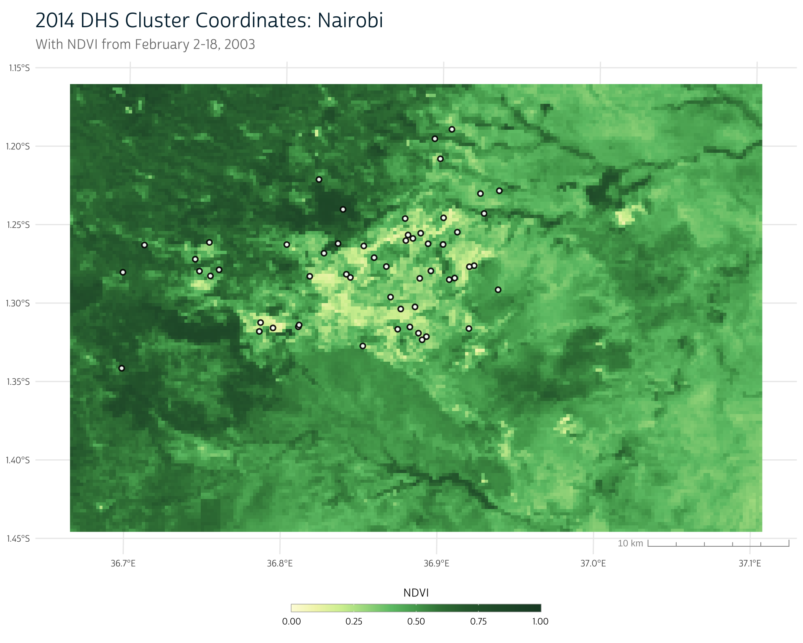
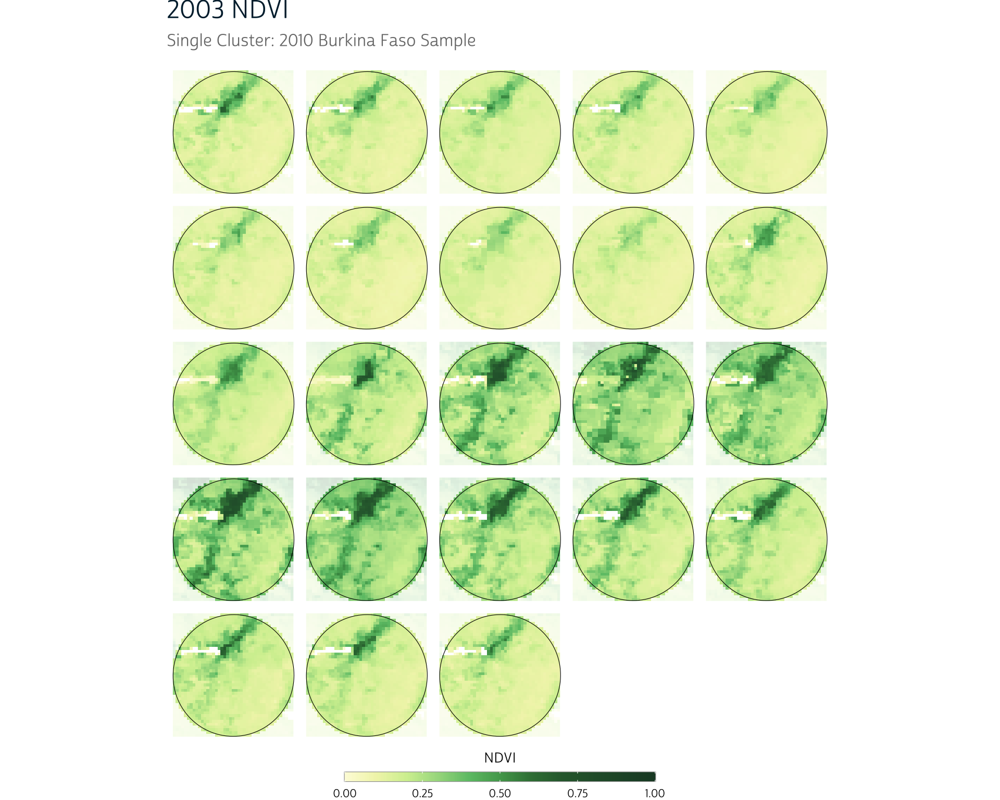
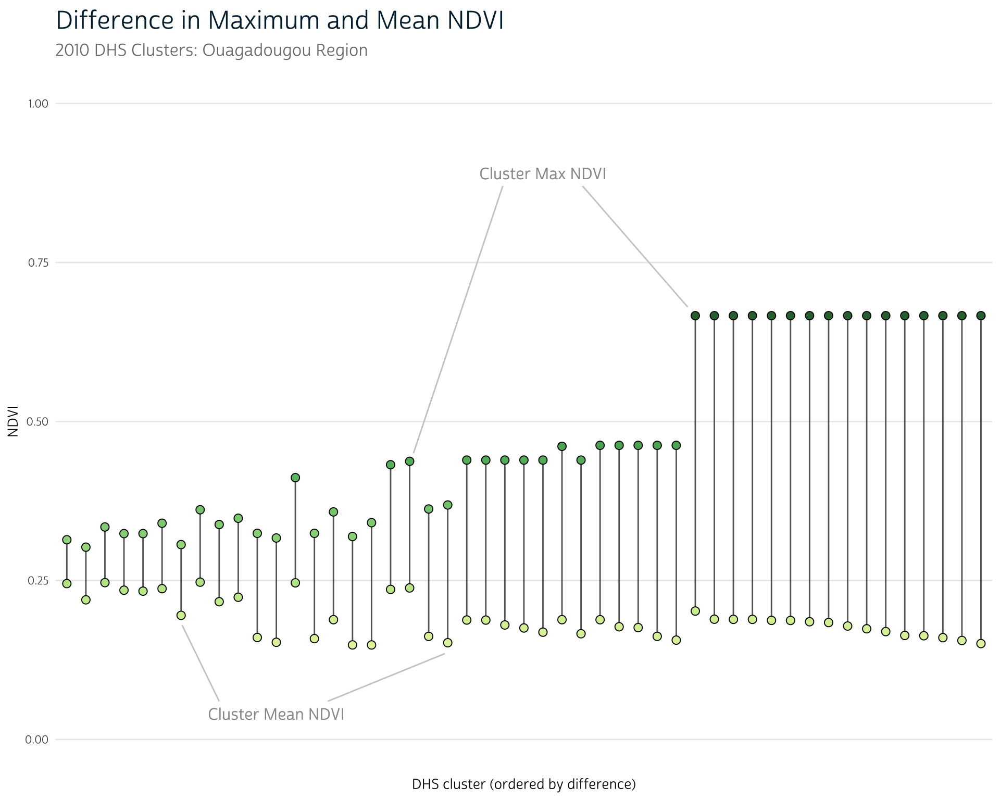
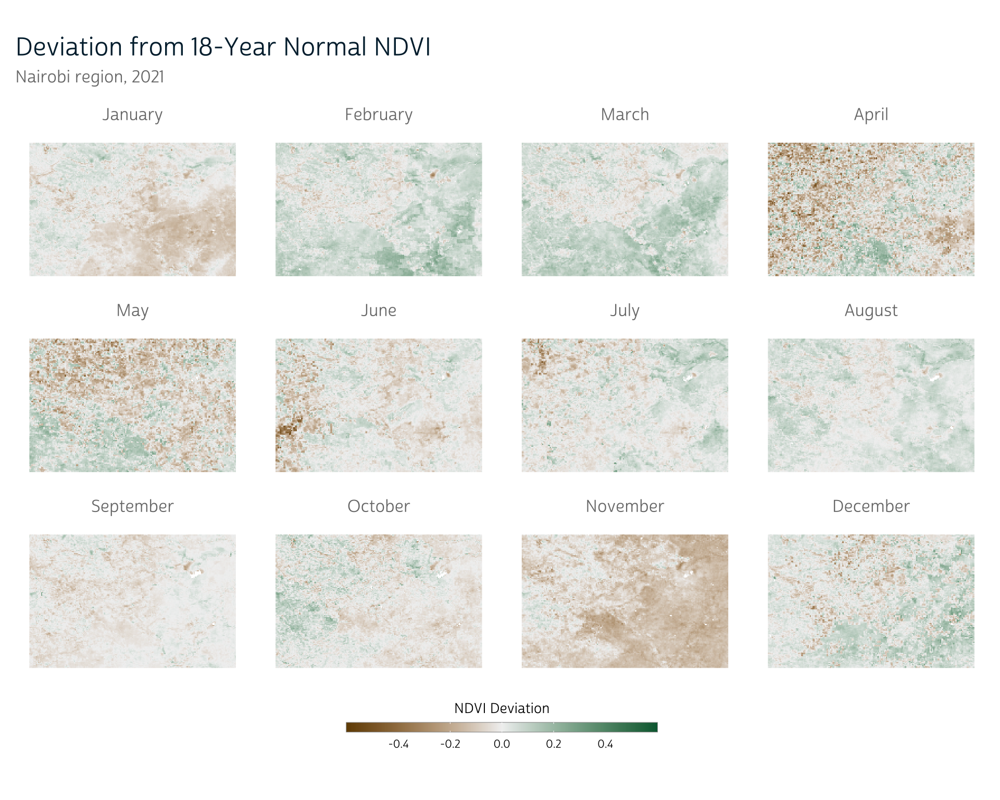
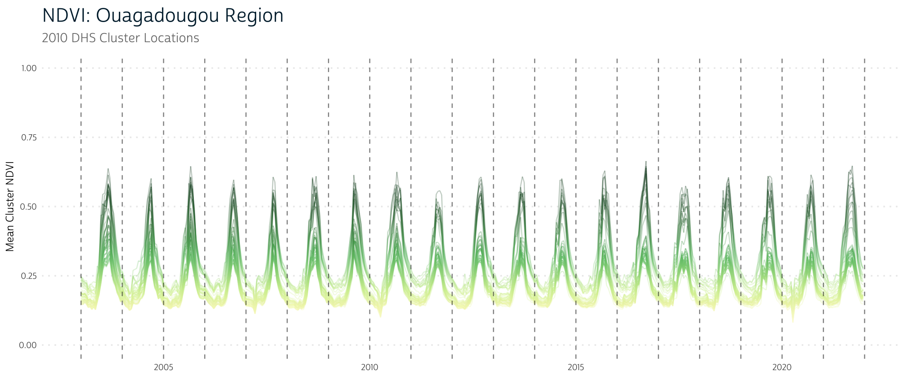
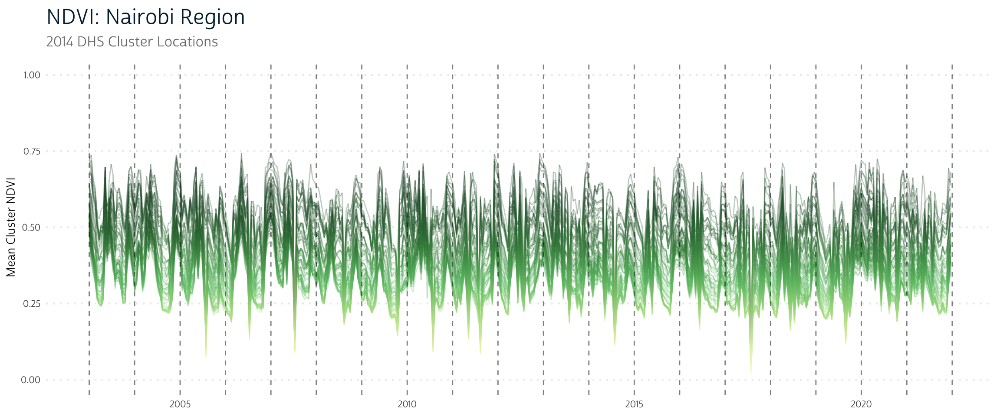

```{r}
#| echo: false
hook_output <- knitr::knit_hooks$get("output")

# set a new output hook to truncate text output
knitr::knit_hooks$set(output = function(x, options) {
  if (!is.null(n <- options$out.lines)) {
    x <- xfun::split_lines(x)
    if (length(x) > n) {
      # truncate the output
      x <- c(head(x, n), "....\n")
    }
    x <- paste(x, collapse = "\n")
  }
  hook_output(x, options)
})

source("../../R/utils.R")

ggplot2::theme_set(theme_dhs_base())

# Load fonts
sysfonts::font_add(
  family = "cabrito", 
  regular = "../../fonts/cabritosansnormregular-webfont.ttf"
)

showtext::showtext_auto()
```

::: callout-caution
## Update

Since we originally released this post, we now recommend using VIIRS when doing contemporary NDVI research. See our [VIIRS post](../2025-03-31-viirs) for more information about how to adapt the contents discussed in this post for use with VIIRS files.
:::

Previously, we showed how to load NDVI data for two time points in Kenya using NASA's Earthdata Search interface. If you're new to NDVI, we suggest you go ahead and take a look at our [introductory post](../2024-07-02-ndvi-concepts) as well as our [NDVI data loading post](../2024-08-01-ndvi-data) before continuing.

In this post, we'll use two NDVI time series to demonstrate some of the considerations that emerge when aggregating and processing NDVI raster data in the context of population health research. We need to conduct many of the same aggregation steps for our NDVI data as we did for previous data sources, like [CHIRPS](../2024-02-04-dhs-chirps) and [CHIRTS](../2024-04-15-chirts-metrics). However, as with any new data source, the decisions we make about how to do so will vary when working with NDVI.

To highlight some of the features of NDVI data, we'll load NDVI time series from two capitals with different climates: Nairobi, Kenya and Ouagadougou, Burkina Faso. We'll use a familiar workflow to build buffers around the DHS cluster points in these regions and will extract NDVI time series for each. Once we have these time series, we'll use them to explore how extreme weather and seasonality may play a role in the way we aggregate NDVI data.

As always, we'll start by loading some of the packages used in the post:

```{r}
#| message: false
library(terra)
library(sf)
library(dplyr)
library(ggplot2)
library(ggspatial)
library(patchwork)
library(lubridate)
```

# Data: Two capital regions

We'll be using NDVI data from the MOD13Q1 [MODIS](https://terra.nasa.gov/about/terra-instruments/modis) product, which we introduced in our [last post](../2024-08-01-ndvi-data). However, instead of working with just 2 time points, this time we'll work with an extended time series from 2003-2021. Because of this long range, we've restricted our spatial regions of interest to reduce file size. We'll work with the regions around Nairobi, Kenya and Ouagadougou, Burkina Faso.

## Obtaining data from NASA

To simplify things, we've gone ahead and prepared these NDVI time series as we described in our [previous post](../2024-08-01-ndvi-data) and saved them as stand-alone .tif files. We won't show the step-by-step process for producing these files, but they track closely with the methods shown in our previous post, so take a look there if you need a refresher on how to ingest MODIS NDVI data into R.

Since our data are stored in .tif files, we can load them directly with `{terra}`:

```{=html}
<div class="cell">
<div class="code-copy-outer-scaffold"><div class="sourceCode" id="cb2"><pre class="downlit sourceCode r code-with-copy"><code class="sourceCode R"><span><span class="co"># Load NDVI time series</span></span>
<span><span class="co"># Nairobi region</span></span>
<span><span class="va">ndvi_nairobi</span> <span class="op">&lt;-</span> <span class="fu"><a href="https://rspatial.github.io/terra/reference/rast.html">rast</a></span><span class="op">(</span><span class="st">"data_local/ndvi_nairobi.tif"</span><span class="op">)</span></span>
<span></span>
<span><span class="co"># Ouagadougou region</span></span>
<span><span class="va">ndvi_ouaga</span> <span class="op">&lt;-</span> <span class="fu"><a href="https://rspatial.github.io/terra/reference/rast.html">rast</a></span><span class="op">(</span><span class="st">"data_local/ndvi_ouaga.tif"</span><span class="op">)</span></span></code></pre></div><button title="Copy to Clipboard" class="code-copy-button"><i class="bi"></i></button></div>
</div>
```

## DHS cluster coordinates

In this post, we'll be aggregating our NDVI raster data to the DHS cluster level as we've [demonstrated before](../2024-02-04-dhs-chirps/#summarize-precipitation-values). To do so, we'll need the cluster coordinate data provided by the DHS. We can use `{sf}` to load the DHS cluster coordinates once we've downloaded the shapefiles provided by the DHS Program.

::: column-margin
If you need a refresher on where you can access cluster coordinate data, see our [CHIRPS post](../2024-02-04-dhs-chirps/#dhs-cluster-coordinates).
:::

```{r}
# Load DHS cluster coordinates
# KE 2014 coordinates
ke_gps <- st_read("data/KEGE71FL/KEGE71FL.shp", quiet = TRUE)

# BF 2010 coordinates
bf_gps <- st_read("data/BFGE61FL/BFGE61FL.shp", quiet = TRUE)
```

Since we're only working with the two capital regions for this demonstration, we'll filter our cluster coordinate data to remove records for clusters that are outside each region of interest.

```{r}
# Filter Kenya cluster locations to those in the Nairobi region
nairobi_gps <- ke_gps |>
  filter(DHSREGNA == "Nairobi")
```

For Burkina Faso, we'll also need to remove some clusters that do not have valid coordinate locations, so we'll filter out cases with (0, 0) coordinates:

```{r}
# Filter Burkina Faso cluster locations to those in the Ouagadougou region
ouaga_gps <- bf_gps |>
  filter(
    !(LATNUM == 0 & LONGNUM == 0), # Remove missing coordinate locations
    DHSREGNA == "Centre"
  )
```

Even though we're working with urban areas, our DHS clusters are still located across a range of NDVI values. Here we see our cluster point locations overlaid on the NDVI raster for the region:

```{=html}
<div class="cell page-columns page-full"> <details class="code-fold"><summary>Show plot code</summary><div class="code-copy-outer-scaffold"><div class="sourceCode" id="cb6"><pre class="downlit sourceCode r code-with-copy"><code class="sourceCode R"><span><span class="co"># We have converted our NDVI palette from the previous post to a scale function</span></span> <span><span class="co"># for easier use in this post</span></span> <span><span class="va">ndvi_pal</span> <span class="op">&lt;-</span> <span class="kw">function</span><span class="op">(</span><span class="op">)</span> <span class="op">{</span></span> <span>  <span class="fu"><a href="https://rdrr.io/r/base/list.html">list</a></span><span class="op">(</span></span> <span>    pal <span class="op">=</span> <span class="fu"><a href="https://rdrr.io/r/base/c.html">c</a></span><span class="op">(</span></span> <span>      <span class="st">"#fdfbdc"</span>,</span> <span>      <span class="st">"#f1f4b7"</span>,</span> <span>      <span class="st">"#d3ef9f"</span>,</span> <span>      <span class="st">"#a5da8d"</span>,</span> <span>      <span class="st">"#6cc275"</span>,</span> <span>      <span class="st">"#51a55b"</span>,</span> <span>      <span class="st">"#397e43"</span>,</span> <span>      <span class="st">"#2d673a"</span>,</span> <span>      <span class="st">"#1d472e"</span></span> <span>    <span class="op">)</span>,</span> <span>    values <span class="op">=</span> <span class="fu"><a href="https://rdrr.io/r/base/c.html">c</a></span><span class="op">(</span><span class="fl">0</span>, <span class="fl">0.1</span>, <span class="fl">0.2</span>, <span class="fl">0.3</span>, <span class="fl">0.4</span>, <span class="fl">0.5</span>, <span class="fl">0.6</span>, <span class="fl">0.7</span>, <span class="fl">1</span><span class="op">)</span></span> <span>  <span class="op">)</span></span> <span><span class="op">}</span></span> <span></span> <span><span class="va">scale_fill_ndvi</span> <span class="op">&lt;-</span> <span class="kw">function</span><span class="op">(</span><span class="va">pal</span> <span class="op">=</span> <span class="fu">ndvi_pal</span><span class="op">(</span><span class="op">)</span>, <span class="va">...</span><span class="op">)</span> <span class="op">{</span></span> <span>  <span class="fu"><a href="https://ggplot2.tidyverse.org/reference/scale_gradient.html">scale_fill_gradientn</a></span><span class="op">(</span>colors <span class="op">=</span> <span class="va">pal</span><span class="op">$</span><span class="va">pal</span>, values <span class="op">=</span> <span class="va">pal</span><span class="op">$</span><span class="va">values</span>, <span class="va">...</span><span class="op">)</span></span> <span><span class="op">}</span></span> <span></span> <span><span class="va">scale_color_ndvi</span> <span class="op">&lt;-</span> <span class="kw">function</span><span class="op">(</span><span class="va">pal</span> <span class="op">=</span> <span class="fu">ndvi_pal</span><span class="op">(</span><span class="op">)</span>, <span class="va">...</span><span class="op">)</span> <span class="op">{</span></span> <span>  <span class="fu"><a href="https://ggplot2.tidyverse.org/reference/scale_gradient.html">scale_color_gradientn</a></span><span class="op">(</span>colors <span class="op">=</span> <span class="va">pal</span><span class="op">$</span><span class="va">pal</span>, values <span class="op">=</span> <span class="va">pal</span><span class="op">$</span><span class="va">values</span>, <span class="va">...</span><span class="op">)</span></span> <span><span class="op">}</span></span> <span></span> <span><span class="fu"><a href="https://ggplot2.tidyverse.org/reference/ggplot.html">ggplot</a></span><span class="op">(</span><span class="op">)</span> <span class="op">+</span></span> <span>  <span class="fu"><a href="https://paleolimbot.github.io/ggspatial/reference/layer_spatial.html">layer_spatial</a></span><span class="op">(</span><span class="va">ndvi_nairobi</span><span class="op">[[</span><span class="fl">3</span><span class="op">]</span><span class="op">]</span><span class="op">)</span> <span class="op">+</span></span> <span>  <span class="co"># layer_spatial(nairobi_gps, color = "white", alpha = 1) +</span></span> <span>  <span class="fu"><a href="https://paleolimbot.github.io/ggspatial/reference/layer_spatial.html">layer_spatial</a></span><span class="op">(</span><span class="va">nairobi_gps</span>, color <span class="op">=</span> <span class="st">"black"</span>, fill <span class="op">=</span> <span class="st">"white"</span>, alpha <span class="op">=</span> <span class="fl">0.9</span>, shape <span class="op">=</span> <span class="fl">21</span>, size <span class="op">=</span> <span class="fl">1.5</span>, stroke <span class="op">=</span> <span class="fl">1</span><span class="op">)</span> <span class="op">+</span></span> <span>  <span class="fu">scale_fill_ndvi</span><span class="op">(</span>limits <span class="op">=</span> <span class="fu"><a href="https://rdrr.io/r/base/c.html">c</a></span><span class="op">(</span><span class="fl">0</span>, <span class="fl">1</span><span class="op">)</span>, na.value <span class="op">=</span> <span class="st">"transparent"</span><span class="op">)</span> <span class="op">+</span></span> <span>  <span class="fu"><a href="https://ggplot2.tidyverse.org/reference/labs.html">labs</a></span><span class="op">(</span></span> <span>    title <span class="op">=</span> <span class="st">"2014 DHS Cluster Coordinates: Nairobi"</span>,</span> <span>    subtitle <span class="op">=</span> <span class="st">"With NDVI from February 2-18, 2003"</span>,</span> <span>    fill <span class="op">=</span> <span class="st">"NDVI"</span></span> <span>  <span class="op">)</span> <span class="op">+</span></span> <span>  <span class="fu">theme_dhs_map</span><span class="op">(</span><span class="op">)</span></span></code></pre></div><button title="Copy to Clipboard" class="code-copy-button"><i class="bi"></i></button></div> </details><div class="cell-output-display page-columns page-full"> <div class="page-columns page-full"> <figure class="figure page-columns page-full"><p class="page-columns page-full">
</p> 
</figure> </div> </div> </div>
```

## Buffer cluster coordinates

As we've shown [before](../2024-02-04-dhs-chirps/#cluster-buffers), the next step is to create a buffer around each cluster point location to get a polygon containing the general region around each cluster.

We'll first project our cluster points and then create a buffer with `st_buffer()`. Then, we'll project our buffered points to the same coordinate reference system as our NDVI data to prepare to aggregate our NDVI data to our newly-created buffer regions.

```{=html}
<div class="cell">
<div class="code-copy-outer-scaffold"><div class="sourceCode" id="cb7"><pre class="downlit sourceCode r code-with-copy"><code class="sourceCode R"><span><span class="co"># Project and buffer Nairobi clusters</span></span>
<span><span class="va">nairobi_gps_buff</span> <span class="op">&lt;-</span> <span class="va">nairobi_gps</span> <span class="op">|&gt;</span></span>
<span>  <span class="fu"><a href="https://r-spatial.github.io/sf/reference/st_transform.html">st_transform</a></span><span class="op">(</span>crs <span class="op">=</span> <span class="fl">32637</span><span class="op">)</span> <span class="op">|&gt;</span> <span class="co"># UTM Zone 37N</span></span>
<span>  <span class="fu"><a href="https://r-spatial.github.io/sf/reference/geos_unary.html">st_buffer</a></span><span class="op">(</span>dist <span class="op">=</span> <span class="fl">5000</span><span class="op">)</span> <span class="op">|&gt;</span></span>
<span>  <span class="fu"><a href="https://r-spatial.github.io/sf/reference/st_transform.html">st_transform</a></span><span class="op">(</span>crs <span class="op">=</span> <span class="fu"><a href="https://rspatial.github.io/terra/reference/crs.html">crs</a></span><span class="op">(</span><span class="va">ndvi_nairobi</span><span class="op">)</span><span class="op">)</span></span>
<span></span>
<span><span class="co"># Project and buffer Ouagadougou clusters</span></span>
<span><span class="va">ouaga_gps_buff</span> <span class="op">&lt;-</span> <span class="va">ouaga_gps</span> <span class="op">|&gt;</span></span>
<span>  <span class="fu"><a href="https://r-spatial.github.io/sf/reference/st_transform.html">st_transform</a></span><span class="op">(</span>crs <span class="op">=</span> <span class="fl">32630</span><span class="op">)</span> <span class="op">|&gt;</span> <span class="co"># UTM Zone 30N</span></span>
<span>  <span class="fu"><a href="https://r-spatial.github.io/sf/reference/geos_unary.html">st_buffer</a></span><span class="op">(</span>dist <span class="op">=</span> <span class="fl">5000</span><span class="op">)</span> <span class="op">|&gt;</span></span>
<span>  <span class="fu"><a href="https://r-spatial.github.io/sf/reference/st_transform.html">st_transform</a></span><span class="op">(</span>crs <span class="op">=</span> <span class="fu"><a href="https://rspatial.github.io/terra/reference/crs.html">crs</a></span><span class="op">(</span><span class="va">ndvi_ouaga</span><span class="op">)</span><span class="op">)</span></span></code></pre></div><button title="Copy to Clipboard" class="code-copy-button"><i class="bi"></i></button></div>
</div>
```

# NDVI spatial aggregation

At this point, we have everything we need to produce a single time series for each cluster region.

## Basic approach

[Previously](../2024-02-04-dhs-chirps/#aggregating-rainfall-within-cluster-regions), we introduced terra's `extract()`, which will allow us to use the NDVI raster along with our buffered cluster polygons to spatially aggregate the NDVI pixels within each cluster region. For instance, to extract the average NDVI value within each buffer, we could use `fun = mean` as shown below (note that we've set `na.rm = TRUE` to exclude missing values from the calculation):

```{=html}
<div class="cell" data-out.lines="5">
<div class="code-copy-outer-scaffold"><div class="sourceCode" id="cb8"><pre class="downlit sourceCode r code-with-copy"><code class="sourceCode R"><span><span class="co"># Extract mean NDVI in each cluster buffer region:</span></span>
<span><span class="va">ke_mean_ndvi</span> <span class="op">&lt;-</span> <span class="fu"><a href="https://rspatial.github.io/terra/reference/extract.html">extract</a></span><span class="op">(</span></span>
<span>  <span class="va">ndvi_nairobi</span>,</span>
<span>  <span class="va">nairobi_gps_buff</span>,</span>
<span>  weights <span class="op">=</span> <span class="cn">TRUE</span>,</span>
<span>  fun <span class="op">=</span> <span class="va">mean</span>,</span>
<span>  na.rm <span class="op">=</span> <span class="cn">TRUE</span> <span class="co"># Exclude missing raster values in average</span></span>
<span><span class="op">)</span></span>
<span></span>
<span><span class="va">ke_mean_ndvi</span></span>
<span><span class="co">#&gt;    ID "250m 16 days NDVI" "250m 16 days NDVI" "250m 16 days NDVI"</span></span>
<span><span class="co">#&gt; 1   1           0.6577829           0.6587233           0.5955906</span></span>
<span><span class="co">#&gt; 2   2           0.6517902           0.6471524           0.5866545</span></span>
<span><span class="co">#&gt; 3   3           0.6726900           0.6747525           0.6094023</span></span>
<span><span class="co">#&gt; 4   4           0.7095437           0.7192108           0.6485346</span></span>
<span><span class="va">....</span></span></code></pre></div><button title="Copy to Clipboard" class="code-copy-button"><i class="bi"></i></button></div>
</div>
```

This gives us a tabular record where each row corresponds to a cluster and each column to the mean NDVI value in that cluster buffer region for a particular time point.

However, our interest in NDVI is primarily as a measure for agricultural production, and some areas aren't intended to be used for agriculture (like water bodies or dense urban environments). Including these low-NDVI pixels in our aggregation serves to reduce the mean NDVI value in a cluster, even if the available *agricultural* land in that cluster is highly productive.

If we want an estimate of the agricultural productivity of the vegetated land in an area, we likely want to remove very low NDVI values (which typically represent impervious surfaces and water) from our calculation. Below, we'll detail a few approaches that could accomplish this goal.

## Idea 1: Mask out sub-zero NDVI values

Recall that NDVI can range from -1 to 1, where values near and below 0 typically represent water or bare soil. Some of these low NDVI values in our raster are already treated as `NA`. Using our approach from above (with `na.rm = TRUE`), these are removed from consideration during aggregation. However, pixels that border these regions may still have low NDVI values. We can set these to `NA` manually using terra's `classify()`.

`classify()` takes an input matrix that defines the range of values in our raster that should be reclassified. In this case, we create a matrix called `subzero_to_na` that defines the range of values from `-Inf` to `0`. The third value in this matrix indicates the output value for all raster cells that fall within this range.

```{r}
subzero_to_na <- matrix(c(-Inf, 0, NA), nrow = 1)

subzero_to_na
```

We can use this matrix with our NDVI raster to reclassify sub-zero NDVI values to `NA`.

```{=html}
<div class="cell">
<div class="code-copy-outer-scaffold"><div class="sourceCode" id="cb10"><pre class="downlit sourceCode r code-with-copy"><code class="sourceCode R"><span><span class="va">ndvi_nairobi</span> <span class="op">&lt;-</span> <span class="fu"><a href="https://rspatial.github.io/terra/reference/classify.html">classify</a></span><span class="op">(</span><span class="va">ndvi_nairobi</span>, <span class="va">subzero_to_na</span><span class="op">)</span></span></code></pre></div><button title="Copy to Clipboard" class="code-copy-button"><i class="bi"></i></button></div>
</div>
```

Now, as long as we continue to use `na.rm = TRUE` in our call to `extract()`, we'll automatically ignore these low NDVI values.

```{=html}
<div class="cell">
<div class="code-copy-outer-scaffold"><div class="sourceCode" id="cb11"><pre class="downlit sourceCode r code-with-copy"><code class="sourceCode R"><span><span class="va">ke_mean_ndvi</span> <span class="op">&lt;-</span> <span class="fu"><a href="https://rspatial.github.io/terra/reference/extract.html">extract</a></span><span class="op">(</span></span>
<span>  <span class="va">ndvi_nairobi</span>,</span>
<span>  <span class="va">nairobi_gps_buff</span>,</span>
<span>  weights <span class="op">=</span> <span class="cn">TRUE</span>,</span>
<span>  fun <span class="op">=</span> <span class="va">mean</span>,</span>
<span>  na.rm <span class="op">=</span> <span class="cn">TRUE</span> <span class="co"># Exclude missing raster values in average</span></span>
<span><span class="op">)</span></span></code></pre></div><button title="Copy to Clipboard" class="code-copy-button"><i class="bi"></i></button></div>
</div>
```

## Idea 2: Use maximum NDVI

Crops are often grown in localized areas, so even if a large portion of a cluster region contains low vegetation values, the crop-producing regions may still be thriving.

For instance, let's take an example cluster from the Ouagadougou area. If we plot the NDVI values in its vicinity over the course of the year, we notice a few obvious patterns.

```{=html}
<div class="cell page-columns page-full">
<details class="code-fold"><summary>Show plot code</summary><div class="code-copy-outer-scaffold"><div class="sourceCode" id="cb12"><pre class="downlit sourceCode r code-with-copy"><code class="sourceCode R"><span><span class="kw"><a href="https://rdrr.io/r/base/library.html">library</a></span><span class="op">(</span><span class="va"><a href="https://patchwork.data-imaginist.com">patchwork</a></span><span class="op">)</span></span>
<span></span>
<span><span class="va">x</span> <span class="op">&lt;-</span> <span class="va">ouaga_gps_buff</span><span class="op">[</span><span class="fl">8</span>, <span class="op">]</span></span>
<span><span class="va">ndvi_clust</span> <span class="op">&lt;-</span> <span class="fu"><a href="https://rspatial.github.io/terra/reference/crop.html">crop</a></span><span class="op">(</span><span class="va">ndvi_ouaga</span>, <span class="va">x</span><span class="op">)</span></span>
<span></span>
<span><span class="va">panels</span> <span class="op">&lt;-</span> <span class="fu">purrr</span><span class="fu">::</span><span class="fu"><a href="https://purrr.tidyverse.org/reference/map.html">map</a></span><span class="op">(</span></span>
<span>  <span class="fl">1</span><span class="op">:</span><span class="fl">23</span>,</span>
<span>  <span class="kw">function</span><span class="op">(</span><span class="va">i</span><span class="op">)</span> <span class="op">{</span></span>
<span>    <span class="fu"><a href="https://ggplot2.tidyverse.org/reference/ggplot.html">ggplot</a></span><span class="op">(</span><span class="op">)</span> <span class="op">+</span></span>
<span>      <span class="fu"><a href="https://paleolimbot.github.io/ggspatial/reference/layer_spatial.html">layer_spatial</a></span><span class="op">(</span><span class="fu"><a href="https://rspatial.github.io/terra/reference/mask.html">mask</a></span><span class="op">(</span><span class="va">ndvi_clust</span><span class="op">[[</span><span class="va">i</span><span class="op">]</span><span class="op">]</span>, <span class="va">x</span>, inverse <span class="op">=</span> <span class="cn">TRUE</span><span class="op">)</span>, alpha <span class="op">=</span> <span class="fl">0.2</span><span class="op">)</span> <span class="op">+</span></span>
<span>      <span class="fu"><a href="https://paleolimbot.github.io/ggspatial/reference/layer_spatial.html">layer_spatial</a></span><span class="op">(</span><span class="fu"><a href="https://rspatial.github.io/terra/reference/mask.html">mask</a></span><span class="op">(</span><span class="va">ndvi_clust</span><span class="op">[[</span><span class="va">i</span><span class="op">]</span><span class="op">]</span>, <span class="va">x</span><span class="op">)</span><span class="op">)</span> <span class="op">+</span></span>
<span>      <span class="fu"><a href="https://paleolimbot.github.io/ggspatial/reference/layer_spatial.html">layer_spatial</a></span><span class="op">(</span><span class="va">x</span>, fill <span class="op">=</span> <span class="cn">NA</span>, color <span class="op">=</span> <span class="st">"black"</span><span class="op">)</span> <span class="op">+</span></span>
<span>      <span class="fu">scale_fill_ndvi</span><span class="op">(</span></span>
<span>        limits <span class="op">=</span> <span class="fu"><a href="https://rdrr.io/r/base/c.html">c</a></span><span class="op">(</span><span class="fl">0</span>, <span class="fl">1</span><span class="op">)</span>,</span>
<span>        na.value <span class="op">=</span> <span class="st">"transparent"</span></span>
<span>      <span class="op">)</span> <span class="op">+</span></span>
<span>      <span class="fu"><a href="https://ggplot2.tidyverse.org/reference/labs.html">labs</a></span><span class="op">(</span>fill <span class="op">=</span> <span class="st">"NDVI"</span><span class="op">)</span></span>
<span>  <span class="op">}</span></span>
<span><span class="op">)</span></span>
<span></span>
<span><span class="fu">purrr</span><span class="fu">::</span><span class="fu"><a href="https://purrr.tidyverse.org/reference/reduce.html">reduce</a></span><span class="op">(</span><span class="va">panels</span>, <span class="va">`+`</span><span class="op">)</span> <span class="op">+</span></span>
<span>  <span class="fu">plot_annotation</span><span class="op">(</span>title <span class="op">=</span> <span class="st">"2003 NDVI"</span>, subtitle <span class="op">=</span> <span class="st">"Single Cluster: 2010 Burkina Faso Sample"</span><span class="op">)</span> <span class="op">+</span></span>
<span>  <span class="fu">plot_layout</span><span class="op">(</span>guides <span class="op">=</span> <span class="st">"collect"</span><span class="op">)</span>  <span class="op">&amp;</span></span>
<span>  <span class="fu"><a href="https://ggplot2.tidyverse.org/reference/ggtheme.html">theme_void</a></span><span class="op">(</span><span class="op">)</span> <span class="op">+</span></span>
<span>  <span class="fu">theme_dhs_map</span><span class="op">(</span><span class="op">)</span> <span class="op">+</span></span>
<span>  <span class="fu"><a href="https://ggplot2.tidyverse.org/reference/theme.html">theme</a></span><span class="op">(</span></span>
<span>    legend.position <span class="op">=</span> <span class="st">"bottom"</span>,</span>
<span>    legend.title.position <span class="op">=</span> <span class="st">"top"</span>,</span>
<span>    legend.title <span class="op">=</span> <span class="fu"><a href="https://ggplot2.tidyverse.org/reference/element.html">element_text</a></span><span class="op">(</span>size <span class="op">=</span> <span class="fl">10</span>, hjust <span class="op">=</span> <span class="fl">0.5</span><span class="op">)</span>,</span>
<span>    legend.key.height <span class="op">=</span> <span class="fu"><a href="https://rdrr.io/r/grid/unit.html">unit</a></span><span class="op">(</span><span class="fl">7</span>, <span class="st">"points"</span><span class="op">)</span>,</span>
<span>    legend.key.width <span class="op">=</span> <span class="fu"><a href="https://rdrr.io/r/grid/unit.html">unit</a></span><span class="op">(</span><span class="fl">45</span>, <span class="st">"points"</span><span class="op">)</span>,</span>
<span>    legend.ticks <span class="op">=</span> <span class="fu"><a href="https://ggplot2.tidyverse.org/reference/element.html">element_line</a></span><span class="op">(</span>color <span class="op">=</span> <span class="st">"white"</span>, linewidth <span class="op">=</span> <span class="fl">0.2</span><span class="op">)</span>,</span>
<span>    legend.ticks.length <span class="op">=</span> <span class="fu"><a href="https://rdrr.io/r/grid/unit.html">unit</a></span><span class="op">(</span><span class="fl">1</span>, <span class="st">"points"</span><span class="op">)</span>,</span>
<span>    legend.frame <span class="op">=</span> <span class="fu"><a href="https://ggplot2.tidyverse.org/reference/element.html">element_rect</a></span><span class="op">(</span></span>
<span>      fill <span class="op">=</span> <span class="cn">NA</span>,</span>
<span>      color <span class="op">=</span> <span class="st">"#999999"</span>,</span>
<span>      linewidth <span class="op">=</span> <span class="fl">0.2</span></span>
<span>    <span class="op">)</span>,</span>
<span>    plot.title <span class="op">=</span> <span class="fu"><a href="https://ggplot2.tidyverse.org/reference/element.html">element_text</a></span><span class="op">(</span></span>
<span>      hjust <span class="op">=</span> <span class="fl">0</span>,</span>
<span>      size <span class="op">=</span> <span class="fl">18</span>, </span>
<span>      color <span class="op">=</span> <span class="st">"#00263A"</span>, <span class="co"># IPUMS navy</span></span>
<span>      margin <span class="op">=</span> <span class="fu"><a href="https://ggplot2.tidyverse.org/reference/element.html">margin</a></span><span class="op">(</span>b <span class="op">=</span> <span class="fl">7</span><span class="op">)</span></span>
<span>    <span class="op">)</span>, </span>
<span>    plot.subtitle <span class="op">=</span> <span class="fu"><a href="https://ggplot2.tidyverse.org/reference/element.html">element_text</a></span><span class="op">(</span></span>
<span>      size <span class="op">=</span> <span class="fl">12</span>, </span>
<span>      hjust <span class="op">=</span> <span class="fl">0</span>,</span>
<span>      color <span class="op">=</span> <span class="st">"#00000099"</span>,</span>
<span>      margin <span class="op">=</span> <span class="fu"><a href="https://ggplot2.tidyverse.org/reference/element.html">margin</a></span><span class="op">(</span>b <span class="op">=</span> <span class="fl">10</span><span class="op">)</span></span>
<span>    <span class="op">)</span>,</span>
<span>    plot.caption <span class="op">=</span> <span class="fu"><a href="https://ggplot2.tidyverse.org/reference/element.html">element_text</a></span><span class="op">(</span></span>
<span>      size <span class="op">=</span> <span class="fl">10</span>,</span>
<span>      hjust <span class="op">=</span> <span class="fl">1</span>,</span>
<span>      color <span class="op">=</span> <span class="st">"#00000099"</span>,</span>
<span>      margin <span class="op">=</span> <span class="fu"><a href="https://ggplot2.tidyverse.org/reference/element.html">margin</a></span><span class="op">(</span>t <span class="op">=</span> <span class="fl">5</span><span class="op">)</span></span>
<span>    <span class="op">)</span>,</span>
<span>    text <span class="op">=</span> <span class="fu"><a href="https://ggplot2.tidyverse.org/reference/element.html">element_text</a></span><span class="op">(</span>family <span class="op">=</span> <span class="st">"cabrito"</span>, size <span class="op">=</span> <span class="fl">10</span><span class="op">)</span>, </span>
<span>  <span class="op">)</span></span></code></pre></div><button title="Copy to Clipboard" class="code-copy-button"><i class="bi"></i></button></div>
</details><div class="cell-output-display page-columns page-full">
<div class="page-columns page-full">
<figure class="figure page-columns page-full">
    <p class="page-columns page-full">
        
    </p>
</figure>
</div>
</div>
</div>
```

First, we notice that the overall region has a period of higher vegetation in the middle of the year. We also notice that there is a small area in the north of the cluster region that has consistently higher vegetation than its surrounding area throughout the year, even in times with less vegetation overall.

This could be a result of water proximity (we notice that some missing values appear near the green patch, which could have been removed because they represent a water source), but it could also be because of **human interaction**, like irrigation.

This human element is an important feature of NDVI that distinguishes it from other environmental metrics, like precipitation and temperature. Vegetation is more directly influenced by human behavior than these other sources.

Whether this particular pattern is prompted primarily by physical geography (a nearby water source) or human behavior (irrigation), it does serve as an example of why calculating a mean NDVI value may not reflect the lived experience on the ground. If most of an area's crops are grown in a particular area, the most critical portion of a cluster region may have very high vegetation values, even if the rest of the cluster does not.

One option to incorporate this into our data processing would be to use the *maximum* NDVI value as this cluster's value rather than the mean. This is easily done in R: we just need to change our aggregation function from `fun = mean` to `fun = max`:

```{=html}
<div class="cell">
<div class="code-copy-outer-scaffold"><div class="sourceCode" id="cb13"><pre class="downlit sourceCode r code-with-copy"><code class="sourceCode R"><span><span class="co"># Reclassify low NDVI values</span></span>
<span><span class="va">ndvi_ouaga</span> <span class="op">&lt;-</span> <span class="fu"><a href="https://rspatial.github.io/terra/reference/classify.html">classify</a></span><span class="op">(</span><span class="va">ndvi_ouaga</span>, <span class="va">subzero_to_na</span><span class="op">)</span></span>
<span></span>
<span><span class="va">bf_max_ndvi</span> <span class="op">&lt;-</span> <span class="fu"><a href="https://rspatial.github.io/terra/reference/extract.html">extract</a></span><span class="op">(</span></span>
<span>  <span class="va">ndvi_ouaga</span>,</span>
<span>  <span class="va">ouaga_gps_buff</span>,</span>
<span>  weights <span class="op">=</span> <span class="cn">TRUE</span>,</span>
<span>  fun <span class="op">=</span> <span class="va">max</span>, <span class="co"># Extract max value within cluster, not mean</span></span>
<span>  na.rm <span class="op">=</span> <span class="cn">TRUE</span></span>
<span><span class="op">)</span></span></code></pre></div><button title="Copy to Clipboard" class="code-copy-button"><i class="bi"></i></button></div>
</div>
```

This gives us a similarly formatted output, but each value now represents the maximum NDVI pixel value in a given cluster (row) for a given time point (column):

```{=html}
<div class="cell" data-out.lines="5">
<div class="code-copy-outer-scaffold"><div class="sourceCode" id="cb14"><pre class="downlit sourceCode r code-with-copy"><code class="sourceCode R"><span><span class="va">bf_max_ndvi</span></span>
<span><span class="co">#&gt;    ID "250m 16 days NDVI" "250m 16 days NDVI" "250m 16 days NDVI"</span></span>
<span><span class="co">#&gt; 1   1              0.4393              0.3828              0.3759</span></span>
<span><span class="co">#&gt; 2   2              0.4320              0.4590              0.3903</span></span>
<span><span class="co">#&gt; 3   3              0.6664              0.4498              0.4392</span></span>
<span><span class="co">#&gt; 4   4              0.4393              0.3828              0.3759</span></span>
<span><span class="va">....</span></span></code></pre></div><button title="Copy to Clipboard" class="code-copy-button"><i class="bi"></i></button></div>
</div>
```

### Comparing maximum and mean aggregation

Using the maximum cluster region NDVI value (rather than the mean) will obviously provide a different NDVI estimate for each cluster, but how much of a difference does this decision make overall?

First, let's extract the **mean** NDVI values for our Ouagadougou clusters as we did earlier for Nairobi:

```{=html}
 <div class="cell">
 <div class="code-copy-outer-scaffold"><div class="sourceCode" id="cb15"><pre class="downlit sourceCode r code-with-copy"><code class="sourceCode R"><span><span class="va">bf_mean_ndvi</span> <span class="op">&lt;-</span> <span class="fu"><a href="https://rspatial.github.io/terra/reference/extract.html">extract</a></span><span class="op">(</span></span>
 <span>  <span class="va">ndvi_ouaga</span>,</span>
 <span>  <span class="va">ouaga_gps_buff</span>,</span>
 <span>  weights <span class="op">=</span> <span class="cn">TRUE</span>,</span>
 <span>  fun <span class="op">=</span> <span class="va">mean</span>,</span>
 <span>  na.rm <span class="op">=</span> <span class="cn">TRUE</span></span>
 <span><span class="op">)</span></span></code></pre></div><button title="Copy to Clipboard" class="code-copy-button"><i class="bi"></i></button></div>
 </div>
```

Now we can compare our maximum and mean NDVI values for each cluster. In the plot below, each line corresponds to a DHS cluster, with the lower points showing the mean NDVI value for that cluster and the higher points representing the max NDVI value for that cluster (for a single date):

```{=html}
<div class="cell page-columns page-full">
<details class="code-fold"><summary>Show plot code</summary><div class="code-copy-outer-scaffold"><div class="sourceCode" id="cb16"><pre class="downlit sourceCode r code-with-copy"><code class="sourceCode R"><span><span class="fu"><a href="https://rdrr.io/r/base/colnames.html">colnames</a></span><span class="op">(</span><span class="va">bf_max_ndvi</span><span class="op">)</span> <span class="op">&lt;-</span> <span class="fu"><a href="https://rdrr.io/r/base/c.html">c</a></span><span class="op">(</span><span class="st">"ID"</span>, <span class="fu"><a href="https://rdrr.io/r/base/character.html">as.character</a></span><span class="op">(</span><span class="fu"><a href="https://rspatial.github.io/terra/reference/time.html">time</a></span><span class="op">(</span><span class="va">ndvi_ouaga</span><span class="op">)</span><span class="op">)</span><span class="op">)</span></span>
<span><span class="fu"><a href="https://rdrr.io/r/base/colnames.html">colnames</a></span><span class="op">(</span><span class="va">bf_mean_ndvi</span><span class="op">)</span> <span class="op">&lt;-</span> <span class="fu"><a href="https://rdrr.io/r/base/c.html">c</a></span><span class="op">(</span><span class="st">"ID"</span>, <span class="fu"><a href="https://rdrr.io/r/base/character.html">as.character</a></span><span class="op">(</span><span class="fu"><a href="https://rspatial.github.io/terra/reference/time.html">time</a></span><span class="op">(</span><span class="va">ndvi_ouaga</span><span class="op">)</span><span class="op">)</span><span class="op">)</span></span>
<span></span>
<span><span class="va">bf_max_ndvi</span> <span class="op">&lt;-</span> <span class="va">bf_max_ndvi</span> <span class="op">|&gt;</span></span>
<span>  <span class="fu">tidyr</span><span class="fu">::</span><span class="fu"><a href="https://tidyr.tidyverse.org/reference/pivot_longer.html">pivot_longer</a></span><span class="op">(</span><span class="op">-</span><span class="va">ID</span><span class="op">)</span> <span class="op">|&gt;</span></span>
<span>  <span class="fu"><a href="https://dplyr.tidyverse.org/reference/mutate.html">mutate</a></span><span class="op">(</span>name <span class="op">=</span> <span class="fu"><a href="https://rdrr.io/r/base/as.Date.html">as.Date</a></span><span class="op">(</span><span class="va">name</span><span class="op">)</span><span class="op">)</span> <span class="op">|&gt;</span></span>
<span>  <span class="fu"><a href="https://dplyr.tidyverse.org/reference/rename.html">rename</a></span><span class="op">(</span>time <span class="op">=</span> <span class="va">name</span><span class="op">)</span></span>
<span></span>
<span><span class="va">bf_mean_ndvi</span> <span class="op">&lt;-</span> <span class="va">bf_mean_ndvi</span> <span class="op">|&gt;</span></span>
<span>  <span class="fu">tidyr</span><span class="fu">::</span><span class="fu"><a href="https://tidyr.tidyverse.org/reference/pivot_longer.html">pivot_longer</a></span><span class="op">(</span><span class="op">-</span><span class="va">ID</span><span class="op">)</span> <span class="op">|&gt;</span></span>
<span>  <span class="fu"><a href="https://dplyr.tidyverse.org/reference/mutate.html">mutate</a></span><span class="op">(</span>name <span class="op">=</span> <span class="fu"><a href="https://rdrr.io/r/base/as.Date.html">as.Date</a></span><span class="op">(</span><span class="va">name</span><span class="op">)</span><span class="op">)</span> <span class="op">|&gt;</span></span>
<span>  <span class="fu"><a href="https://dplyr.tidyverse.org/reference/rename.html">rename</a></span><span class="op">(</span>time <span class="op">=</span> <span class="va">name</span><span class="op">)</span></span>
<span></span>
<span><span class="fu"><a href="https://dplyr.tidyverse.org/reference/mutate-joins.html">full_join</a></span><span class="op">(</span><span class="va">bf_max_ndvi</span>, <span class="va">bf_mean_ndvi</span>, by <span class="op">=</span> <span class="fu"><a href="https://rdrr.io/r/base/c.html">c</a></span><span class="op">(</span><span class="st">"ID"</span>, <span class="st">"time"</span><span class="op">)</span><span class="op">)</span> <span class="op">|&gt;</span></span>
<span>  <span class="fu"><a href="https://dplyr.tidyverse.org/reference/mutate.html">mutate</a></span><span class="op">(</span>d <span class="op">=</span> <span class="va">value.x</span> <span class="op">-</span> <span class="va">value.y</span><span class="op">)</span> <span class="op">|&gt;</span></span>
<span>  <span class="fu"><a href="https://dplyr.tidyverse.org/reference/filter.html">filter</a></span><span class="op">(</span><span class="va">time</span> <span class="op">==</span> <span class="st">"2003-01-01"</span><span class="op">)</span> <span class="op">|&gt;</span></span>
<span>  <span class="fu"><a href="https://ggplot2.tidyverse.org/reference/ggplot.html">ggplot</a></span><span class="op">(</span><span class="op">)</span> <span class="op">+</span></span>
<span>  <span class="fu"><a href="https://ggplot2.tidyverse.org/reference/geom_segment.html">geom_segment</a></span><span class="op">(</span><span class="fu"><a href="https://ggplot2.tidyverse.org/reference/aes.html">aes</a></span><span class="op">(</span>x <span class="op">=</span> <span class="fu"><a href="https://rdrr.io/r/stats/reorder.factor.html">reorder</a></span><span class="op">(</span><span class="va">ID</span>, <span class="va">d</span><span class="op">)</span>, y <span class="op">=</span> <span class="va">value.x</span>, yend <span class="op">=</span> <span class="va">value.y</span><span class="op">)</span>, linewidth <span class="op">=</span> <span class="fl">0.5</span>, color <span class="op">=</span> <span class="st">"gray20"</span>, alpha <span class="op">=</span> <span class="fl">0.8</span><span class="op">)</span> <span class="op">+</span></span>
<span>  <span class="fu"><a href="https://ggplot2.tidyverse.org/reference/geom_point.html">geom_point</a></span><span class="op">(</span><span class="fu"><a href="https://ggplot2.tidyverse.org/reference/aes.html">aes</a></span><span class="op">(</span>x <span class="op">=</span> <span class="fu"><a href="https://rdrr.io/r/stats/reorder.factor.html">reorder</a></span><span class="op">(</span><span class="va">ID</span>, <span class="va">d</span><span class="op">)</span>, y <span class="op">=</span> <span class="va">value.x</span>, fill <span class="op">=</span> <span class="va">value.x</span><span class="op">)</span>, size <span class="op">=</span> <span class="fl">2.5</span>, shape <span class="op">=</span> <span class="fl">21</span><span class="op">)</span> <span class="op">+</span></span>
<span>  <span class="fu"><a href="https://ggplot2.tidyverse.org/reference/geom_point.html">geom_point</a></span><span class="op">(</span><span class="fu"><a href="https://ggplot2.tidyverse.org/reference/aes.html">aes</a></span><span class="op">(</span>x <span class="op">=</span> <span class="fu"><a href="https://rdrr.io/r/stats/reorder.factor.html">reorder</a></span><span class="op">(</span><span class="va">ID</span>, <span class="va">d</span><span class="op">)</span>, y <span class="op">=</span> <span class="va">value.y</span>, fill <span class="op">=</span> <span class="va">value.y</span><span class="op">)</span>, size <span class="op">=</span> <span class="fl">2.5</span>, shape <span class="op">=</span> <span class="fl">21</span><span class="op">)</span> <span class="op">+</span></span>
<span>  <span class="fu"><a href="https://ggplot2.tidyverse.org/reference/annotate.html">annotate</a></span><span class="op">(</span><span class="st">"segment"</span>, x <span class="op">=</span> <span class="fl">33.6</span>, xend <span class="op">=</span> <span class="fl">27.8</span>, y <span class="op">=</span> <span class="fl">0.68</span>, yend <span class="op">=</span> <span class="fl">0.88</span>, color <span class="op">=</span> <span class="st">"gray80"</span><span class="op">)</span> <span class="op">+</span></span>
<span>  <span class="fu"><a href="https://ggplot2.tidyverse.org/reference/annotate.html">annotate</a></span><span class="op">(</span><span class="st">"segment"</span>, x <span class="op">=</span> <span class="fl">19.2</span>, xend <span class="op">=</span> <span class="fl">24</span>, y <span class="op">=</span> <span class="fl">0.45</span>, yend <span class="op">=</span> <span class="fl">0.88</span>, color <span class="op">=</span> <span class="st">"gray80"</span><span class="op">)</span> <span class="op">+</span></span>
<span>  <span class="fu"><a href="https://ggplot2.tidyverse.org/reference/geom_text.html">geom_label</a></span><span class="op">(</span></span>
<span>    x <span class="op">=</span> <span class="fl">26</span>,</span>
<span>    y <span class="op">=</span> <span class="fl">0.89</span>,</span>
<span>    label <span class="op">=</span> <span class="st">"Cluster Max NDVI"</span>,</span>
<span>    color <span class="op">=</span> <span class="st">"gray60"</span>,</span>
<span>    label.size <span class="op">=</span> <span class="fl">0</span>,</span>
<span>    label.padding <span class="op">=</span> <span class="fu"><a href="https://rdrr.io/r/grid/unit.html">unit</a></span><span class="op">(</span><span class="fl">0.35</span>, <span class="st">"lines"</span><span class="op">)</span>,</span>
<span>    label.r <span class="op">=</span> <span class="fu"><a href="https://rdrr.io/r/grid/unit.html">unit</a></span><span class="op">(</span><span class="fl">0.5</span>, <span class="st">"lines"</span><span class="op">)</span>,</span>
<span>    alpha <span class="op">=</span> <span class="fl">0.3</span>,</span>
<span>    size <span class="op">=</span> <span class="fl">4</span>,</span>
<span>    family <span class="op">=</span> <span class="st">"cabrito"</span></span>
<span>  <span class="op">)</span> <span class="op">+</span></span>
<span>  <span class="fu"><a href="https://ggplot2.tidyverse.org/reference/annotate.html">annotate</a></span><span class="op">(</span><span class="st">"segment"</span>, x <span class="op">=</span> <span class="fl">9</span>, xend <span class="op">=</span> <span class="fl">7.05</span>, y <span class="op">=</span> <span class="fl">0.06</span>, yend <span class="op">=</span> <span class="fl">0.18</span>, color <span class="op">=</span> <span class="st">"gray80"</span><span class="op">)</span> <span class="op">+</span></span>
<span>  <span class="fu"><a href="https://ggplot2.tidyverse.org/reference/annotate.html">annotate</a></span><span class="op">(</span><span class="st">"segment"</span>, x <span class="op">=</span> <span class="fl">14.7</span>, xend <span class="op">=</span> <span class="fl">20.85</span>, y <span class="op">=</span> <span class="fl">0.06</span>, yend <span class="op">=</span> <span class="fl">0.135</span>, color <span class="op">=</span> <span class="st">"gray80"</span><span class="op">)</span> <span class="op">+</span></span>
<span>  <span class="fu"><a href="https://ggplot2.tidyverse.org/reference/geom_text.html">geom_label</a></span><span class="op">(</span></span>
<span>    x <span class="op">=</span> <span class="fl">12</span>,</span>
<span>    y <span class="op">=</span> <span class="fl">0.04</span>,</span>
<span>    label <span class="op">=</span> <span class="st">"Cluster Mean NDVI"</span>,</span>
<span>    color <span class="op">=</span> <span class="st">"gray60"</span>,</span>
<span>    label.size <span class="op">=</span> <span class="fl">0</span>,</span>
<span>    label.padding <span class="op">=</span> <span class="fu"><a href="https://rdrr.io/r/grid/unit.html">unit</a></span><span class="op">(</span><span class="fl">0.35</span>, <span class="st">"lines"</span><span class="op">)</span>,</span>
<span>    label.r <span class="op">=</span> <span class="fu"><a href="https://rdrr.io/r/grid/unit.html">unit</a></span><span class="op">(</span><span class="fl">0.5</span>, <span class="st">"lines"</span><span class="op">)</span>,</span>
<span>    alpha <span class="op">=</span> <span class="fl">0.3</span>,</span>
<span>    size <span class="op">=</span> <span class="fl">4</span>,</span>
<span>    family <span class="op">=</span> <span class="st">"cabrito"</span></span>
<span>  <span class="op">)</span> <span class="op">+</span></span>
<span>  <span class="fu">scale_fill_ndvi</span><span class="op">(</span>limits <span class="op">=</span> <span class="fu"><a href="https://rdrr.io/r/base/c.html">c</a></span><span class="op">(</span><span class="fl">0</span>, <span class="fl">1</span><span class="op">)</span>, guide <span class="op">=</span> <span class="st">"none"</span><span class="op">)</span> <span class="op">+</span></span>
<span>  <span class="fu"><a href="https://ggplot2.tidyverse.org/reference/lims.html">lims</a></span><span class="op">(</span>y <span class="op">=</span> <span class="fu"><a href="https://rdrr.io/r/base/c.html">c</a></span><span class="op">(</span><span class="fl">0</span>, <span class="fl">1</span><span class="op">)</span><span class="op">)</span> <span class="op">+</span></span>
<span>  <span class="fu"><a href="https://ggplot2.tidyverse.org/reference/labs.html">labs</a></span><span class="op">(</span></span>
<span>    title <span class="op">=</span> <span class="st">"Difference in Maximum and Mean NDVI"</span>,</span>
<span>    subtitle <span class="op">=</span> <span class="st">"2010 DHS Clusters: Ouagadougou Region"</span>,</span>
<span>    x <span class="op">=</span> <span class="st">"DHS cluster (ordered by difference)"</span>,</span>
<span>    y <span class="op">=</span> <span class="st">"NDVI"</span></span>
<span>  <span class="op">)</span> <span class="op">+</span></span>
<span>  <span class="fu"><a href="https://ggplot2.tidyverse.org/reference/theme.html">theme</a></span><span class="op">(</span></span>
<span>    axis.text.x <span class="op">=</span> <span class="fu"><a href="https://ggplot2.tidyverse.org/reference/element.html">element_blank</a></span><span class="op">(</span><span class="op">)</span>,</span>
<span>    panel.grid.major.x <span class="op">=</span> <span class="fu"><a href="https://ggplot2.tidyverse.org/reference/element.html">element_blank</a></span><span class="op">(</span><span class="op">)</span>,</span>
<span>    panel.grid.minor.y <span class="op">=</span> <span class="fu"><a href="https://ggplot2.tidyverse.org/reference/element.html">element_blank</a></span><span class="op">(</span><span class="op">)</span></span>
<span>  <span class="op">)</span></span></code></pre></div><button title="Copy to Clipboard" class="code-copy-button"><i class="bi"></i></button></div>
</details><div class="cell-output-display page-columns page-full">
<div class="page-columns page-full">
<figure class="figure page-columns page-full"><p class="page-columns page-full"></p>
</figure>
</div>
</div>
</div>
```

Across clusters, we see some variability in how much of a difference the aggregation function makes. That is, some clusters have a mean that closely resembles the cluster maximum, while other clusters show more of a difference. This could be an indication of

We can also see that there is much more variability in maximum NDVI values than mean NDVI values, which may help draw out relationships between NDVI and other health outcomes. When measuring with mean NDVI, all the clusters had nearly the same NDVI value!

::: callout-note
Remember that this example uses clusters exclusively from the capital region. Because of the overlap in their buffer areas, we would expect their NDVI values (especially their mean values) to be highly correlated.

If we included clusters from across the country, we'd likely see far more variability in these results, even for mean values.
:::

Of course, this approach also has its pitfalls. For instance, a single pixel with an outlying NDVI value may inflate the overall aggregated NDVI value for an entire cluster region.

### Idea 2.5: Quantile aggregation

As an alternative, it's also possible to get the NDVI value at a certain *percentile* of a given cluster's pixel values. That is, we could get the NDVI value that represents the 95th percentile of all NDVI values in a given cluster. In R, we can do this with the `quantile()` function.

Recall that `extract()` allows us to provide an [anonymous function](../2024-04-15-chirts-metrics/index.html#scaling-up) to its `fun` argument. We can use `quantile()` with the `0.95` probability level (for instance) to get the 95th percentile NDVI value for each cluster:

```{=html}
<div class="cell">
<div class="code-copy-outer-scaffold"><div class="sourceCode" id="cb17"><pre class="downlit sourceCode r code-with-copy"><code class="sourceCode R"><span><span class="fu"><a href="https://rspatial.github.io/terra/reference/extract.html">extract</a></span><span class="op">(</span></span>
<span>  <span class="va">ndvi_ouaga</span>,</span>
<span>  <span class="va">ouaga_gps_buff</span>,</span>
<span>  fun <span class="op">=</span> <span class="kw">function</span><span class="op">(</span><span class="va">x</span><span class="op">)</span> <span class="fu"><a href="https://rspatial.github.io/terra/reference/quantile.html">quantile</a></span><span class="op">(</span><span class="va">x</span>, <span class="fl">0.95</span>, na.rm <span class="op">=</span> <span class="cn">TRUE</span><span class="op">)</span></span>
<span><span class="op">)</span></span></code></pre></div><button title="Copy to Clipboard" class="code-copy-button"><i class="bi"></i></button></div>
</div>
```

Calculating the quantile for a cluster may mitigate the effect of outliers, but because NDVI pixels are correlated with one another (that is, pixels with high NDVI values will disproportionately be located next to other pixels with high values), it's not unusual to observe several pixels near the maximum value in a cluster. In these cases, a quantile approach may not produce a significant difference from using the maximum.

## Idea 3: A relative measure

Because NDVI is an index, its values don't have any intrinsic units (what does it really mean when we see an NDVI value of 0.6, for example?). This means that NDVI is often easier to interpret when considered *relative* to past NDVI values in a given location. Instead of aggregating NDVI directly, we can compare each pixel to its prior values over the course of many years. These long-run comparisons are called **normals**.

To demonstrate, imagine we wanted to calculate the deviation from normal NDVI we observed in 2021. First, we'll split our final year of data (2021) from the rest of the time series:

```{=html}
<div class="cell">
<div class="code-copy-outer-scaffold"><div class="sourceCode" id="cb18"><pre class="downlit sourceCode r code-with-copy"><code class="sourceCode R"><span><span class="co"># Split 2021 data from the rest of our data for demonstration</span></span>
<span><span class="va">is_2021</span> <span class="op">&lt;-</span> <span class="fu"><a href="https://lubridate.tidyverse.org/reference/year.html">year</a></span><span class="op">(</span><span class="fu"><a href="https://rspatial.github.io/terra/reference/time.html">time</a></span><span class="op">(</span><span class="va">ndvi_nairobi</span><span class="op">)</span><span class="op">)</span> <span class="op">==</span> <span class="fl">2021</span></span>
<span></span>
<span><span class="va">ndvi_nairobi_2021</span> <span class="op">&lt;-</span> <span class="va">ndvi_nairobi</span><span class="op">[[</span><span class="va">is_2021</span><span class="op">]</span><span class="op">]</span></span>
<span><span class="va">ndvi_nairobi_comp</span> <span class="op">&lt;-</span> <span class="va">ndvi_nairobi</span><span class="op">[[</span><span class="op">!</span><span class="va">is_2021</span><span class="op">]</span><span class="op">]</span></span></code></pre></div><button title="Copy to Clipboard" class="code-copy-button"><i class="bi"></i></button></div>
</div>
```

Remember that our NDVI data are recorded on 16-day intervals; we can simplify by calculating the mean *monthly* NDVI for 2021 and for the rest of the series:

```{=html}
<div class="cell">
<div class="code-copy-outer-scaffold"><div class="sourceCode" id="cb19"><pre class="downlit sourceCode r code-with-copy"><code class="sourceCode R"><span><span class="va">ndvi_nairobi_2021</span> <span class="op">&lt;-</span> <span class="fu"><a href="https://rspatial.github.io/terra/reference/tapp.html">tapp</a></span><span class="op">(</span><span class="va">ndvi_nairobi_2021</span>, fun <span class="op">=</span> <span class="va">mean</span>, index <span class="op">=</span> <span class="st">"months"</span><span class="op">)</span></span>
<span><span class="va">ndvi_nairobi_comp</span> <span class="op">&lt;-</span> <span class="fu"><a href="https://rspatial.github.io/terra/reference/tapp.html">tapp</a></span><span class="op">(</span><span class="va">ndvi_nairobi_comp</span>, fun <span class="op">=</span> <span class="va">mean</span>, index <span class="op">=</span> <span class="st">"months"</span><span class="op">)</span></span></code></pre></div><button title="Copy to Clipboard" class="code-copy-button"><i class="bi"></i></button></div>
</div>
```

::: column-margin
We first introduced terra's `tapp()` in our [CHIRTS post](../2024-04-15-chirts-metrics/index.html#average-monthly-temperature).
:::

Now our 2021 data and our comparison data are both measured at the monthly level. We can simply subtract them to get the monthly deviation of 2021's NDVI values from the long-run normal NDVI for each pixel:

```{=html}
<div class="cell">
<div class="code-copy-outer-scaffold"><div class="sourceCode" id="cb20"><pre class="downlit sourceCode r code-with-copy"><code class="sourceCode R"><span><span class="va">ndvi_dev</span> <span class="op">&lt;-</span> <span class="va">ndvi_nairobi_2021</span> <span class="op">-</span> <span class="va">ndvi_nairobi_comp</span></span></code></pre></div><button title="Copy to Clipboard" class="code-copy-button"><i class="bi"></i></button></div>
</div>
```

Recall that subtracting two rasters in terra will operate layer-by-layer. This means that we will correctly subtract each month of 2021 from the corresponding average *for that month* in the 18-year monthly average raster.

```{=html}
<div class="cell page-columns page-full">
<details class="code-fold"><summary>Show plot code</summary><div class="code-copy-outer-scaffold"><div class="sourceCode" id="cb21"><pre class="downlit sourceCode r code-with-copy"><code class="sourceCode R"><span><span class="co"># Helper to split raster layers into a list for small-multiple panel mapping</span></span>
<span><span class="va">split_raster</span> <span class="op">&lt;-</span> <span class="kw">function</span><span class="op">(</span><span class="va">r</span><span class="op">)</span> <span class="op">{</span></span>
<span>  <span class="fu">purrr</span><span class="fu">::</span><span class="fu"><a href="https://purrr.tidyverse.org/reference/map.html">map</a></span><span class="op">(</span><span class="fu"><a href="https://rdrr.io/r/base/seq.html">seq_len</a></span><span class="op">(</span><span class="fu"><a href="https://rspatial.github.io/terra/reference/dimensions.html">nlyr</a></span><span class="op">(</span><span class="va">r</span><span class="op">)</span><span class="op">)</span>, <span class="kw">function</span><span class="op">(</span><span class="va">i</span><span class="op">)</span> <span class="va">r</span><span class="op">[[</span><span class="va">i</span><span class="op">]</span><span class="op">]</span><span class="op">)</span></span>
<span><span class="op">}</span></span>
<span></span>
<span><span class="co"># Function to build individual panels for a small-multiple map using </span></span>
<span><span class="co"># continuous color scheme</span></span>
<span><span class="va">ndvi_panel_continuous</span> <span class="op">&lt;-</span> <span class="kw">function</span><span class="op">(</span><span class="va">x</span>, </span>
<span>                                  <span class="va">panel_title</span> <span class="op">=</span> <span class="st">""</span>,</span>
<span>                                  <span class="va">show_scale</span> <span class="op">=</span> <span class="cn">TRUE</span>,</span>
<span>                                  <span class="va">...</span><span class="op">)</span> <span class="op">{</span></span>
<span>  <span class="fu"><a href="https://ggplot2.tidyverse.org/reference/ggplot.html">ggplot</a></span><span class="op">(</span><span class="op">)</span> <span class="op">+</span> </span>
<span>    <span class="fu"><a href="https://paleolimbot.github.io/ggspatial/reference/layer_spatial.html">layer_spatial</a></span><span class="op">(</span><span class="va">x</span>, alpha <span class="op">=</span> <span class="fl">1</span>, na.rm <span class="op">=</span> <span class="cn">TRUE</span><span class="op">)</span> <span class="op">+</span></span>
<span>    <span class="fu"><a href="https://ggplot2.tidyverse.org/reference/labs.html">labs</a></span><span class="op">(</span>subtitle <span class="op">=</span> <span class="va">panel_title</span>, fill <span class="op">=</span> <span class="st">"NDVI Deviation"</span><span class="op">)</span> <span class="op">+</span></span>
<span>    <span class="fu"><a href="https://ggplot2.tidyverse.org/reference/scale_gradient.html">scale_fill_gradient2</a></span><span class="op">(</span></span>
<span>      low <span class="op">=</span> <span class="st">"#724b00"</span>,</span>
<span>      mid <span class="op">=</span> <span class="st">"#f1f1f1"</span>,</span>
<span>      high <span class="op">=</span> <span class="st">"#00673f"</span>,</span>
<span>      na.value <span class="op">=</span> <span class="st">"transparent"</span>,</span>
<span>      <span class="va">...</span></span>
<span>    <span class="op">)</span> <span class="op">+</span></span>
<span>    <span class="fu">theme_dhs_map</span><span class="op">(</span>show_scale <span class="op">=</span> <span class="va">show_scale</span><span class="op">)</span> <span class="op">+</span></span>
<span>    <span class="fu"><a href="https://ggplot2.tidyverse.org/reference/theme.html">theme</a></span><span class="op">(</span></span>
<span>      axis.text.x <span class="op">=</span> <span class="fu"><a href="https://ggplot2.tidyverse.org/reference/element.html">element_blank</a></span><span class="op">(</span><span class="op">)</span>, </span>
<span>      axis.text.y <span class="op">=</span> <span class="fu"><a href="https://ggplot2.tidyverse.org/reference/element.html">element_blank</a></span><span class="op">(</span><span class="op">)</span>,</span>
<span>      plot.subtitle <span class="op">=</span> <span class="fu"><a href="https://ggplot2.tidyverse.org/reference/element.html">element_text</a></span><span class="op">(</span>hjust <span class="op">=</span> <span class="fl">0.5</span>, size <span class="op">=</span> <span class="fl">12</span><span class="op">)</span>,</span>
<span>      panel.grid <span class="op">=</span> <span class="fu"><a href="https://ggplot2.tidyverse.org/reference/element.html">element_blank</a></span><span class="op">(</span><span class="op">)</span></span>
<span>    <span class="op">)</span></span>
<span><span class="op">}</span></span>
<span></span>
<span><span class="co"># Split raster by layer</span></span>
<span><span class="va">r</span> <span class="op">&lt;-</span> <span class="fu">split_raster</span><span class="op">(</span><span class="va">ndvi_dev</span><span class="op">)</span></span>
<span></span>
<span><span class="co"># Panel labels</span></span>
<span><span class="va">months</span> <span class="op">&lt;-</span> <span class="fu"><a href="https://rdrr.io/r/base/c.html">c</a></span><span class="op">(</span><span class="st">"January"</span>, <span class="st">"February"</span>, <span class="st">"March"</span>, <span class="st">"April"</span>, </span>
<span>            <span class="st">"May"</span>, <span class="st">"June"</span>, <span class="st">"July"</span>, <span class="st">"August"</span>,</span>
<span>            <span class="st">"September"</span>, <span class="st">"October"</span>, <span class="st">"November"</span>, <span class="st">"December"</span><span class="op">)</span></span>
<span></span>
<span><span class="co"># Create map panels</span></span>
<span><span class="va">panels</span> <span class="op">&lt;-</span> <span class="fu">purrr</span><span class="fu">::</span><span class="fu"><a href="https://purrr.tidyverse.org/reference/map2.html">map2</a></span><span class="op">(</span></span>
<span>  <span class="va">r</span>, </span>
<span>  <span class="va">months</span>,</span>
<span>  <span class="kw">function</span><span class="op">(</span><span class="va">x</span>, <span class="va">y</span><span class="op">)</span> <span class="fu">ndvi_panel_continuous</span><span class="op">(</span></span>
<span>    <span class="va">x</span>, </span>
<span>    <span class="va">y</span>, </span>
<span>    show_scale <span class="op">=</span> <span class="cn">FALSE</span>,</span>
<span>    n.breaks <span class="op">=</span> <span class="fl">8</span>, </span>
<span>    limits <span class="op">=</span> <span class="fu"><a href="https://rdrr.io/r/base/c.html">c</a></span><span class="op">(</span><span class="op">-</span><span class="fl">0.6</span>, <span class="fl">0.6</span><span class="op">)</span></span>
<span>  <span class="op">)</span></span>
<span><span class="op">)</span></span>
<span></span>
<span><span class="co"># Plot</span></span>
<span><span class="fu">wrap_plots</span><span class="op">(</span><span class="va">panels</span><span class="op">)</span> <span class="op">+</span></span>
<span>  <span class="fu">plot_layout</span><span class="op">(</span>guides <span class="op">=</span> <span class="st">"collect"</span>, ncol <span class="op">=</span> <span class="fl">4</span><span class="op">)</span> <span class="op">+</span></span>
<span>  <span class="fu">plot_annotation</span><span class="op">(</span></span>
<span>    title <span class="op">=</span> <span class="st">"Deviation from 18-Year Normal NDVI"</span>,</span>
<span>    subtitle <span class="op">=</span> <span class="st">"Nairobi region, 2021"</span></span>
<span>  <span class="op">)</span></span></code></pre></div><button title="Copy to Clipboard" class="code-copy-button"><i class="bi"></i></button></div>
</details><div class="cell-output-display page-columns page-full">
<div class="page-columns page-full">
<figure class="figure page-columns page-full"><p class="page-columns page-full"></p>
</figure>
</div>
</div>
</div>
```

This approach gives us a sense of whether certain parts of the year were more or less vegetated than normal. Depending on when periods of abnormally low vegetation occur, they could be an indicator of poor food production.

As before, we could proceed to aggregate these values to our DHS clusters with `extract()`:

```{=html}
<div class="cell">
<div class="code-copy-outer-scaffold"><div class="sourceCode" id="cb22"><pre class="downlit sourceCode r code-with-copy"><code class="sourceCode R"><span><span class="fu"><a href="https://rspatial.github.io/terra/reference/extract.html">extract</a></span><span class="op">(</span></span>
<span>  <span class="va">ndvi_dev</span>,</span>
<span>  <span class="va">nairobi_gps_buff</span>,</span>
<span>  weights <span class="op">=</span> <span class="cn">TRUE</span>,</span>
<span>  fun <span class="op">=</span> <span class="va">mean</span>,</span>
<span>  na.rm <span class="op">=</span> <span class="cn">TRUE</span></span>
<span><span class="op">)</span></span></code></pre></div><button title="Copy to Clipboard" class="code-copy-button"><i class="bi"></i></button></div>
</div>
```

------------------------------------------------------------------------

Note that this is by no means an exhaustive list of aggregation techniques you might use with NDVI data. By demonstrating several possible options, our goal is to emphasize that selecting an appropriate method is a process of evaluating its relative advantages and disadvantages in the context of your overall research.

# Introducing seasonality

So far, we've been discussing ways to aggregate data spatially to get a single value for each DHS cluster. As we've covered [previously](../2024-04-15-chirts-metrics/index.html#a-new-approach), though, we also need to consider how to aggregate data over time.

Seasonal changes figure prominently into our understanding of how NDVI may reflect conditions for people living in a given area. Certain staple crops are likely grown in a particular part of the season, so higher NDVI during that time range may be a better indication of food access than at other times of the year. Similarly, we may not be concerned about low NDVI values at times of year when crops aren't typically grown in the first place.

We can see this reflected in the time series of mean NDVI values for each of our Ouagadougou cluster regions below. An obvious cyclical pattern appears each year:

```{=html}
<div class="cell page-columns page-full">
<details class="code-fold"><summary>Show plot code</summary><div class="code-copy-outer-scaffold"><div class="sourceCode" id="cb23"><pre class="downlit sourceCode r code-with-copy"><code class="sourceCode R"><span><span class="va">dates</span> <span class="op">&lt;-</span> <span class="fu"><a href="https://rdrr.io/r/base/c.html">c</a></span><span class="op">(</span><span class="fu"><a href="https://rspatial.github.io/terra/reference/unique.html">unique</a></span><span class="op">(</span><span class="va">bf_mean_ndvi</span><span class="op">$</span><span class="va">time</span><span class="op">)</span>, <span class="st">"2022-01-01"</span><span class="op">)</span></span>
<span><span class="va">dates</span> <span class="op">&lt;-</span> <span class="fu"><a href="https://rdrr.io/r/base/numeric.html">as.numeric</a></span><span class="op">(</span><span class="va">dates</span><span class="op">[</span><span class="fu"><a href="https://rdrr.io/r/base/which.html">which</a></span><span class="op">(</span><span class="fu"><a href="https://lubridate.tidyverse.org/reference/day.html">mday</a></span><span class="op">(</span><span class="va">dates</span><span class="op">)</span> <span class="op">==</span> <span class="fl">1</span> <span class="op">&amp;</span> <span class="fu"><a href="https://lubridate.tidyverse.org/reference/month.html">month</a></span><span class="op">(</span><span class="va">dates</span><span class="op">)</span> <span class="op">==</span> <span class="fl">1</span><span class="op">)</span><span class="op">]</span><span class="op">)</span></span>
<span></span>
<span><span class="fu"><a href="https://ggplot2.tidyverse.org/reference/ggplot.html">ggplot</a></span><span class="op">(</span><span class="va">bf_mean_ndvi</span><span class="op">)</span> <span class="op">+</span></span>
<span>  <span class="fu">ggforce</span><span class="fu">::</span><span class="fu">geom_link2</span><span class="op">(</span><span class="fu"><a href="https://ggplot2.tidyverse.org/reference/aes.html">aes</a></span><span class="op">(</span>x <span class="op">=</span> <span class="va">time</span>, y <span class="op">=</span> <span class="va">value</span>, group <span class="op">=</span> <span class="va">ID</span>, color <span class="op">=</span> <span class="va">value</span><span class="op">)</span>, n <span class="op">=</span> <span class="fl">30</span>, alpha <span class="op">=</span> <span class="fl">0.3</span><span class="op">)</span> <span class="op">+</span></span>
<span>  <span class="fu"><a href="https://ggplot2.tidyverse.org/reference/geom_abline.html">geom_vline</a></span><span class="op">(</span>xintercept <span class="op">=</span> <span class="va">dates</span>, alpha <span class="op">=</span> <span class="fl">0.5</span>, linetype <span class="op">=</span> <span class="st">"dashed"</span><span class="op">)</span> <span class="op">+</span></span>
<span>  <span class="fu">scale_color_ndvi</span><span class="op">(</span>guide <span class="op">=</span> <span class="st">"none"</span><span class="op">)</span> <span class="op">+</span></span>
<span>  <span class="fu"><a href="https://ggplot2.tidyverse.org/reference/labs.html">labs</a></span><span class="op">(</span>title <span class="op">=</span> <span class="st">"NDVI: Ouagadougou Region"</span>, subtitle <span class="op">=</span> <span class="st">"2010 DHS Cluster Locations"</span>, y <span class="op">=</span> <span class="st">"Mean Cluster NDVI"</span><span class="op">)</span> <span class="op">+</span></span>
<span>  <span class="fu"><a href="https://ggplot2.tidyverse.org/reference/lims.html">ylim</a></span><span class="op">(</span><span class="fu"><a href="https://rdrr.io/r/base/c.html">c</a></span><span class="op">(</span><span class="fl">0</span>, <span class="fl">1</span><span class="op">)</span><span class="op">)</span> <span class="op">+</span></span>
<span>  <span class="fu"><a href="https://ggplot2.tidyverse.org/reference/theme.html">theme</a></span><span class="op">(</span>panel.grid.minor <span class="op">=</span> <span class="fu"><a href="https://ggplot2.tidyverse.org/reference/element.html">element_blank</a></span><span class="op">(</span><span class="op">)</span>,</span>
<span>        panel.grid.major.x <span class="op">=</span> <span class="fu"><a href="https://ggplot2.tidyverse.org/reference/element.html">element_blank</a></span><span class="op">(</span><span class="op">)</span>,</span>
<span>        panel.grid.major.y <span class="op">=</span> <span class="fu"><a href="https://ggplot2.tidyverse.org/reference/element.html">element_line</a></span><span class="op">(</span>linewidth <span class="op">=</span> <span class="fl">0.7</span>, linetype <span class="op">=</span> <span class="st">"dotted"</span><span class="op">)</span>,</span>
<span>        axis.title.x <span class="op">=</span> <span class="fu"><a href="https://ggplot2.tidyverse.org/reference/element.html">element_blank</a></span><span class="op">(</span><span class="op">)</span><span class="op">)</span></span></code></pre></div><button title="Copy to Clipboard" class="code-copy-button"><i class="bi"></i></button></div>
</details><div class="cell-output-display page-columns page-full">
<div class="page-columns page-full">
<figure class="figure page-columns page-full"><p class="page-columns page-full"></p>
</figure>
</div>
</div>
</div>
```

However, other areas (like Nairobi) show a lot more variability:

```{=html}
<div class="cell page-columns page-full">
<details class="code-fold"><summary>Show plot code</summary><div class="code-copy-outer-scaffold"><div class="sourceCode" id="cb24"><pre class="downlit sourceCode r code-with-copy"><code class="sourceCode R"><span><span class="fu"><a href="https://rdrr.io/r/base/colnames.html">colnames</a></span><span class="op">(</span><span class="va">ke_mean_ndvi</span><span class="op">)</span> <span class="op">&lt;-</span> <span class="fu"><a href="https://rdrr.io/r/base/c.html">c</a></span><span class="op">(</span><span class="st">"ID"</span>, <span class="fu"><a href="https://rdrr.io/r/base/character.html">as.character</a></span><span class="op">(</span><span class="fu"><a href="https://rspatial.github.io/terra/reference/time.html">time</a></span><span class="op">(</span><span class="va">ndvi_nairobi</span><span class="op">)</span><span class="op">)</span><span class="op">)</span></span>
<span></span>
<span><span class="va">ke_mean_ndvi</span> <span class="op">&lt;-</span> <span class="va">ke_mean_ndvi</span> <span class="op">|&gt;</span></span>
<span>  <span class="fu">tidyr</span><span class="fu">::</span><span class="fu"><a href="https://tidyr.tidyverse.org/reference/pivot_longer.html">pivot_longer</a></span><span class="op">(</span><span class="op">-</span><span class="va">ID</span><span class="op">)</span> <span class="op">|&gt;</span></span>
<span>  <span class="fu"><a href="https://dplyr.tidyverse.org/reference/mutate.html">mutate</a></span><span class="op">(</span>name <span class="op">=</span> <span class="fu"><a href="https://rdrr.io/r/base/as.Date.html">as.Date</a></span><span class="op">(</span><span class="va">name</span><span class="op">)</span><span class="op">)</span> <span class="op">|&gt;</span></span>
<span>  <span class="fu"><a href="https://dplyr.tidyverse.org/reference/rename.html">rename</a></span><span class="op">(</span>time <span class="op">=</span> <span class="va">name</span><span class="op">)</span></span>
<span></span>
<span><span class="va">dates</span> <span class="op">&lt;-</span> <span class="fu"><a href="https://rdrr.io/r/base/c.html">c</a></span><span class="op">(</span><span class="fu"><a href="https://rspatial.github.io/terra/reference/unique.html">unique</a></span><span class="op">(</span><span class="va">ke_mean_ndvi</span><span class="op">$</span><span class="va">time</span><span class="op">)</span>, <span class="st">"2022-01-01"</span><span class="op">)</span></span>
<span><span class="va">dates</span> <span class="op">&lt;-</span> <span class="fu"><a href="https://rdrr.io/r/base/numeric.html">as.numeric</a></span><span class="op">(</span><span class="va">dates</span><span class="op">[</span><span class="fu"><a href="https://rdrr.io/r/base/which.html">which</a></span><span class="op">(</span><span class="fu"><a href="https://lubridate.tidyverse.org/reference/day.html">mday</a></span><span class="op">(</span><span class="va">dates</span><span class="op">)</span> <span class="op">==</span> <span class="fl">1</span> <span class="op">&amp;</span> <span class="fu"><a href="https://lubridate.tidyverse.org/reference/month.html">month</a></span><span class="op">(</span><span class="va">dates</span><span class="op">)</span> <span class="op">==</span> <span class="fl">1</span><span class="op">)</span><span class="op">]</span><span class="op">)</span></span>
<span></span>
<span><span class="fu"><a href="https://ggplot2.tidyverse.org/reference/ggplot.html">ggplot</a></span><span class="op">(</span><span class="va">ke_mean_ndvi</span><span class="op">)</span> <span class="op">+</span></span>
<span>  <span class="fu">ggforce</span><span class="fu">::</span><span class="fu">geom_link2</span><span class="op">(</span><span class="fu"><a href="https://ggplot2.tidyverse.org/reference/aes.html">aes</a></span><span class="op">(</span>x <span class="op">=</span> <span class="va">time</span>, y <span class="op">=</span> <span class="va">value</span>, group <span class="op">=</span> <span class="va">ID</span>, color <span class="op">=</span> <span class="va">value</span><span class="op">)</span>, n <span class="op">=</span> <span class="fl">30</span>, alpha <span class="op">=</span> <span class="fl">0.3</span><span class="op">)</span> <span class="op">+</span></span>
<span>  <span class="fu"><a href="https://ggplot2.tidyverse.org/reference/geom_abline.html">geom_vline</a></span><span class="op">(</span>xintercept <span class="op">=</span> <span class="va">dates</span>, alpha <span class="op">=</span> <span class="fl">0.5</span>, linetype <span class="op">=</span> <span class="st">"dashed"</span><span class="op">)</span> <span class="op">+</span></span>
<span>  <span class="fu">scale_color_ndvi</span><span class="op">(</span>guide <span class="op">=</span> <span class="st">"none"</span><span class="op">)</span> <span class="op">+</span></span>
<span>  <span class="fu"><a href="https://ggplot2.tidyverse.org/reference/labs.html">labs</a></span><span class="op">(</span>title <span class="op">=</span> <span class="st">"NDVI: Nairobi Region"</span>, subtitle <span class="op">=</span> <span class="st">"2014 DHS Cluster Locations"</span>, y <span class="op">=</span> <span class="st">"Mean Cluster NDVI"</span><span class="op">)</span> <span class="op">+</span></span>
<span>  <span class="fu"><a href="https://ggplot2.tidyverse.org/reference/lims.html">ylim</a></span><span class="op">(</span><span class="fu"><a href="https://rdrr.io/r/base/c.html">c</a></span><span class="op">(</span><span class="fl">0</span>, <span class="fl">1</span><span class="op">)</span><span class="op">)</span> <span class="op">+</span></span>
<span>  <span class="fu"><a href="https://ggplot2.tidyverse.org/reference/theme.html">theme</a></span><span class="op">(</span>panel.grid.minor <span class="op">=</span> <span class="fu"><a href="https://ggplot2.tidyverse.org/reference/element.html">element_blank</a></span><span class="op">(</span><span class="op">)</span>,</span>
<span>        panel.grid.major.x <span class="op">=</span> <span class="fu"><a href="https://ggplot2.tidyverse.org/reference/element.html">element_blank</a></span><span class="op">(</span><span class="op">)</span>,</span>
<span>        panel.grid.major.y <span class="op">=</span> <span class="fu"><a href="https://ggplot2.tidyverse.org/reference/element.html">element_line</a></span><span class="op">(</span>linewidth <span class="op">=</span> <span class="fl">0.7</span>, linetype <span class="op">=</span> <span class="st">"dotted"</span><span class="op">)</span>,</span>
<span>        axis.title.x <span class="op">=</span> <span class="fu"><a href="https://ggplot2.tidyverse.org/reference/element.html">element_blank</a></span><span class="op">(</span><span class="op">)</span><span class="op">)</span></span></code></pre></div><button title="Copy to Clipboard" class="code-copy-button"><i class="bi"></i></button></div>
</details><div class="cell-output-display page-columns page-full">
<div class="page-columns page-full">
<figure class="figure page-columns page-full"><p class="page-columns page-full"></p>
</figure>
</div>
</div>
</div>
```

In the future, we'll spend some time exploring how we can further adjust our spatial data processing to incorporate this idea of seasonality!

## Getting Help {.appendix}

Questions or comments? Check out the [IPUMS User Forum](https://forum.ipums.org) or reach out to IPUMS User Support at ipums\@umn.edu.
