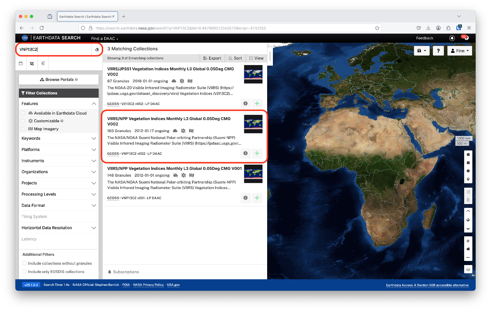
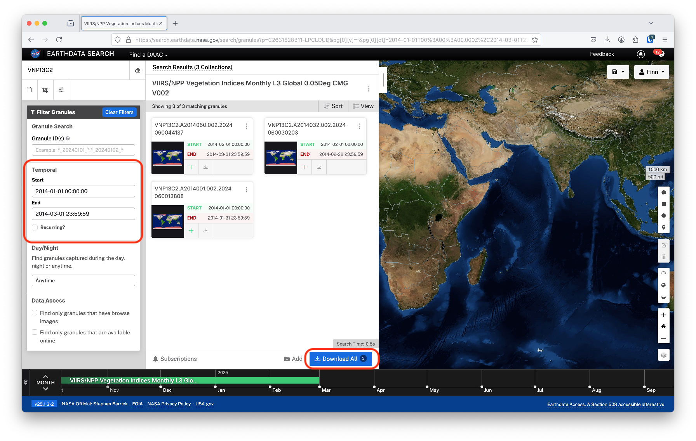
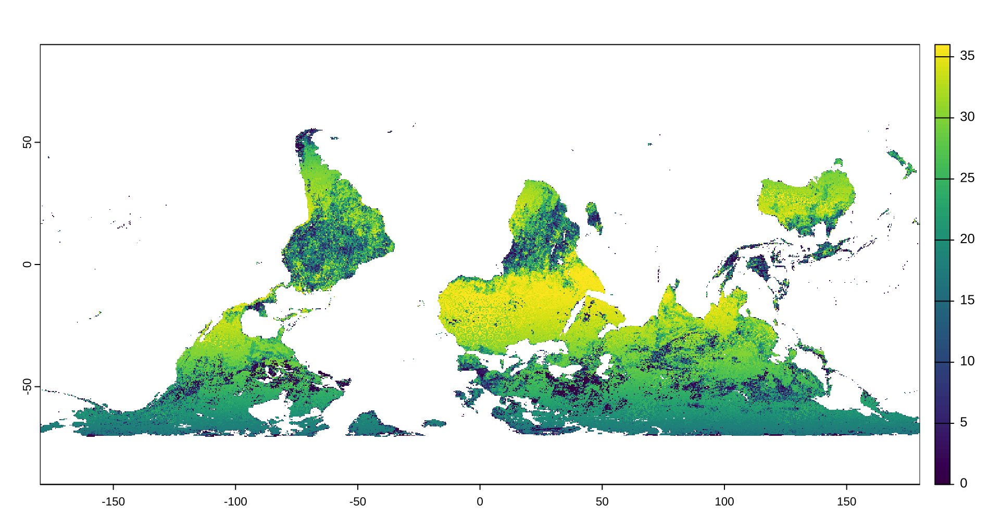
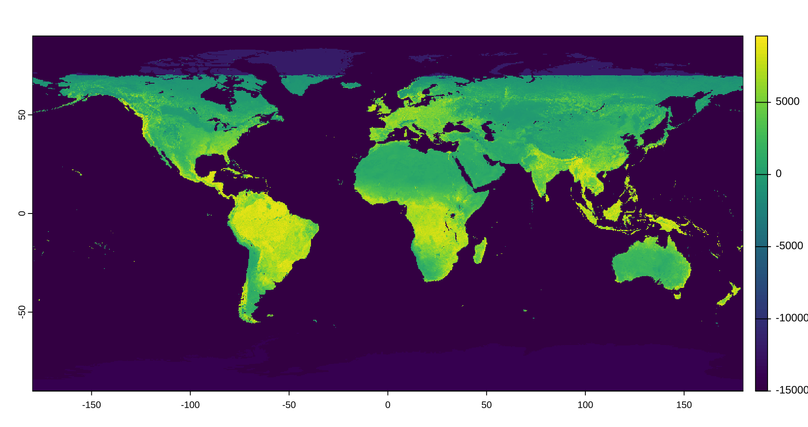
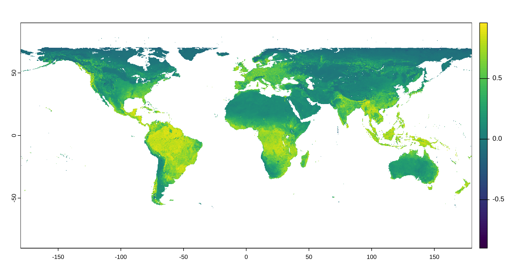
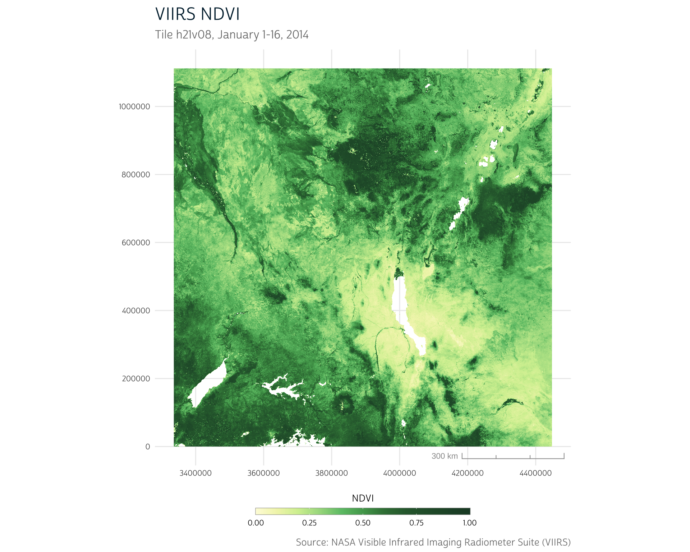
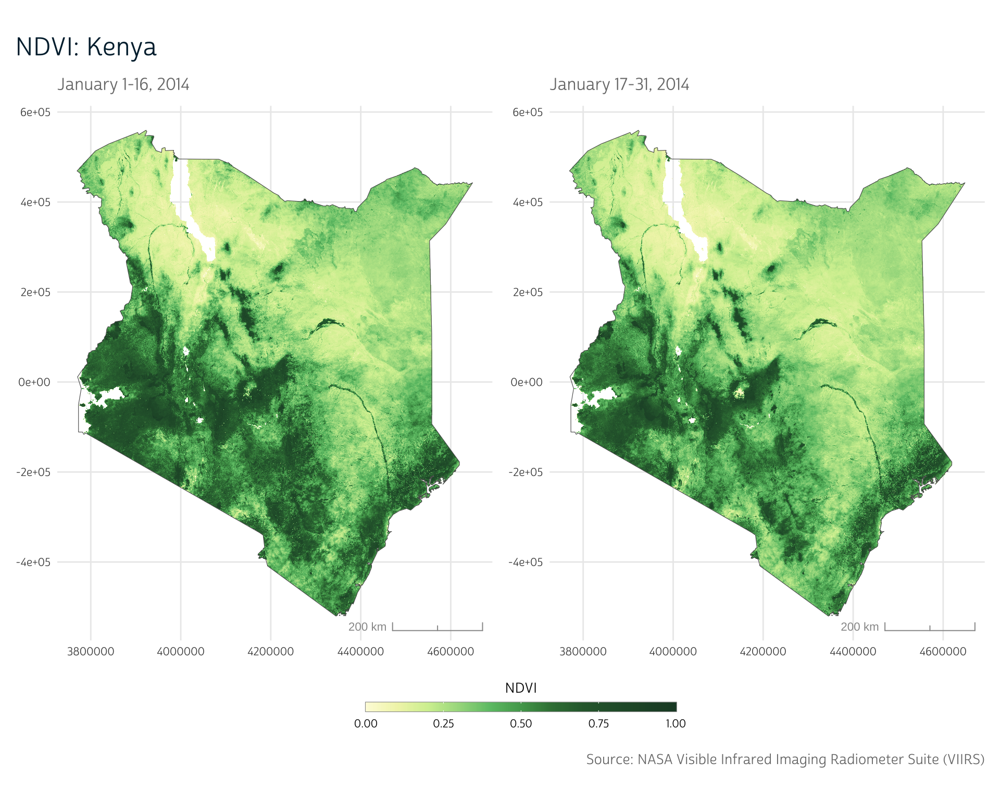

```{r}
#| echo: false
source("../../R/utils.R")

hook_output <- knitr::knit_hooks$get("output")

# set a new output hook to truncate text output
knitr::knit_hooks$set(output = function(x, options) {
  sdl <- options$scrub_data_local
  n <- options$out.lines
  
  if (rlang::is_true(sdl)) {
    x <- stringr::str_replace_all(x, "data_local", "data")
  }
  
  if (!is.null(n)) {
    x <- xfun::split_lines(x)
    if (length(x) > n) {
      # truncate the output
      x <- c(head(x, n), "....\n")
    }
    x <- paste(x, collapse = "\n")
  }
  
  hook_output(x, options)
})

ggplot2::theme_set(theme_dhs_base())

# Load fonts
sysfonts::font_add(
  family = "cabrito", 
  regular = "../../fonts/cabritosansnormregular-webfont.ttf"
)

showtext::showtext_auto()
```

The Normalized Vegetation Index (NDVI) is a measure that can be used in
research involving climate patterns, agriculture, access to green space
and much more. We’ve introduced NDVI in a [previous
post](../2024-08-01-ndvi-data), where we downloaded and prepared NDVI
data from MODIS.

[MODIS](https://modis.gsfc.nasa.gov/), or the Moderate Resolution
Imaging Spectroradiometer, is a global imager on two satellites (Terra
and Aqua) that has collected images of Earth’s surface for more than 20
years. While originally designed with the expectation of a 5-year
lifespan, MODIS is still operating today. However, as we
[mentioned](../2024-08-01-ndvi-data/#obtaining-ndvi) previously, both
Terra and Aqua are set to be
[decommissioned](https://www.earthdata.nasa.gov/news/feature-articles/from-terra-terra-firma).
As they drift from their original orbits, their overpass times will
increasingly lag, making the data they collect more difficult to compare
over time. Terra will continue to collect data until December 2025,
while Aqua will remain in orbit until August 2026.

Fortunately, a new imaging instrument has already been launched: the
[Visible Infrared Imaging Radiometer
Suite](https://www.earthdata.nasa.gov/data/instruments/viirs) (VIIRS).
In this post, we'll adapt the workflows we introduced before using MODIS
data with a new workflow using VIIRS data.

# MODIS vs. VIIRS

Fortunately, given the importance of MODIS in many earth science and
observation applications, significant effort has been put into ensuring
continuity between MODIS and VIIRS to ease the transition between the
two instruments.[@Roman2024; @Skakun2018] Still, there are some
differences between the two products.

Perhaps most importantly, of course, is difference in temporal
availability between the two. VIIRS data is only available starting in
2012, while MODIS data are available all the way back to early 2000.
Thus, if you’re linking environmental data to historical survey records,
you may have no choice but to use MODIS data. Fortunately, research
suggests that you can use data from the two instruments together if your
timeframe of interest overlaps the transition from MODIS to
VIIRS.[@Roman2024; @Li2014; @Skakun2018]

::: aside
For use before 2000, you may need to look into the [Advanced Very High
Resolution
Radiometer](https://www.earthdata.nasa.gov/data/instruments/avhrr)
(AVHRR).
:::

VIIRS and MODIS also have different spectral bands. MODIS has 36
spectral bands ranging from 250m to 1km in resolution, while VIIRS has
22 spectral bands at 375m and 750m. Some, though not all, of the VIIRS
spectral bands have higher resolution than their analogous MODIS
bands.[@Roman2024] So, while VIIRS does use more current technology and
improves upon MODIS in detection and accuracy for certain wavelengths of
light, there are specific bands where MODIS provides higher resolution.

::: callout-tip
A spectral **band** refers to a specific range of light wavelengths that
are detected by the imaging sensor. The reflectance of the surface in
different bands can be used to calculate many remote sensing metrics.
NDVI, for instance, is calculated using both the near-infrared band
reflectance and the red band reflectance.
:::

Further, while MODIS data was collected both in the morning and in the
afternoon, VIIRS only provides afternoon data. This means that diurnal
comparisons are not possible using VIIRS, and observations for areas
that tend to have cloud cover during the afternoon may be more
difficult.

See Román et al. (2024)[@Roman2024] for more detailed technical
comparisons between the two instruments. The [VIIRS vegetation index
technical
documentation](https://viirsland.gsfc.nasa.gov/PDF/SNPP_VIIRS_VI_UserGuide_09-26-2017_KDidan.pdf)
is also a comprehensive resource for understanding how VIIRS vegetation
data is collected and processed.

# Obtaining VIIRS NDVI data

You can obtain VIIRS data through NASA's [Earthdata
Search](https://search.earthdata.nasa.gov/search) interface, just like
we [previously demonstrated](../2024-08-01-ndvi-data/#earthdata-search)
when explaining how to download data from MODIS. All you need to do is
update the data collection you search for to identify VIIRS data
products rather than MODIS data products.

In our previous post, we used the MOD13Q1 collection—250m resolution
data delivered in 16-day increments. In this section, we'll demonstrate
how to obtain coarser global vegetation data from VIIRS.

## Why coarse resolution data?

Just like MODIS, VIIRS provides several different spatial and temporal
resolution options.

While it may seem obvious that you'd always want to find the highest
resolution data available, this isn't always the case. Particularly when
linking environmental data to large-scale surveys as we've demonstrated
throughout this blog, the limiting factor on our precision is typically
the location data available in the *survey*, not the environmental data.
Essentially, because of the inherent uncertainty in our survey
locations, the benefit of highly detailed environmental data is lost.

In many cases, NASA will provide data products that have already been
aggregated both spatially and temporally. These data are often easier to
work with and smaller in size, and the aggregation methods that NASA
uses often do a better job of handling data quality issues than we could
do when aggregating ourselves.

That being said, there are certainly cases where it's worthwhile to
obtain higher-resolution data. This may be the case if you have a high
degree of spatial resolution in the data you're linking to the
environmental metrics, or if you want to aggregate data in a particular
way to calculate environmental metrics that NASA doesn't provide out of
the box (see our [CHIRTS heatwave
post](../2024-04-15-chirts-metrics/#days-above) for an example).

The key is that when coarse resolution data are sufficient—as they often
are—they're typically the best option.

### VIIRS global data: VNP13C2

In the Earthdata Search interface, the product we'll use has the code
**VNP13C2**.

**VNP** is the prefix used for products that use the VIIRS instrument
aboard the NPP (as opposed to **MOD**, which we used for Terra-based
MODIS products).

::: callout-note
NPP refers to the [Suomi National Polar-orbiting
Partnership](https://eospso.nasa.gov/missions/suomi-national-polar-orbiting-partnership),
a satellite launched in 2011 with VIIRS (and other instruments) on
board. The newer [Joint Polar Satellite
System](https://eospso.nasa.gov/missions/joint-polar-satellite-system-1)
(JPSS-1) also houses VIIRS instruments (with the code VJ1).

We're using data from 2014 in this demo for consistency with our
previous post on MODIS. However, if you're working with data more recent
than 2017, you likely will want to use JPSS-1 VIIRS data.
:::

The **13** component of the collection name is a code that indicates
that the collection is a vegetation index.

The spatial resolution is represented by the final 2 digits of the
collection code. In this case we'll use **C2**, which is the coarsest
data available from VIIRS (\~5.5 km) and is delivered globally. This and
other global data products are provided on the **Climate Modeling
Grid**, or CMG, in which data are in geographic (latitude and longitude)
coordinates (this will be important later!).

To find the VNP13C2 product, enter the code in the search bar on the
Earthdata Search interface.

You should see a few different collections that pop up. We'll want to
use the **latest version** of the data. NASA regularly makes
improvements and corrections to the data from its instruments, and
importantly these changes are **retroactively applied** to prior years
of data. Thus, it's always advisable to use the latest version of a data
product once it's released. At the time of writing, the latest version
is v002, so we'll select the "VIIRS/NPP Vegetation Indices Monthly L3
Global 0.05Deg CMG V002" collection.

::: column-page
{fig-alt="NASA Earthdata VIIRS screenshot"}
:::

From here, you can follow the
[instructions](../2024-08-01-ndvi-data/#earthdata-search) we introduced
in our previous post (or use the Earthdata Search walk-through available
when you launch the website) to narrow down your temporal range of
interest. Here, our data are global, but if you were working with a
higher resolution dataset, you could also select data for a specific
spatial region through this interface as well.

We've restricted our data to the first three months of 2014 for
demonstration. You can download the data by clicking **Download All**.

::: column-page
{fig-alt="NASA Earthdata VIIRS screenshot 2"}
:::

We've placed these VNP13C2 files in a `data/VNP13C2` directory, which
we'll use for the rest of the post.

# Loading VIIRS data into R

As always, we'll start by loading the packages we'll use in this demo.

<!-- Note that this was run under terra 1.8.29 -->

```{r}
#| message: false
library(stringr)
library(ggplot2)
library(ggspatial)
library(purrr)
library(terra)
```

In large part, loading VIIRS data follows the same workflow that we
[demonstrated](../2024-08-01-ndvi-data/#nasa-image-files) for MODIS
data. Both data sources are raster data containing the same vegetation
indices.

```{r}
#| echo: false
#| results: false
files <- list.files("data_local/VNP13C2", full.names = TRUE)
```

```{r}
#| eval: false
files <- list.files("data/VNP13C2", full.names = TRUE)
```

The file names contain helpful information about the data within. We can
see the VIIRS product code (VNP13C2) followed by the file timestamp
(e.g., A2014001), which uses the year (2014) followed by the Julian day
(001—for January 1st). We also see the version (002) and finally the
time that the file was last processed by NASA.

```{r}
#| scrub_data_local: true
files
```

One key difference is in the file format. While the MODIS files we
downloaded previously came in HDF4 format, VIIRS files come in HDF5
(`.h5`) format. HDF5 files are supported by `{terra}`, but they store
their metadata in different ways, which are not always detected
automatically.

For instance, if we load a few sample VIIRS files that we downloaded as
described above, we notice that we get a warning when attempting to load
with `rast()`:

<div class="cell">
<div class="code-copy-outer-scaffold"><div class="sourceCode" id="cb4"><pre class="downlit sourceCode r code-with-copy"><code class="sourceCode R"><span><span class="va">viirs_cmg</span> <span class="op">&lt;-</span> <span class="fu"><a href="https://rspatial.github.io/terra/reference/rast.html">rast</a></span><span class="op">(</span><span class="va">files</span><span class="op">)</span></span>
<span><span class="co">#&gt; Warning: [rast] unknown extent</span></span></code></pre></div><button title="Copy to Clipboard" class="code-copy-button"><i class="bi"></i></button></div>
</div>

This warning is alerting us to the fact that while we were able to load
the file into a `SpatRaster` object, we're missing information about the
spatial extent of the data we've loaded.

We can check the extent information with `ext()`:

<div class="cell">
<div class="code-copy-outer-scaffold"><div class="sourceCode" id="cb5"><pre class="downlit sourceCode r code-with-copy"><code class="sourceCode R"><span><span class="fu"><a href="https://rspatial.github.io/terra/reference/ext.html">ext</a></span><span class="op">(</span><span class="va">viirs_cmg</span><span class="op">)</span></span>
<span><span class="co">#&gt; SpatExtent : 0, 7200, 0, 3600 (xmin, xmax, ymin, ymax)</span></span></code></pre></div><button title="Copy to Clipboard" class="code-copy-button"><i class="bi"></i></button></div>
</div>

Why do we have extent information stored when terra warned us that it
couldn't identify the extent? This is because the extent that's used in
the absence of geographical information is simply in *pixel units*. That
is, our raster is 7200x3600 pixels.

Unfortunately, this doesn't tell us anything about the geographic
locations that the data correspond to. That is, the data aren't
**georeferenced**.

Accordingly, we'll notice that our data are also missing a coordinate
reference system:

<div class="cell">
<div class="code-copy-outer-scaffold"><div class="sourceCode" id="cb6"><pre class="downlit sourceCode r code-with-copy"><code class="sourceCode R"><span><span class="fu"><a href="https://rspatial.github.io/terra/reference/crs.html">crs</a></span><span class="op">(</span><span class="va">viirs_cmg</span><span class="op">)</span></span>
<span><span class="co">#&gt; [1] ""</span></span></code></pre></div><button title="Copy to Clipboard" class="code-copy-button"><i class="bi"></i></button></div>
</div>

So, terra was able to load the raster values, but we don't know any of
the critical geographical information associated with these data.
Apparently terra isn't able to access it in these files!

::: callout-note
While these metadata aren't loaded automatically at the time of writing,
it's possible that future updates to these files, `{terra}` or other R
packages may make it possible to do so, and you may not need to manually
fix the raster metadata after loading as we demonstrate below.
:::

## Fixing raster metadata

As stated in the [VIIRS Vegetation Index Product
Guide](https://viirsland.gsfc.nasa.gov/PDF/SNPP_VIIRS_VI_UserGuide_09-26-2017_KDidan.pdf),
the VIIRS CMG data are provided in WGS84 geographic coordinates (that
is, latitude and longitude) for the entire globe.

We could use this knowledge to provide the missing extent and CRS
information ourselves. We know that the global extent should span from
-180° to 180° in longitude and -90° to 90° in latitude, so we can easily
set the extent using terra's `ext()`:

<div class="cell">
<div class="code-copy-outer-scaffold"><div class="sourceCode" id="cb7"><pre class="downlit sourceCode r code-with-copy"><code class="sourceCode R"><span><span class="co"># Note that `ext()` expects coordinates in (xmin, xmax, ymin, ymax) order</span></span>
<span><span class="fu"><a href="https://rspatial.github.io/terra/reference/ext.html">ext</a></span><span class="op">(</span><span class="va">viirs_cmg</span><span class="op">)</span> <span class="op">&lt;-</span> <span class="fu"><a href="https://rdrr.io/r/base/c.html">c</a></span><span class="op">(</span><span class="op">-</span><span class="fl">180</span>, <span class="fl">180</span>, <span class="op">-</span><span class="fl">90</span>, <span class="fl">90</span><span class="op">)</span></span></code></pre></div><button title="Copy to Clipboard" class="code-copy-button"><i class="bi"></i></button></div>
</div>

Similarly, we could provide the [EPSG code](https://epsg.io/) for WGS84
using terra's `crs()`:

<div class="cell">
<div class="code-copy-outer-scaffold"><div class="sourceCode" id="cb8"><pre class="downlit sourceCode r code-with-copy"><code class="sourceCode R"><span><span class="fu"><a href="https://rspatial.github.io/terra/reference/crs.html">crs</a></span><span class="op">(</span><span class="va">viirs_cmg</span><span class="op">)</span> <span class="op">&lt;-</span> <span class="st">"epsg:4326"</span></span></code></pre></div><button title="Copy to Clipboard" class="code-copy-button"><i class="bi"></i></button></div>
</div>

Unfortunately, if we go ahead and plot our data, we notice something a
bit unexpected:

<div class="cell">
<div class="code-copy-outer-scaffold"><div class="sourceCode" id="cb9"><pre class="downlit sourceCode r code-with-copy"><code class="sourceCode R"><span><span class="fu"><a href="https://rspatial.github.io/terra/reference/plot.html">plot</a></span><span class="op">(</span><span class="va">viirs_cmg</span><span class="op">[[</span><span class="fl">1</span><span class="op">]</span><span class="op">]</span><span class="op">)</span></span></code></pre></div><button title="Copy to Clipboard" class="code-copy-button"><i class="bi"></i></button></div>
</div>

```{r}
#| fig-alt: "Global Map flipped"
#| column: page
#| out-width: "100%"
#| echo: false
# Default `plot()` margins are not ideal...for now just
# going to crop the plot manually and insert image below

```

As it turns out, because of the lack of geographic metadata, the file
was flagged as "flipped" by [GDAL](https://gdal.org/en/stable/) (the
spatial translation library used by terra), so terra flipped the file
vertically. When loading our raster, we can set `noflip = TRUE` to
ensure our data are loaded in the correct orientation.

You may also have noticed that the range of values in the plot above
doesn't correspond to what we'd expect from NDVI (which should range
from -1 to 1). This is because our input file actually contains several
measures ("subdatasets") in addition to NDVI, and we've only shown the
first. We can use the `subds` argument to select a particular subdataset
from the HDF5 file. ([Later](#access-metadata), we'll show how you can
use the metadata to find the correct subdataset name.)

Making these adjustments, we get:

<div class="cell">
<div class="code-copy-outer-scaffold"><div class="sourceCode" id="cb10"><pre class="downlit sourceCode r code-with-copy"><code class="sourceCode R"><span><span class="va">viirs_cmg</span> <span class="op">&lt;-</span> <span class="fu"><a href="https://rspatial.github.io/terra/reference/rast.html">rast</a></span><span class="op">(</span></span>
<span>  <span class="va">files</span>, </span>
<span>  subds <span class="op">=</span> <span class="st">"//HDFEOS/GRIDS/VIIRS_Grid_monthly_VI_CMG/Data_Fields/CMG_0.05_Deg_monthly_NDVI"</span>,</span>
<span>  noflip <span class="op">=</span> <span class="cn">TRUE</span></span>
<span><span class="op">)</span></span>
<span></span>
<span><span class="co"># Don't forget to attach geographic info as we've re-loaded the file!</span></span>
<span><span class="fu"><a href="https://rspatial.github.io/terra/reference/ext.html">ext</a></span><span class="op">(</span><span class="va">viirs_cmg</span><span class="op">)</span> <span class="op">&lt;-</span> <span class="fu"><a href="https://rdrr.io/r/base/c.html">c</a></span><span class="op">(</span><span class="op">-</span><span class="fl">180</span>, <span class="fl">180</span>, <span class="op">-</span><span class="fl">90</span>, <span class="fl">90</span><span class="op">)</span></span>
<span><span class="fu"><a href="https://rspatial.github.io/terra/reference/crs.html">crs</a></span><span class="op">(</span><span class="va">viirs_cmg</span><span class="op">)</span> <span class="op">&lt;-</span> <span class="st">"epsg:4326"</span></span></code></pre></div><button title="Copy to Clipboard" class="code-copy-button"><i class="bi"></i></button></div>
</div>

We now have a georeferenced NDVI raster dataset for 3 months:

<div class="cell">
<div class="code-copy-outer-scaffold"><div class="sourceCode" id="cb11"><pre class="downlit sourceCode r code-with-copy"><code class="sourceCode R"><span><span class="va">viirs_cmg</span></span>
<span><span class="co">#&gt; class       : SpatRaster </span></span>
<span><span class="co">#&gt; dimensions  : 3600, 7200, 3  (nrow, ncol, nlyr)</span></span>
<span><span class="co">#&gt; resolution  : 0.05, 0.05  (x, y)</span></span>
<span><span class="co">#&gt; extent      : -180, 180, -90, 90  (xmin, xmax, ymin, ymax)</span></span>
<span><span class="co">#&gt; coord. ref. : lon/lat WGS 84 (EPSG:4326) </span></span>
<span><span class="co">#&gt; sources     : VNP13C2.A2014001.002.2024060013808.h5://CMG_0.05_Deg_monthly_NDVI  </span></span>
<span><span class="co">#&gt;               VNP13C2.A2014032.002.2024060030203.h5://CMG_0.05_Deg_monthly_NDVI  </span></span>
<span><span class="co">#&gt;               VNP13C2.A2014060.002.2024060044137.h5://CMG_0.05_Deg_monthly_NDVI  </span></span>
<span><span class="co">#&gt; varnames    : CMG_0 </span></span>
<span><span class="co">#&gt;               CMG_0 </span></span>
<span><span class="co">#&gt;               CMG_0 </span></span>
<span><span class="co">#&gt; names       : CMG_0.05_D~nthly_NDVI, CMG_0.05_D~nthly_NDVI, CMG_0.05_D~nthly_NDVI</span></span></code></pre></div><button title="Copy to Clipboard" class="code-copy-button"><i class="bi"></i></button></div>
</div>

A quick map of our data shows that it's now oriented correctly:

<div class="cell">
<div class="code-copy-outer-scaffold"><div class="sourceCode" id="cb12"><pre class="downlit sourceCode r code-with-copy"><code class="sourceCode R"><span><span class="fu"><a href="https://rspatial.github.io/terra/reference/plot.html">plot</a></span><span class="op">(</span><span class="va">viirs_cmg</span><span class="op">[[</span><span class="fl">1</span><span class="op">]</span><span class="op">]</span><span class="op">)</span></span></code></pre></div><button title="Copy to Clipboard" class="code-copy-button"><i class="bi"></i></button></div>
</div>

```{r}
#| fig-alt: "Global Map corrected, NDVI scaled"
#| column: page
#| out-width: "100%"
#| echo: false

```

However, our NDVI units still appear to be off—we'd expect them to range
from -1 to 1, but here we see they appear to be scaled. The [VIIRS
documentation](https://viirsland.gsfc.nasa.gov/PDF/SNPP_VIIRS_VI_UserGuide_09-26-2017_KDidan.pdf)
indicates that the values have been scaled by 10000 and that the valid
range of data is from -10000 to 10000.

We'll rescale our data with simple division:

<div class="cell">
<div class="code-copy-outer-scaffold"><div class="sourceCode" id="cb13"><pre class="downlit sourceCode r code-with-copy"><code class="sourceCode R"><span><span class="co"># Rescale data</span></span>
<span><span class="va">viirs_cmg</span> <span class="op">&lt;-</span> <span class="va">viirs_cmg</span> <span class="op">/</span> <span class="fl">10000</span></span></code></pre></div><button title="Copy to Clipboard" class="code-copy-button"><i class="bi"></i></button></div>
</div>

Then, we'll use `classify()` to convert all raster values below -1 to
missing values. `classify()` expects a matrix that contains an input
range (in this case, `-Inf` to `-1`) and an output value that should be
used as a replacement for values in that range (in this case, `NA`).

<div class="cell">
<div class="code-copy-outer-scaffold"><div class="sourceCode" id="cb14"><pre class="downlit sourceCode r code-with-copy"><code class="sourceCode R"><span><span class="co"># Reclassify out-of-range data to NA</span></span>
<span><span class="va">m</span> <span class="op">&lt;-</span> <span class="fu"><a href="https://rdrr.io/r/base/matrix.html">matrix</a></span><span class="op">(</span><span class="fu"><a href="https://rdrr.io/r/base/c.html">c</a></span><span class="op">(</span><span class="op">-</span><span class="cn">Inf</span>, <span class="op">-</span><span class="fl">1</span>, <span class="cn">NA</span><span class="op">)</span>, nrow <span class="op">=</span> <span class="fl">1</span><span class="op">)</span></span>
<span><span class="va">viirs_cmg</span> <span class="op">&lt;-</span> <span class="fu"><a href="https://rspatial.github.io/terra/reference/classify.html">classify</a></span><span class="op">(</span><span class="va">viirs_cmg</span>, <span class="va">m</span><span class="op">)</span></span></code></pre></div><button title="Copy to Clipboard" class="code-copy-button"><i class="bi"></i></button></div>
</div>

This looks much better:

<!-- ```{r} -->

<!-- #| cache: true -->

<!-- #| echo: false -->

<!-- #| code-fold: true -->

<!-- #| code-summary: "Show plot code" -->

<!-- #| column: page -->

<!-- #| include: false -->

<!-- ndvi_pal <- list( -->

<!--   pal = c( -->

<!--     "#fdfbdc", -->

<!--     "#f1f4b7", -->

<!--     "#d3ef9f", -->

<!--     "#a5da8d", -->

<!--     "#6cc275", -->

<!--     "#51a55b", -->

<!--     "#397e43", -->

<!--     "#2d673a", -->

<!--     "#1d472e" -->

<!--   ), -->

<!--   values = c(0, 0.1, 0.2, 0.3, 0.4, 0.5, 0.6, 0.7, 1) -->

<!-- ) -->

<!-- ggplot() + -->

<!--   layer_spatial(viirs_cmg[[1]]) + -->

<!--   scale_fill_gradientn( -->

<!--     colors = ndvi_pal$pal, -->

<!--     values = ndvi_pal$values, -->

<!--     limits = c(0, 1), -->

<!--     na.value = "transparent" -->

<!--   ) + -->

<!--   theme_void() + -->

<!--   guides(fill = "none") -->

<!-- ``` -->

```{r}
#| eval: false
plot(viirs_cmg[[1]])
```

```{r}
#| fig-alt: "Global map correct orientation and NDVI"
#| column: page
#| out-width: "100%"
#| echo: false

```

At this point, we could load spatial boundary files for a particular
region to crop our data and proceed with our analysis. We've covered
this kind of process [previously](../2024-08-01-ndvi-data/#crop-tiles),
so we won't demonstrate again here. As is often the case, the bulk of
the work when introducing a new data product is figuring out how to get
it loaded and prepared correctly.

# Working with other VIIRS data products

So far we've been working with global, coarse-resolution data. In our
previous [MODIS post](../2024-08-01-ndvi-data), we instead showed how to
access higher-resolution data for a particular region of interest.

As a more direct analog to our previous workflow, we'll quickly
demonstrate how that process can be updated for use with VIIRS HDF5
files. This will also give us a chance to show you how you can access
HDF5 file metadata to help identify subdatasets and geographic
information for a file.

## HDF5 metadata

In general, the process for loading and working with higher-resolution
files mirrors the process we demonstrated above. However, instead of
downloading global data, we'll download data for a collection of
**tiles** of data in our area of interest.

::: callout-tip
We showed you how to use Earthdata Search to download data on a
tile-by-tile basis in our [MODIS
post](../2024-08-01-ndvi-data/#earthdata-search). The only difference
here is that we've downloaded data for the VNP13A1 product, not the
MOD13Q1 product.
:::

There are two key differences when working with VNP13A1 as compared to
the global VNP13C2 data described above.

-   First, NASA uses a **sinusoidal projection** for its high resolution
    products, not the geographic coordinates used for the global CMG
    product.
-   Second, because we will be stitching together multiple tiles of
    data, each will have a different geographic extent.

To deal with these additional complexities, we'll need to access the
file metadata directly to attempt to identify the correct CRS and extent
information.

### Bioconductor and the rhdf5 package

```{r}
#| echo: false
#| results: false
files <- list.files("data_local/VNP13A1", full.names = TRUE)
```

First, we'll load a collection of 8 HDF files that cover 2 timestamps
for the same 4 tiles that we used in our MODIS post. We've placed them
in a `data/VNP13A1` directory.

<div class="cell">
<div class="code-copy-outer-scaffold"><div class="sourceCode" id="cb16"><pre class="downlit sourceCode r code-with-copy"><code class="sourceCode R"><span><span class="va">files</span> <span class="op">&lt;-</span> <span class="fu"><a href="https://rdrr.io/r/base/list.files.html">list.files</a></span><span class="op">(</span><span class="st">"data/VNP13A1"</span>, full.names <span class="op">=</span> <span class="cn">TRUE</span><span class="op">)</span></span></code></pre></div><button title="Copy to Clipboard" class="code-copy-button"><i class="bi"></i></button></div>
</div>

Unfortunately, terra isn't designed to provide flexible access to
metadata for HDF5 files. However, there is another R package that can
help, appropriately named `{rhdf5}`.

rhdf5 is a package from [Bioconductor](https://www.bioconductor.org/),
an open-source software project focused on building bioinformatics
tools. You're probably familiar with installing packages from
[CRAN](https://cran.r-project.org/), which is the default behavior when
using `install.packages()`, but Bioconductor packages are not stored on
CRAN.

Fortunately, Bioconductor maintains the `{BiocManager}` package to help
install Bioconductor packages. If you've never worked with a
Bioconductor package before, you can install the manager with

<div class="cell">
<div class="code-copy-outer-scaffold"><div class="sourceCode" id="cb17"><pre class="downlit sourceCode r code-with-copy"><code class="sourceCode R"><span><span class="fu"><a href="https://rdrr.io/r/utils/install.packages.html">install.packages</a></span><span class="op">(</span><span class="st">"BiocManager"</span><span class="op">)</span></span></code></pre></div><button title="Copy to Clipboard" class="code-copy-button"><i class="bi"></i></button></div>
</div>

Then, you can use it to install rhdf5:

```{r}
#| eval: false
BiocManager::install("rhdf5")
```

Note that you'll only need to do this once, unless you later need to
update the `BiocManager` or `rhdf5` packages.

### Accessing metadata {#access-metadata}

First, we'll load the `{rhdf5}` package:

<div class="cell">
<div class="code-copy-outer-scaffold"><div class="sourceCode" id="cb19"><pre class="downlit sourceCode r code-with-copy"><code class="sourceCode R"><span><span class="kw"><a href="https://rdrr.io/r/base/library.html">library</a></span><span class="op">(</span><span class="va"><a href="https://github.com/Huber-group-EMBL/rhdf5">rhdf5</a></span><span class="op">)</span></span></code></pre></div><button title="Copy to Clipboard" class="code-copy-button"><i class="bi"></i></button></div>
</div>

We can view the available data and metadata fields in an HDF5 file with
`h5ls()`.

<div class="cell">
<div class="code-copy-outer-scaffold"><div class="sourceCode" id="cb20"><pre class="downlit sourceCode r code-with-copy"><code class="sourceCode R"><span><span class="va">ds</span> <span class="op">&lt;-</span> <span class="fu"><a href="https://rdrr.io/pkg/rhdf5/man/h5ls.html">h5ls</a></span><span class="op">(</span><span class="va">files</span><span class="op">[</span><span class="fl">1</span><span class="op">]</span><span class="op">)</span></span></code></pre></div><button title="Copy to Clipboard" class="code-copy-button"><i class="bi"></i></button></div>
</div>

HDF5 files are organized into **groups**. Groups refer to an abstract
collection of objects, like datasets or metadata objects. Each data
object has a **name**. You can think of each group as a directory and
the objects inside as different files within that directory.

For instance, if we view this file's groups, we notice that there are
several entries in the `Data Fields` group, among others:

<div class="cell">
<div class="code-copy-outer-scaffold"><div class="sourceCode" id="cb21"><pre class="downlit sourceCode r code-with-copy"><code class="sourceCode R"><span><span class="va">ds</span><span class="op">$</span><span class="va">group</span></span>
<span><span class="co">#&gt;  [1] "/"                                                 </span></span>
<span><span class="co">#&gt;  [2] "/HDFEOS"                                           </span></span>
<span><span class="co">#&gt;  [3] "/HDFEOS/ADDITIONAL"                                </span></span>
<span><span class="co">#&gt;  [4] "/HDFEOS"                                           </span></span>
<span><span class="co">#&gt;  [5] "/HDFEOS/GRIDS"                                     </span></span>
<span><span class="co">#&gt;  [6] "/HDFEOS/GRIDS/VIIRS_Grid_16Day_VI_500m"            </span></span>
<span><span class="co">#&gt;  [7] "/HDFEOS/GRIDS/VIIRS_Grid_16Day_VI_500m/Data Fields"</span></span>
<span><span class="co">#&gt;  [8] "/HDFEOS/GRIDS/VIIRS_Grid_16Day_VI_500m/Data Fields"</span></span>
<span><span class="co">#&gt;  [9] "/HDFEOS/GRIDS/VIIRS_Grid_16Day_VI_500m/Data Fields"</span></span>
<span><span class="co">#&gt; [10] "/HDFEOS/GRIDS/VIIRS_Grid_16Day_VI_500m/Data Fields"</span></span>
<span><span class="co">#&gt; [11] "/HDFEOS/GRIDS/VIIRS_Grid_16Day_VI_500m/Data Fields"</span></span>
<span><span class="co">#&gt; [12] "/HDFEOS/GRIDS/VIIRS_Grid_16Day_VI_500m/Data Fields"</span></span>
<span><span class="co">#&gt; [13] "/HDFEOS/GRIDS/VIIRS_Grid_16Day_VI_500m/Data Fields"</span></span>
<span><span class="co">#&gt; [14] "/HDFEOS/GRIDS/VIIRS_Grid_16Day_VI_500m/Data Fields"</span></span>
<span><span class="co">#&gt; [15] "/HDFEOS/GRIDS/VIIRS_Grid_16Day_VI_500m/Data Fields"</span></span>
<span><span class="co">#&gt; [16] "/HDFEOS/GRIDS/VIIRS_Grid_16Day_VI_500m/Data Fields"</span></span>
<span><span class="co">#&gt; [17] "/HDFEOS/GRIDS/VIIRS_Grid_16Day_VI_500m/Data Fields"</span></span>
<span><span class="co">#&gt; [18] "/HDFEOS/GRIDS/VIIRS_Grid_16Day_VI_500m/Data Fields"</span></span>
<span><span class="co">#&gt; [19] "/HDFEOS/GRIDS/VIIRS_Grid_16Day_VI_500m/Data Fields"</span></span>
<span><span class="co">#&gt; [20] "/HDFEOS/GRIDS/VIIRS_Grid_16Day_VI_500m/Data Fields"</span></span>
<span><span class="co">#&gt; [21] "/HDFEOS/GRIDS/VIIRS_Grid_16Day_VI_500m/Data Fields"</span></span>
<span><span class="co">#&gt; [22] "/HDFEOS/GRIDS/VIIRS_Grid_16Day_VI_500m/Data Fields"</span></span>
<span><span class="co">#&gt; [23] "/HDFEOS/GRIDS/VIIRS_Grid_16Day_VI_500m/Data Fields"</span></span>
<span><span class="co">#&gt; [24] "/HDFEOS/GRIDS/VIIRS_Grid_16Day_VI_500m"            </span></span>
<span><span class="co">#&gt; [25] "/HDFEOS/GRIDS/VIIRS_Grid_16Day_VI_500m"            </span></span>
<span><span class="co">#&gt; [26] "/"                                                 </span></span>
<span><span class="co">#&gt; [27] "/HDFEOS INFORMATION"                               </span></span>
<span><span class="co">#&gt; [28] "/HDFEOS INFORMATION"                               </span></span>
<span><span class="co">#&gt; [29] "/HDFEOS INFORMATION"</span></span></code></pre></div><button title="Copy to Clipboard" class="code-copy-button"><i class="bi"></i></button></div>
</div>

If we look at the specific objects within these groups, we see that each
of these data fields is a different metric (e.g. EVI \[Enhanced
Vegetation Index\], NDVI, etc.):

<div class="cell">
<div class="code-copy-outer-scaffold"><div class="sourceCode" id="cb22"><pre class="downlit sourceCode r code-with-copy"><code class="sourceCode R"><span><span class="fu"><a href="https://rdrr.io/r/base/paste.html">paste</a></span><span class="op">(</span><span class="va">ds</span><span class="op">$</span><span class="va">group</span>, <span class="va">ds</span><span class="op">$</span><span class="va">name</span>, sep <span class="op">=</span> <span class="st">"/"</span><span class="op">)</span></span>
<span><span class="co">#&gt;  [1] "//HDFEOS"                                                                                  </span></span>
<span><span class="co">#&gt;  [2] "/HDFEOS/ADDITIONAL"                                                                        </span></span>
<span><span class="co">#&gt;  [3] "/HDFEOS/ADDITIONAL/FILE_ATTRIBUTES"                                                        </span></span>
<span><span class="co">#&gt;  [4] "/HDFEOS/GRIDS"                                                                             </span></span>
<span><span class="co">#&gt;  [5] "/HDFEOS/GRIDS/VIIRS_Grid_16Day_VI_500m"                                                    </span></span>
<span><span class="co">#&gt;  [6] "/HDFEOS/GRIDS/VIIRS_Grid_16Day_VI_500m/Data Fields"                                        </span></span>
<span><span class="co">#&gt;  [7] "/HDFEOS/GRIDS/VIIRS_Grid_16Day_VI_500m/Data Fields/500 m 16 days EVI"                      </span></span>
<span><span class="co">#&gt;  [8] "/HDFEOS/GRIDS/VIIRS_Grid_16Day_VI_500m/Data Fields/500 m 16 days EVI2"                     </span></span>
<span><span class="co">#&gt;  [9] "/HDFEOS/GRIDS/VIIRS_Grid_16Day_VI_500m/Data Fields/500 m 16 days NDVI"                     </span></span>
<span><span class="co">#&gt; [10] "/HDFEOS/GRIDS/VIIRS_Grid_16Day_VI_500m/Data Fields/500 m 16 days NIR reflectance"          </span></span>
<span><span class="co">#&gt; [11] "/HDFEOS/GRIDS/VIIRS_Grid_16Day_VI_500m/Data Fields/500 m 16 days SWIR1 reflectance"        </span></span>
<span><span class="co">#&gt; [12] "/HDFEOS/GRIDS/VIIRS_Grid_16Day_VI_500m/Data Fields/500 m 16 days SWIR2 reflectance"        </span></span>
<span><span class="co">#&gt; [13] "/HDFEOS/GRIDS/VIIRS_Grid_16Day_VI_500m/Data Fields/500 m 16 days SWIR3 reflectance"        </span></span>
<span><span class="co">#&gt; [14] "/HDFEOS/GRIDS/VIIRS_Grid_16Day_VI_500m/Data Fields/500 m 16 days VI Quality"               </span></span>
<span><span class="co">#&gt; [15] "/HDFEOS/GRIDS/VIIRS_Grid_16Day_VI_500m/Data Fields/500 m 16 days blue reflectance"         </span></span>
<span><span class="co">#&gt; [16] "/HDFEOS/GRIDS/VIIRS_Grid_16Day_VI_500m/Data Fields/500 m 16 days composite day of the year"</span></span>
<span><span class="co">#&gt; [17] "/HDFEOS/GRIDS/VIIRS_Grid_16Day_VI_500m/Data Fields/500 m 16 days green reflectance"        </span></span>
<span><span class="co">#&gt; [18] "/HDFEOS/GRIDS/VIIRS_Grid_16Day_VI_500m/Data Fields/500 m 16 days pixel reliability"        </span></span>
<span><span class="co">#&gt; [19] "/HDFEOS/GRIDS/VIIRS_Grid_16Day_VI_500m/Data Fields/500 m 16 days red reflectance"          </span></span>
<span><span class="co">#&gt; [20] "/HDFEOS/GRIDS/VIIRS_Grid_16Day_VI_500m/Data Fields/500 m 16 days relative azimuth angle"   </span></span>
<span><span class="co">#&gt; [21] "/HDFEOS/GRIDS/VIIRS_Grid_16Day_VI_500m/Data Fields/500 m 16 days sun zenith angle"         </span></span>
<span><span class="co">#&gt; [22] "/HDFEOS/GRIDS/VIIRS_Grid_16Day_VI_500m/Data Fields/500 m 16 days view zenith angle"        </span></span>
<span><span class="co">#&gt; [23] "/HDFEOS/GRIDS/VIIRS_Grid_16Day_VI_500m/Data Fields/Projection"                             </span></span>
<span><span class="co">#&gt; [24] "/HDFEOS/GRIDS/VIIRS_Grid_16Day_VI_500m/XDim"                                               </span></span>
<span><span class="co">#&gt; [25] "/HDFEOS/GRIDS/VIIRS_Grid_16Day_VI_500m/YDim"                                               </span></span>
<span><span class="co">#&gt; [26] "//HDFEOS INFORMATION"                                                                      </span></span>
<span><span class="co">#&gt; [27] "/HDFEOS INFORMATION/ArchiveMetadata.0"                                                     </span></span>
<span><span class="co">#&gt; [28] "/HDFEOS INFORMATION/CoreMetadata.0"                                                        </span></span>
<span><span class="co">#&gt; [29] "/HDFEOS INFORMATION/StructMetadata.0"</span></span></code></pre></div><button title="Copy to Clipboard" class="code-copy-button"><i class="bi"></i></button></div>
</div>

Of particular interest is the `"500 m 16 days NDVI"` data field, which
contains the NDVI data we'll eventually want to load.

Also of note is the `"/HDFEOS INFORMATION/StructMetadata.0"` object. By
convention, this is where NASA stores some of the key geographic
metadata for the file.

We can read the HDF5 metadata using `h5read()`. The `name` argument
should be set to one of the `group` and `name` values from the `h5ls()`
output above.

<div class="cell">
<div class="code-copy-outer-scaffold"><div class="sourceCode" id="cb23"><pre class="downlit sourceCode r code-with-copy"><code class="sourceCode R"><span><span class="va">metadata</span> <span class="op">&lt;-</span> <span class="fu"><a href="https://rdrr.io/pkg/rhdf5/man/h5_read.html">h5read</a></span><span class="op">(</span><span class="va">files</span><span class="op">[</span><span class="fl">1</span><span class="op">]</span>, name <span class="op">=</span> <span class="st">"//HDFEOS INFORMATION/StructMetadata.0"</span><span class="op">)</span></span></code></pre></div><button title="Copy to Clipboard" class="code-copy-button"><i class="bi"></i></button></div>
</div>

You can use `cat()` to display the metadata text in the R console,
making it a bit easier to read.

<div class="cell" data-out.lines="15">
<div class="code-copy-outer-scaffold"><div class="sourceCode" id="cb24"><pre class="downlit sourceCode r code-with-copy"><code class="sourceCode R"><span><span class="fu"><a href="https://rdrr.io/r/base/cat.html">cat</a></span><span class="op">(</span><span class="va">metadata</span><span class="op">)</span></span>
<span><span class="co">#&gt; GROUP=SwathStructure</span></span>
<span><span class="co">#&gt; END_GROUP=SwathStructure</span></span>
<span><span class="co">#&gt; GROUP=GridStructure</span></span>
<span><span class="co">#&gt;  GROUP=GRID_1</span></span>
<span><span class="co">#&gt;      GridName="VIIRS_Grid_16Day_VI_500m"</span></span>
<span><span class="co">#&gt;      XDim=2400</span></span>
<span><span class="co">#&gt;      YDim=2400</span></span>
<span><span class="co">#&gt;      UpperLeftPointMtrs=(3335851.559000,1111950.519667)</span></span>
<span><span class="co">#&gt;      LowerRightMtrs=(4447802.078667,0.000000)</span></span>
<span><span class="co">#&gt;      Projection=HE5_GCTP_SNSOID</span></span>
<span><span class="co">#&gt;      ProjParams=(6371007.181000,0,0,0,0,0,0,0,0,0,0,0,0)</span></span>
<span><span class="co">#&gt;      SphereCode=-1</span></span>
<span><span class="co">#&gt;      GROUP=Dimension</span></span>
<span><span class="co">#&gt;          OBJECT=Dimension_1</span></span>
<span><span class="co">#&gt;              DimensionName="dimofone"</span></span>
<span><span class="va">....</span></span></code></pre></div><button title="Copy to Clipboard" class="code-copy-button"><i class="bi"></i></button></div>
</div>

#### Projection metadata

Notice the `Projection` and `ProjParams` rows in the output above. These
show details about the projection and projection parameters for our
data. On their own, they're hard to interpret, but a quick look at the
VIIRS documentation reveals that this is the NASA code for the
sinusoidal projection.

We can use a
[PROJ-string](https://proj.org/en/stable/usage/quickstart.html) to
represent this projection. This will allow us to assign the appropriate
projection when we later load our data.

::: aside
[PROJ](https://proj.org/en/stable/about.html) is a set of software tools
that support transformations between coordinate reference systems.
PROJ-strings are one way to represent the parameters of a specific
projection in a way that PROJ can interpret.
:::

For the sinusoidal projection, we can use the following:

```{r}
sinu_proj <- "+proj=sinu +lon_0=0 +x_0=0 +y_0=0 +R=6371007.181 +units=m +no_defs"
```

::: callout-note
Note that this is the projection that NASA uses for all its tiled VIIRS
(and MODIS) products. Even if you're working with a different tile, you
can use the same projection string to set the CRS of the raster you're
working with.
:::

#### Extent metadata

The `UpperLeftPointMtrs` and `LowerRightMtrs` metadata rows show the
locations of the upper left and lower right points of the raster grid in
the sinusoidal projection.

```{r}
#| eval: false
....
#>      UpperLeftPointMtrs=(3335851.559000,1111950.519667)
#>      LowerRightMtrs=(4447802.078667,0.000000)
....
```

From these, we can determine the extent of our raster grid. To simplify
things, we'll just hard-code these points in this demo:

::: aside
You could also use [regular
expressions](https://stringr.tidyverse.org/articles/regular-expressions.html)
to extract the numeric values themselves. We use this approach in our
iterative workflow
[later](#using-string-matching-to-identify-tile-extent-coordinates) in
the post.
:::

```{r}
ul <- c(3335851.559, 1111950.519667)
lr <- c(4447802.078667, 0)
```

`{terra}` expects the extent to be in (xmin, xmax, ymin, ymax) order. In
our case, this corresponds to (upper-left x-coordinate, lower-right
x-coordinate, lower-right y-coordinate, upper-left y-coordinate).

We'll use terra's `ext()` to create a `SpatExtent` object containing the
extent:

```{r}
# Using (xmin, xmax, ymin, ymax) order
extent <- ext(ul[1], lr[1], lr[2], ul[2])

extent
```

::: callout-note
Note that when working with multiple tiles, you'll need to get the
extent information *individually* for each tile, as each tile contains
data for a different geographic area.

We'll show one way to deal with this [below](#viirs-iterative-workflow),
where we update the iterative workflow we demonstrated in our MODIS post
to work with VIIRS files.
:::

### Using metadata

We can use the metadata we've explored to improve our data loading
workflow and attach correct geographic information to the loaded data.

First, we'll use the NDVI subdataset name we identified above to load
just the NDVI raster, ignoring other bands:

<div class="cell">
<div class="code-copy-outer-scaffold"><div class="sourceCode" id="cb29"><pre class="downlit sourceCode r code-with-copy"><code class="sourceCode R"><span><span class="va">viirs_ndvi</span> <span class="op">&lt;-</span> <span class="fu"><a href="https://rspatial.github.io/terra/reference/rast.html">rast</a></span><span class="op">(</span></span>
<span>  <span class="va">files</span><span class="op">[</span><span class="fl">1</span><span class="op">]</span>, </span>
<span>  subds <span class="op">=</span> <span class="st">"//HDFEOS/GRIDS/VIIRS_Grid_16Day_VI_500m/Data_Fields/500_m_16_days_NDVI"</span>,</span>
<span>  noflip <span class="op">=</span> <span class="cn">TRUE</span></span>
<span><span class="op">)</span></span></code></pre></div><button title="Copy to Clipboard" class="code-copy-button"><i class="bi"></i></button></div>
</div>

Now, we can assign our sinusoidal projection to our data:

<div class="cell">
<div class="code-copy-outer-scaffold"><div class="sourceCode" id="cb30"><pre class="downlit sourceCode r code-with-copy"><code class="sourceCode R"><span><span class="fu"><a href="https://rspatial.github.io/terra/reference/crs.html">crs</a></span><span class="op">(</span><span class="va">viirs_ndvi</span><span class="op">)</span> <span class="op">&lt;-</span> <span class="va">sinu_proj</span></span></code></pre></div><button title="Copy to Clipboard" class="code-copy-button"><i class="bi"></i></button></div>
</div>

As well as the extent we created above:

<div class="cell">
<div class="code-copy-outer-scaffold"><div class="sourceCode" id="cb31"><pre class="downlit sourceCode r code-with-copy"><code class="sourceCode R"><span><span class="fu"><a href="https://rspatial.github.io/terra/reference/ext.html">ext</a></span><span class="op">(</span><span class="va">viirs_ndvi</span><span class="op">)</span> <span class="op">&lt;-</span> <span class="va">extent</span></span></code></pre></div><button title="Copy to Clipboard" class="code-copy-button"><i class="bi"></i></button></div>
</div>

Finally, we'll make the scale adjustments that we introduced when
working with the global CMG data:

<div class="cell">
<div class="code-copy-outer-scaffold"><div class="sourceCode" id="cb32"><pre class="downlit sourceCode r code-with-copy"><code class="sourceCode R"><span><span class="co"># Rescale NDVI values</span></span>
<span><span class="va">viirs_ndvi</span> <span class="op">&lt;-</span> <span class="va">viirs_ndvi</span> <span class="op">/</span> <span class="fl">10000</span></span>
<span></span>
<span><span class="co"># Replace out-of-range values with NA</span></span>
<span><span class="va">m</span> <span class="op">&lt;-</span> <span class="fu"><a href="https://rdrr.io/r/base/matrix.html">matrix</a></span><span class="op">(</span><span class="fu"><a href="https://rdrr.io/r/base/c.html">c</a></span><span class="op">(</span><span class="op">-</span><span class="cn">Inf</span>, <span class="op">-</span><span class="fl">1</span>, <span class="cn">NA</span><span class="op">)</span>, nrow <span class="op">=</span> <span class="fl">1</span><span class="op">)</span></span>
<span><span class="va">viirs_ndvi</span> <span class="op">&lt;-</span> <span class="fu"><a href="https://rspatial.github.io/terra/reference/classify.html">classify</a></span><span class="op">(</span><span class="va">viirs_ndvi</span>, <span class="va">m</span><span class="op">)</span></span></code></pre></div><button title="Copy to Clipboard" class="code-copy-button"><i class="bi"></i></button></div>
</div>

Now we can see that our raster seems to have the appropriate CRS,
extent, and scale!

<div class="cell">
<div class="code-copy-outer-scaffold"><div class="sourceCode" id="cb33"><pre class="downlit sourceCode r code-with-copy"><code class="sourceCode R"><span><span class="va">viirs_ndvi</span></span>
<span><span class="co">#&gt; class       : SpatRaster </span></span>
<span><span class="co">#&gt; dimensions  : 2400, 2400, 1  (nrow, ncol, nlyr)</span></span>
<span><span class="co">#&gt; resolution  : 463.3127, 463.3127  (x, y)</span></span>
<span><span class="co">#&gt; extent      : 3335852, 4447802, 0, 1111951  (xmin, xmax, ymin, ymax)</span></span>
<span><span class="co">#&gt; coord. ref. : +proj=sinu +lon_0=0 +x_0=0 +y_0=0 +R=6371007.181 +units=m +no_defs </span></span>
<span><span class="co">#&gt; source(s)   : memory</span></span>
<span><span class="co">#&gt; varname     : 500_m_16_days_NDVI </span></span>
<span><span class="co">#&gt; name        : 500_m_16_days_NDVI </span></span>
<span><span class="co">#&gt; min value   :            -0.9688 </span></span>
<span><span class="co">#&gt; max value   :             0.9994</span></span></code></pre></div><button title="Copy to Clipboard" class="code-copy-button"><i class="bi"></i></button></div>
</div>

<div class="cell page-columns page-full">
<details class="code-fold"><summary>Show plot code</summary><div class="code-copy-outer-scaffold"><div class="sourceCode" id="cb34"><pre class="downlit sourceCode r code-with-copy"><code class="sourceCode R"><span><span class="va">ndvi_pal</span> <span class="op">&lt;-</span> <span class="fu"><a href="https://rdrr.io/r/base/list.html">list</a></span><span class="op">(</span></span>
<span>  pal <span class="op">=</span> <span class="fu"><a href="https://rdrr.io/r/base/c.html">c</a></span><span class="op">(</span></span>
<span>    <span class="st">"#fdfbdc"</span>,</span>
<span>    <span class="st">"#f1f4b7"</span>,</span>
<span>    <span class="st">"#d3ef9f"</span>,</span>
<span>    <span class="st">"#a5da8d"</span>,</span>
<span>    <span class="st">"#6cc275"</span>,</span>
<span>    <span class="st">"#51a55b"</span>,</span>
<span>    <span class="st">"#397e43"</span>,</span>
<span>    <span class="st">"#2d673a"</span>,</span>
<span>    <span class="st">"#1d472e"</span> </span>
<span>  <span class="op">)</span>,</span>
<span>  values <span class="op">=</span> <span class="fu"><a href="https://rdrr.io/r/base/c.html">c</a></span><span class="op">(</span><span class="fl">0</span>, <span class="fl">0.1</span>, <span class="fl">0.2</span>, <span class="fl">0.3</span>, <span class="fl">0.4</span>, <span class="fl">0.5</span>, <span class="fl">0.6</span>, <span class="fl">0.7</span>, <span class="fl">1</span><span class="op">)</span></span>
<span><span class="op">)</span></span>
<span></span>
<span><span class="fu"><a href="https://ggplot2.tidyverse.org/reference/ggplot.html">ggplot</a></span><span class="op">(</span><span class="op">)</span> <span class="op">+</span> </span>
<span>  <span class="fu"><a href="https://paleolimbot.github.io/ggspatial/reference/layer_spatial.html">layer_spatial</a></span><span class="op">(</span><span class="va">viirs_ndvi</span><span class="op">)</span> <span class="op">+</span></span>
<span>  <span class="fu"><a href="https://ggplot2.tidyverse.org/reference/ggsf.html">coord_sf</a></span><span class="op">(</span>datum <span class="op">=</span> <span class="fu">sf</span><span class="fu">::</span><span class="fu"><a href="https://r-spatial.github.io/sf/reference/st_crs.html">st_crs</a></span><span class="op">(</span><span class="va">viirs_ndvi</span><span class="op">)</span><span class="op">)</span> <span class="op">+</span></span>
<span>  <span class="fu"><a href="https://ggplot2.tidyverse.org/reference/scale_gradient.html">scale_fill_gradientn</a></span><span class="op">(</span></span>
<span>    colors <span class="op">=</span> <span class="va">ndvi_pal</span><span class="op">$</span><span class="va">pal</span>,</span>
<span>    values <span class="op">=</span> <span class="va">ndvi_pal</span><span class="op">$</span><span class="va">values</span>,</span>
<span>    limits <span class="op">=</span> <span class="fu"><a href="https://rdrr.io/r/base/c.html">c</a></span><span class="op">(</span><span class="fl">0</span>, <span class="fl">1</span><span class="op">)</span>,</span>
<span>    na.value <span class="op">=</span> <span class="st">"transparent"</span></span>
<span>  <span class="op">)</span> <span class="op">+</span></span>
<span>  <span class="fu"><a href="https://ggplot2.tidyverse.org/reference/labs.html">labs</a></span><span class="op">(</span></span>
<span>    title <span class="op">=</span> <span class="st">"VIIRS NDVI"</span>, </span>
<span>    subtitle <span class="op">=</span> <span class="st">"Tile h21v08, January 1-16, 2014"</span>, </span>
<span>    fill <span class="op">=</span> <span class="st">"NDVI"</span>,</span>
<span>    caption <span class="op">=</span> <span class="st">"Source: NASA Visible Infrared Imaging Radiometer Suite (VIIRS)"</span></span>
<span>  <span class="op">)</span> <span class="op">+</span></span>
<span>  <span class="fu">theme_dhs_map</span><span class="op">(</span><span class="op">)</span> <span class="op">+</span></span>
<span>  <span class="fu">theme_dhs_base</span><span class="op">(</span><span class="op">)</span></span></code></pre></div><button title="Copy to Clipboard" class="code-copy-button"><i class="bi"></i></button></div>
</details><div class="cell-output-display page-columns page-full">
<div class="page-columns page-full">
<figure class="figure page-columns page-full"><p class="page-columns page-full"></p>
</figure>
</div>
</div>
</div>

```{r listing-img}
#| echo: false
#| include: false
#| cache: true
ggplot() + 
  layer_spatial(viirs_ndvi) +
  coord_sf(datum = sf::st_crs(viirs_ndvi)) +
  scale_fill_gradientn(
    colors = ndvi_pal$pal,
    values = ndvi_pal$values,
    limits = c(0, 1),
    na.value = "transparent"
  ) +
  theme_void() +
  guides(fill = "none")
```

# An iterative workflow for multiple tiles {#viirs-iterative-workflow}

In our [MODIS post](../2024-08-01-ndvi-data/#an-iterative-r-workflow),
we demonstrated a way to load and process multiple tiles of data using
`{purrr}` and `{terra}`.

For the most part, this workflow can be directly applied to VIIRS files.
The primary difference is that each of the tiles will have a different
geographic extent. Our workflow therefore will need to correctly
identify and assign the extent on a **per-tile** basis.

Certainly, you could reproduce the process we just introduced for a
single file to manually update extent and projection information for
multiple files. But if you're working with many tiles or time points, it
may be worthwhile to automate the data loading process.

We'll reproduce an analogous workflow to the one we introduced for MODIS
tiles here.

::: callout-note
Because this workflow tracks closely with the workflow we've shown
[previously](../2024-08-01-ndvi-data/#an-iterative-r-workflow), we won't
spend a lot of time discussing the details of our code in this section.
We've included it primarily to serve as a reference for how the
transition from MODIS to VIIRS may affect the approach we've previously
shown.

In many cases, global CMG data may be more appropriate, and you can
avoid needing to load data from multiple tiles.
:::

## Identify tile codes

As we demonstrated last time, we'll identify each unique tile code from
our file names:

```{r}
tile_codes <- unique(str_extract(files, "h[0-9]{2}v[0-9]{2}"))

tile_codes
```

This allows us to group our files by tile into a list:

```{r}
#| scrub_data_local: true
tiles <- map(
  tile_codes,
  function(code) files[str_detect(files, code)]
)

tiles
```

## Using string matching to identify tile extent coordinates {#using-string-matching-to-identify-tile-extent-coordinates}

Now, for each of these tiles, we can extract the metadata for the first
file using `h5read()`. (Recall that the two files in each group are
differentiated by their timestamps, but share the same geographic
extent.)

```{r}
tile_metadata <- map(
  tiles,
  function(t) h5read(t[1], name = "//HDFEOS INFORMATION/StructMetadata.0")
)
```

The metadata are in string format. To extract the upper left and lower
right coordinates, we'll need to use regular expressions to pull out the
text coordinates and convert to numeric values.

```{r}
ul <- map(
  tile_metadata,
  ~ str_match(.x, "UpperLeftPointMtrs=\\((.*?)\\)")[, 2]
)

ul <- map(str_split(ul, ","), as.numeric)

ul
```

```{r}
lr <- map_chr(
  tile_metadata,
  ~ str_match(.x, "LowerRightMtrs=\\((.*?)\\)")[, 2]
)

lr <- map(str_split(lr, ","), as.numeric)

lr
```

Now we can convert these points to extents using terra's conventions. We
use `map2()` to iterate over both sets of points **in parallel**. That
is, we'll use the first point in the `ul` list along with the first
point in the `lr` list to construct the first extent, and so on.

```{r}
tile_ext <- map2(ul, lr, function(u, l) ext(u[1], l[1], l[2], u[2]))

tile_ext
```

## Load all tiles

Now, we need to load the data for each tile, updating its CRS and extent
information with the corresponding extent for that tile. Since we need
to iterate over both **tiles** and **extents**, we'll again use
`map2()`. This will load the first tile and apply the first extent, then
the second tile with the second extent, and so on.

```{r}
viirs_tiles <- map2(
  tiles,
  tile_ext,
  function(tile, ext) {
    # Load raster for the input tile. We select the NDVI subdataset
    r <- rast(
      tile, 
      subds = "//HDFEOS/GRIDS/VIIRS_Grid_16Day_VI_500m/Data_Fields/500_m_16_days_NDVI",
      noflip = TRUE
    )
    
    crs(r) <- sinu_proj # Attach sinusoidal projection defined above
    ext(r) <- ext # Attach this tile's extent
    
    r # Return the updated raster for this tile
  }
)
```

## Mosaic georeferenced tiles

As we did in our [MODIS post](../2024-08-01-ndvi-data/#mosaic-tiles),
we'll now mosaic all the tiles together into a single source:

<div class="cell">
<div class="code-copy-outer-scaffold"><div class="sourceCode" id="cb42"><pre class="downlit sourceCode r code-with-copy"><code class="sourceCode R"><span><span class="va">viirs_mosaic</span> <span class="op">&lt;-</span> <span class="fu"><a href="https://purrr.tidyverse.org/reference/reduce.html">reduce</a></span><span class="op">(</span><span class="va">viirs_tiles</span>, <span class="va">mosaic</span><span class="op">)</span></span></code></pre></div><button title="Copy to Clipboard" class="code-copy-button"><i class="bi"></i></button></div>
</div>

And take care of the NDVI adjustments we described above.

<div class="cell">
<div class="code-copy-outer-scaffold"><div class="sourceCode" id="cb43"><pre class="downlit sourceCode r code-with-copy"><code class="sourceCode R"><span><span class="va">viirs_mosaic</span> <span class="op">&lt;-</span> <span class="va">viirs_mosaic</span> <span class="op">/</span> <span class="fl">10000</span></span>
<span></span>
<span><span class="va">m</span> <span class="op">&lt;-</span> <span class="fu"><a href="https://rdrr.io/r/base/matrix.html">matrix</a></span><span class="op">(</span><span class="fu"><a href="https://rdrr.io/r/base/c.html">c</a></span><span class="op">(</span><span class="op">-</span><span class="cn">Inf</span>, <span class="op">-</span><span class="fl">1</span>, <span class="cn">NA</span><span class="op">)</span>, nrow <span class="op">=</span> <span class="fl">1</span><span class="op">)</span></span>
<span><span class="va">viirs_mosaic</span> <span class="op">&lt;-</span> <span class="fu"><a href="https://rspatial.github.io/terra/reference/classify.html">classify</a></span><span class="op">(</span><span class="va">viirs_mosaic</span>, <span class="va">m</span><span class="op">)</span></span></code></pre></div><button title="Copy to Clipboard" class="code-copy-button"><i class="bi"></i></button></div>
</div>

<div class="cell page-columns page-full">
<details class="code-fold"><summary>Show plot code</summary><div class="code-copy-outer-scaffold"><div class="sourceCode" id="cb44"><pre class="downlit sourceCode r code-with-copy"><code class="sourceCode R"><span><span class="kw"><a href="https://rdrr.io/r/base/library.html">library</a></span><span class="op">(</span><span class="va"><a href="https://r-spatial.github.io/sf/">sf</a></span><span class="op">)</span></span>
<span><span class="kw"><a href="https://rdrr.io/r/base/library.html">library</a></span><span class="op">(</span><span class="va"><a href="https://patchwork.data-imaginist.com">patchwork</a></span><span class="op">)</span></span>
<span></span>
<span><span class="va">ke_borders</span> <span class="op">&lt;-</span> <span class="fu">ipumsr</span><span class="fu">::</span><span class="fu"><a href="https://tech.popdata.org/ipumsr/reference/read_ipums_sf.html">read_ipums_sf</a></span><span class="op">(</span><span class="st">"data/geo_ke1989_2014.zip"</span><span class="op">)</span> <span class="op">|&gt;</span> </span>
<span>  <span class="fu"><a href="https://r-spatial.github.io/sf/reference/valid.html">st_make_valid</a></span><span class="op">(</span><span class="op">)</span> <span class="op">|&gt;</span> <span class="co"># Fix minor border inconsistencies</span></span>
<span>  <span class="fu"><a href="https://r-spatial.github.io/sf/reference/geos_combine.html">st_union</a></span><span class="op">(</span><span class="op">)</span> <span class="op">|&gt;</span> </span>
<span>  <span class="fu"><a href="https://r-spatial.github.io/sf/reference/st_transform.html">st_transform</a></span><span class="op">(</span><span class="fu"><a href="https://rspatial.github.io/terra/reference/crs.html">crs</a></span><span class="op">(</span><span class="va">viirs_mosaic</span><span class="op">)</span><span class="op">)</span></span>
<span></span>
<span><span class="va">ke_viirs</span> <span class="op">&lt;-</span> <span class="fu"><a href="https://rspatial.github.io/terra/reference/crop.html">crop</a></span><span class="op">(</span><span class="va">viirs_mosaic</span>, <span class="va">ke_borders</span><span class="op">)</span></span>
<span><span class="va">ke_viirs_mask</span> <span class="op">&lt;-</span> <span class="fu"><a href="https://rspatial.github.io/terra/reference/mask.html">mask</a></span><span class="op">(</span><span class="va">ke_viirs</span>, <span class="fu"><a href="https://rspatial.github.io/terra/reference/vect.html">vect</a></span><span class="op">(</span><span class="va">ke_borders</span><span class="op">)</span><span class="op">)</span></span>
<span></span>
<span><span class="va">p1</span> <span class="op">&lt;-</span> <span class="fu"><a href="https://ggplot2.tidyverse.org/reference/ggplot.html">ggplot</a></span><span class="op">(</span><span class="op">)</span> <span class="op">+</span> </span>
<span>  <span class="fu"><a href="https://paleolimbot.github.io/ggspatial/reference/layer_spatial.html">layer_spatial</a></span><span class="op">(</span><span class="va">ke_viirs_mask</span><span class="op">[[</span><span class="fl">1</span><span class="op">]</span><span class="op">]</span><span class="op">)</span> <span class="op">+</span></span>
<span>  <span class="fu"><a href="https://paleolimbot.github.io/ggspatial/reference/layer_spatial.html">layer_spatial</a></span><span class="op">(</span><span class="fu"><a href="https://r-spatial.github.io/sf/reference/geos_unary.html">st_simplify</a></span><span class="op">(</span><span class="va">ke_borders</span>, dTolerance <span class="op">=</span> <span class="fl">1000</span><span class="op">)</span>, fill <span class="op">=</span> <span class="cn">NA</span><span class="op">)</span> <span class="op">+</span></span>
<span>  <span class="fu"><a href="https://ggplot2.tidyverse.org/reference/ggsf.html">coord_sf</a></span><span class="op">(</span>datum <span class="op">=</span> <span class="fu">sf</span><span class="fu">::</span><span class="fu"><a href="https://r-spatial.github.io/sf/reference/st_crs.html">st_crs</a></span><span class="op">(</span><span class="va">viirs_ndvi</span><span class="op">)</span><span class="op">)</span> <span class="op">+</span></span>
<span>  <span class="fu"><a href="https://ggplot2.tidyverse.org/reference/scale_gradient.html">scale_fill_gradientn</a></span><span class="op">(</span></span>
<span>    colors <span class="op">=</span> <span class="va">ndvi_pal</span><span class="op">$</span><span class="va">pal</span>,</span>
<span>    values <span class="op">=</span> <span class="va">ndvi_pal</span><span class="op">$</span><span class="va">values</span>,</span>
<span>    limits <span class="op">=</span> <span class="fu"><a href="https://rdrr.io/r/base/c.html">c</a></span><span class="op">(</span><span class="fl">0</span>, <span class="fl">1</span><span class="op">)</span>,</span>
<span>    na.value <span class="op">=</span> <span class="st">"transparent"</span></span>
<span>  <span class="op">)</span> <span class="op">+</span></span>
<span>  <span class="fu"><a href="https://ggplot2.tidyverse.org/reference/labs.html">labs</a></span><span class="op">(</span>subtitle <span class="op">=</span> <span class="st">"January 1-16, 2014"</span>, fill <span class="op">=</span> <span class="st">"NDVI"</span><span class="op">)</span> <span class="op">+</span></span>
<span>  <span class="fu">theme_dhs_map</span><span class="op">(</span><span class="op">)</span> <span class="op">+</span></span>
<span>  <span class="fu">theme_dhs_base</span><span class="op">(</span><span class="op">)</span></span>
<span></span>
<span><span class="va">p2</span> <span class="op">&lt;-</span> <span class="fu"><a href="https://ggplot2.tidyverse.org/reference/ggplot.html">ggplot</a></span><span class="op">(</span><span class="op">)</span> <span class="op">+</span> </span>
<span>  <span class="fu"><a href="https://paleolimbot.github.io/ggspatial/reference/layer_spatial.html">layer_spatial</a></span><span class="op">(</span><span class="va">ke_viirs_mask</span><span class="op">[[</span><span class="fl">2</span><span class="op">]</span><span class="op">]</span><span class="op">)</span> <span class="op">+</span></span>
<span>  <span class="fu"><a href="https://paleolimbot.github.io/ggspatial/reference/layer_spatial.html">layer_spatial</a></span><span class="op">(</span><span class="fu"><a href="https://r-spatial.github.io/sf/reference/geos_unary.html">st_simplify</a></span><span class="op">(</span><span class="va">ke_borders</span>, dTolerance <span class="op">=</span> <span class="fl">1000</span><span class="op">)</span>, fill <span class="op">=</span> <span class="cn">NA</span><span class="op">)</span> <span class="op">+</span></span>
<span>  <span class="fu"><a href="https://ggplot2.tidyverse.org/reference/ggsf.html">coord_sf</a></span><span class="op">(</span>datum <span class="op">=</span> <span class="fu">sf</span><span class="fu">::</span><span class="fu"><a href="https://r-spatial.github.io/sf/reference/st_crs.html">st_crs</a></span><span class="op">(</span><span class="va">viirs_ndvi</span><span class="op">)</span><span class="op">)</span> <span class="op">+</span></span>
<span>  <span class="fu"><a href="https://ggplot2.tidyverse.org/reference/scale_gradient.html">scale_fill_gradientn</a></span><span class="op">(</span></span>
<span>    colors <span class="op">=</span> <span class="va">ndvi_pal</span><span class="op">$</span><span class="va">pal</span>,</span>
<span>    values <span class="op">=</span> <span class="va">ndvi_pal</span><span class="op">$</span><span class="va">values</span>,</span>
<span>    limits <span class="op">=</span> <span class="fu"><a href="https://rdrr.io/r/base/c.html">c</a></span><span class="op">(</span><span class="fl">0</span>, <span class="fl">1</span><span class="op">)</span>,</span>
<span>    na.value <span class="op">=</span> <span class="st">"transparent"</span></span>
<span>  <span class="op">)</span> <span class="op">+</span></span>
<span>  <span class="fu"><a href="https://ggplot2.tidyverse.org/reference/labs.html">labs</a></span><span class="op">(</span>subtitle <span class="op">=</span> <span class="st">"January 17-31, 2014"</span>, fill <span class="op">=</span> <span class="st">"NDVI"</span><span class="op">)</span> <span class="op">+</span></span>
<span>  <span class="fu">theme_dhs_map</span><span class="op">(</span><span class="op">)</span> <span class="op">+</span></span>
<span>  <span class="fu">theme_dhs_base</span><span class="op">(</span><span class="op">)</span></span>
<span></span>
<span><span class="va">p1</span> <span class="op">+</span> <span class="va">p2</span> <span class="op">+</span></span>
<span>  <span class="fu">plot_layout</span><span class="op">(</span>guides <span class="op">=</span> <span class="st">"collect"</span>, ncol <span class="op">=</span> <span class="fl">2</span><span class="op">)</span> <span class="op">+</span></span>
<span>  <span class="fu">plot_annotation</span><span class="op">(</span></span>
<span>    title <span class="op">=</span> <span class="st">"NDVI: Kenya"</span>,</span>
<span>    caption <span class="op">=</span> <span class="st">"Source: NASA Visible Infrared Imaging Radiometer Suite (VIIRS)"</span></span>
<span>  <span class="op">)</span> <span class="op">&amp;</span></span>
<span>  <span class="fu"><a href="https://ggplot2.tidyverse.org/reference/theme.html">theme</a></span><span class="op">(</span>legend.position<span class="op">=</span><span class="st">'bottom'</span><span class="op">)</span></span></code></pre></div><button title="Copy to Clipboard" class="code-copy-button"><i class="bi"></i></button></div>
</details><div class="cell-output-display page-columns page-full">
<div class="page-columns page-full">
<figure class="figure page-columns page-full"><p class="page-columns page-full"></p>
</figure>
</div>
</div>
</div>

Fortunately, you can avoid most of this processing when working with
global data, as the data have a simpler CRS and are already whole. While
you're likely to want to use global CMG data for most purposes, it's
worthwhile to be aware of some of the quirks required for handling VIIRS
files when working with multiple tiles. That being said, resist the
temptation to always use high-resolution data! Always assess the spatial
resolution of your other data sources to determine when it may be more
appropriate to rely on the simpler global VIIRS data.

## Getting Help {.appendix}

Questions or comments? Check out the [IPUMS User
Forum](https://forum.ipums.org) or reach out to IPUMS User Support at
ipums\@umn.edu.
