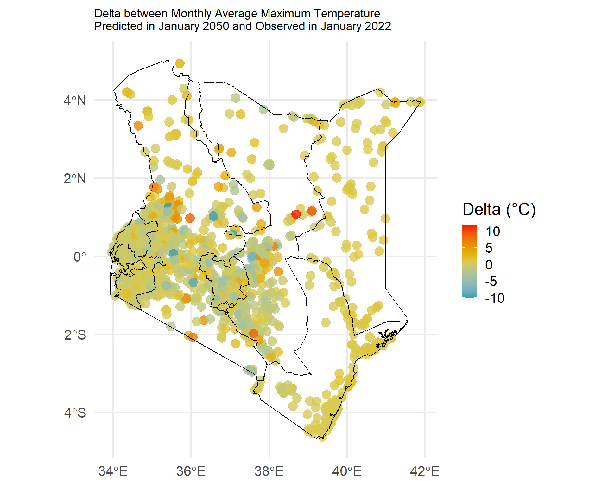
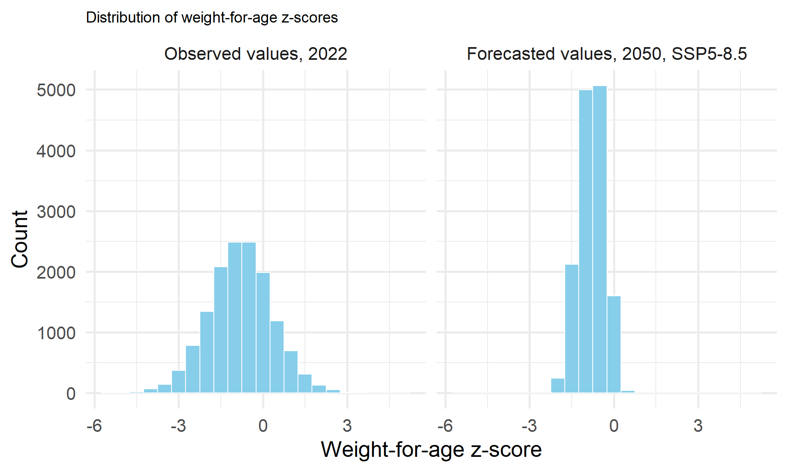

---
title:
 "Using Historical and Projected Climate Data to Forecast Child Malnutrition"
description: |
    In the final post in our series on future estimation we create a model to predict child malnutrition and plug in projected climate scenario data to predict a future level of child malnutrition.
author:
  - name: Rebecca Luttinen
    affiliation: IPUMS Global Health Data Analyst
  - name: Jessie Pinchoff
    affiliation: IPUMS Researcher
date: 10-24-2025
categories:
  - Climate
  - Scenarios
  - Temperature
  - R
  - Nutrition
  - Forecasts
fig-width: 10
fig-height: 8
open-graph:
  title: |
     Using Historical and Projected Climate Data to Forecast Child Malnutrition
  description: |
    In the final post in our series on future estimation we create a model to predict child malnutrition and plug in projected climate scenario data to predict a future level of child malnutrition.
---

This post concludes our series on how to use future estimation in child health research. The previous posts introduced proper terminology, showcased how to use Demographic and Health Survey (DHS) data to project a population/vital rates, and introduced a source of climate scenario data. Now we will apply what we have learned from this series and use it to create a forecast of child malnutrition. Information such as this can be used to inform humanitarian intervention which can take preventative action against future child malnutrition.

# Refresher: What is a forecast?

Our [first post](https://tech.popdata.org/dhs-research-hub/posts/2025-04-23-forecasting-pt1/) in this series parsed some of the terminology used when using methods of future estimation. We defined forecasts as “short-term, numeric model estimates of physical phenomena which can have accuracy assessments embedded in them.” To create a forecast of something, analysts and researchers develop a quantitative model of that outcome using both historical and current data. For example, if a model predicts the number of children with acute malnutrition within a given region, a forecast of that model would be the number of children with acute malnutrition that the model predicts into a future timeframe. Predictions can be short term (weeks to months in the future) or long-term (out to the year 2050 or 2100). For the far future, we use different scenarios to give a range of possible outcomes, while in the short-term we can likely assume most conditions will stay the same.

## **Tying in Climate Scenario Data**

In the [third post in this series](https://tech.popdata.org/dhs-research-hub/posts/2025-09-05-forecasting-pt3/), we introduced climate scenarios. Data from a climate scenario can be used as an input in a quantitative model to generate a forecast, which was described in the [first post](https://tech.popdata.org/dhs-research-hub/posts/2025-04-23-forecasting-pt1/), given the specific climate conditions in the scenario. Before we can use the climate scenario data as an input in our model, we need to build the forecasting model with historical climate data. Below we demonstrate a workflow that can be used to accomplish this.

# Building a Forecast

## **Data Harmonization**

First, this post introduces how to make a quantitative model from Kenya 2022 DHS data. Second, we plug climate scenario data into our the model and generate forecasts.

First, we will load the libraries we will employ for this analysis.

```{r,  message=FALSE}
library(haven)
library(tidyverse)
library(sf)
library(terra)
library(stats)

```

As we have demonstrated how to format DHS and climate data in [earlier posts](https://tech.popdata.org/dhs-research-hub/posts/2024-02-04-dhs-chirps/)), we will skip over how to format climate and DHS data together, and get right into temporally harmonizing these data sources and modeling. First, we will read in a .Rda file, which is an R data file. This file contains already formatted child health/ household information from the 2022 Kenya DHS survey, as well as monthly average maximum temperature for a 10 kilometer buffer zone around each DHS cluster from [CHIRTS](https://www.chc.ucsb.edu/data/chirtsdaily). If you are not familiar with how to harmonize climate and DHS data, read the post linked at the start of this paragraph .

::: column-margin
The DHS is currently reviewing applications for data access. Click here to [apply for and access DHS data](https://www.idhsdata.org/idhs/).
:::

```{r}

#load DHS data

load("data/DHS/childdatafilter.Rda")

#load climate data

load("data/ken_chirts/ken_chirts_long_filter_bp.Rda")

```

Now, that we have loaded our child health and climate information, we must make sure our data has the proper temporal format. In this blog post we will follow an [anticipatory action framework](https://www.unocha.org/anticipatory-action), which involves acting ahead of predicted hazards to reduce the impact at various time-frames, such as 1, 3, 6, 9 or 12 months in advance. For the purpose of this blog post, we use the average temperature information for 1-3 months prior to the date of the DHS survey.

::: callout-note
**Note**: In this example, we have we have named our DHS cluster variable to "ID" in both our climate and child health datasets. This is different from IPUMS DHS, and the raw variable names provided by the DHS.
:::

First, we will merge our child health and climate information by the DHS cluster variable, ID to get all of our information into one dataset.

```{r}
#merge with DHS 
surveytempreframe <- merge(childdatafilter, ken_chirts_long_filter, by="ID")
```

Then we can use this information to create new variables for the temperature information 1-3 months before the survey date.

```{r}

#create new variables for 1-3 months before survey

surveytempreframe$presurveytemp1<-ifelse(surveytempreframe$CHIRTSCMC== (surveytempreframe$surveydate-1), surveytempreframe$AV_TEMP, NA)

surveytempreframe$presurveytemp2<-ifelse(surveytempreframe$CHIRTSCMC== (surveytempreframe$surveydate-2), surveytempreframe$AV_TEMP, NA)

surveytempreframe$presurveytemp3<-ifelse(surveytempreframe$CHIRTSCMC== (surveytempreframe$surveydate-3), surveytempreframe$AV_TEMP, NA)


```

In addition to geographic variation, there is temporal variation in this dataset, however, and we only need the temporal information pertinent to the DHS survey. We can restructure our dataset to only keep the temporal information necessary for our analysis. We can uses the contains() function to make our new variables into a new single variable in a long format, as each of the new variables contains the prefix "surveytemp." The old variable names we have created, will be stored in a new column called "monthbeforesurvey" and the monthly average maximum value in Celsius will be stored in a new column called "temperature."

```{r}

#pivot long

surveytempreframe2<-surveytempreframe %>%
  pivot_longer(
    cols = contains("surveytemp"),
    names_to = "monthbeforesurvey",
    names_prefix = "temp",
    values_to = "temperature",
    values_drop_na = TRUE)


```

We just used pivot_longer, to get our climate information to be in a long format. There is one more step necessary to be able to merge this information with our DHS data. We still need our climate information to be in a wide format, meaning we need separate variables for each month. We can use the pivot_wider() function to accomplish this. Here we signify three ID columns that we do not want to be merged into the wide format. Caseid is a unique identifier for each woman surveyed by the DHS. We also use the birthorder column to make sure we are getting each individual birth, because women can report up to five births prior to the DHS survey. And lastly, we use the DHS cluster variable.

```{r}

#pivot wider
ken_chirts_wide2 <- surveytempreframe2 %>%
  pivot_wider(id_cols = c(caseid, birthorder, ID), names_from = monthbeforesurvey, values_from = temperature)


#merge with DHS again
tempandDHSwithsurvey <- merge(childdatafilter, ken_chirts_wide2, by= c('caseid', 'birthorder', 'ID'))


```

Now that we have a full dataset, we can begin modeling. First, we will drop the NA's from our dataset.

```{r}

#drop children without accurate age information
tempandDHSwithsurveyfilter<-tempandDHSwithsurvey%>%
  filter(curchildage!='NA')

#drop children without accurate sex information

tempandDHSwithsurveyfilter<-tempandDHSwithsurvey%>%
  filter(childsex!='NA')

```

## Bivariate Analysis

Then we can test for bivariate associations between our temperature values and our outcome: weight-for-age. Below, we do this for each month separately.

```{r}

#correlation tests

#1 month before survey
cor.test(tempandDHSwithsurveyfilter$w4age, tempandDHSwithsurveyfilter$presurveytemp1 )

#2 months before survey
cor.test(tempandDHSwithsurveyfilter$w4age, tempandDHSwithsurveyfilter$presurveytemp2 )

#3 months before survey
cor.test(tempandDHSwithsurveyfilter$w4age, tempandDHSwithsurveyfilter$presurveytemp3 )
```

The correlation between child weight-for-age and the monthly average daily maximum temperature per DHS cluster is significant for each month 1-3 months before the survey.

Next, we create variable that is the average of these 1-3 months.

```{r}

tempandDHSwithsurveyfilter$avtemppresurvey<-((tempandDHSwithsurveyfilter$presurveytemp1+ tempandDHSwithsurveyfilter$presurveytemp2+ tempandDHSwithsurveyfilter$presurveytemp3)/3)

```

## Multivariate Multilevel Modeling

Now we will build a multivariate model that takes into account the multilevel structure of our dataset. We use various variables that are known to influence child health outcomes such as: household urban/ rural status, maternal educational attainment, child age, child sex, maternal marital status, and whether the household has a finished floor or not.

::: callout-note
Research questions that require multi-level analysis involve outcomes that are clustered by time or space. This perspective requires consideration at the person-level and some other structural level. Multi-level data can include 2 or more levels. DHS surveys include information at the household, cluster, regional, and national levels. Read more about [Multilevel Modeling Using DHS Surveys](https://dhsprogram.com/publications/publication-mr27-methodological-reports.cfm).

Why use a multilevel model instead of ordinary least squares (OLS) regression? If data are clustered at a structural level, we cannot assume **independence of observations**, a key assumption of OLS.
:::

Multilevel modeling can be accomplished in R using the lme4 package. The last part of the code (1\|ID) is how we allow the intercept to vary per DHS cluster, which is the ID variable.

```{r, message=FALSE}

library(lme4)

wastingmlm <- lmer(w4age ~ urban + educationlevel + curchildage+ childsex + married + AGE + floor + avtemppresurvey + (1 | ID), data = tempandDHSwithsurveyfilter)

summary(wastingmlm)
```

An alternative way to present our results, can be accomplished with the modelsummary() package.

```{r}
library(modelsummary)
library(knitr)
library(kableExtra)

tbl_df <- modelsummary(
  list("(1)" = wastingmlm),
  stars = TRUE,
  output = "dataframe"
)

model_col <- setdiff(names(tbl_df), c("part", "term", "statistic"))

tbl_df$Variable <- ifelse(
  tbl_df$part == "estimates" & tbl_df$statistic == "estimate",
  tbl_df$term,
  ifelse(tbl_df$part == "estimates", "", tbl_df$term)
)

tbl_out <- tbl_df[, c("Variable", model_col)]
names(tbl_out) <- c("Variable", "(1)")

kable(
  tbl_out,
  format = "html",
  caption = "Multilevel Regression Model Results",
  escape = FALSE,
  col.names = c("Variable", "(1)"),
  table.attr = 'class="table table-borderless compact-model-table"'
) |>
  kable_styling(full_width = FALSE, position = "center") |>
  footnote(
    general = "+ p < 0.1, * p < 0.05, ** p < 0.01, *** p < 0.001",
    general_title = "",
    footnote_as_chunk = TRUE
  )
```  

Our multivariate, linear model, with a random intercept for each DHS cluster shows a negative, significant relationship between the average maximum temperature for 1-3 months prior to a survey and child weight-for-age z-score.

Now that we have built a model predicting child weight-for-age z-score, we will use this model with the climate scenario data to make a forecast of the count of children experiencing wasting per DHS cluster in the year of 2050.

## Integrating Climate Scenario Data into our Workflow

We will begin this process by reading in the climate scenario data. For this example, we will use SSP5-8.5. Read more about this SSP and how to download and format it in order to use it with DHS data in [the post before this one.](https://tech.popdata.org/dhs-research-hub/posts/2025-09-05-forecasting-pt3/)

<div class="cell">
<div class="code-copy-outer-scaffold"><div class="sourceCode" id="cb12"><pre class="downlit sourceCode r code-with-copy"><code class="sourceCode R"><span><span class="co">#read in climate scenario data</span></span>
<span></span>
<span><span class="fu"><a href="https://rdrr.io/r/base/load.html">load</a></span><span class="op">(</span><span class="st">"C:/Users/Rebecca/Downloads/ken_Tmax_585_2050_spatial_mean_sf.Rda"</span><span class="op">)</span></span>
<span></span>
<span><span class="fu"><a href="https://rdrr.io/r/base/load.html">load</a></span><span class="op">(</span><span class="st">"C:/Users/Rebecca/Downloads/ken_Tmax_585_2049_spatial_mean_sf.Rda"</span><span class="op">)</span></span></code></pre></div><button title="Copy to Clipboard" class="code-copy-button"><i class="bi"></i></button></div>
</div>

We grab only a subset of months from 2049 because we are creating a forecast for 2050, not 2049. The reason we need information is because we are using an anticipatory action framework, which involves studying how climate trends prior to 2050 influence child malnutrition in 2050.

The months we need from 2049 are stored in columns 21:23 in this example. Second, as we mentioned earlier, we have renamed our DHS cluster variable to be ID, so we will rename it here as well to streamline any further merging.

<div class="cell">
<div class="code-copy-outer-scaffold"><div class="sourceCode" id="cb13"><pre class="downlit sourceCode r code-with-copy"><code class="sourceCode R"><span><span class="co">#make a subset of the 2049 since we only need a few months of data from this year</span></span>
<span><span class="va">ken_Tmax_585_2049</span><span class="op">&lt;-</span><span class="fu"><a href="https://dplyr.tidyverse.org/reference/select.html">select</a></span><span class="op">(</span><span class="va">ken_Tmax_585_2049_spatial_mean_sf</span>, <span class="fl">21</span><span class="op">:</span><span class="fl">23</span><span class="op">)</span></span>
<span></span>
<span><span class="va">climatescenariodata</span><span class="op">&lt;-</span><span class="fu"><a href="https://r-spatial.github.io/sf/reference/st_join.html">st_join</a></span><span class="op">(</span><span class="va">ken_Tmax_585_2050_spatial_mean_sf</span>, <span class="va">ken_Tmax_585_2049</span><span class="op">)</span></span>
<span></span>
<span><span class="co">#rename DHS cluster to ID for merging</span></span>
<span></span>
<span><span class="va">climatescenariodata</span><span class="op">&lt;-</span><span class="va">climatescenariodata</span><span class="op"><a href="https://magrittr.tidyverse.org/reference/pipe.html">%&gt;%</a></span></span>
<span>  <span class="fu"><a href="https://dplyr.tidyverse.org/reference/rename.html">rename</a></span><span class="op">(</span><span class="st">'ID'</span><span class="op">=</span> <span class="st">'DHSCLUST'</span><span class="op">)</span></span></code></pre></div><button title="Copy to Clipboard" class="code-copy-button"><i class="bi"></i></button></div>
</div>

Now we will need to create dataframe that is the same structure as the dataframe that we used to create our model. We will need to reorganize our climate scenario data to be 1-3 month averages prior to the month that the DHS survey was administered. We can do this by calculating the month of the DHS using information from our [century-month-code](https://dhsprogram.com/data/Guide-to-DHS-Statistics/Organization_of_DHS_Data.htm) variable.

```{r}

#use the century-month code formula to calculate the month

tempandDHSwithsurveyfilter$surveymonth<-(tempandDHSwithsurveyfilter$surveydate-(12*(2022-1900)))

```

Next, we will create a new dataframe for the year of 2050. We will manipulate our original dataframe in order to accomplish this. We will hold all of our DHS variables constant, meaning we will use the same values as the original dataframe.

```{r}

#make a subset of the a dataframe with predictors for analysis 

build2050frame<-select(tempandDHSwithsurveyfilter, caseid, birthorder, ID, urban, married, curchildage, childsex, educationlevel, AGE, floor)

#add value for year as 2050 and value for outcome as NA

build2050frame$year <- rep(2050, nrow(build2050frame))

build2050frame$w4age <- rep(NA, nrow(build2050frame))

```

We will swap our historical climate information for the climate scenario information, however.

Next, we need to merge our climate scenario information with this new dataframe for 2050. Our climate scenario information is integral to generating a forecast because all of our other variables besides DHS cluster are equal to 'NA.'

First, we select a subset of our cliamte scenario data that only includes the year-months that we need. In this example, these variables are in columns 21:35.

<div class="cell">
<div class="code-copy-outer-scaffold"><div class="sourceCode" id="cb16"><pre class="downlit sourceCode r code-with-copy"><code class="sourceCode R"><span></span>
<span><span class="va">climatescenarioselect</span><span class="op">&lt;-</span><span class="fu"><a href="https://dplyr.tidyverse.org/reference/select.html">select</a></span><span class="op">(</span><span class="va">climatescenariodata</span>, <span class="va">ID</span>, <span class="fl">21</span><span class="op">:</span><span class="fl">35</span><span class="op">)</span></span>
<span></span>
<span><span class="co">#drop geometry </span></span>
<span><span class="va">climatescenarioselect_df</span> <span class="op">&lt;-</span> <span class="va">climatescenarioselect</span><span class="op"><a href="https://magrittr.tidyverse.org/reference/pipe.html">%&gt;%</a></span> </span>
<span>  <span class="fu"><a href="https://r-spatial.github.io/sf/reference/st_geometry.html">st_drop_geometry</a></span><span class="op">(</span><span class="op">)</span></span></code></pre></div><button title="Copy to Clipboard" class="code-copy-button"><i class="bi"></i></button></div>
</div>

At this point, we have built a dataframe that contains the DHS cluster column and the projecte average monthly maximum temperature for select months in 2049 and 2050. We have to restructure this to be in the 1-3 month prior to the survey date format, as we did above with the historical information.

We can start by using pivot_longer to make this our projected temperature data into the long format. In this example, we create a scenario_DATE variable with stores the full date in mm-dd-yyyy format. Then we can calculate the CMC for this variable.

<div class="cell">
<div class="code-copy-outer-scaffold"><div class="sourceCode" id="cb17"><pre class="downlit sourceCode r code-with-copy"><code class="sourceCode R"><span><span class="co">#make data long</span></span>
<span></span>
<span><span class="va">climatescenario_long</span> <span class="op">&lt;-</span> <span class="va">climatescenarioselect_df</span><span class="op"><a href="https://magrittr.tidyverse.org/reference/pipe.html">%&gt;%</a></span></span>
<span>  <span class="fu"><a href="https://tidyr.tidyverse.org/reference/pivot_longer.html">pivot_longer</a></span><span class="op">(</span></span>
<span>    cols <span class="op">=</span> <span class="op">-</span><span class="va">ID</span>, <span class="co"># Do not pivot the ID col</span></span>
<span>    names_to <span class="op">=</span> <span class="st">"scenario_DATE"</span>, <span class="co"># Rename output columns</span></span>
<span>    values_to <span class="op">=</span> <span class="st">"AV_TEMP"</span></span>
<span>  <span class="op">)</span> <span class="op"><a href="https://magrittr.tidyverse.org/reference/pipe.html">%&gt;%</a></span></span>
<span>  <span class="fu"><a href="https://dplyr.tidyverse.org/reference/mutate.html">mutate</a></span><span class="op">(</span></span>
<span>    scenario_DATE<span class="op">=</span> <span class="fu"><a href="https://stringr.tidyverse.org/reference/str_replace.html">str_replace</a></span><span class="op">(</span><span class="va">scenario_DATE</span>, <span class="st">"ym_"</span>, <span class="st">""</span><span class="op">)</span>,</span>
<span>    scenario_DATE <span class="op">=</span> <span class="fu"><a href="https://lubridate.tidyverse.org/reference/ymd.html">ym</a></span><span class="op">(</span><span class="va">scenario_DATE</span><span class="op">)</span><span class="op">)</span></span>
<span></span>
<span></span>
<span><span class="co">#calculate the CMC</span></span>
<span></span>
<span><span class="va">climatescenario_long</span><span class="op">&lt;-</span><span class="va">climatescenario_long</span><span class="op"><a href="https://magrittr.tidyverse.org/reference/pipe.html">%&gt;%</a></span></span>
<span>  <span class="fu"><a href="https://dplyr.tidyverse.org/reference/mutate.html">mutate</a></span><span class="op">(</span>scenarioCMC<span class="op">=</span><span class="op">(</span><span class="fu"><a href="https://lubridate.tidyverse.org/reference/year.html">year</a></span><span class="op">(</span><span class="va">scenario_DATE</span><span class="op">)</span> <span class="op">-</span> <span class="fl">1900</span><span class="op">)</span> <span class="op">*</span> <span class="fl">12</span> <span class="op">+</span> <span class="fu"><a href="https://lubridate.tidyverse.org/reference/month.html">month</a></span><span class="op">(</span><span class="va">scenario_DATE</span><span class="op">)</span><span class="op">)</span></span></code></pre></div><button title="Copy to Clipboard" class="code-copy-button"><i class="bi"></i></button></div>
</div>

Now we will change our DHS survey date variable, to make it as if it were collected in the year of 2050. We can do this by editing the CMC to match that of 2050. First, we extract the exact survey dates from our dataset. This variable is in CMC format.

<div class="cell">
<div class="code-copy-outer-scaffold"><div class="sourceCode" id="cb18"><pre class="downlit sourceCode r code-with-copy"><code class="sourceCode R"><span></span>
<span><span class="co">#first see what the unique values of the survey date are</span></span>
<span></span>
<span><span class="fu"><a href="https://rspatial.github.io/terra/reference/unique.html">unique</a></span><span class="op">(</span><span class="va">tempandDHSwithsurveyfilter</span><span class="op">$</span><span class="va">surveydate</span><span class="op">)</span></span>
<span><span class="co">#&gt; [1] 1468 1469 1470 1471 1467 1466</span></span>
<span></span>
<span><span class="co">#another way to check this is by creating a month variable</span></span>
<span></span>
<span><span class="co">#calculate the month from  the cmc</span></span>
<span></span>
<span><span class="va">tempandDHSwithsurveyfilter</span><span class="op">&lt;-</span><span class="va">tempandDHSwithsurveyfilter</span><span class="op"><a href="https://magrittr.tidyverse.org/reference/pipe.html">%&gt;%</a></span></span>
<span>  <span class="fu"><a href="https://dplyr.tidyverse.org/reference/mutate.html">mutate</a></span><span class="op">(</span>month<span class="op">=</span> <span class="va">surveydate</span><span class="op">-</span> <span class="fl">12</span> <span class="op">*</span><span class="op">(</span><span class="fl">2022</span><span class="op">-</span><span class="fl">1900</span><span class="op">)</span><span class="op">)</span></span>
<span></span>
<span><span class="fu"><a href="https://rspatial.github.io/terra/reference/unique.html">unique</a></span><span class="op">(</span><span class="va">tempandDHSwithsurveyfilter</span><span class="op">$</span><span class="va">month</span><span class="op">)</span></span>
<span><span class="co">#&gt; [1] 4 5 6 7 3 2</span></span></code></pre></div><button title="Copy to Clipboard" class="code-copy-button"><i class="bi"></i></button></div>
</div>

Now that we know what the exact dates/ months are. We can write code to create a 'future' survey date.

<div class="cell">
<div class="code-copy-outer-scaffold"><div class="sourceCode" id="cb19"><pre class="downlit sourceCode r code-with-copy"><code class="sourceCode R"><span></span>
<span><span class="co">#now use case_when to get the CMC for these specific months in 2049-2050</span></span>
<span></span>
<span><span class="va">tempandDHSwithsurveyfilter</span><span class="op">&lt;-</span><span class="va">tempandDHSwithsurveyfilter</span><span class="op"><a href="https://magrittr.tidyverse.org/reference/pipe.html">%&gt;%</a></span></span>
<span>  <span class="fu"><a href="https://dplyr.tidyverse.org/reference/mutate.html">mutate</a></span><span class="op">(</span>futuresurveydate<span class="op">=</span> <span class="fu"><a href="https://dplyr.tidyverse.org/reference/case-and-replace-when.html">case_when</a></span><span class="op">(</span><span class="va">month</span><span class="op">==</span><span class="fl">2</span><span class="op">~</span> <span class="fl">1802</span>,</span>
<span>                          <span class="va">month</span><span class="op">==</span><span class="fl">3</span><span class="op">~</span> <span class="fl">1803</span>,</span>
<span>                          <span class="va">month</span><span class="op">==</span><span class="fl">4</span><span class="op">~</span> <span class="fl">1804</span>,</span>
<span>                          <span class="va">month</span><span class="op">==</span><span class="fl">5</span><span class="op">~</span> <span class="fl">1805</span>,</span>
<span>                          <span class="va">month</span><span class="op">==</span><span class="fl">6</span><span class="op">~</span> <span class="fl">1806</span>,</span>
<span>                          <span class="va">month</span><span class="op">==</span><span class="fl">7</span><span class="op">~</span> <span class="fl">1807</span><span class="op">)</span><span class="op">)</span></span></code></pre></div><button title="Copy to Clipboard" class="code-copy-button"><i class="bi"></i></button></div>
</div>

Now that we have a future survey date in our dataset, we can lag our climate scenario information.

<div class="cell">
<div class="code-copy-outer-scaffold"><div class="sourceCode" id="cb20"><pre class="downlit sourceCode r code-with-copy"><code class="sourceCode R"><span></span>
<span><span class="co">#merge with DHS </span></span>
<span><span class="va">climatescenarioreframe</span> <span class="op">&lt;-</span> <span class="fu"><a href="https://rspatial.github.io/terra/reference/merge.html">merge</a></span><span class="op">(</span><span class="va">tempandDHSwithsurveyfilter</span>, <span class="va">climatescenario_long</span>, by<span class="op">=</span><span class="st">"ID"</span><span class="op">)</span></span>
<span></span>
<span><span class="co">#create new variables for 1-3 months before future survey date</span></span>
<span></span>
<span></span>
<span><span class="va">climatescenarioreframe</span><span class="op">$</span><span class="va">prefuturesurveytemp1</span><span class="op">&lt;-</span><span class="fu"><a href="https://rdrr.io/r/base/ifelse.html">ifelse</a></span><span class="op">(</span><span class="va">climatescenarioreframe</span><span class="op">$</span><span class="va">scenarioCMC</span><span class="op">==</span> <span class="op">(</span><span class="va">climatescenarioreframe</span><span class="op">$</span><span class="va">futuresurveydate</span><span class="op">-</span><span class="fl">1</span><span class="op">)</span>, <span class="va">climatescenarioreframe</span><span class="op">$</span><span class="va">AV_TEMP</span>, <span class="cn">NA</span><span class="op">)</span></span>
<span></span>
<span></span>
<span><span class="va">climatescenarioreframe</span><span class="op">$</span><span class="va">prefuturesurveytemp2</span><span class="op">&lt;-</span><span class="fu"><a href="https://rdrr.io/r/base/ifelse.html">ifelse</a></span><span class="op">(</span><span class="va">climatescenarioreframe</span><span class="op">$</span><span class="va">scenarioCMC</span><span class="op">==</span> <span class="op">(</span><span class="va">climatescenarioreframe</span><span class="op">$</span><span class="va">futuresurveydate</span><span class="op">-</span><span class="fl">2</span><span class="op">)</span>, <span class="va">climatescenarioreframe</span><span class="op">$</span><span class="va">AV_TEMP</span>, <span class="cn">NA</span><span class="op">)</span></span>
<span></span>
<span></span>
<span><span class="va">climatescenarioreframe</span><span class="op">$</span><span class="va">prefuturesurveytemp3</span><span class="op">&lt;-</span><span class="fu"><a href="https://rdrr.io/r/base/ifelse.html">ifelse</a></span><span class="op">(</span><span class="va">climatescenarioreframe</span><span class="op">$</span><span class="va">scenarioCMC</span><span class="op">==</span> <span class="op">(</span><span class="va">climatescenarioreframe</span><span class="op">$</span><span class="va">futuresurveydate</span><span class="op">-</span><span class="fl">3</span><span class="op">)</span>, <span class="va">climatescenarioreframe</span><span class="op">$</span><span class="va">AV_TEMP</span>, <span class="cn">NA</span><span class="op">)</span></span></code></pre></div><button title="Copy to Clipboard" class="code-copy-button"><i class="bi"></i></button></div>
</div>

Now we will restructure the dataset one last time and merge it with the dataframe for 2050 that we have created.

<div class="cell">
<div class="code-copy-outer-scaffold"><div class="sourceCode" id="cb21"><pre class="downlit sourceCode r code-with-copy"><code class="sourceCode R"><span><span class="co">#pivot long</span></span>
<span></span>
<span><span class="va">climatescenarioreframe2</span><span class="op">&lt;-</span><span class="va">climatescenarioreframe</span> <span class="op"><a href="https://magrittr.tidyverse.org/reference/pipe.html">%&gt;%</a></span></span>
<span>  <span class="fu"><a href="https://tidyr.tidyverse.org/reference/pivot_longer.html">pivot_longer</a></span><span class="op">(</span></span>
<span>    cols <span class="op">=</span> <span class="fu"><a href="https://tidyselect.r-lib.org/reference/starts_with.html">contains</a></span><span class="op">(</span><span class="st">"futuresurveytemp"</span><span class="op">)</span>,</span>
<span>    names_to <span class="op">=</span> <span class="st">"cmcinreftosurvey"</span>,</span>
<span>    names_prefix <span class="op">=</span> <span class="st">"temp"</span>,</span>
<span>    values_to <span class="op">=</span> <span class="st">"temperature"</span>,</span>
<span>    values_drop_na <span class="op">=</span> <span class="cn">TRUE</span><span class="op">)</span></span>
<span></span>
<span><span class="co">#pivot wider</span></span>
<span><span class="va">scenario_wide2</span> <span class="op">&lt;-</span> <span class="va">climatescenarioreframe2</span><span class="op"><a href="https://magrittr.tidyverse.org/reference/pipe.html">%&gt;%</a></span></span>
<span>  <span class="fu"><a href="https://tidyr.tidyverse.org/reference/pivot_wider.html">pivot_wider</a></span><span class="op">(</span>id_cols <span class="op">=</span> <span class="fu"><a href="https://rdrr.io/r/base/c.html">c</a></span><span class="op">(</span><span class="va">caseid</span>, <span class="va">ID</span>, <span class="va">birthorder</span><span class="op">)</span>, names_from <span class="op">=</span> <span class="va">cmcinreftosurvey</span>, values_from <span class="op">=</span> <span class="va">temperature</span><span class="op">)</span></span>
<span></span>
<span></span>
<span><span class="co">#merge with 2050 df </span></span>
<span><span class="va">df_2050_scenariodata</span><span class="op">&lt;-</span> <span class="fu"><a href="https://dplyr.tidyverse.org/reference/mutate-joins.html">left_join</a></span><span class="op">(</span><span class="va">build2050frame</span>, <span class="va">scenario_wide2</span>, by<span class="op">=</span> <span class="fu"><a href="https://rdrr.io/r/base/c.html">c</a></span><span class="op">(</span><span class="st">'caseid'</span>, <span class="st">'birthorder'</span>, <span class="st">'ID'</span><span class="op">)</span><span class="op">)</span></span></code></pre></div><button title="Copy to Clipboard" class="code-copy-button"><i class="bi"></i></button></div>
</div>

Next, since we worked with the average maximum temperature for 1-3 months prior to a survey. We need to create an average variable of our climate scenario data.

<div class="cell">
<div class="code-copy-outer-scaffold"><div class="sourceCode" id="cb22"><pre class="downlit sourceCode r code-with-copy"><code class="sourceCode R"><span><span class="co">#calculate the average temperature for 1-3 months prior to survey</span></span>
<span></span>
<span><span class="va">df_2050_scenariodata</span><span class="op">$</span><span class="va">avtemppresurvey</span><span class="op">&lt;-</span><span class="op">(</span><span class="op">(</span><span class="va">df_2050_scenariodata</span><span class="op">$</span><span class="va">prefuturesurveytemp1</span><span class="op">+</span> <span class="va">df_2050_scenariodata</span><span class="op">$</span><span class="va">prefuturesurveytemp2</span><span class="op">+</span> <span class="va">df_2050_scenariodata</span><span class="op">$</span><span class="va">prefuturesurveytemp3</span><span class="op">)</span><span class="op">/</span><span class="fl">3</span><span class="op">)</span></span></code></pre></div><button title="Copy to Clipboard" class="code-copy-button"><i class="bi"></i></button></div>
</div>

## How Much Hotter Is 2050 than 2022?

Before we generate our weight-for-age forecasts, let's visualize how much hotter the temperature in projected to be in 2050 is than the observed temperature in 2022. For the sake of comparison, let's visualize the difference between the average monthly maximum temperature in January 2022 and January 2050.

<div class="cell">
<div class="code-copy-outer-scaffold"><div class="sourceCode" id="cb23"><pre class="downlit sourceCode r code-with-copy"><code class="sourceCode R"><span></span>
<span><span class="co">#2022</span></span>
<span><span class="va">Jan2022</span><span class="op">&lt;-</span><span class="va">ken_chirts_long_filter</span><span class="op"><a href="https://magrittr.tidyverse.org/reference/pipe.html">%&gt;%</a></span></span>
<span>  <span class="fu"><a href="https://rdrr.io/r/stats/filter.html">filter</a></span><span class="op">(</span><span class="va">CHIRTSCMC</span><span class="op">==</span><span class="fl">1465</span><span class="op">)</span><span class="op"><a href="https://magrittr.tidyverse.org/reference/pipe.html">%&gt;%</a></span></span>
<span>  <span class="fu"><a href="https://dplyr.tidyverse.org/reference/rename.html">rename</a></span><span class="op">(</span><span class="st">'AV_TEMP_2022'</span><span class="op">=</span><span class="st">'AV_TEMP'</span><span class="op">)</span></span>
<span></span>
<span><span class="co">#2050</span></span>
<span><span class="va">Jan2050</span><span class="op">&lt;-</span><span class="va">climatescenario_long</span><span class="op"><a href="https://magrittr.tidyverse.org/reference/pipe.html">%&gt;%</a></span></span>
<span>  <span class="fu"><a href="https://rdrr.io/r/stats/filter.html">filter</a></span><span class="op">(</span><span class="va">scenarioCMC</span><span class="op">==</span><span class="fl">1801</span><span class="op">)</span><span class="op"><a href="https://magrittr.tidyverse.org/reference/pipe.html">%&gt;%</a></span></span>
<span>  <span class="fu"><a href="https://dplyr.tidyverse.org/reference/rename.html">rename</a></span><span class="op">(</span><span class="st">'AV_TEMP_2050'</span><span class="op">=</span><span class="st">'AV_TEMP'</span><span class="op">)</span></span>
<span></span>
<span><span class="co">#merge them </span></span>
<span></span>
<span><span class="va">temptogether</span><span class="op">&lt;-</span><span class="fu"><a href="https://dplyr.tidyverse.org/reference/mutate-joins.html">left_join</a></span><span class="op">(</span><span class="va">Jan2022</span>, <span class="va">Jan2050</span><span class="op">)</span></span>
<span><span class="co">#&gt; Joining with `by = join_by(ID)`</span></span>
<span></span>
<span><span class="co">#add the geometry back in</span></span>
<span></span>
<span><span class="va">justgps</span><span class="op">&lt;-</span><span class="fu"><a href="https://dplyr.tidyverse.org/reference/select.html">select</a></span><span class="op">(</span><span class="va">ken_Tmax_585_2049_spatial_mean_sf</span>, ID<span class="op">=</span><span class="va">DHSCLUST</span>, <span class="va">geometry</span><span class="op">)</span></span>
<span> </span>
<span><span class="va">temp20222050wgeo</span><span class="op">&lt;-</span><span class="fu"><a href="https://dplyr.tidyverse.org/reference/mutate-joins.html">left_join</a></span><span class="op">(</span><span class="va">temptogether</span>, <span class="va">justgps</span><span class="op">)</span></span>
<span><span class="co">#&gt; Joining with `by = join_by(ID)`</span></span>
<span></span>
<span><span class="co">#convert to spatial frame</span></span>
<span></span>
<span><span class="va">temptogetherwgeo</span><span class="op">&lt;-</span><span class="fu"><a href="https://r-spatial.github.io/sf/reference/sf.html">st_sf</a></span><span class="op">(</span><span class="va">temp20222050wgeo</span><span class="op">)</span></span>
<span></span>
<span><span class="co">#calculate the difference between them</span></span>
<span></span>
<span><span class="va">temp20222050wgeo</span><span class="op">$</span><span class="va">delta</span><span class="op">&lt;-</span><span class="va">temp20222050wgeo</span><span class="op">$</span><span class="va">AV_TEMP_2050</span><span class="op">-</span><span class="va">temp20222050wgeo</span><span class="op">$</span><span class="va">AV_TEMP_2022</span></span></code></pre></div><button title="Copy to Clipboard" class="code-copy-button"><i class="bi"></i></button></div>
</div>

Next, we read in an administrative boundary file for Kenya, and use both ggplot() and a package inspired by the filmmaker [Wes Anderson](https://www.imdb.com/name/nm0027572/), that allows you to use a color palette reminiscent of the colors you see in his films. Read more about the [Wes Anderson Palettes package] (https://github.com/karthik/wesanderson).

<div class="cell page-columns page-full" data-layout-align="center">
<details class="code-fold"><summary>Code</summary><div class="code-copy-outer-scaffold"><div class="sourceCode" id="cb24"><pre class="downlit sourceCode r code-with-copy"><code class="sourceCode R"><span><span class="co">#read into kenya borders</span></span>
<span></span>
<span><span class="va">ken_borders</span><span class="op">&lt;-</span><span class="fu"><a href="https://r-spatial.github.io/sf/reference/st_read.html">st_read</a></span><span class="op">(</span><span class="st">"data/geo_ke1989_2014/geo_ke1989_2014.shp"</span><span class="op">)</span></span>
<span><span class="co">#&gt; Reading layer `geo_ke1989_2014' from data source </span></span>
<span><span class="co">#&gt;   `C:\Users\Rebecca\Documents\Projects\dhs-research-hub\posts\2025-10-24-forecasting-pt4\data\geo_ke1989_2014\geo_ke1989_2014.shp' </span></span>
<span><span class="co">#&gt;   using driver `ESRI Shapefile'</span></span>
<span><span class="co">#&gt; Simple feature collection with 9 features and 3 fields</span></span>
<span><span class="co">#&gt; Geometry type: MULTIPOLYGON</span></span>
<span><span class="co">#&gt; Dimension:     XY</span></span>
<span><span class="co">#&gt; Bounding box:  xmin: 33.90983 ymin: -4.680056 xmax: 41.90684 ymax: 5.033421</span></span>
<span><span class="co">#&gt; Geodetic CRS:  WGS 84</span></span>
<span></span>
<span></span>
<span><span class="co"># Load the wesanderson package </span></span>
<span><span class="kw"><a href="https://rdrr.io/r/base/library.html">library</a></span><span class="op">(</span><span class="va"><a href="https://github.com/karthik/wesanderson">wesanderson</a></span><span class="op">)</span></span>
<span><span class="co">#&gt; Warning: package 'wesanderson' was built under R version 4.5.1</span></span>
<span></span>
<span></span>
<span><span class="co"># Create a reversed continuous gradient from Zissou1, a reference to the 'The Life Aquatic'</span></span>
<span><span class="va">gb_palette</span> <span class="op">&lt;-</span> <span class="fu"><a href="https://rdrr.io/r/grDevices/colorRamp.html">colorRampPalette</a></span><span class="op">(</span><span class="fu">wesanderson</span><span class="fu">::</span><span class="fu"><a href="https://rdrr.io/pkg/wesanderson/man/wes_palette.html">wes_palette</a></span><span class="op">(</span><span class="st">"Zissou1"</span>, type <span class="op">=</span> <span class="st">"continuous"</span><span class="op">)</span><span class="op">)</span><span class="op">(</span><span class="fl">100</span><span class="op">)</span></span>
<span></span>
<span><span class="fu"><a href="https://ggplot2.tidyverse.org/reference/ggplot.html">ggplot</a></span><span class="op">(</span><span class="va">temp20222050wgeo</span><span class="op">)</span> <span class="op">+</span></span>
<span>  <span class="fu"><a href="https://ggplot2.tidyverse.org/reference/ggsf.html">geom_sf</a></span><span class="op">(</span><span class="fu"><a href="https://ggplot2.tidyverse.org/reference/aes.html">aes</a></span><span class="op">(</span>geometry <span class="op">=</span> <span class="va">geometry</span>, color <span class="op">=</span> <span class="va">delta</span><span class="op">)</span>, size <span class="op">=</span> <span class="fl">5</span>, alpha <span class="op">=</span> <span class="fl">0.8</span><span class="op">)</span> <span class="op">+</span></span>
<span>  <span class="fu"><a href="https://ggplot2.tidyverse.org/reference/ggsf.html">geom_sf</a></span><span class="op">(</span>data <span class="op">=</span> <span class="va">ken_borders</span>, color <span class="op">=</span> <span class="st">"black"</span>, fill <span class="op">=</span> <span class="cn">NA</span>, linewidth <span class="op">=</span> <span class="fl">0.4</span><span class="op">)</span> <span class="op">+</span></span>
<span>  <span class="fu"><a href="https://ggplot2.tidyverse.org/reference/scale_gradient.html">scale_color_gradientn</a></span><span class="op">(</span>colors <span class="op">=</span> <span class="va">gb_palette</span><span class="op">)</span> <span class="op">+</span></span>
<span>  <span class="fu"><a href="https://ggplot2.tidyverse.org/reference/labs.html">labs</a></span><span class="op">(</span></span>
<span>    title <span class="op">=</span> <span class="st">"Delta between Monthly Average Maximum Temperature \nPredicted in January 2050 and Observed in January 2022"</span>,</span>
<span>    color <span class="op">=</span> <span class="st">"Delta (°C)"</span></span>
<span>  <span class="op">)</span> <span class="op">+</span></span>
<span>  <span class="fu"><a href="https://ggplot2.tidyverse.org/reference/ggtheme.html">theme_minimal</a></span><span class="op">(</span>base_size <span class="op">=</span> <span class="fl">20</span><span class="op">)</span><span class="op">+</span></span>
<span><span class="fu"><a href="https://ggplot2.tidyverse.org/reference/theme.html">theme</a></span><span class="op">(</span></span>
<span>  plot.title <span class="op">=</span> <span class="fu"><a href="https://ggplot2.tidyverse.org/reference/element.html">element_text</a></span><span class="op">(</span>size <span class="op">=</span> <span class="fl">14</span><span class="op">)</span></span>
<span><span class="op">)</span></span></code></pre></div><button title="Copy to Clipboard" class="code-copy-button"><i class="bi"></i></button></div>
</details><div class="cell-output-display page-columns page-full">
<div class="quarto-figure quarto-figure-center page-columns page-full">
<figure class="figure page-columns page-full"><p class="page-columns page-full"></p>
</figure>
</div>
</div>
</div>

# Generate the Forecasts

Now we have our dataframe for 2050, we can generate the fitted values of our outcome, weight-for-age, for 2050. We can use the predict() function to run the model we have built earlier with the dataframe we have created in which we substituted out our historical climate data for climate scenario data.

<div class="cell">
<div class="code-copy-outer-scaffold"><div class="sourceCode" id="cb25"><pre class="downlit sourceCode r code-with-copy"><code class="sourceCode R"><span></span>
<span><span class="co">#generate the predictions</span></span>
<span></span>
<span><span class="va">forecasts_2050</span> <span class="op">&lt;-</span><span class="fu"><a href="https://rdrr.io/r/stats/predict.html">predict</a></span><span class="op">(</span><span class="va">wastingmlm</span>, newdata <span class="op">=</span> <span class="va">df_2050_scenariodata</span>, allow.new.levels <span class="op">=</span> <span class="cn">TRUE</span><span class="op">)</span></span></code></pre></div><button title="Copy to Clipboard" class="code-copy-button"><i class="bi"></i></button></div>
</div>

# Comparing our Observed and Forecasted Values

Now let's compare our forecasted weight-for-age z-scores for 2050 using SSP5-8.5, with our observed weight-for-age z-scores in 2022.

To visualize the differences, we will calculate the observed average weight-for-age z-score per DHS cluster in 2022, alongside the predicted one for 2050, given the SSP5-8.5 assumptions.

<div class="cell">
<div class="code-copy-outer-scaffold"><div class="sourceCode" id="cb26"><pre class="downlit sourceCode r code-with-copy"><code class="sourceCode R"><span></span>
<span><span class="co"># Combine actual and predicted values</span></span>
<span><span class="va">forecasts_and_observed</span> <span class="op">&lt;-</span> <span class="fu"><a href="https://rdrr.io/r/base/data.frame.html">data.frame</a></span><span class="op">(</span>Predictedw4age<span class="op">=</span><span class="va">forecasts_2050</span>, caseid<span class="op">=</span><span class="va">df_2050_scenariodata</span><span class="op">$</span><span class="va">caseid</span>, ID<span class="op">=</span><span class="va">df_2050_scenariodata</span><span class="op">$</span><span class="va">ID</span>, observedw4age<span class="op">=</span><span class="va">tempandDHSwithsurveyfilter</span><span class="op">$</span><span class="va">w4age</span><span class="op">)</span></span></code></pre></div><button title="Copy to Clipboard" class="code-copy-button"><i class="bi"></i></button></div>
</div>

Now let's plot the distribution of our observed and predicted weight-for-age scores.

<div class="cell page-columns page-full" data-layout-align="center">
<details class="code-fold"><summary>Code</summary><div class="code-copy-outer-scaffold"><div class="sourceCode" id="cb27"><pre class="downlit sourceCode r code-with-copy"><code class="sourceCode R"><span><span class="co"># Reshape to long format</span></span>
<span><span class="va">forecasts_and_observed_long</span> <span class="op">&lt;-</span> <span class="va">forecasts_and_observed</span> <span class="op"><a href="https://magrittr.tidyverse.org/reference/pipe.html">%&gt;%</a></span></span>
<span>  <span class="fu"><a href="https://tidyr.tidyverse.org/reference/pivot_longer.html">pivot_longer</a></span><span class="op">(</span>cols <span class="op">=</span> <span class="fu"><a href="https://rdrr.io/r/base/c.html">c</a></span><span class="op">(</span><span class="va">Predictedw4age</span>, <span class="va">observedw4age</span><span class="op">)</span>, names_to <span class="op">=</span> <span class="st">"predicted_observed"</span>, values_to <span class="op">=</span> <span class="st">"value"</span><span class="op">)</span></span>
<span></span>
<span></span>
<span><span class="va">forecasts_and_observed_long</span> <span class="op">&lt;-</span> <span class="va">forecasts_and_observed_long</span> <span class="op"><a href="https://magrittr.tidyverse.org/reference/pipe.html">%&gt;%</a></span></span>
<span>  <span class="fu"><a href="https://rdrr.io/r/stats/filter.html">filter</a></span><span class="op">(</span><span class="op">!</span><span class="fu"><a href="https://rdrr.io/r/base/NA.html">is.na</a></span><span class="op">(</span><span class="va">value</span><span class="op">)</span><span class="op">)</span></span>
<span></span>
<span><span class="co"># Histogram with facet_wrap</span></span>
<span><span class="fu"><a href="https://ggplot2.tidyverse.org/reference/ggplot.html">ggplot</a></span><span class="op">(</span><span class="va">forecasts_and_observed_long</span>, <span class="fu"><a href="https://ggplot2.tidyverse.org/reference/aes.html">aes</a></span><span class="op">(</span>x <span class="op">=</span> <span class="va">value</span><span class="op">)</span><span class="op">)</span> <span class="op">+</span></span>
<span>  <span class="fu"><a href="https://ggplot2.tidyverse.org/reference/geom_histogram.html">geom_histogram</a></span><span class="op">(</span>binwidth <span class="op">=</span> <span class="fl">0.5</span>, fill <span class="op">=</span> <span class="st">"skyblue"</span>, color <span class="op">=</span> <span class="st">"white"</span><span class="op">)</span> <span class="op">+</span></span>
<span>  <span class="fu"><a href="https://ggplot2.tidyverse.org/reference/facet_wrap.html">facet_wrap</a></span><span class="op">(</span><span class="op">~</span> <span class="va">predicted_observed</span>, scales <span class="op">=</span> <span class="st">"fixed"</span>, labeller <span class="op">=</span> <span class="fu"><a href="https://ggplot2.tidyverse.org/reference/labeller.html">labeller</a></span><span class="op">(</span>predicted_observed <span class="op">=</span> <span class="fu"><a href="https://rdrr.io/r/base/c.html">c</a></span><span class="op">(</span></span>
<span>    <span class="st">"observedw4age"</span> <span class="op">=</span> <span class="st">"Observed values, 2022"</span>,</span>
<span>    <span class="st">"Predictedw4age"</span> <span class="op">=</span> <span class="st">"Forecasted values, 2050, SSP5-8.5"</span></span>
<span>  <span class="op">)</span><span class="op">)</span><span class="op">)</span> <span class="op">+</span></span>
<span>  <span class="fu"><a href="https://ggplot2.tidyverse.org/reference/ggtheme.html">theme_minimal</a></span><span class="op">(</span><span class="op">)</span> <span class="op">+</span></span>
<span>  <span class="fu"><a href="https://ggplot2.tidyverse.org/reference/labs.html">labs</a></span><span class="op">(</span>title <span class="op">=</span> <span class="st">"Distribution of weight-for-age z-scores "</span>,</span>
<span>       x <span class="op">=</span> <span class="st">"Weight-for-age z-score"</span>,</span>
<span>       y <span class="op">=</span> <span class="st">"Count"</span><span class="op">)</span><span class="op">+</span></span>
<span>  <span class="fu"><a href="https://ggplot2.tidyverse.org/reference/ggtheme.html">theme_minimal</a></span><span class="op">(</span>base_size <span class="op">=</span> <span class="fl">20</span><span class="op">)</span><span class="op">+</span></span>
<span><span class="fu"><a href="https://ggplot2.tidyverse.org/reference/theme.html">theme</a></span><span class="op">(</span></span>
<span>  plot.title <span class="op">=</span> <span class="fu"><a href="https://ggplot2.tidyverse.org/reference/element.html">element_text</a></span><span class="op">(</span>size <span class="op">=</span> <span class="fl">14</span><span class="op">)</span></span>
<span><span class="op">)</span></span></code></pre></div><button title="Copy to Clipboard" class="code-copy-button"><i class="bi"></i></button></div>
</details><div class="cell-output-display page-columns page-full">
<div class="quarto-figure quarto-figure-center page-columns page-full">
<figure class="figure page-columns page-full"><p class="page-columns page-full"></p>
</figure>
</div>
</div>
</div>


Our forecasts are mainly concentrated below zero, meaning that our forecasted sample is predicted to have a higher concentration of lower weight-for-age z-scores than our observed sample from 2022.

Our historical model confirmed that monthly average maximum temperature per DHS cluster 1-3 months before the survey is associated with a lower weight-for-age z-score. In addition to this, the predicted temperature data for SSP5-8.5 in 2050 is higher than the observed temperature data in 2022, on average. Therefore, it is reasonable to assume that the forecasted weight-for-age values would be more negative than those that we observed.

# Conclusion

This post is the last of our series on climate and population projections. Together the posts in this series introduced proper terminology when using future estimation, demonstrated how to carry out demographic methods like calcualting vital rates and population projections, and showed how climate data can be integrated into these workflows. This series used data from the Kenya 2022 DHS, however, these methods can be integrated in different regions with different data sources as well. In this final post, we found the child population surveyed by the Kenya 2022 DHS would experience lower weight-for-age z-scores on average if they were surveyed in 2050, given SSP5-8.5 assumptions. This information can be utilized to mitigate the future risks of increased child malnutrition as temperatures continue to rise in Kenya.

# Looking ahead

Our next blog post will be the second post in our series on dietary diversity, a topic that definitely has implications on child health. When a child has regular access to nutritious foods, their risk of experiencing indicators of malnutrition, such as wasting or stunting, is greatly reduced.
