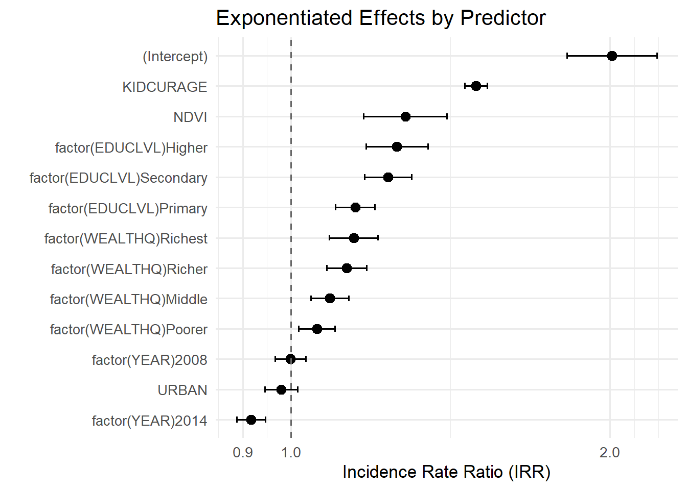

This post is a follow-up to [our earlier blog](https://tech.popdata.org/dhs-research-hub/posts/2025-08-06-intro-diet-diversity/) on measuring dietary diversity using Demographic and Health Surveys (DHS) data over time. First we will attach Normalized Difference Vegetation Index data to the individual level child records. Second, we will analyze the association between NDVI and dietary diversity using a multilevel model.

# Setting up the Data

## NDVI data

We covered how to read in an [IPUMS DHS](https://www.idhsdata.org/idhs/) data file and calculate dietary diversity using World Health Organization definitions in [our previous post on dietary diversity](https://tech.popdata.org/dhs-research-hub/posts/2025-08-06-intro-diet-diversity/), and we discuss in multiple previous posts ([iterative worklows using NDVI](https://tech.popdata.org/dhs-research-hub/posts/2024-08-01-ndvi-data/); [aggregation methods](https://tech.popdata.org/dhs-research-hub/posts/2024-08-16-ndvi-data-2/)) how to download and summarize NDVI data from NASA. The code below (hidden until you click "Code") is included as a refresher.

<div class="cell">
<details class="code-fold"><summary>Code</summary><div class="code-copy-outer-scaffold"><div class="sourceCode cell-code" id="cb1"><pre class="sourceCode r code-with-copy"><code class="sourceCode r"><span id="cb1-1"><a href="#cb1-1" aria-hidden="true" tabindex="-1"></a><span class="co"># Load necessary packages</span></span>
<span id="cb1-2"><a href="#cb1-2" aria-hidden="true" tabindex="-1"></a><span class="fu">library</span>(ipumsr)</span>
<span id="cb1-3"><a href="#cb1-3" aria-hidden="true" tabindex="-1"></a><span class="fu">library</span>(sf)</span>
<span id="cb1-4"><a href="#cb1-4" aria-hidden="true" tabindex="-1"></a><span class="fu">library</span>(dplyr)</span>
<span id="cb1-5"><a href="#cb1-5" aria-hidden="true" tabindex="-1"></a><span class="fu">library</span>(tidyr)</span>
<span id="cb1-6"><a href="#cb1-6" aria-hidden="true" tabindex="-1"></a><span class="fu">library</span>(zoo)</span>
<span id="cb1-7"><a href="#cb1-7" aria-hidden="true" tabindex="-1"></a><span class="fu">library</span>(lubridate)</span>
<span id="cb1-8"><a href="#cb1-8" aria-hidden="true" tabindex="-1"></a><span class="fu">library</span>(terra)</span>
<span id="cb1-9"><a href="#cb1-9" aria-hidden="true" tabindex="-1"></a><span class="fu">library</span>(fs)</span>
<span id="cb1-10"><a href="#cb1-10" aria-hidden="true" tabindex="-1"></a><span class="fu">library</span>(stringr)</span>
<span id="cb1-11"><a href="#cb1-11" aria-hidden="true" tabindex="-1"></a><span class="fu">library</span>(purrr)</span>
<span id="cb1-12"><a href="#cb1-12" aria-hidden="true" tabindex="-1"></a></span>
<span id="cb1-13"><a href="#cb1-13" aria-hidden="true" tabindex="-1"></a><span class="co">#Read in GPS data ----</span></span>
<span id="cb1-14"><a href="#cb1-14" aria-hidden="true" tabindex="-1"></a>ke2003_gps <span class="ot">&lt;-</span> <span class="fu">st_read</span>(<span class="st">"data/gps_clusters/KEGE43FL.shp"</span>)</span>
<span id="cb1-15"><a href="#cb1-15" aria-hidden="true" tabindex="-1"></a><span class="co">#&gt; Reading layer `KEGE43FL' from data source </span></span>
<span id="cb1-16"><a href="#cb1-16" aria-hidden="true" tabindex="-1"></a><span class="co">#&gt;   `C:\Users\krist108\Documents\R_projects\projects\dhs-research-hub\posts\2025-11-21-diet-diversity-ndvi\data\gps_clusters\KEGE43FL.shp' </span></span>
<span id="cb1-17"><a href="#cb1-17" aria-hidden="true" tabindex="-1"></a><span class="co">#&gt;   using driver `ESRI Shapefile'</span></span>
<span id="cb1-18"><a href="#cb1-18" aria-hidden="true" tabindex="-1"></a><span class="co">#&gt; Simple feature collection with 400 features and 20 fields</span></span>
<span id="cb1-19"><a href="#cb1-19" aria-hidden="true" tabindex="-1"></a><span class="co">#&gt; Geometry type: POINT</span></span>
<span id="cb1-20"><a href="#cb1-20" aria-hidden="true" tabindex="-1"></a><span class="co">#&gt; Dimension:     XY</span></span>
<span id="cb1-21"><a href="#cb1-21" aria-hidden="true" tabindex="-1"></a><span class="co">#&gt; Bounding box:  xmin: 2.220446e-16 ymin: -4.664255 xmax: 41.88377 ymax: 4.243911</span></span>
<span id="cb1-22"><a href="#cb1-22" aria-hidden="true" tabindex="-1"></a><span class="co">#&gt; Geodetic CRS:  WGS 84</span></span>
<span id="cb1-23"><a href="#cb1-23" aria-hidden="true" tabindex="-1"></a>ke2008_gps <span class="ot">&lt;-</span> <span class="fu">st_read</span>(<span class="st">"data/gps_clusters/KEGE52FL.shp"</span>)</span>
<span id="cb1-24"><a href="#cb1-24" aria-hidden="true" tabindex="-1"></a><span class="co">#&gt; Reading layer `KEGE52FL' from data source </span></span>
<span id="cb1-25"><a href="#cb1-25" aria-hidden="true" tabindex="-1"></a><span class="co">#&gt;   `C:\Users\krist108\Documents\R_projects\projects\dhs-research-hub\posts\2025-11-21-diet-diversity-ndvi\data\gps_clusters\KEGE52FL.shp' </span></span>
<span id="cb1-26"><a href="#cb1-26" aria-hidden="true" tabindex="-1"></a><span class="co">#&gt;   using driver `ESRI Shapefile'</span></span>
<span id="cb1-27"><a href="#cb1-27" aria-hidden="true" tabindex="-1"></a><span class="co">#&gt; Simple feature collection with 398 features and 20 fields</span></span>
<span id="cb1-28"><a href="#cb1-28" aria-hidden="true" tabindex="-1"></a><span class="co">#&gt; Geometry type: POINT</span></span>
<span id="cb1-29"><a href="#cb1-29" aria-hidden="true" tabindex="-1"></a><span class="co">#&gt; Dimension:     XY</span></span>
<span id="cb1-30"><a href="#cb1-30" aria-hidden="true" tabindex="-1"></a><span class="co">#&gt; Bounding box:  xmin: 0 ymin: -4.635513 xmax: 41.83 ymax: 4.685894</span></span>
<span id="cb1-31"><a href="#cb1-31" aria-hidden="true" tabindex="-1"></a><span class="co">#&gt; Geodetic CRS:  WGS 84</span></span>
<span id="cb1-32"><a href="#cb1-32" aria-hidden="true" tabindex="-1"></a>ke2014_gps <span class="ot">&lt;-</span> <span class="fu">st_read</span>(<span class="st">"data/gps_clusters/KEGE71FL.shp"</span>)</span>
<span id="cb1-33"><a href="#cb1-33" aria-hidden="true" tabindex="-1"></a><span class="co">#&gt; Reading layer `KEGE71FL' from data source </span></span>
<span id="cb1-34"><a href="#cb1-34" aria-hidden="true" tabindex="-1"></a><span class="co">#&gt;   `C:\Users\krist108\Documents\R_projects\projects\dhs-research-hub\posts\2025-11-21-diet-diversity-ndvi\data\gps_clusters\KEGE71FL.shp' </span></span>
<span id="cb1-35"><a href="#cb1-35" aria-hidden="true" tabindex="-1"></a><span class="co">#&gt;   using driver `ESRI Shapefile'</span></span>
<span id="cb1-36"><a href="#cb1-36" aria-hidden="true" tabindex="-1"></a><span class="co">#&gt; Simple feature collection with 1594 features and 20 fields</span></span>
<span id="cb1-37"><a href="#cb1-37" aria-hidden="true" tabindex="-1"></a><span class="co">#&gt; Geometry type: POINT</span></span>
<span id="cb1-38"><a href="#cb1-38" aria-hidden="true" tabindex="-1"></a><span class="co">#&gt; Dimension:     XY</span></span>
<span id="cb1-39"><a href="#cb1-39" aria-hidden="true" tabindex="-1"></a><span class="co">#&gt; Bounding box:  xmin: 0 ymin: -4.660926 xmax: 41.8772 ymax: 4.568669</span></span>
<span id="cb1-40"><a href="#cb1-40" aria-hidden="true" tabindex="-1"></a><span class="co">#&gt; Geodetic CRS:  WGS 84</span></span>
<span id="cb1-41"><a href="#cb1-41" aria-hidden="true" tabindex="-1"></a></span>
<span id="cb1-42"><a href="#cb1-42" aria-hidden="true" tabindex="-1"></a><span class="co">#Combine all three survey GPS points into one shapefile</span></span>
<span id="cb1-43"><a href="#cb1-43" aria-hidden="true" tabindex="-1"></a>ke_all_gps <span class="ot">&lt;-</span> <span class="fu">bind_rows</span>(ke2003_gps, ke2008_gps, ke2014_gps)</span>
<span id="cb1-44"><a href="#cb1-44" aria-hidden="true" tabindex="-1"></a></span>
<span id="cb1-45"><a href="#cb1-45" aria-hidden="true" tabindex="-1"></a><span class="co">#Remove empty geographies</span></span>
<span id="cb1-46"><a href="#cb1-46" aria-hidden="true" tabindex="-1"></a>ke_all_gps <span class="ot">&lt;-</span> ke_all_gps <span class="sc">|&gt;</span> <span class="fu">filter</span>(LATNUM <span class="sc">!=</span> <span class="dv">0</span>, LONGNUM <span class="sc">!=</span> <span class="dv">0</span>)</span>
<span id="cb1-47"><a href="#cb1-47" aria-hidden="true" tabindex="-1"></a></span>
<span id="cb1-48"><a href="#cb1-48" aria-hidden="true" tabindex="-1"></a><span class="co">#Read in border data ----</span></span>
<span id="cb1-49"><a href="#cb1-49" aria-hidden="true" tabindex="-1"></a>ke_borders <span class="ot">&lt;-</span> ipumsr<span class="sc">::</span><span class="fu">read_ipums_sf</span>(<span class="st">"data/boundaries/geo_ke1989_2014.zip"</span>) <span class="sc">|&gt;</span> </span>
<span id="cb1-50"><a href="#cb1-50" aria-hidden="true" tabindex="-1"></a>  <span class="fu">st_make_valid</span>() <span class="sc">|&gt;</span> <span class="co"># Fix minor border inconsistencies</span></span>
<span id="cb1-51"><a href="#cb1-51" aria-hidden="true" tabindex="-1"></a>  <span class="fu">st_union</span>()</span>
<span id="cb1-52"><a href="#cb1-52" aria-hidden="true" tabindex="-1"></a></span>
<span id="cb1-53"><a href="#cb1-53" aria-hidden="true" tabindex="-1"></a><span class="co">#Create buffers around GPS data ----</span></span>
<span id="cb1-54"><a href="#cb1-54" aria-hidden="true" tabindex="-1"></a>ke_all_gps <span class="ot">&lt;-</span> <span class="fu">st_transform</span>(ke_all_gps, <span class="at">crs =</span> <span class="dv">32630</span>)</span>
<span id="cb1-55"><a href="#cb1-55" aria-hidden="true" tabindex="-1"></a>ke_all_gps10 <span class="ot">&lt;-</span> <span class="fu">st_buffer</span>(</span>
<span id="cb1-56"><a href="#cb1-56" aria-hidden="true" tabindex="-1"></a>  ke_all_gps,</span>
<span id="cb1-57"><a href="#cb1-57" aria-hidden="true" tabindex="-1"></a>  <span class="at">dist =</span> <span class="fu">if_else</span>(ke_all_gps<span class="sc">$</span>URBAN_RURA <span class="sc">==</span> <span class="st">"U"</span>, <span class="dv">2000</span>, <span class="dv">10000</span>)</span>
<span id="cb1-58"><a href="#cb1-58" aria-hidden="true" tabindex="-1"></a>)</span>
<span id="cb1-59"><a href="#cb1-59" aria-hidden="true" tabindex="-1"></a></span>
<span id="cb1-60"><a href="#cb1-60" aria-hidden="true" tabindex="-1"></a><span class="co">#Read in HDF files ----</span></span>
<span id="cb1-61"><a href="#cb1-61" aria-hidden="true" tabindex="-1"></a>hdf_files <span class="ot">&lt;-</span> <span class="fu">list.files</span>(<span class="st">"data_local"</span>, <span class="at">full.names =</span> <span class="cn">TRUE</span>, <span class="at">pattern =</span> <span class="st">"</span><span class="sc">\\</span><span class="st">.hdf$"</span>)</span>
<span id="cb1-62"><a href="#cb1-62" aria-hidden="true" tabindex="-1"></a>tile_codes <span class="ot">&lt;-</span> <span class="fu">unique</span>(<span class="fu">str_extract</span>(hdf_files, <span class="st">"h[0-9]{2}v[0-9]{2}"</span>))</span>
<span id="cb1-63"><a href="#cb1-63" aria-hidden="true" tabindex="-1"></a></span>
<span id="cb1-64"><a href="#cb1-64" aria-hidden="true" tabindex="-1"></a><span class="co">#Convert HDF files into TIF in a loop</span></span>
<span id="cb1-65"><a href="#cb1-65" aria-hidden="true" tabindex="-1"></a><span class="cf">for</span> (f <span class="cf">in</span> hdf_files) {</span>
<span id="cb1-66"><a href="#cb1-66" aria-hidden="true" tabindex="-1"></a>  s <span class="ot">&lt;-</span> <span class="fu">sds</span>(f)[<span class="dv">1</span>]  <span class="co"># pick subdataset index or name</span></span>
<span id="cb1-67"><a href="#cb1-67" aria-hidden="true" tabindex="-1"></a>  out_tif <span class="ot">&lt;-</span> <span class="fu">gsub</span>(<span class="st">".hdf$"</span>, <span class="st">".tif"</span>, <span class="fu">basename</span>(f))</span>
<span id="cb1-68"><a href="#cb1-68" aria-hidden="true" tabindex="-1"></a>  <span class="fu">writeRaster</span>(s, <span class="fu">file.path</span>(<span class="st">"data_local/"</span>, out_tif), <span class="at">overwrite =</span> <span class="cn">TRUE</span>)</span>
<span id="cb1-69"><a href="#cb1-69" aria-hidden="true" tabindex="-1"></a>}</span>
<span id="cb1-70"><a href="#cb1-70" aria-hidden="true" tabindex="-1"></a></span>
<span id="cb1-71"><a href="#cb1-71" aria-hidden="true" tabindex="-1"></a><span class="co">#Create new list of TIF files</span></span>
<span id="cb1-72"><a href="#cb1-72" aria-hidden="true" tabindex="-1"></a>tif_files <span class="ot">&lt;-</span> <span class="fu">list.files</span>(<span class="st">"data_local"</span>, <span class="at">full.names =</span> <span class="cn">TRUE</span>, <span class="at">pattern =</span> <span class="st">"</span><span class="sc">\\</span><span class="st">.tif$"</span>)</span>
<span id="cb1-73"><a href="#cb1-73" aria-hidden="true" tabindex="-1"></a></span>
<span id="cb1-74"><a href="#cb1-74" aria-hidden="true" tabindex="-1"></a>tiles <span class="ot">&lt;-</span> <span class="fu">map</span>(</span>
<span id="cb1-75"><a href="#cb1-75" aria-hidden="true" tabindex="-1"></a>  tile_codes,</span>
<span id="cb1-76"><a href="#cb1-76" aria-hidden="true" tabindex="-1"></a>  <span class="cf">function</span>(code) tif_files[<span class="fu">str_detect</span>(tif_files, code)]</span>
<span id="cb1-77"><a href="#cb1-77" aria-hidden="true" tabindex="-1"></a>)</span>
<span id="cb1-78"><a href="#cb1-78" aria-hidden="true" tabindex="-1"></a></span>
<span id="cb1-79"><a href="#cb1-79" aria-hidden="true" tabindex="-1"></a><span class="co"># Load NDVI TIF files for each set of files corresponding to a particular tile</span></span>
<span id="cb1-80"><a href="#cb1-80" aria-hidden="true" tabindex="-1"></a>ndvi_tiles <span class="ot">&lt;-</span> <span class="fu">map</span>(</span>
<span id="cb1-81"><a href="#cb1-81" aria-hidden="true" tabindex="-1"></a>  tiles, </span>
<span id="cb1-82"><a href="#cb1-82" aria-hidden="true" tabindex="-1"></a>  <span class="cf">function</span>(x) <span class="fu">rast</span>(x)</span>
<span id="cb1-83"><a href="#cb1-83" aria-hidden="true" tabindex="-1"></a>)</span>
<span id="cb1-84"><a href="#cb1-84" aria-hidden="true" tabindex="-1"></a></span>
<span id="cb1-85"><a href="#cb1-85" aria-hidden="true" tabindex="-1"></a><span class="co"># Obtain CRS of NDVI raster data</span></span>
<span id="cb1-86"><a href="#cb1-86" aria-hidden="true" tabindex="-1"></a> ndvi_crs <span class="ot">&lt;-</span> <span class="fu">crs</span>(ndvi_tiles[[<span class="dv">1</span>]])</span>
<span id="cb1-87"><a href="#cb1-87" aria-hidden="true" tabindex="-1"></a></span>
<span id="cb1-88"><a href="#cb1-88" aria-hidden="true" tabindex="-1"></a><span class="co"># Transform borders and GPS to same CRS as NDVI</span></span>
<span id="cb1-89"><a href="#cb1-89" aria-hidden="true" tabindex="-1"></a> ke_borders <span class="ot">&lt;-</span> <span class="fu">st_transform</span>(ke_borders, <span class="at">crs =</span> ndvi_crs)</span>
<span id="cb1-90"><a href="#cb1-90" aria-hidden="true" tabindex="-1"></a> ke_all_gps10 <span class="ot">&lt;-</span> <span class="fu">st_transform</span>(ke_all_gps10, <span class="at">crs =</span> ndvi_crs)</span>
<span id="cb1-91"><a href="#cb1-91" aria-hidden="true" tabindex="-1"></a></span>
<span id="cb1-92"><a href="#cb1-92" aria-hidden="true" tabindex="-1"></a>ndvi_tiles <span class="ot">&lt;-</span> <span class="fu">map</span>(</span>
<span id="cb1-93"><a href="#cb1-93" aria-hidden="true" tabindex="-1"></a>  ndvi_tiles, </span>
<span id="cb1-94"><a href="#cb1-94" aria-hidden="true" tabindex="-1"></a>  <span class="cf">function</span>(x) <span class="fu">crop</span>(x, ke_borders)</span>
<span id="cb1-95"><a href="#cb1-95" aria-hidden="true" tabindex="-1"></a>)</span>
<span id="cb1-96"><a href="#cb1-96" aria-hidden="true" tabindex="-1"></a></span>
<span id="cb1-97"><a href="#cb1-97" aria-hidden="true" tabindex="-1"></a>ke_ndvi <span class="ot">&lt;-</span> <span class="fu">reduce</span>(ndvi_tiles, mosaic)</span>
<span id="cb1-98"><a href="#cb1-98" aria-hidden="true" tabindex="-1"></a><span class="co">#&gt; </span></span>
<span id="cb1-99"><a href="#cb1-99" aria-hidden="true" tabindex="-1"></a><span class="sc">|---------</span><span class="er">|</span><span class="sc">---------</span><span class="er">|</span><span class="sc">---------</span><span class="er">|</span><span class="sc">---------</span><span class="er">|</span></span>
<span id="cb1-100"><a href="#cb1-100" aria-hidden="true" tabindex="-1"></a></span>
<span id="cb1-101"><a href="#cb1-101" aria-hidden="true" tabindex="-1"></a><span class="er">|</span><span class="sc">---------</span><span class="er">|</span><span class="sc">---------</span><span class="er">|</span><span class="sc">---------</span><span class="er">|</span><span class="sc">---------</span><span class="er">|</span></span>
<span id="cb1-102"><a href="#cb1-102" aria-hidden="true" tabindex="-1"></a><span class="er">=========================================</span></span>
<span id="cb1-103"><a href="#cb1-103" aria-hidden="true" tabindex="-1"></a>                                          </span>
<span id="cb1-104"><a href="#cb1-104" aria-hidden="true" tabindex="-1"></a><span class="er">===</span></span>
<span id="cb1-105"><a href="#cb1-105" aria-hidden="true" tabindex="-1"></a><span class="er">|</span><span class="sc">---------</span><span class="er">|</span><span class="sc">---------</span><span class="er">|</span><span class="sc">---------</span><span class="er">|</span><span class="sc">---------</span><span class="er">|</span></span>
<span id="cb1-106"><a href="#cb1-106" aria-hidden="true" tabindex="-1"></a><span class="er">=========================================</span></span>
<span id="cb1-107"><a href="#cb1-107" aria-hidden="true" tabindex="-1"></a>                                          </span>
<span id="cb1-108"><a href="#cb1-108" aria-hidden="true" tabindex="-1"></a><span class="er">====</span></span>
<span id="cb1-109"><a href="#cb1-109" aria-hidden="true" tabindex="-1"></a><span class="er">|</span><span class="sc">---------</span><span class="er">|</span><span class="sc">---------</span><span class="er">|</span><span class="sc">---------</span><span class="er">|</span><span class="sc">---------</span><span class="er">|</span></span>
<span id="cb1-110"><a href="#cb1-110" aria-hidden="true" tabindex="-1"></a><span class="er">=========================================</span></span>
<span id="cb1-111"><a href="#cb1-111" aria-hidden="true" tabindex="-1"></a>                                          </span>
<span id="cb1-112"><a href="#cb1-112" aria-hidden="true" tabindex="-1"></a><span class="er">===</span></span>
<span id="cb1-113"><a href="#cb1-113" aria-hidden="true" tabindex="-1"></a><span class="er">|</span><span class="sc">---------</span><span class="er">|</span><span class="sc">---------</span><span class="er">|</span><span class="sc">---------</span><span class="er">|</span><span class="sc">---------</span><span class="er">|</span></span>
<span id="cb1-114"><a href="#cb1-114" aria-hidden="true" tabindex="-1"></a><span class="er">=========================================</span></span>
<span id="cb1-115"><a href="#cb1-115" aria-hidden="true" tabindex="-1"></a>                                          </span>
<span id="cb1-116"><a href="#cb1-116" aria-hidden="true" tabindex="-1"></a><span class="er">====</span></span>
<span id="cb1-117"><a href="#cb1-117" aria-hidden="true" tabindex="-1"></a><span class="er">|</span><span class="sc">---------</span><span class="er">|</span><span class="sc">---------</span><span class="er">|</span><span class="sc">---------</span><span class="er">|</span><span class="sc">---------</span><span class="er">|</span></span>
<span id="cb1-118"><a href="#cb1-118" aria-hidden="true" tabindex="-1"></a><span class="er">=========================================</span></span>
<span id="cb1-119"><a href="#cb1-119" aria-hidden="true" tabindex="-1"></a>                                          </span>
<span id="cb1-120"><a href="#cb1-120" aria-hidden="true" tabindex="-1"></a><span class="er">===</span></span>
<span id="cb1-121"><a href="#cb1-121" aria-hidden="true" tabindex="-1"></a><span class="er">|</span><span class="sc">---------</span><span class="er">|</span><span class="sc">---------</span><span class="er">|</span><span class="sc">---------</span><span class="er">|</span><span class="sc">---------</span><span class="er">|</span></span>
<span id="cb1-122"><a href="#cb1-122" aria-hidden="true" tabindex="-1"></a><span class="er">=========================================</span></span>
<span id="cb1-123"><a href="#cb1-123" aria-hidden="true" tabindex="-1"></a>                                          </span>
<span id="cb1-124"><a href="#cb1-124" aria-hidden="true" tabindex="-1"></a><span class="er">====</span></span>
<span id="cb1-125"><a href="#cb1-125" aria-hidden="true" tabindex="-1"></a><span class="er">|</span><span class="sc">---------</span><span class="er">|</span><span class="sc">---------</span><span class="er">|</span><span class="sc">---------</span><span class="er">|</span><span class="sc">---------</span><span class="er">|</span></span>
<span id="cb1-126"><a href="#cb1-126" aria-hidden="true" tabindex="-1"></a><span class="er">===========================</span></span>
<span id="cb1-127"><a href="#cb1-127" aria-hidden="true" tabindex="-1"></a>                                          </span>
<span id="cb1-128"><a href="#cb1-128" aria-hidden="true" tabindex="-1"></a></span>
<span id="cb1-129"><a href="#cb1-129" aria-hidden="true" tabindex="-1"></a><span class="er">|</span><span class="sc">---------</span><span class="er">|</span><span class="sc">---------</span><span class="er">|</span><span class="sc">---------</span><span class="er">|</span><span class="sc">---------</span><span class="er">|</span></span>
<span id="cb1-130"><a href="#cb1-130" aria-hidden="true" tabindex="-1"></a><span class="er">==============</span></span>
<span id="cb1-131"><a href="#cb1-131" aria-hidden="true" tabindex="-1"></a>                                          </span>
<span id="cb1-132"><a href="#cb1-132" aria-hidden="true" tabindex="-1"></a><span class="er">===</span></span>
<span id="cb1-133"><a href="#cb1-133" aria-hidden="true" tabindex="-1"></a><span class="er">|</span><span class="sc">---------</span><span class="er">|</span><span class="sc">---------</span><span class="er">|</span><span class="sc">---------</span><span class="er">|</span><span class="sc">---------</span><span class="er">|</span></span>
<span id="cb1-134"><a href="#cb1-134" aria-hidden="true" tabindex="-1"></a><span class="er">===========================</span></span>
<span id="cb1-135"><a href="#cb1-135" aria-hidden="true" tabindex="-1"></a>                                          </span>
<span id="cb1-136"><a href="#cb1-136" aria-hidden="true" tabindex="-1"></a></span>
<span id="cb1-137"><a href="#cb1-137" aria-hidden="true" tabindex="-1"></a><span class="er">|</span><span class="sc">---------</span><span class="er">|</span><span class="sc">---------</span><span class="er">|</span><span class="sc">---------</span><span class="er">|</span><span class="sc">---------</span><span class="er">|</span></span>
<span id="cb1-138"><a href="#cb1-138" aria-hidden="true" tabindex="-1"></a><span class="er">==============</span></span>
<span id="cb1-139"><a href="#cb1-139" aria-hidden="true" tabindex="-1"></a>                                          </span>
<span id="cb1-140"><a href="#cb1-140" aria-hidden="true" tabindex="-1"></a><span class="er">===</span></span>
<span id="cb1-141"><a href="#cb1-141" aria-hidden="true" tabindex="-1"></a><span class="er">|</span><span class="sc">---------</span><span class="er">|</span><span class="sc">---------</span><span class="er">|</span><span class="sc">---------</span><span class="er">|</span><span class="sc">---------</span><span class="er">|</span></span>
<span id="cb1-142"><a href="#cb1-142" aria-hidden="true" tabindex="-1"></a><span class="er">===========================</span></span>
<span id="cb1-143"><a href="#cb1-143" aria-hidden="true" tabindex="-1"></a>                                          </span>
<span id="cb1-144"><a href="#cb1-144" aria-hidden="true" tabindex="-1"></a></span>
<span id="cb1-145"><a href="#cb1-145" aria-hidden="true" tabindex="-1"></a><span class="er">|</span><span class="sc">---------</span><span class="er">|</span><span class="sc">---------</span><span class="er">|</span><span class="sc">---------</span><span class="er">|</span><span class="sc">---------</span><span class="er">|</span></span>
<span id="cb1-146"><a href="#cb1-146" aria-hidden="true" tabindex="-1"></a><span class="er">==============</span></span>
<span id="cb1-147"><a href="#cb1-147" aria-hidden="true" tabindex="-1"></a>                                          </span>
<span id="cb1-148"><a href="#cb1-148" aria-hidden="true" tabindex="-1"></a><span class="er">====</span></span>
<span id="cb1-149"><a href="#cb1-149" aria-hidden="true" tabindex="-1"></a><span class="er">|</span><span class="sc">---------</span><span class="er">|</span><span class="sc">---------</span><span class="er">|</span><span class="sc">---------</span><span class="er">|</span><span class="sc">---------</span><span class="er">|</span></span>
<span id="cb1-150"><a href="#cb1-150" aria-hidden="true" tabindex="-1"></a><span class="er">=========================================</span></span>
<span id="cb1-151"><a href="#cb1-151" aria-hidden="true" tabindex="-1"></a>                                          </span>
<span id="cb1-152"><a href="#cb1-152" aria-hidden="true" tabindex="-1"></a><span class="er">===</span></span>
<span id="cb1-153"><a href="#cb1-153" aria-hidden="true" tabindex="-1"></a><span class="er">|</span><span class="sc">---------</span><span class="er">|</span><span class="sc">---------</span><span class="er">|</span><span class="sc">---------</span><span class="er">|</span><span class="sc">---------</span><span class="er">|</span></span>
<span id="cb1-154"><a href="#cb1-154" aria-hidden="true" tabindex="-1"></a><span class="er">=========================================</span></span>
<span id="cb1-155"><a href="#cb1-155" aria-hidden="true" tabindex="-1"></a>                                          </span>
<span id="cb1-156"><a href="#cb1-156" aria-hidden="true" tabindex="-1"></a><span class="er">====</span></span>
<span id="cb1-157"><a href="#cb1-157" aria-hidden="true" tabindex="-1"></a><span class="er">|</span><span class="sc">---------</span><span class="er">|</span><span class="sc">---------</span><span class="er">|</span><span class="sc">---------</span><span class="er">|</span><span class="sc">---------</span><span class="er">|</span></span>
<span id="cb1-158"><a href="#cb1-158" aria-hidden="true" tabindex="-1"></a><span class="er">=========================================</span></span>
<span id="cb1-159"><a href="#cb1-159" aria-hidden="true" tabindex="-1"></a>                                          </span>
<span id="cb1-160"><a href="#cb1-160" aria-hidden="true" tabindex="-1"></a><span class="er">===</span></span>
<span id="cb1-161"><a href="#cb1-161" aria-hidden="true" tabindex="-1"></a><span class="er">|</span><span class="sc">---------</span><span class="er">|</span><span class="sc">---------</span><span class="er">|</span><span class="sc">---------</span><span class="er">|</span><span class="sc">---------</span><span class="er">|</span></span>
<span id="cb1-162"><a href="#cb1-162" aria-hidden="true" tabindex="-1"></a><span class="er">=========================================</span></span>
<span id="cb1-163"><a href="#cb1-163" aria-hidden="true" tabindex="-1"></a>                                          </span>
<span id="cb1-164"><a href="#cb1-164" aria-hidden="true" tabindex="-1"></a></span>
<span id="cb1-165"><a href="#cb1-165" aria-hidden="true" tabindex="-1"></a><span class="er">|</span><span class="sc">---------</span><span class="er">|</span><span class="sc">---------</span><span class="er">|</span><span class="sc">---------</span><span class="er">|</span><span class="sc">---------</span><span class="er">|</span></span>
<span id="cb1-166"><a href="#cb1-166" aria-hidden="true" tabindex="-1"></a><span class="er">=========================================</span></span>
<span id="cb1-167"><a href="#cb1-167" aria-hidden="true" tabindex="-1"></a>                                          </span>
<span id="cb1-168"><a href="#cb1-168" aria-hidden="true" tabindex="-1"></a></span>
<span id="cb1-169"><a href="#cb1-169" aria-hidden="true" tabindex="-1"></a><span class="er">|</span><span class="sc">---------</span><span class="er">|</span><span class="sc">---------</span><span class="er">|</span><span class="sc">---------</span><span class="er">|</span><span class="sc">---------</span><span class="er">|</span></span>
<span id="cb1-170"><a href="#cb1-170" aria-hidden="true" tabindex="-1"></a><span class="er">=========================================</span></span>
<span id="cb1-171"><a href="#cb1-171" aria-hidden="true" tabindex="-1"></a>                                          </span>
<span id="cb1-172"><a href="#cb1-172" aria-hidden="true" tabindex="-1"></a></span>
<span id="cb1-173"><a href="#cb1-173" aria-hidden="true" tabindex="-1"></a>                                          </span>
<span id="cb1-174"><a href="#cb1-174" aria-hidden="true" tabindex="-1"></a></span>
<span id="cb1-175"><a href="#cb1-175" aria-hidden="true" tabindex="-1"></a><span class="er">|</span><span class="sc">---------</span><span class="er">|</span><span class="sc">---------</span><span class="er">|</span><span class="sc">---------</span><span class="er">|</span><span class="sc">---------</span><span class="er">|</span></span>
<span id="cb1-176"><a href="#cb1-176" aria-hidden="true" tabindex="-1"></a></span>
<span id="cb1-177"><a href="#cb1-177" aria-hidden="true" tabindex="-1"></a><span class="er">|</span><span class="sc">---------</span><span class="er">|</span><span class="sc">---------</span><span class="er">|</span><span class="sc">---------</span><span class="er">|</span><span class="sc">---------</span><span class="er">|</span></span>
<span id="cb1-178"><a href="#cb1-178" aria-hidden="true" tabindex="-1"></a><span class="er">=========================================</span></span>
<span id="cb1-179"><a href="#cb1-179" aria-hidden="true" tabindex="-1"></a>                                          </span>
<span id="cb1-180"><a href="#cb1-180" aria-hidden="true" tabindex="-1"></a><span class="er">==</span></span>
<span id="cb1-181"><a href="#cb1-181" aria-hidden="true" tabindex="-1"></a><span class="er">|</span><span class="sc">---------</span><span class="er">|</span><span class="sc">---------</span><span class="er">|</span><span class="sc">---------</span><span class="er">|</span><span class="sc">---------</span><span class="er">|</span></span>
<span id="cb1-182"><a href="#cb1-182" aria-hidden="true" tabindex="-1"></a><span class="er">=========================================</span></span>
<span id="cb1-183"><a href="#cb1-183" aria-hidden="true" tabindex="-1"></a>                                          </span>
<span id="cb1-184"><a href="#cb1-184" aria-hidden="true" tabindex="-1"></a><span class="er">==</span></span>
<span id="cb1-185"><a href="#cb1-185" aria-hidden="true" tabindex="-1"></a><span class="er">|</span><span class="sc">---------</span><span class="er">|</span><span class="sc">---------</span><span class="er">|</span><span class="sc">---------</span><span class="er">|</span><span class="sc">---------</span><span class="er">|</span></span>
<span id="cb1-186"><a href="#cb1-186" aria-hidden="true" tabindex="-1"></a><span class="er">=========================================</span></span>
<span id="cb1-187"><a href="#cb1-187" aria-hidden="true" tabindex="-1"></a>                                          </span>
<span id="cb1-188"><a href="#cb1-188" aria-hidden="true" tabindex="-1"></a><span class="er">==</span></span>
<span id="cb1-189"><a href="#cb1-189" aria-hidden="true" tabindex="-1"></a><span class="er">|</span><span class="sc">---------</span><span class="er">|</span><span class="sc">---------</span><span class="er">|</span><span class="sc">---------</span><span class="er">|</span><span class="sc">---------</span><span class="er">|</span></span>
<span id="cb1-190"><a href="#cb1-190" aria-hidden="true" tabindex="-1"></a><span class="er">==============</span></span>
<span id="cb1-191"><a href="#cb1-191" aria-hidden="true" tabindex="-1"></a>                                          </span>
<span id="cb1-192"><a href="#cb1-192" aria-hidden="true" tabindex="-1"></a></span>
<span id="cb1-193"><a href="#cb1-193" aria-hidden="true" tabindex="-1"></a><span class="er">|</span><span class="sc">---------</span><span class="er">|</span><span class="sc">---------</span><span class="er">|</span><span class="sc">---------</span><span class="er">|</span><span class="sc">---------</span><span class="er">|</span></span>
<span id="cb1-194"><a href="#cb1-194" aria-hidden="true" tabindex="-1"></a><span class="er">=========================================</span></span>
<span id="cb1-195"><a href="#cb1-195" aria-hidden="true" tabindex="-1"></a>                                          </span>
<span id="cb1-196"><a href="#cb1-196" aria-hidden="true" tabindex="-1"></a></span>
<span id="cb1-197"><a href="#cb1-197" aria-hidden="true" tabindex="-1"></a><span class="er">|</span><span class="sc">---------</span><span class="er">|</span><span class="sc">---------</span><span class="er">|</span><span class="sc">---------</span><span class="er">|</span><span class="sc">---------</span><span class="er">|</span></span>
<span id="cb1-198"><a href="#cb1-198" aria-hidden="true" tabindex="-1"></a><span class="er">=========================================</span></span>
<span id="cb1-199"><a href="#cb1-199" aria-hidden="true" tabindex="-1"></a>                                          </span>
<span id="cb1-200"><a href="#cb1-200" aria-hidden="true" tabindex="-1"></a><span class="er">==</span></span>
<span id="cb1-201"><a href="#cb1-201" aria-hidden="true" tabindex="-1"></a><span class="er">|</span><span class="sc">---------</span><span class="er">|</span><span class="sc">---------</span><span class="er">|</span><span class="sc">---------</span><span class="er">|</span><span class="sc">---------</span><span class="er">|</span></span>
<span id="cb1-202"><a href="#cb1-202" aria-hidden="true" tabindex="-1"></a><span class="er">=========================================</span></span>
<span id="cb1-203"><a href="#cb1-203" aria-hidden="true" tabindex="-1"></a>                                          </span>
<span id="cb1-204"><a href="#cb1-204" aria-hidden="true" tabindex="-1"></a><span class="er">==</span></span>
<span id="cb1-205"><a href="#cb1-205" aria-hidden="true" tabindex="-1"></a><span class="er">|</span><span class="sc">---------</span><span class="er">|</span><span class="sc">---------</span><span class="er">|</span><span class="sc">---------</span><span class="er">|</span><span class="sc">---------</span><span class="er">|</span></span>
<span id="cb1-206"><a href="#cb1-206" aria-hidden="true" tabindex="-1"></a><span class="er">=========================================</span></span>
<span id="cb1-207"><a href="#cb1-207" aria-hidden="true" tabindex="-1"></a>                                          </span>
<span id="cb1-208"><a href="#cb1-208" aria-hidden="true" tabindex="-1"></a><span class="er">==</span></span>
<span id="cb1-209"><a href="#cb1-209" aria-hidden="true" tabindex="-1"></a><span class="er">|</span><span class="sc">---------</span><span class="er">|</span><span class="sc">---------</span><span class="er">|</span><span class="sc">---------</span><span class="er">|</span><span class="sc">---------</span><span class="er">|</span></span>
<span id="cb1-210"><a href="#cb1-210" aria-hidden="true" tabindex="-1"></a><span class="er">=========================================</span></span>
<span id="cb1-211"><a href="#cb1-211" aria-hidden="true" tabindex="-1"></a>                                          </span>
<span id="cb1-212"><a href="#cb1-212" aria-hidden="true" tabindex="-1"></a><span class="er">==</span></span>
<span id="cb1-213"><a href="#cb1-213" aria-hidden="true" tabindex="-1"></a><span class="er">|</span><span class="sc">---------</span><span class="er">|</span><span class="sc">---------</span><span class="er">|</span><span class="sc">---------</span><span class="er">|</span><span class="sc">---------</span><span class="er">|</span></span>
<span id="cb1-214"><a href="#cb1-214" aria-hidden="true" tabindex="-1"></a><span class="er">==============</span></span>
<span id="cb1-215"><a href="#cb1-215" aria-hidden="true" tabindex="-1"></a>                                          </span>
<span id="cb1-216"><a href="#cb1-216" aria-hidden="true" tabindex="-1"></a></span>
<span id="cb1-217"><a href="#cb1-217" aria-hidden="true" tabindex="-1"></a><span class="er">|</span><span class="sc">---------</span><span class="er">|</span><span class="sc">---------</span><span class="er">|</span><span class="sc">---------</span><span class="er">|</span><span class="sc">---------</span><span class="er">|</span></span>
<span id="cb1-218"><a href="#cb1-218" aria-hidden="true" tabindex="-1"></a><span class="er">=========================================</span></span>
<span id="cb1-219"><a href="#cb1-219" aria-hidden="true" tabindex="-1"></a>                                          </span>
<span id="cb1-220"><a href="#cb1-220" aria-hidden="true" tabindex="-1"></a></span>
<span id="cb1-221"><a href="#cb1-221" aria-hidden="true" tabindex="-1"></a><span class="er">|</span><span class="sc">---------</span><span class="er">|</span><span class="sc">---------</span><span class="er">|</span><span class="sc">---------</span><span class="er">|</span><span class="sc">---------</span><span class="er">|</span></span>
<span id="cb1-222"><a href="#cb1-222" aria-hidden="true" tabindex="-1"></a><span class="er">=========================================</span></span>
<span id="cb1-223"><a href="#cb1-223" aria-hidden="true" tabindex="-1"></a>                                          </span>
<span id="cb1-224"><a href="#cb1-224" aria-hidden="true" tabindex="-1"></a><span class="er">==</span></span>
<span id="cb1-225"><a href="#cb1-225" aria-hidden="true" tabindex="-1"></a><span class="er">|</span><span class="sc">---------</span><span class="er">|</span><span class="sc">---------</span><span class="er">|</span><span class="sc">---------</span><span class="er">|</span><span class="sc">---------</span><span class="er">|</span></span>
<span id="cb1-226"><a href="#cb1-226" aria-hidden="true" tabindex="-1"></a><span class="er">=========================================</span></span>
<span id="cb1-227"><a href="#cb1-227" aria-hidden="true" tabindex="-1"></a>                                          </span>
<span id="cb1-228"><a href="#cb1-228" aria-hidden="true" tabindex="-1"></a><span class="er">==</span></span>
<span id="cb1-229"><a href="#cb1-229" aria-hidden="true" tabindex="-1"></a><span class="er">|</span><span class="sc">---------</span><span class="er">|</span><span class="sc">---------</span><span class="er">|</span><span class="sc">---------</span><span class="er">|</span><span class="sc">---------</span><span class="er">|</span></span>
<span id="cb1-230"><a href="#cb1-230" aria-hidden="true" tabindex="-1"></a><span class="er">=========================================</span></span>
<span id="cb1-231"><a href="#cb1-231" aria-hidden="true" tabindex="-1"></a>                                          </span>
<span id="cb1-232"><a href="#cb1-232" aria-hidden="true" tabindex="-1"></a><span class="er">==</span></span>
<span id="cb1-233"><a href="#cb1-233" aria-hidden="true" tabindex="-1"></a><span class="er">|</span><span class="sc">---------</span><span class="er">|</span><span class="sc">---------</span><span class="er">|</span><span class="sc">---------</span><span class="er">|</span><span class="sc">---------</span><span class="er">|</span></span>
<span id="cb1-234"><a href="#cb1-234" aria-hidden="true" tabindex="-1"></a><span class="er">=========================================</span></span>
<span id="cb1-235"><a href="#cb1-235" aria-hidden="true" tabindex="-1"></a>                                          </span>
<span id="cb1-236"><a href="#cb1-236" aria-hidden="true" tabindex="-1"></a><span class="er">=</span></span>
<span id="cb1-237"><a href="#cb1-237" aria-hidden="true" tabindex="-1"></a><span class="er">|</span><span class="sc">---------</span><span class="er">|</span><span class="sc">---------</span><span class="er">|</span><span class="sc">---------</span><span class="er">|</span><span class="sc">---------</span><span class="er">|</span></span>
<span id="cb1-238"><a href="#cb1-238" aria-hidden="true" tabindex="-1"></a><span class="er">==============</span></span>
<span id="cb1-239"><a href="#cb1-239" aria-hidden="true" tabindex="-1"></a>                                          </span>
<span id="cb1-240"><a href="#cb1-240" aria-hidden="true" tabindex="-1"></a></span>
<span id="cb1-241"><a href="#cb1-241" aria-hidden="true" tabindex="-1"></a><span class="er">|</span><span class="sc">---------</span><span class="er">|</span><span class="sc">---------</span><span class="er">|</span><span class="sc">---------</span><span class="er">|</span><span class="sc">---------</span><span class="er">|</span></span>
<span id="cb1-242"><a href="#cb1-242" aria-hidden="true" tabindex="-1"></a><span class="er">===========================</span></span>
<span id="cb1-243"><a href="#cb1-243" aria-hidden="true" tabindex="-1"></a>                                          </span>
<span id="cb1-244"><a href="#cb1-244" aria-hidden="true" tabindex="-1"></a><span class="er">==</span></span>
<span id="cb1-245"><a href="#cb1-245" aria-hidden="true" tabindex="-1"></a><span class="er">|</span><span class="sc">---------</span><span class="er">|</span><span class="sc">---------</span><span class="er">|</span><span class="sc">---------</span><span class="er">|</span><span class="sc">---------</span><span class="er">|</span></span>
<span id="cb1-246"><a href="#cb1-246" aria-hidden="true" tabindex="-1"></a><span class="er">=========================================</span></span>
<span id="cb1-247"><a href="#cb1-247" aria-hidden="true" tabindex="-1"></a>                                          </span>
<span id="cb1-248"><a href="#cb1-248" aria-hidden="true" tabindex="-1"></a><span class="er">==</span></span>
<span id="cb1-249"><a href="#cb1-249" aria-hidden="true" tabindex="-1"></a><span class="er">|</span><span class="sc">---------</span><span class="er">|</span><span class="sc">---------</span><span class="er">|</span><span class="sc">---------</span><span class="er">|</span><span class="sc">---------</span><span class="er">|</span></span>
<span id="cb1-250"><a href="#cb1-250" aria-hidden="true" tabindex="-1"></a><span class="er">=========================================</span></span>
<span id="cb1-251"><a href="#cb1-251" aria-hidden="true" tabindex="-1"></a>                                          </span>
<span id="cb1-252"><a href="#cb1-252" aria-hidden="true" tabindex="-1"></a><span class="er">==</span></span>
<span id="cb1-253"><a href="#cb1-253" aria-hidden="true" tabindex="-1"></a><span class="er">|</span><span class="sc">---------</span><span class="er">|</span><span class="sc">---------</span><span class="er">|</span><span class="sc">---------</span><span class="er">|</span><span class="sc">---------</span><span class="er">|</span></span>
<span id="cb1-254"><a href="#cb1-254" aria-hidden="true" tabindex="-1"></a><span class="er">=========================================</span></span>
<span id="cb1-255"><a href="#cb1-255" aria-hidden="true" tabindex="-1"></a>                                          </span>
<span id="cb1-256"><a href="#cb1-256" aria-hidden="true" tabindex="-1"></a><span class="er">==</span></span>
<span id="cb1-257"><a href="#cb1-257" aria-hidden="true" tabindex="-1"></a><span class="er">|</span><span class="sc">---------</span><span class="er">|</span><span class="sc">---------</span><span class="er">|</span><span class="sc">---------</span><span class="er">|</span><span class="sc">---------</span><span class="er">|</span></span>
<span id="cb1-258"><a href="#cb1-258" aria-hidden="true" tabindex="-1"></a><span class="er">==============</span></span>
<span id="cb1-259"><a href="#cb1-259" aria-hidden="true" tabindex="-1"></a>                                          </span>
<span id="cb1-260"><a href="#cb1-260" aria-hidden="true" tabindex="-1"></a><span class="er">==</span></span>
<span id="cb1-261"><a href="#cb1-261" aria-hidden="true" tabindex="-1"></a><span class="er">|</span><span class="sc">---------</span><span class="er">|</span><span class="sc">---------</span><span class="er">|</span><span class="sc">---------</span><span class="er">|</span><span class="sc">---------</span><span class="er">|</span></span>
<span id="cb1-262"><a href="#cb1-262" aria-hidden="true" tabindex="-1"></a><span class="er">=========================================</span></span>
<span id="cb1-263"><a href="#cb1-263" aria-hidden="true" tabindex="-1"></a>                                          </span>
<span id="cb1-264"><a href="#cb1-264" aria-hidden="true" tabindex="-1"></a><span class="er">==</span></span>
<span id="cb1-265"><a href="#cb1-265" aria-hidden="true" tabindex="-1"></a><span class="er">|</span><span class="sc">---------</span><span class="er">|</span><span class="sc">---------</span><span class="er">|</span><span class="sc">---------</span><span class="er">|</span><span class="sc">---------</span><span class="er">|</span></span>
<span id="cb1-266"><a href="#cb1-266" aria-hidden="true" tabindex="-1"></a><span class="er">=========================================</span></span>
<span id="cb1-267"><a href="#cb1-267" aria-hidden="true" tabindex="-1"></a>                                          </span>
<span id="cb1-268"><a href="#cb1-268" aria-hidden="true" tabindex="-1"></a><span class="er">==</span></span>
<span id="cb1-269"><a href="#cb1-269" aria-hidden="true" tabindex="-1"></a><span class="er">|</span><span class="sc">---------</span><span class="er">|</span><span class="sc">---------</span><span class="er">|</span><span class="sc">---------</span><span class="er">|</span><span class="sc">---------</span><span class="er">|</span></span>
<span id="cb1-270"><a href="#cb1-270" aria-hidden="true" tabindex="-1"></a><span class="er">=========================================</span></span>
<span id="cb1-271"><a href="#cb1-271" aria-hidden="true" tabindex="-1"></a>                                          </span>
<span id="cb1-272"><a href="#cb1-272" aria-hidden="true" tabindex="-1"></a><span class="er">==</span></span>
<span id="cb1-273"><a href="#cb1-273" aria-hidden="true" tabindex="-1"></a><span class="er">|</span><span class="sc">---------</span><span class="er">|</span><span class="sc">---------</span><span class="er">|</span><span class="sc">---------</span><span class="er">|</span><span class="sc">---------</span><span class="er">|</span></span>
<span id="cb1-274"><a href="#cb1-274" aria-hidden="true" tabindex="-1"></a><span class="er">==============</span></span>
<span id="cb1-275"><a href="#cb1-275" aria-hidden="true" tabindex="-1"></a>                                          </span>
<span id="cb1-276"><a href="#cb1-276" aria-hidden="true" tabindex="-1"></a><span class="er">==</span></span>
<span id="cb1-277"><a href="#cb1-277" aria-hidden="true" tabindex="-1"></a>                                          </span>
<span id="cb1-278"><a href="#cb1-278" aria-hidden="true" tabindex="-1"></a></span>
<span id="cb1-279"><a href="#cb1-279" aria-hidden="true" tabindex="-1"></a><span class="er">|</span><span class="sc">---------</span><span class="er">|</span><span class="sc">---------</span><span class="er">|</span><span class="sc">---------</span><span class="er">|</span><span class="sc">---------</span><span class="er">|</span></span>
<span id="cb1-280"><a href="#cb1-280" aria-hidden="true" tabindex="-1"></a></span>
<span id="cb1-281"><a href="#cb1-281" aria-hidden="true" tabindex="-1"></a><span class="er">|</span><span class="sc">---------</span><span class="er">|</span><span class="sc">---------</span><span class="er">|</span><span class="sc">---------</span><span class="er">|</span><span class="sc">---------</span><span class="er">|</span></span>
<span id="cb1-282"><a href="#cb1-282" aria-hidden="true" tabindex="-1"></a><span class="er">=========================================</span></span>
<span id="cb1-283"><a href="#cb1-283" aria-hidden="true" tabindex="-1"></a>                                          </span>
<span id="cb1-284"><a href="#cb1-284" aria-hidden="true" tabindex="-1"></a><span class="er">==</span></span>
<span id="cb1-285"><a href="#cb1-285" aria-hidden="true" tabindex="-1"></a><span class="er">|</span><span class="sc">---------</span><span class="er">|</span><span class="sc">---------</span><span class="er">|</span><span class="sc">---------</span><span class="er">|</span><span class="sc">---------</span><span class="er">|</span></span>
<span id="cb1-286"><a href="#cb1-286" aria-hidden="true" tabindex="-1"></a><span class="er">=========================================</span></span>
<span id="cb1-287"><a href="#cb1-287" aria-hidden="true" tabindex="-1"></a>                                          </span>
<span id="cb1-288"><a href="#cb1-288" aria-hidden="true" tabindex="-1"></a><span class="er">=</span></span>
<span id="cb1-289"><a href="#cb1-289" aria-hidden="true" tabindex="-1"></a><span class="er">|</span><span class="sc">---------</span><span class="er">|</span><span class="sc">---------</span><span class="er">|</span><span class="sc">---------</span><span class="er">|</span><span class="sc">---------</span><span class="er">|</span></span>
<span id="cb1-290"><a href="#cb1-290" aria-hidden="true" tabindex="-1"></a><span class="er">=========================================</span></span>
<span id="cb1-291"><a href="#cb1-291" aria-hidden="true" tabindex="-1"></a>                                          </span>
<span id="cb1-292"><a href="#cb1-292" aria-hidden="true" tabindex="-1"></a><span class="er">==</span></span>
<span id="cb1-293"><a href="#cb1-293" aria-hidden="true" tabindex="-1"></a><span class="er">|</span><span class="sc">---------</span><span class="er">|</span><span class="sc">---------</span><span class="er">|</span><span class="sc">---------</span><span class="er">|</span><span class="sc">---------</span><span class="er">|</span></span>
<span id="cb1-294"><a href="#cb1-294" aria-hidden="true" tabindex="-1"></a><span class="er">=========================================</span></span>
<span id="cb1-295"><a href="#cb1-295" aria-hidden="true" tabindex="-1"></a>                                          </span>
<span id="cb1-296"><a href="#cb1-296" aria-hidden="true" tabindex="-1"></a><span class="er">==</span></span>
<span id="cb1-297"><a href="#cb1-297" aria-hidden="true" tabindex="-1"></a><span class="er">|</span><span class="sc">---------</span><span class="er">|</span><span class="sc">---------</span><span class="er">|</span><span class="sc">---------</span><span class="er">|</span><span class="sc">---------</span><span class="er">|</span></span>
<span id="cb1-298"><a href="#cb1-298" aria-hidden="true" tabindex="-1"></a><span class="er">=========================================</span></span>
<span id="cb1-299"><a href="#cb1-299" aria-hidden="true" tabindex="-1"></a>                                          </span>
<span id="cb1-300"><a href="#cb1-300" aria-hidden="true" tabindex="-1"></a><span class="er">==</span></span>
<span id="cb1-301"><a href="#cb1-301" aria-hidden="true" tabindex="-1"></a><span class="er">|</span><span class="sc">---------</span><span class="er">|</span><span class="sc">---------</span><span class="er">|</span><span class="sc">---------</span><span class="er">|</span><span class="sc">---------</span><span class="er">|</span></span>
<span id="cb1-302"><a href="#cb1-302" aria-hidden="true" tabindex="-1"></a><span class="er">=========================================</span></span>
<span id="cb1-303"><a href="#cb1-303" aria-hidden="true" tabindex="-1"></a>                                          </span>
<span id="cb1-304"><a href="#cb1-304" aria-hidden="true" tabindex="-1"></a><span class="er">=</span></span>
<span id="cb1-305"><a href="#cb1-305" aria-hidden="true" tabindex="-1"></a><span class="er">|</span><span class="sc">---------</span><span class="er">|</span><span class="sc">---------</span><span class="er">|</span><span class="sc">---------</span><span class="er">|</span><span class="sc">---------</span><span class="er">|</span></span>
<span id="cb1-306"><a href="#cb1-306" aria-hidden="true" tabindex="-1"></a><span class="er">=========================================</span></span>
<span id="cb1-307"><a href="#cb1-307" aria-hidden="true" tabindex="-1"></a>                                          </span>
<span id="cb1-308"><a href="#cb1-308" aria-hidden="true" tabindex="-1"></a><span class="er">==</span></span>
<span id="cb1-309"><a href="#cb1-309" aria-hidden="true" tabindex="-1"></a><span class="er">|</span><span class="sc">---------</span><span class="er">|</span><span class="sc">---------</span><span class="er">|</span><span class="sc">---------</span><span class="er">|</span><span class="sc">---------</span><span class="er">|</span></span>
<span id="cb1-310"><a href="#cb1-310" aria-hidden="true" tabindex="-1"></a><span class="er">=========================================</span></span>
<span id="cb1-311"><a href="#cb1-311" aria-hidden="true" tabindex="-1"></a>                                          </span>
<span id="cb1-312"><a href="#cb1-312" aria-hidden="true" tabindex="-1"></a><span class="er">==</span></span>
<span id="cb1-313"><a href="#cb1-313" aria-hidden="true" tabindex="-1"></a><span class="er">|</span><span class="sc">---------</span><span class="er">|</span><span class="sc">---------</span><span class="er">|</span><span class="sc">---------</span><span class="er">|</span><span class="sc">---------</span><span class="er">|</span></span>
<span id="cb1-314"><a href="#cb1-314" aria-hidden="true" tabindex="-1"></a><span class="er">=========================================</span></span>
<span id="cb1-315"><a href="#cb1-315" aria-hidden="true" tabindex="-1"></a>                                          </span>
<span id="cb1-316"><a href="#cb1-316" aria-hidden="true" tabindex="-1"></a><span class="er">=</span></span>
<span id="cb1-317"><a href="#cb1-317" aria-hidden="true" tabindex="-1"></a><span class="er">|</span><span class="sc">---------</span><span class="er">|</span><span class="sc">---------</span><span class="er">|</span><span class="sc">---------</span><span class="er">|</span><span class="sc">---------</span><span class="er">|</span></span>
<span id="cb1-318"><a href="#cb1-318" aria-hidden="true" tabindex="-1"></a><span class="er">=========================================</span></span>
<span id="cb1-319"><a href="#cb1-319" aria-hidden="true" tabindex="-1"></a>                                          </span>
<span id="cb1-320"><a href="#cb1-320" aria-hidden="true" tabindex="-1"></a><span class="er">==</span></span>
<span id="cb1-321"><a href="#cb1-321" aria-hidden="true" tabindex="-1"></a><span class="er">|</span><span class="sc">---------</span><span class="er">|</span><span class="sc">---------</span><span class="er">|</span><span class="sc">---------</span><span class="er">|</span><span class="sc">---------</span><span class="er">|</span></span>
<span id="cb1-322"><a href="#cb1-322" aria-hidden="true" tabindex="-1"></a><span class="er">=========================================</span></span>
<span id="cb1-323"><a href="#cb1-323" aria-hidden="true" tabindex="-1"></a>                                          </span>
<span id="cb1-324"><a href="#cb1-324" aria-hidden="true" tabindex="-1"></a><span class="er">==</span></span>
<span id="cb1-325"><a href="#cb1-325" aria-hidden="true" tabindex="-1"></a><span class="er">|</span><span class="sc">---------</span><span class="er">|</span><span class="sc">---------</span><span class="er">|</span><span class="sc">---------</span><span class="er">|</span><span class="sc">---------</span><span class="er">|</span></span>
<span id="cb1-326"><a href="#cb1-326" aria-hidden="true" tabindex="-1"></a><span class="er">=========================================</span></span>
<span id="cb1-327"><a href="#cb1-327" aria-hidden="true" tabindex="-1"></a>                                          </span>
<span id="cb1-328"><a href="#cb1-328" aria-hidden="true" tabindex="-1"></a></span>
<span id="cb1-329"><a href="#cb1-329" aria-hidden="true" tabindex="-1"></a><span class="er">|</span><span class="sc">---------</span><span class="er">|</span><span class="sc">---------</span><span class="er">|</span><span class="sc">---------</span><span class="er">|</span><span class="sc">---------</span><span class="er">|</span></span>
<span id="cb1-330"><a href="#cb1-330" aria-hidden="true" tabindex="-1"></a><span class="er">=========================================</span></span>
<span id="cb1-331"><a href="#cb1-331" aria-hidden="true" tabindex="-1"></a>                                          </span>
<span id="cb1-332"><a href="#cb1-332" aria-hidden="true" tabindex="-1"></a></span>
<span id="cb1-333"><a href="#cb1-333" aria-hidden="true" tabindex="-1"></a><span class="er">|</span><span class="sc">---------</span><span class="er">|</span><span class="sc">---------</span><span class="er">|</span><span class="sc">---------</span><span class="er">|</span><span class="sc">---------</span><span class="er">|</span></span>
<span id="cb1-334"><a href="#cb1-334" aria-hidden="true" tabindex="-1"></a><span class="er">=========================</span></span>
<span id="cb1-335"><a href="#cb1-335" aria-hidden="true" tabindex="-1"></a>                                          </span>
<span id="cb1-336"><a href="#cb1-336" aria-hidden="true" tabindex="-1"></a><span class="er">==</span></span>
<span id="cb1-337"><a href="#cb1-337" aria-hidden="true" tabindex="-1"></a><span class="er">|</span><span class="sc">---------</span><span class="er">|</span><span class="sc">---------</span><span class="er">|</span><span class="sc">---------</span><span class="er">|</span><span class="sc">---------</span><span class="er">|</span></span>
<span id="cb1-338"><a href="#cb1-338" aria-hidden="true" tabindex="-1"></a><span class="er">=========================================</span></span>
<span id="cb1-339"><a href="#cb1-339" aria-hidden="true" tabindex="-1"></a>                                          </span>
<span id="cb1-340"><a href="#cb1-340" aria-hidden="true" tabindex="-1"></a><span class="er">=</span></span>
<span id="cb1-341"><a href="#cb1-341" aria-hidden="true" tabindex="-1"></a><span class="er">|</span><span class="sc">---------</span><span class="er">|</span><span class="sc">---------</span><span class="er">|</span><span class="sc">---------</span><span class="er">|</span><span class="sc">---------</span><span class="er">|</span></span>
<span id="cb1-342"><a href="#cb1-342" aria-hidden="true" tabindex="-1"></a><span class="er">=========================================</span></span>
<span id="cb1-343"><a href="#cb1-343" aria-hidden="true" tabindex="-1"></a>                                          </span>
<span id="cb1-344"><a href="#cb1-344" aria-hidden="true" tabindex="-1"></a><span class="er">==</span></span>
<span id="cb1-345"><a href="#cb1-345" aria-hidden="true" tabindex="-1"></a><span class="er">|</span><span class="sc">---------</span><span class="er">|</span><span class="sc">---------</span><span class="er">|</span><span class="sc">---------</span><span class="er">|</span><span class="sc">---------</span><span class="er">|</span></span>
<span id="cb1-346"><a href="#cb1-346" aria-hidden="true" tabindex="-1"></a><span class="er">=========================================</span></span>
<span id="cb1-347"><a href="#cb1-347" aria-hidden="true" tabindex="-1"></a>                                          </span>
<span id="cb1-348"><a href="#cb1-348" aria-hidden="true" tabindex="-1"></a><span class="er">==</span></span>
<span id="cb1-349"><a href="#cb1-349" aria-hidden="true" tabindex="-1"></a><span class="er">|</span><span class="sc">---------</span><span class="er">|</span><span class="sc">---------</span><span class="er">|</span><span class="sc">---------</span><span class="er">|</span><span class="sc">---------</span><span class="er">|</span></span>
<span id="cb1-350"><a href="#cb1-350" aria-hidden="true" tabindex="-1"></a><span class="er">=========================================</span></span>
<span id="cb1-351"><a href="#cb1-351" aria-hidden="true" tabindex="-1"></a>                                          </span>
<span id="cb1-352"><a href="#cb1-352" aria-hidden="true" tabindex="-1"></a></span>
<span id="cb1-353"><a href="#cb1-353" aria-hidden="true" tabindex="-1"></a><span class="er">|</span><span class="sc">---------</span><span class="er">|</span><span class="sc">---------</span><span class="er">|</span><span class="sc">---------</span><span class="er">|</span><span class="sc">---------</span><span class="er">|</span></span>
<span id="cb1-354"><a href="#cb1-354" aria-hidden="true" tabindex="-1"></a><span class="er">=========================================</span></span>
<span id="cb1-355"><a href="#cb1-355" aria-hidden="true" tabindex="-1"></a>                                          </span>
<span id="cb1-356"><a href="#cb1-356" aria-hidden="true" tabindex="-1"></a></span>
<span id="cb1-357"><a href="#cb1-357" aria-hidden="true" tabindex="-1"></a><span class="er">|</span><span class="sc">---------</span><span class="er">|</span><span class="sc">---------</span><span class="er">|</span><span class="sc">---------</span><span class="er">|</span><span class="sc">---------</span><span class="er">|</span></span>
<span id="cb1-358"><a href="#cb1-358" aria-hidden="true" tabindex="-1"></a><span class="er">=========================================</span></span>
<span id="cb1-359"><a href="#cb1-359" aria-hidden="true" tabindex="-1"></a>                                          </span>
<span id="cb1-360"><a href="#cb1-360" aria-hidden="true" tabindex="-1"></a><span class="er">=</span></span>
<span id="cb1-361"><a href="#cb1-361" aria-hidden="true" tabindex="-1"></a><span class="er">|</span><span class="sc">---------</span><span class="er">|</span><span class="sc">---------</span><span class="er">|</span><span class="sc">---------</span><span class="er">|</span><span class="sc">---------</span><span class="er">|</span></span>
<span id="cb1-362"><a href="#cb1-362" aria-hidden="true" tabindex="-1"></a><span class="er">=========================================</span></span>
<span id="cb1-363"><a href="#cb1-363" aria-hidden="true" tabindex="-1"></a>                                          </span>
<span id="cb1-364"><a href="#cb1-364" aria-hidden="true" tabindex="-1"></a><span class="er">==</span></span>
<span id="cb1-365"><a href="#cb1-365" aria-hidden="true" tabindex="-1"></a><span class="er">|</span><span class="sc">---------</span><span class="er">|</span><span class="sc">---------</span><span class="er">|</span><span class="sc">---------</span><span class="er">|</span><span class="sc">---------</span><span class="er">|</span></span>
<span id="cb1-366"><a href="#cb1-366" aria-hidden="true" tabindex="-1"></a><span class="er">=========================================</span></span>
<span id="cb1-367"><a href="#cb1-367" aria-hidden="true" tabindex="-1"></a>                                          </span>
<span id="cb1-368"><a href="#cb1-368" aria-hidden="true" tabindex="-1"></a><span class="er">==</span></span>
<span id="cb1-369"><a href="#cb1-369" aria-hidden="true" tabindex="-1"></a><span class="er">|</span><span class="sc">---------</span><span class="er">|</span><span class="sc">---------</span><span class="er">|</span><span class="sc">---------</span><span class="er">|</span><span class="sc">---------</span><span class="er">|</span></span>
<span id="cb1-370"><a href="#cb1-370" aria-hidden="true" tabindex="-1"></a><span class="er">=========================================</span></span>
<span id="cb1-371"><a href="#cb1-371" aria-hidden="true" tabindex="-1"></a>                                          </span>
<span id="cb1-372"><a href="#cb1-372" aria-hidden="true" tabindex="-1"></a><span class="er">=</span></span>
<span id="cb1-373"><a href="#cb1-373" aria-hidden="true" tabindex="-1"></a><span class="er">|</span><span class="sc">---------</span><span class="er">|</span><span class="sc">---------</span><span class="er">|</span><span class="sc">---------</span><span class="er">|</span><span class="sc">---------</span><span class="er">|</span></span>
<span id="cb1-374"><a href="#cb1-374" aria-hidden="true" tabindex="-1"></a><span class="er">=========================================</span></span>
<span id="cb1-375"><a href="#cb1-375" aria-hidden="true" tabindex="-1"></a>                                          </span>
<span id="cb1-376"><a href="#cb1-376" aria-hidden="true" tabindex="-1"></a></span>
<span id="cb1-377"><a href="#cb1-377" aria-hidden="true" tabindex="-1"></a><span class="er">|</span><span class="sc">---------</span><span class="er">|</span><span class="sc">---------</span><span class="er">|</span><span class="sc">---------</span><span class="er">|</span><span class="sc">---------</span><span class="er">|</span></span>
<span id="cb1-378"><a href="#cb1-378" aria-hidden="true" tabindex="-1"></a><span class="er">=========================================</span></span>
<span id="cb1-379"><a href="#cb1-379" aria-hidden="true" tabindex="-1"></a>                                          </span>
<span id="cb1-380"><a href="#cb1-380" aria-hidden="true" tabindex="-1"></a></span>
<span id="cb1-381"><a href="#cb1-381" aria-hidden="true" tabindex="-1"></a><span class="er">|</span><span class="sc">---------</span><span class="er">|</span><span class="sc">---------</span><span class="er">|</span><span class="sc">---------</span><span class="er">|</span><span class="sc">---------</span><span class="er">|</span></span>
<span id="cb1-382"><a href="#cb1-382" aria-hidden="true" tabindex="-1"></a><span class="er">=========================================</span></span>
<span id="cb1-383"><a href="#cb1-383" aria-hidden="true" tabindex="-1"></a>                                          </span>
<span id="cb1-384"><a href="#cb1-384" aria-hidden="true" tabindex="-1"></a><span class="er">==</span></span>
<span id="cb1-385"><a href="#cb1-385" aria-hidden="true" tabindex="-1"></a>                                          </span>
<span id="cb1-386"><a href="#cb1-386" aria-hidden="true" tabindex="-1"></a></span>
<span id="cb1-387"><a href="#cb1-387" aria-hidden="true" tabindex="-1"></a><span class="co">#Rescale NDVI values</span></span>
<span id="cb1-388"><a href="#cb1-388" aria-hidden="true" tabindex="-1"></a>ke_ndvi <span class="ot">&lt;-</span> ke_ndvi <span class="sc">/</span> <span class="dv">100000000</span></span>
<span id="cb1-389"><a href="#cb1-389" aria-hidden="true" tabindex="-1"></a><span class="co">#&gt; </span></span>
<span id="cb1-390"><a href="#cb1-390" aria-hidden="true" tabindex="-1"></a><span class="sc">|---------</span><span class="er">|</span><span class="sc">---------</span><span class="er">|</span><span class="sc">---------</span><span class="er">|</span><span class="sc">---------</span><span class="er">|</span></span>
<span id="cb1-391"><a href="#cb1-391" aria-hidden="true" tabindex="-1"></a><span class="er">=========================================</span></span>
<span id="cb1-392"><a href="#cb1-392" aria-hidden="true" tabindex="-1"></a>                                          </span>
<span id="cb1-393"><a href="#cb1-393" aria-hidden="true" tabindex="-1"></a></span>
<span id="cb1-394"><a href="#cb1-394" aria-hidden="true" tabindex="-1"></a><span class="co"># Reclassify out-of-range data to NA</span></span>
<span id="cb1-395"><a href="#cb1-395" aria-hidden="true" tabindex="-1"></a>m <span class="ot">&lt;-</span> <span class="fu">matrix</span>(<span class="fu">c</span>(<span class="sc">-</span><span class="cn">Inf</span>, <span class="sc">-</span><span class="dv">1</span>, <span class="cn">NA</span>), <span class="at">nrow =</span> <span class="dv">1</span>)</span>
<span id="cb1-396"><a href="#cb1-396" aria-hidden="true" tabindex="-1"></a>ke_ndvi <span class="ot">&lt;-</span> <span class="fu">classify</span>(ke_ndvi, m)</span>
<span id="cb1-397"><a href="#cb1-397" aria-hidden="true" tabindex="-1"></a><span class="co">#&gt; </span></span>
<span id="cb1-398"><a href="#cb1-398" aria-hidden="true" tabindex="-1"></a><span class="sc">|---------</span><span class="er">|</span><span class="sc">---------</span><span class="er">|</span><span class="sc">---------</span><span class="er">|</span><span class="sc">---------</span><span class="er">|</span></span>
<span id="cb1-399"><a href="#cb1-399" aria-hidden="true" tabindex="-1"></a><span class="er">=========================================</span></span>
<span id="cb1-400"><a href="#cb1-400" aria-hidden="true" tabindex="-1"></a>                                          </span>
<span id="cb1-401"><a href="#cb1-401" aria-hidden="true" tabindex="-1"></a></span>
<span id="cb1-402"><a href="#cb1-402" aria-hidden="true" tabindex="-1"></a><span class="co"># Extract 7-digit sequence following an "A"</span></span>
<span id="cb1-403"><a href="#cb1-403" aria-hidden="true" tabindex="-1"></a>timestamps <span class="ot">&lt;-</span> <span class="fu">unique</span>(stringr<span class="sc">::</span><span class="fu">str_extract</span>(tif_files, <span class="st">"(?&lt;=A)[0-9]{7}"</span>))</span>
<span id="cb1-404"><a href="#cb1-404" aria-hidden="true" tabindex="-1"></a></span>
<span id="cb1-405"><a href="#cb1-405" aria-hidden="true" tabindex="-1"></a><span class="fu">time</span>(ke_ndvi) <span class="ot">&lt;-</span> <span class="fu">unique</span>(lubridate<span class="sc">::</span><span class="fu">parse_date_time</span>(timestamps, <span class="st">"yj"</span>))</span>
<span id="cb1-406"><a href="#cb1-406" aria-hidden="true" tabindex="-1"></a></span>
<span id="cb1-407"><a href="#cb1-407" aria-hidden="true" tabindex="-1"></a><span class="co">#change incremented values into start dates array</span></span>
<span id="cb1-408"><a href="#cb1-408" aria-hidden="true" tabindex="-1"></a>raster_times <span class="ot">&lt;-</span> <span class="fu">time</span>(ke_ndvi)</span>
<span id="cb1-409"><a href="#cb1-409" aria-hidden="true" tabindex="-1"></a></span>
<span id="cb1-410"><a href="#cb1-410" aria-hidden="true" tabindex="-1"></a><span class="co">#Extract values for each buffer for every time point</span></span>
<span id="cb1-411"><a href="#cb1-411" aria-hidden="true" tabindex="-1"></a>ke_mean_ndvi <span class="ot">&lt;-</span> <span class="fu">extract</span>(</span>
<span id="cb1-412"><a href="#cb1-412" aria-hidden="true" tabindex="-1"></a>  ke_ndvi,</span>
<span id="cb1-413"><a href="#cb1-413" aria-hidden="true" tabindex="-1"></a>  ke_all_gps10,</span>
<span id="cb1-414"><a href="#cb1-414" aria-hidden="true" tabindex="-1"></a>  <span class="at">weights =</span> <span class="cn">TRUE</span>,</span>
<span id="cb1-415"><a href="#cb1-415" aria-hidden="true" tabindex="-1"></a>  <span class="at">fun =</span> mean,</span>
<span id="cb1-416"><a href="#cb1-416" aria-hidden="true" tabindex="-1"></a>  <span class="at">na.rm =</span> <span class="cn">TRUE</span>, <span class="co"># Exclude missing raster values in average</span></span>
<span id="cb1-417"><a href="#cb1-417" aria-hidden="true" tabindex="-1"></a>  <span class="at">bind =</span> <span class="cn">TRUE</span></span>
<span id="cb1-418"><a href="#cb1-418" aria-hidden="true" tabindex="-1"></a>)</span></code></pre></div><button title="Copy to Clipboard" class="code-copy-button"><i class="bi"></i></button></div>
</details>
</div>

There are two things to note for how the code above differs from our previous posts on NDVI. First, we convert the HDF into TIFF files. We have 140 HDF files to load in across the three DHS survey years, but RStudio can only have 32 HDF files open at a time (due to a [set limit in the HDF4 library](https://gdal.org/en/stable/drivers/raster/hdf4.html#driver-building)). So we loop through the file list of HDF files downloaded from NASA's website and convert the first layer (the NDVI layer) to a TIFF file and name it exactly the same, except for the .tif file extension.

Second, the NDVI data are in a sinusoidal projection, and both our GPS data points and Kenya border vector data are in WGS 1984 Datum, an ellipsoidal projection. We convert both the border shapefile and GPS point buffers into sinusoidal projection to match the NDVI data. The reason we convert the polygons and points to the NDVI project rather than the other way around is that polygons and points can be readily transformed into different projections by calculating equivalent coordinates, while transforming raster data requires complex interpolation of different cell sizes and shapes.

::: column-margin
In brief, the reason there are different ways of describing Earth's surface is that Earth is not a perfect sphere. Sinusoidal projections are a more efficient way to store large amounts of raster data.

See the following paper for more detail:

Seong, J. C., Mulcahy, K. A., & Usery, E. L. (2002). The sinusoidal projection: A new importance in relation to global image data. The Professional Geographer, 54(2), 218-225.

Ellipsoidal representations are more accurate but computationally intensive ([see the Chapter 9 summary](https://mgimond.github.io/Spatial/chp09_0.html))
:::

After running the code hidden above, we have an NDVI dataset for the entire country of Kenya for 2003, 2008, and 2014 during the periods of time when DHS interviews occurred (see the table below).

```{=html}
<table class="caption-top table">
<colgroup>
<col style="width: 26%">
<col style="width: 24%">
<col style="width: 24%">
<col style="width: 24%">
</colgroup>
<thead>
<tr class="header">
<th>
  <span class="sr-only">Interview dates label header</span>
</th>
<th style="text-align: center;">DHS Kenya 2003</th>
<th style="text-align: center;">DHS Kenya 2008</th>
<th style="text-align: center;">DHS Kenya 2014</th>
</tr>
</thead>
<tbody>
<tr class="odd">
<td><strong>Interview dates</strong></td>
<td style="text-align: center;">April to September</td>
<td style="text-align: center;">November 2008 to March 2009</td>
<td style="text-align: center;">May to October</td>
</tr>
</tbody>
</table>
```

Each row in the dataframe we have created is a summarized NDVI value for a 2k or 10k buffer, for urban and rural DHS cluster points respectively, over a 16-day period. Although we recently [introduced VIIRS as a more recent data source for NDVI data](https://tech.popdata.org/dhs-research-hub/posts/2025-03-31-viirs/), we use data from MODIS because we use data from 2003 and 2008. VIIRS did not start collecting data until 2012. We also chose to use the 16-day NDVI value over the monthly NDVI values because the diet diversity questions use a reference window of 24 hours, so we want to use NDVI data with more temporal immediacy than other NDVI products with a larger time window.

## DHS data

Using the code hidden below, we create an IPUMS DHS dataframe containing only youngest surviving children between the ages of 6 and 23 months for the DHS Kenya surveys from 2003, 2008, and 2014. The code also creates a comparable variable that represents a count of food groups they consumed in the past 24 hours, with possible values between zero and seven.

```{=html}
<div class="cell">
<details class="code-fold"><summary>Code</summary><div class="code-copy-outer-scaffold"><div class="sourceCode" id="cb2"><pre class="downlit sourceCode r code-with-copy"><code class="sourceCode R"><span><span class="co">#Read in IPUMS DHS data ----</span></span>
<span><span class="va">dhs_microdata</span> <span class="op">&lt;-</span> <span class="fu">read_ipums_micro</span><span class="op">(</span></span>
<span>  ddi <span class="op">=</span> <span class="st">"data/dhs/idhs_00058.xml"</span>,</span>
<span>  data_file <span class="op">=</span> <span class="st">"data/dhs/idhs_00058.dat.gz"</span>,</span>
<span>  verbose <span class="op">=</span> <span class="cn">FALSE</span></span>
<span><span class="op">)</span></span>
<span></span>
<span><span class="co">#Keep only children under 2 years old</span></span>
<span><span class="va">dhs_microdata</span> <span class="op">&lt;-</span> <span class="va">dhs_microdata</span> <span class="op">%&gt;%</span> </span>
<span>  <span class="fu">dplyr</span><span class="fu">::</span><span class="fu"><a href="https://dplyr.tidyverse.org/reference/filter.html">filter</a></span><span class="op">(</span><span class="va">KIDCURAGE</span> <span class="op">&lt;</span> <span class="fl">2</span><span class="op">)</span></span>
<span><span class="co">#Keep only children who live with their mother</span></span>
<span><span class="va">dhs_microdata</span> <span class="op">&lt;-</span> <span class="va">dhs_microdata</span> <span class="op">%&gt;%</span> </span>
<span>  <span class="fu">dplyr</span><span class="fu">::</span><span class="fu"><a href="https://dplyr.tidyverse.org/reference/filter.html">filter</a></span><span class="op">(</span><span class="va">KIDLIVESWITH</span> <span class="op">==</span> <span class="fl">10</span><span class="op">)</span></span>
<span><span class="co">#Drop children who are not alive</span></span>
<span><span class="va">dhs_microdata</span> <span class="op">&lt;-</span> <span class="va">dhs_microdata</span> <span class="op">%&gt;%</span> </span>
<span>  <span class="fu">dplyr</span><span class="fu">::</span><span class="fu"><a href="https://dplyr.tidyverse.org/reference/filter.html">filter</a></span><span class="op">(</span><span class="va">KIDALIVE</span> <span class="op">==</span> <span class="fl">1</span><span class="op">)</span></span>
<span><span class="co">#Restrict to youngest born children</span></span>
<span><span class="va">dhs_microdata</span> <span class="op">&lt;-</span> <span class="va">dhs_microdata</span> <span class="op">%&gt;%</span></span>
<span>  <span class="fu">group_by</span><span class="op">(</span><span class="va">SAMPLE</span>, <span class="va">CASEID</span><span class="op">)</span> <span class="op">%&gt;%</span></span>
<span>  <span class="fu"><a href="https://rdrr.io/r/stats/filter.html">filter</a></span><span class="op">(</span><span class="fu">row_number</span><span class="op">(</span><span class="op">)</span> <span class="op">==</span> <span class="fl">1</span> <span class="op">|</span> <span class="va">CASEID</span> <span class="op">!=</span> <span class="fu"><a href="https://rdrr.io/r/stats/lag.html">lag</a></span><span class="op">(</span><span class="va">CASEID</span><span class="op">)</span><span class="op">)</span></span>
<span></span>
<span><span class="co">##Create indicators for whether the youngest child </span></span>
<span><span class="co">##consumed something from each of  7 food groups </span></span>
<span><span class="co">##in the past 24 hours</span></span>
<span></span>
<span><span class="co">#Breastmilk</span></span>
<span><span class="va">dhs_microdata</span> <span class="op">&lt;-</span> <span class="va">dhs_microdata</span> <span class="op">%&gt;%</span> </span>
<span>  <span class="fu">mutate</span><span class="op">(</span>breastmilk <span class="op">=</span> <span class="fu">case_when</span><span class="op">(</span><span class="va">BRSFEDUR</span><span class="op">==</span><span class="fl">95</span> <span class="op">~</span> <span class="fl">1</span><span class="op">)</span><span class="op">)</span></span>
<span></span>
<span><span class="co">#Grains, cereals, tubers, porridge, and teff products</span></span>
<span><span class="va">dhs_microdata</span> <span class="op">&lt;-</span> <span class="va">dhs_microdata</span> <span class="op">%&gt;%</span> </span>
<span>  <span class="fu">mutate</span><span class="op">(</span>grains <span class="op">=</span> <span class="fu">case_when</span><span class="op">(</span><span class="va">MAFEDCEREAL24H</span><span class="op">==</span><span class="fl">1</span> <span class="op">|</span> <span class="va">MAFEDGRAIN24H</span><span class="op">==</span><span class="fl">1</span> <span class="op">|</span> <span class="va">MAFEDTUBER24H</span><span class="op">==</span><span class="fl">1</span> <span class="op">|</span> <span class="va">MAFEDPORR24H</span><span class="op">==</span><span class="fl">1</span> <span class="op">~</span> <span class="fl">1</span><span class="op">)</span><span class="op">)</span></span>
<span></span>
<span><span class="co">#Legumes and nuts</span></span>
<span><span class="va">dhs_microdata</span> <span class="op">&lt;-</span> <span class="va">dhs_microdata</span> <span class="op">%&gt;%</span> </span>
<span>  <span class="fu">mutate</span><span class="op">(</span>nuts_legumes <span class="op">=</span> <span class="fu">case_when</span><span class="op">(</span><span class="va">MAFEDLEGUM24H</span><span class="op">==</span><span class="fl">1</span> <span class="op">~</span> <span class="fl">1</span><span class="op">)</span><span class="op">)</span></span>
<span></span>
<span><span class="co">#Dairy products (infant formula, milk, yogurt, cheese)</span></span>
<span><span class="va">dhs_microdata</span> <span class="op">&lt;-</span> <span class="va">dhs_microdata</span> <span class="op">%&gt;%</span> </span>
<span>  <span class="fu">mutate</span><span class="op">(</span>dairy <span class="op">=</span> <span class="fu">case_when</span><span class="op">(</span><span class="va">MAFEDFORM24H</span><span class="op">==</span><span class="fl">1</span> <span class="op">|</span> <span class="va">MAFEDGENMILK24H</span><span class="op">==</span><span class="fl">1</span> <span class="op">|</span> <span class="va">MAFEDCHEESE24H</span><span class="op">==</span><span class="fl">1</span> <span class="op">|</span> <span class="va">MAFEDYOGURT24H</span><span class="op">==</span><span class="fl">1</span> <span class="op">~</span> <span class="fl">1</span><span class="op">)</span><span class="op">)</span></span>
<span></span>
<span><span class="co">#Vitamin A rich fruits and vegetables</span></span>
<span><span class="va">dhs_microdata</span> <span class="op">&lt;-</span> <span class="va">dhs_microdata</span> <span class="op">%&gt;%</span> </span>
<span>  <span class="fu">mutate</span><span class="op">(</span>vita <span class="op">=</span> <span class="fu">case_when</span><span class="op">(</span><span class="va">MAFEDYELVEG24H</span><span class="op">==</span><span class="fl">1</span> <span class="op">|</span> <span class="va">MAFEDGRNVEG24H</span><span class="op">==</span><span class="fl">1</span> <span class="op">|</span> <span class="va">MAFEDVITAFRUIT24H</span><span class="op">==</span><span class="fl">1</span> <span class="op">~</span> <span class="fl">1</span><span class="op">)</span><span class="op">)</span></span>
<span></span>
<span><span class="co">#Other fruits and vegetables</span></span>
<span><span class="va">dhs_microdata</span> <span class="op">&lt;-</span> <span class="va">dhs_microdata</span> <span class="op">%&gt;%</span> </span>
<span>  <span class="fu">mutate</span><span class="op">(</span>othfrtveg <span class="op">=</span> <span class="fu">case_when</span><span class="op">(</span><span class="va">MAFEDOFRTVEG24H</span><span class="op">==</span><span class="fl">1</span> <span class="op">~</span> <span class="fl">1</span><span class="op">)</span><span class="op">)</span></span>
<span></span>
<span><span class="co">#Create a variable that equals 1 if the child consumed </span></span>
<span><span class="co">#any animal protein or egg in the past 24 hours</span></span>
<span><span class="va">dhs_microdata</span> <span class="op">&lt;-</span> <span class="va">dhs_microdata</span> <span class="op">%&gt;%</span> </span>
<span>  <span class="fu">mutate</span><span class="op">(</span>meateggs <span class="op">=</span> <span class="fu">case_when</span><span class="op">(</span><span class="va">MAFEDEGG24H</span><span class="op">==</span><span class="fl">1</span> <span class="op">|</span> <span class="va">MAFEDMEAT24H</span><span class="op">==</span><span class="fl">1</span> <span class="op">|</span> <span class="va">MAFEDORGAN24H</span><span class="op">==</span><span class="fl">1</span> <span class="op">|</span> <span class="va">MAFEDFISH24H</span><span class="op">==</span><span class="fl">1</span> <span class="op">|</span> <span class="va">MAFEDPROTEIN24H</span> <span class="op">==</span> <span class="fl">1</span> <span class="op">~</span> <span class="fl">1</span><span class="op">)</span><span class="op">)</span></span>
<span></span>
<span><span class="co">#Calculate the number of food groups the child consumed in the past 24 hours</span></span>
<span><span class="va">dhs_microdata</span> <span class="op">&lt;-</span> <span class="va">dhs_microdata</span> <span class="op">%&gt;%</span></span>
<span>  <span class="fu">mutate</span><span class="op">(</span>foodgroups_com <span class="op">=</span> <span class="fu"><a href="https://rdrr.io/r/base/colSums.html">rowSums</a></span><span class="op">(</span><span class="fu">across</span><span class="op">(</span><span class="fu"><a href="https://rdrr.io/r/base/c.html">c</a></span><span class="op">(</span><span class="va">breastmilk</span>, <span class="va">grains</span>, <span class="va">nuts_legumes</span>, <span class="va">dairy</span>, <span class="va">meateggs</span>, <span class="va">vita</span>, <span class="va">othfrtveg</span><span class="op">)</span><span class="op">)</span>, </span>
<span>                              na.rm <span class="op">=</span> <span class="cn">TRUE</span><span class="op">)</span><span class="op">)</span></span></code></pre></div><button title="Copy to Clipboard" class="code-copy-button"><i class="bi"></i></button></div>
</details>
</div>
```
To create a dataset for our proposed analysis, we need to attach the NDVI data to the DHS data by both cluster ID (DHSID) and the interview date, which will differ by household.

First, we'll create a single interview date variable in POSIXct format out of the separate interview year (INTYEAR), month (MONTHINT), and day (INTDAY) variables from IPUMS DHS.

```{=html}
<div class="cell">
<div class="code-copy-outer-scaffold"><div class="sourceCode" id="cb3"><pre class="downlit sourceCode r code-with-copy"><code class="sourceCode R"><span><span class="co">#Create POSIXct date variable ----</span></span>
<span><span class="va">dhs_microdata</span><span class="op">$</span><span class="va">interview_date</span> <span class="op">&lt;-</span> <span class="fu">make_datetime</span><span class="op">(</span></span>
<span>  year <span class="op">=</span> <span class="va">dhs_microdata</span><span class="op">$</span><span class="va">INTYEAR</span>,</span>
<span>  month <span class="op">=</span> <span class="va">dhs_microdata</span><span class="op">$</span><span class="va">MONTHINT</span>,</span>
<span>  day <span class="op">=</span> <span class="va">dhs_microdata</span><span class="op">$</span><span class="va">INTDAY</span></span>
<span><span class="op">)</span></span></code></pre></div><button title="Copy to Clipboard" class="code-copy-button"><i class="bi"></i></button></div>
</div>
```

::: column-margin
POSIXct is a way of storing date and time data efficiently in R. Its value is the number of seconds since January 1st, 1970.
:::

## Preparing to merge NDVI and DHS data

Next, we'll take some steps to make sure that the numerical suffixes of the NDVI columns and the start and end dates match so that each numerical value corresponds to the same 16-day period. These values were stored above (in the hidden code) as the object `raster_times`.

```{=html}
<div class="cell">
<div class="code-copy-outer-scaffold"><div class="sourceCode" id="cb4"><pre class="downlit sourceCode r code-with-copy"><code class="sourceCode R"><span><span class="co">#Create columns ending in 1-35 containing the raster times of start dates</span></span>
<span><span class="va">ke_mean_ndvi_df</span> <span class="op">&lt;-</span> <span class="fu">st_as_sf</span><span class="op">(</span><span class="va">ke_mean_ndvi</span><span class="op">)</span></span>
<span><span class="va">ke_mean_ndvi_df</span> <span class="op">&lt;-</span> <span class="fu">bind_cols</span><span class="op">(</span></span>
<span>  <span class="va">ke_mean_ndvi_df</span>,</span>
<span>  <span class="fu"><a href="https://rdrr.io/r/stats/setNames.html">setNames</a></span><span class="op">(</span></span>
<span>    <span class="fu"><a href="https://rdrr.io/r/base/lapply.html">lapply</a></span><span class="op">(</span><span class="va">raster_times</span>, <span class="kw">function</span><span class="op">(</span><span class="va">d</span><span class="op">)</span> <span class="fu"><a href="https://rdrr.io/r/base/rep.html">rep</a></span><span class="op">(</span><span class="va">d</span>, <span class="fu"><a href="https://rdrr.io/r/base/nrow.html">nrow</a></span><span class="op">(</span><span class="va">ke_mean_ndvi_df</span><span class="op">)</span><span class="op">)</span><span class="op">)</span>,</span>
<span>    <span class="fu"><a href="https://rdrr.io/r/base/paste.html">paste0</a></span><span class="op">(</span><span class="st">"start_date_"</span>, <span class="fu"><a href="https://rdrr.io/r/base/seq.html">seq_along</a></span><span class="op">(</span><span class="va">raster_times</span><span class="op">)</span><span class="op">)</span></span>
<span>  <span class="op">)</span></span>
<span><span class="op">)</span></span>
<span></span>
<span><span class="co">#Show names of start_date columns</span></span>
<span><span class="va">cols</span> <span class="op">&lt;-</span> <span class="fu"><a href="https://rdrr.io/r/base/grep.html">grep</a></span><span class="op">(</span><span class="st">"start_date_"</span>, <span class="fu"><a href="https://rdrr.io/r/base/names.html">names</a></span><span class="op">(</span><span class="va">ke_mean_ndvi_df</span><span class="op">)</span>, value <span class="op">=</span> <span class="cn">TRUE</span><span class="op">)</span></span>
<span><span class="va">cols</span></span>
<span><span class="co">#&gt;  [1] "start_date_1"  "start_date_2"  "start_date_3"  "start_date_4" </span></span>
<span><span class="co">#&gt;  [5] "start_date_5"  "start_date_6"  "start_date_7"  "start_date_8" </span></span>
<span><span class="co">#&gt;  [9] "start_date_9"  "start_date_10" "start_date_11" "start_date_12"</span></span>
<span><span class="co">#&gt; [13] "start_date_13" "start_date_14" "start_date_15" "start_date_16"</span></span>
<span><span class="co">#&gt; [17] "start_date_17" "start_date_18" "start_date_19" "start_date_20"</span></span>
<span><span class="co">#&gt; [21] "start_date_21" "start_date_22" "start_date_23" "start_date_24"</span></span>
<span><span class="co">#&gt; [25] "start_date_25" "start_date_26" "start_date_27" "start_date_28"</span></span>
<span><span class="co">#&gt; [29] "start_date_29" "start_date_30" "start_date_31" "start_date_32"</span></span>
<span><span class="co">#&gt; [33] "start_date_33" "start_date_34" "start_date_35"</span></span>
<span></span>
<span><span class="co">#Show names of NDVI columns</span></span>
<span><span class="va">cols_ndvi</span> <span class="op">&lt;-</span> <span class="fu"><a href="https://rdrr.io/r/base/grep.html">grep</a></span><span class="op">(</span><span class="st">"X250m"</span>, <span class="fu"><a href="https://rdrr.io/r/base/names.html">names</a></span><span class="op">(</span><span class="va">ke_mean_ndvi_df</span><span class="op">)</span>, value <span class="op">=</span> <span class="cn">TRUE</span><span class="op">)</span></span>
<span><span class="va">cols_ndvi</span></span>
<span><span class="co">#&gt;  [1] "X250m.16.days.NDVI"    "X250m.16.days.NDVI.1"  "X250m.16.days.NDVI.2" </span></span>
<span><span class="co">#&gt;  [4] "X250m.16.days.NDVI.3"  "X250m.16.days.NDVI.4"  "X250m.16.days.NDVI.5" </span></span>
<span><span class="co">#&gt;  [7] "X250m.16.days.NDVI.6"  "X250m.16.days.NDVI.7"  "X250m.16.days.NDVI.8" </span></span>
<span><span class="co">#&gt; [10] "X250m.16.days.NDVI.9"  "X250m.16.days.NDVI.10" "X250m.16.days.NDVI.11"</span></span>
<span><span class="co">#&gt; [13] "X250m.16.days.NDVI.12" "X250m.16.days.NDVI.13" "X250m.16.days.NDVI.14"</span></span>
<span><span class="co">#&gt; [16] "X250m.16.days.NDVI.15" "X250m.16.days.NDVI.16" "X250m.16.days.NDVI.17"</span></span>
<span><span class="co">#&gt; [19] "X250m.16.days.NDVI.18" "X250m.16.days.NDVI.19" "X250m.16.days.NDVI.20"</span></span>
<span><span class="co">#&gt; [22] "X250m.16.days.NDVI.21" "X250m.16.days.NDVI.22" "X250m.16.days.NDVI.23"</span></span>
<span><span class="co">#&gt; [25] "X250m.16.days.NDVI.24" "X250m.16.days.NDVI.25" "X250m.16.days.NDVI.26"</span></span>
<span><span class="co">#&gt; [28] "X250m.16.days.NDVI.27" "X250m.16.days.NDVI.28" "X250m.16.days.NDVI.29"</span></span>
<span><span class="co">#&gt; [31] "X250m.16.days.NDVI.30" "X250m.16.days.NDVI.31" "X250m.16.days.NDVI.32"</span></span>
<span><span class="co">#&gt; [34] "X250m.16.days.NDVI.33" "X250m.16.days.NDVI.34"</span></span></code></pre></div><button title="Copy to Clipboard" class="code-copy-button"><i class="bi"></i></button></div>
</div>
```

The automatic indexing of the NDVI columns started without a number, and the second NDVI column ends in 1. So we will add a zero to the first column of NDVI data (the earliest 16-day time period of interview dates), and then add 1 to the numerical suffix of the entire series to align with the start_date series of columns, so that a variable suffix of "1" corresponds to April 7, 2003 to April 22, 2003.

```{=html}
<div class="cell">
<div class="code-copy-outer-scaffold"><div class="sourceCode" id="cb5"><pre class="downlit sourceCode r code-with-copy"><code class="sourceCode R"><span><span class="co">#rename NDVI column without numerical suffix</span></span>
<span><span class="va">ke_mean_ndvi_df</span> <span class="op">&lt;-</span> <span class="va">ke_mean_ndvi_df</span> <span class="op">%&gt;%</span> </span>
<span>  <span class="fu">st_drop_geometry</span><span class="op">(</span><span class="op">)</span> <span class="op">%&gt;%</span></span>
<span>  <span class="fu">rename</span><span class="op">(</span>X250m.16.days.NDVI.0 <span class="op">=</span> <span class="va">X250m.16.days.NDVI</span><span class="op">)</span></span>
<span></span>
<span><span class="co">#increment NDVI columns to match with start_date columns</span></span>
<span><span class="va">prefix</span> <span class="op">&lt;-</span> <span class="st">"X250m.16.days.NDVI."</span></span>
<span><span class="va">ke_mean_ndvi_df2</span> <span class="op">&lt;-</span> <span class="va">ke_mean_ndvi_df</span> <span class="op">%&gt;%</span></span>
<span>  <span class="fu">rename_with</span><span class="op">(</span></span>
<span>    <span class="op">~</span> <span class="fu"><a href="https://rdrr.io/r/base/lapply.html">sapply</a></span><span class="op">(</span><span class="va">.</span>, <span class="kw">function</span><span class="op">(</span><span class="va">nm</span><span class="op">)</span> <span class="op">{</span></span>
<span>      <span class="kw">if</span> <span class="op">(</span><span class="fu"><a href="https://rdrr.io/r/base/grep.html">grepl</a></span><span class="op">(</span><span class="fu"><a href="https://rdrr.io/r/base/paste.html">paste0</a></span><span class="op">(</span><span class="st">"^"</span>, <span class="va">prefix</span>, <span class="st">"\\d+$"</span><span class="op">)</span>, <span class="va">nm</span><span class="op">)</span><span class="op">)</span> <span class="op">{</span></span>
<span>        <span class="va">num</span> <span class="op">&lt;-</span> <span class="fu"><a href="https://rdrr.io/r/base/integer.html">as.integer</a></span><span class="op">(</span><span class="fu"><a href="https://rdrr.io/r/base/grep.html">sub</a></span><span class="op">(</span><span class="fu"><a href="https://rdrr.io/r/base/paste.html">paste0</a></span><span class="op">(</span><span class="st">"^"</span>, <span class="va">prefix</span>, <span class="st">"(\\d+)$"</span><span class="op">)</span>, <span class="st">"\\1"</span>, <span class="va">nm</span><span class="op">)</span><span class="op">)</span></span>
<span>        <span class="fu"><a href="https://rdrr.io/r/base/paste.html">paste0</a></span><span class="op">(</span><span class="va">prefix</span>, <span class="va">num</span> <span class="op">+</span> <span class="fl">1</span><span class="op">)</span></span>
<span>      <span class="op">}</span> <span class="kw">else</span> <span class="op">{</span></span>
<span>        <span class="va">nm</span></span>
<span>      <span class="op">}</span></span>
<span>    <span class="op">}</span><span class="op">)</span>,</span>
<span>    .cols <span class="op">=</span> <span class="fu">starts_with</span><span class="op">(</span><span class="va">prefix</span><span class="op">)</span></span>
<span>  <span class="op">)</span></span>
<span><span class="fu"><a href="https://rdrr.io/r/base/names.html">names</a></span><span class="op">(</span><span class="va">ke_mean_ndvi_df2</span><span class="op">)</span> <span class="op">&lt;-</span> <span class="fu"><a href="https://rdrr.io/r/base/grep.html">sub</a></span><span class="op">(</span><span class="st">"X250m.16.days.NDVI."</span>, <span class="st">"NDVI_"</span>, <span class="fu"><a href="https://rdrr.io/r/base/names.html">names</a></span><span class="op">(</span><span class="va">ke_mean_ndvi_df2</span><span class="op">)</span><span class="op">)</span></span></code></pre></div><button title="Copy to Clipboard" class="code-copy-button"><i class="bi"></i></button></div>
</div>
```
We can now pivot the data longer so that instead of columns of NDVI data and start date data for each time period, we end up with each row representing a 16-day period that the NDVI data represents corresponding to each DHS cluster point across the three surveys, with only one column for start date and one column for NDVI. We'll also create the end date column that is 15 days later than the start date to capture the full 16 day period.

We only need the DHSID, start and end dates of the NDVI data periods, and NDVI data to attach to the DHS microdata, so we'll create a dataframe called `ke_ndvi_long_select` with only those columns to keep things tidy.

```{=html}
<div class="cell">
<div class="code-copy-outer-scaffold"><div class="sourceCode" id="cb6"><pre class="downlit sourceCode r code-with-copy"><code class="sourceCode R"><span><span class="co">#Reformat data to long with start date, end date, and NDVI as one column each</span></span>
<span><span class="va">ke_mean_ndvi_long</span> <span class="op">&lt;-</span> <span class="va">ke_mean_ndvi_df2</span> <span class="op">%&gt;%</span></span>
<span>  <span class="fu">pivot_longer</span><span class="op">(</span></span>
<span>    cols <span class="op">=</span> <span class="fu">starts_with</span><span class="op">(</span><span class="fu"><a href="https://rdrr.io/r/base/c.html">c</a></span><span class="op">(</span><span class="st">"NDVI_"</span>, <span class="st">"start_date_"</span><span class="op">)</span><span class="op">)</span>,</span>
<span>    names_to <span class="op">=</span> <span class="fu"><a href="https://rdrr.io/r/base/c.html">c</a></span><span class="op">(</span><span class="st">".value"</span>, <span class="st">"period"</span><span class="op">)</span>,</span>
<span>    names_pattern <span class="op">=</span> <span class="st">"(start_date|NDVI)_(.*)"</span></span>
<span>  <span class="op">)</span></span>
<span><span class="co">#Create an end date based on start_date</span></span>
<span><span class="va">ke_mean_ndvi_long</span> <span class="op">&lt;-</span> <span class="va">ke_mean_ndvi_long</span> <span class="op">%&gt;%</span></span>
<span>  <span class="fu">mutate</span><span class="op">(</span>end_date <span class="op">=</span> <span class="va">start_date</span> <span class="op">+</span> <span class="fu">days</span><span class="op">(</span><span class="fl">15</span><span class="op">)</span><span class="op">)</span></span>
<span></span>
<span><span class="co">#Create a dataframe with only the necessary data for merging</span></span>
<span><span class="va">ke_ndvi_long_select</span> <span class="op">&lt;-</span> <span class="va">ke_mean_ndvi_long</span> <span class="op">%&gt;%</span></span>
<span>  <span class="fu">select</span><span class="op">(</span><span class="va">DHSID</span>,<span class="va">NDVI</span>,<span class="va">start_date</span>,<span class="va">end_date</span><span class="op">)</span></span></code></pre></div><button title="Copy to Clipboard" class="code-copy-button"><i class="bi"></i></button></div>
</div>
```

::: column-margin
Note if you just add 15 to the start date without enclosing it in the `days()` function, you only add 15 seconds.
:::

## Merging the NDVI and DHS data

Because we are matching an interview date to a range of dates, we can't use the common `inner_join()` function one would usually use to merge dataframes. Instead, we'll load a library called data.table and make sure that our two dataframes (`ke_ndvi_long_select` and `dhs_microdata`) are set as data tables.

```{=html}
<div class="cell">
<div class="code-copy-outer-scaffold"><div class="sourceCode" id="cb7"><pre class="downlit sourceCode r code-with-copy"><code class="sourceCode R"><span><span class="kw"><a href="https://rdrr.io/r/base/library.html">library</a></span><span class="op">(</span><span class="va"><a href="https://r-datatable.com">data.table</a></span><span class="op">)</span></span>
<span></span>
<span><span class="fu"><a href="https://rdrr.io/pkg/data.table/man/setDT.html">setDT</a></span><span class="op">(</span><span class="va">dhs_microdata</span><span class="op">)</span></span>
<span><span class="fu"><a href="https://rdrr.io/pkg/data.table/man/setDT.html">setDT</a></span><span class="op">(</span><span class="va">ke_ndvi_long_select</span><span class="op">)</span></span></code></pre></div><button title="Copy to Clipboard" class="code-copy-button"><i class="bi"></i></button></div>
</div>
```
Then we'll merge the dataframes using both the DHS cluster ID and the date ranges. We want an exact match on DHSID, so we need to list that matching requirement in the "by" argument. We list the dataframe `dhs_microdata` first, so we use the date variable from that dataframe (interview_date) in our logical statements first. The argument "allow.cartesian" allows for multiple matches of NDVI data to DHS observations.

```{=html}
<div class="cell">
<div class="code-copy-outer-scaffold"><div class="sourceCode" id="cb8"><pre class="downlit sourceCode r code-with-copy"><code class="sourceCode R"><span><span class="va">dhs_ndvi</span> <span class="op">&lt;-</span> <span class="fu"><a href="https://rdrr.io/r/base/merge.html">merge</a></span><span class="op">(</span></span>
<span>  <span class="va">dhs_microdata</span>,</span>
<span>  <span class="va">ke_ndvi_long_select</span>,  </span>
<span>  by <span class="op">=</span> <span class="st">"DHSID"</span>,</span>
<span>  allow.cartesian <span class="op">=</span> <span class="cn">TRUE</span></span>
<span><span class="op">)</span><span class="op">[</span><span class="va">interview_date</span> <span class="op">&gt;=</span> <span class="va">start_date</span> <span class="op">&amp;</span> <span class="va">interview_date</span> <span class="op">&lt;=</span> <span class="va">end_date</span><span class="op">]</span></span></code></pre></div><button title="Copy to Clipboard" class="code-copy-button"><i class="bi"></i></button></div>
</div>
```

Now that we have a full dataset, we will summarize the data to get oriented. Let's look at the mean number of food groups consumed by young children by 1st level administrative region (harmonized over time) and DHS sample. The gt and gtsummary packages help us easily create summary tables, and will help us display regression results. The haven package assists in variable label display in the tables. We also weight the mean estimates by the person-level normalized weight PERWEIGHT.

```{=html}
<div class="cell">
<div class="code-copy-outer-scaffold"><div class="sourceCode" id="cb9"><pre class="downlit sourceCode r code-with-copy"><code class="sourceCode R"><span><span class="co">#Read in necessary packages</span></span>
<span><span class="kw"><a href="https://rdrr.io/r/base/library.html">library</a></span><span class="op">(</span><span class="va"><a href="https://github.com/ddsjoberg/gtsummary">gtsummary</a></span><span class="op">)</span></span>
<span><span class="kw"><a href="https://rdrr.io/r/base/library.html">library</a></span><span class="op">(</span><span class="va"><a href="https://gt.rstudio.com">gt</a></span><span class="op">)</span></span>
<span><span class="kw"><a href="https://rdrr.io/r/base/library.html">library</a></span><span class="op">(</span><span class="va"><a href="https://haven.tidyverse.org">haven</a></span><span class="op">)</span></span>
<span></span>
<span><span class="co">#Create a table of regional differences over time </span></span>
<span><span class="va">table_means</span> <span class="op">&lt;-</span> <span class="va">dhs_ndvi</span> <span class="op"><a href="https://magrittr.tidyverse.org/reference/pipe.html">%&gt;%</a></span></span>
<span>  <span class="fu">group_by</span><span class="op">(</span><span class="va">GEO_KE1989_2014</span>, <span class="va">YEAR</span><span class="op">)</span> <span class="op"><a href="https://magrittr.tidyverse.org/reference/pipe.html">%&gt;%</a></span></span>
<span>  <span class="fu">summarize</span><span class="op">(</span>mean_indicator <span class="op">=</span> <span class="fu"><a href="https://rdrr.io/r/stats/weighted.mean.html">weighted.mean</a></span><span class="op">(</span><span class="va">foodgroups_com</span>, na.rm <span class="op">=</span> <span class="cn">TRUE</span>, w <span class="op">=</span> <span class="va">PERWEIGHT</span><span class="op">)</span>, .groups <span class="op">=</span> <span class="st">"drop"</span><span class="op">)</span> <span class="op"><a href="https://magrittr.tidyverse.org/reference/pipe.html">%&gt;%</a></span></span>
<span>  <span class="fu">pivot_wider</span><span class="op">(</span>names_from <span class="op">=</span> <span class="va">YEAR</span>, values_from <span class="op">=</span> <span class="va">mean_indicator</span><span class="op">)</span></span>
<span></span>
<span><span class="va">table_means</span> <span class="op">&lt;-</span> <span class="va">table_means</span> <span class="op"><a href="https://magrittr.tidyverse.org/reference/pipe.html">%&gt;%</a></span></span>
<span>  <span class="fu"><a href="https://dplyr.tidyverse.org/reference/mutate.html">mutate</a></span><span class="op">(</span><span class="fu">across</span><span class="op">(</span><span class="fu"><a href="https://tidyselect.r-lib.org/reference/where.html">where</a></span><span class="op">(</span><span class="va">is.labelled</span><span class="op">)</span>, <span class="va">as_factor</span><span class="op">)</span><span class="op">)</span></span>
<span></span>
<span><span class="co"># Format the table_means we calculate and display using gt</span></span>
<span><span class="va">table_means</span> <span class="op"><a href="https://magrittr.tidyverse.org/reference/pipe.html">%&gt;%</a></span></span>
<span>  <span class="fu"><a href="https://gt.rstudio.com/reference/gt.html">gt</a></span><span class="op">(</span><span class="op">)</span> <span class="op"><a href="https://magrittr.tidyverse.org/reference/pipe.html">%&gt;%</a></span></span>
<span>  <span class="fu"><a href="https://gt.rstudio.com/reference/fmt_number.html">fmt_number</a></span><span class="op">(</span></span>
<span>    columns <span class="op">=</span> <span class="op">-</span><span class="va">GEO_KE1989_2014</span>,</span>
<span>    decimals <span class="op">=</span> <span class="fl">2</span></span>
<span>  <span class="op">)</span></span></code></pre></div><button title="Copy to Clipboard" class="code-copy-button"><i class="bi"></i></button></div>
<div class="cell-output-display">
<div id="nqijksngte" style="padding-left:0px;padding-right:0px;padding-top:10px;padding-bottom:10px;overflow-x:auto;overflow-y:auto;width:auto;height:auto;">
<style>#nqijksngte table {
  font-family: system-ui, 'Segoe UI', Roboto, Helvetica, Arial, sans-serif, 'Apple Color Emoji', 'Segoe UI Emoji', 'Segoe UI Symbol', 'Noto Color Emoji';
  -webkit-font-smoothing: antialiased;
  -moz-osx-font-smoothing: grayscale;
}

#nqijksngte thead, #nqijksngte tbody, #nqijksngte tfoot, #nqijksngte tr, #nqijksngte td, #nqijksngte th {
  border-style: none;
}

#nqijksngte p {
  margin: 0;
  padding: 0;
}

#nqijksngte .gt_table {
  display: table;
  border-collapse: collapse;
  line-height: normal;
  margin-left: auto;
  margin-right: auto;
  color: #333333;
  font-size: 16px;
  font-weight: normal;
  font-style: normal;
  background-color: #FFFFFF;
  width: auto;
  border-top-style: solid;
  border-top-width: 2px;
  border-top-color: #A8A8A8;
  border-right-style: none;
  border-right-width: 2px;
  border-right-color: #D3D3D3;
  border-bottom-style: solid;
  border-bottom-width: 2px;
  border-bottom-color: #A8A8A8;
  border-left-style: none;
  border-left-width: 2px;
  border-left-color: #D3D3D3;
}

#nqijksngte .gt_caption {
  padding-top: 4px;
  padding-bottom: 4px;
}

#nqijksngte .gt_title {
  color: #333333;
  font-size: 125%;
  font-weight: initial;
  padding-top: 4px;
  padding-bottom: 4px;
  padding-left: 5px;
  padding-right: 5px;
  border-bottom-color: #FFFFFF;
  border-bottom-width: 0;
}

#nqijksngte .gt_subtitle {
  color: #333333;
  font-size: 85%;
  font-weight: initial;
  padding-top: 3px;
  padding-bottom: 5px;
  padding-left: 5px;
  padding-right: 5px;
  border-top-color: #FFFFFF;
  border-top-width: 0;
}

#nqijksngte .gt_heading {
  background-color: #FFFFFF;
  text-align: center;
  border-bottom-color: #FFFFFF;
  border-left-style: none;
  border-left-width: 1px;
  border-left-color: #D3D3D3;
  border-right-style: none;
  border-right-width: 1px;
  border-right-color: #D3D3D3;
}

#nqijksngte .gt_bottom_border {
  border-bottom-style: solid;
  border-bottom-width: 2px;
  border-bottom-color: #D3D3D3;
}

#nqijksngte .gt_col_headings {
  border-top-style: solid;
  border-top-width: 2px;
  border-top-color: #D3D3D3;
  border-bottom-style: solid;
  border-bottom-width: 2px;
  border-bottom-color: #D3D3D3;
  border-left-style: none;
  border-left-width: 1px;
  border-left-color: #D3D3D3;
  border-right-style: none;
  border-right-width: 1px;
  border-right-color: #D3D3D3;
}

#nqijksngte .gt_col_heading {
  color: #333333;
  background-color: #FFFFFF;
  font-size: 100%;
  font-weight: normal;
  text-transform: inherit;
  border-left-style: none;
  border-left-width: 1px;
  border-left-color: #D3D3D3;
  border-right-style: none;
  border-right-width: 1px;
  border-right-color: #D3D3D3;
  vertical-align: bottom;
  padding-top: 5px;
  padding-bottom: 6px;
  padding-left: 5px;
  padding-right: 5px;
  overflow-x: hidden;
}

#nqijksngte .gt_column_spanner_outer {
  color: #333333;
  background-color: #FFFFFF;
  font-size: 100%;
  font-weight: normal;
  text-transform: inherit;
  padding-top: 0;
  padding-bottom: 0;
  padding-left: 4px;
  padding-right: 4px;
}

#nqijksngte .gt_column_spanner_outer:first-child {
  padding-left: 0;
}

#nqijksngte .gt_column_spanner_outer:last-child {
  padding-right: 0;
}

#nqijksngte .gt_column_spanner {
  border-bottom-style: solid;
  border-bottom-width: 2px;
  border-bottom-color: #D3D3D3;
  vertical-align: bottom;
  padding-top: 5px;
  padding-bottom: 5px;
  overflow-x: hidden;
  display: inline-block;
  width: 100%;
}

#nqijksngte .gt_spanner_row {
  border-bottom-style: hidden;
}

#nqijksngte .gt_group_heading {
  padding-top: 8px;
  padding-bottom: 8px;
  padding-left: 5px;
  padding-right: 5px;
  color: #333333;
  background-color: #FFFFFF;
  font-size: 100%;
  font-weight: initial;
  text-transform: inherit;
  border-top-style: solid;
  border-top-width: 2px;
  border-top-color: #D3D3D3;
  border-bottom-style: solid;
  border-bottom-width: 2px;
  border-bottom-color: #D3D3D3;
  border-left-style: none;
  border-left-width: 1px;
  border-left-color: #D3D3D3;
  border-right-style: none;
  border-right-width: 1px;
  border-right-color: #D3D3D3;
  vertical-align: middle;
  text-align: left;
}

#nqijksngte .gt_empty_group_heading {
  padding: 0.5px;
  color: #333333;
  background-color: #FFFFFF;
  font-size: 100%;
  font-weight: initial;
  border-top-style: solid;
  border-top-width: 2px;
  border-top-color: #D3D3D3;
  border-bottom-style: solid;
  border-bottom-width: 2px;
  border-bottom-color: #D3D3D3;
  vertical-align: middle;
}

#nqijksngte .gt_from_md > :first-child {
  margin-top: 0;
}

#nqijksngte .gt_from_md > :last-child {
  margin-bottom: 0;
}

#nqijksngte .gt_row {
  padding-top: 8px;
  padding-bottom: 8px;
  padding-left: 5px;
  padding-right: 5px;
  margin: 10px;
  border-top-style: solid;
  border-top-width: 1px;
  border-top-color: #D3D3D3;
  border-left-style: none;
  border-left-width: 1px;
  border-left-color: #D3D3D3;
  border-right-style: none;
  border-right-width: 1px;
  border-right-color: #D3D3D3;
  vertical-align: middle;
  overflow-x: hidden;
}

#nqijksngte .gt_stub {
  color: #333333;
  background-color: #FFFFFF;
  font-size: 100%;
  font-weight: initial;
  text-transform: inherit;
  border-right-style: solid;
  border-right-width: 2px;
  border-right-color: #D3D3D3;
  padding-left: 5px;
  padding-right: 5px;
}

#nqijksngte .gt_stub_row_group {
  color: #333333;
  background-color: #FFFFFF;
  font-size: 100%;
  font-weight: initial;
  text-transform: inherit;
  border-right-style: solid;
  border-right-width: 2px;
  border-right-color: #D3D3D3;
  padding-left: 5px;
  padding-right: 5px;
  vertical-align: top;
}

#nqijksngte .gt_row_group_first td {
  border-top-width: 2px;
}

#nqijksngte .gt_row_group_first th {
  border-top-width: 2px;
}

#nqijksngte .gt_summary_row {
  color: #333333;
  background-color: #FFFFFF;
  text-transform: inherit;
  padding-top: 8px;
  padding-bottom: 8px;
  padding-left: 5px;
  padding-right: 5px;
}

#nqijksngte .gt_first_summary_row {
  border-top-style: solid;
  border-top-color: #D3D3D3;
}

#nqijksngte .gt_first_summary_row.thick {
  border-top-width: 2px;
}

#nqijksngte .gt_last_summary_row {
  padding-top: 8px;
  padding-bottom: 8px;
  padding-left: 5px;
  padding-right: 5px;
  border-bottom-style: solid;
  border-bottom-width: 2px;
  border-bottom-color: #D3D3D3;
}

#nqijksngte .gt_grand_summary_row {
  color: #333333;
  background-color: #FFFFFF;
  text-transform: inherit;
  padding-top: 8px;
  padding-bottom: 8px;
  padding-left: 5px;
  padding-right: 5px;
}

#nqijksngte .gt_first_grand_summary_row {
  padding-top: 8px;
  padding-bottom: 8px;
  padding-left: 5px;
  padding-right: 5px;
  border-top-style: double;
  border-top-width: 6px;
  border-top-color: #D3D3D3;
}

#nqijksngte .gt_last_grand_summary_row_top {
  padding-top: 8px;
  padding-bottom: 8px;
  padding-left: 5px;
  padding-right: 5px;
  border-bottom-style: double;
  border-bottom-width: 6px;
  border-bottom-color: #D3D3D3;
}

#nqijksngte .gt_striped {
  background-color: rgba(128, 128, 128, 0.05);
}

#nqijksngte .gt_table_body {
  border-top-style: solid;
  border-top-width: 2px;
  border-top-color: #D3D3D3;
  border-bottom-style: solid;
  border-bottom-width: 2px;
  border-bottom-color: #D3D3D3;
}

#nqijksngte .gt_footnotes {
  color: #333333;
  background-color: #FFFFFF;
  border-bottom-style: none;
  border-bottom-width: 2px;
  border-bottom-color: #D3D3D3;
  border-left-style: none;
  border-left-width: 2px;
  border-left-color: #D3D3D3;
  border-right-style: none;
  border-right-width: 2px;
  border-right-color: #D3D3D3;
}

#nqijksngte .gt_footnote {
  margin: 0px;
  font-size: 90%;
  padding-top: 4px;
  padding-bottom: 4px;
  padding-left: 5px;
  padding-right: 5px;
}

#nqijksngte .gt_sourcenotes {
  color: #333333;
  background-color: #FFFFFF;
  border-bottom-style: none;
  border-bottom-width: 2px;
  border-bottom-color: #D3D3D3;
  border-left-style: none;
  border-left-width: 2px;
  border-left-color: #D3D3D3;
  border-right-style: none;
  border-right-width: 2px;
  border-right-color: #D3D3D3;
}

#nqijksngte .gt_sourcenote {
  font-size: 90%;
  padding-top: 4px;
  padding-bottom: 4px;
  padding-left: 5px;
  padding-right: 5px;
}

#nqijksngte .gt_left {
  text-align: left;
}

#nqijksngte .gt_center {
  text-align: center;
}

#nqijksngte .gt_right {
  text-align: right;
  font-variant-numeric: tabular-nums;
}

#nqijksngte .gt_font_normal {
  font-weight: normal;
}

#nqijksngte .gt_font_bold {
  font-weight: bold;
}

#nqijksngte .gt_font_italic {
  font-style: italic;
}

#nqijksngte .gt_super {
  font-size: 65%;
}

#nqijksngte .gt_footnote_marks {
  font-size: 75%;
  vertical-align: 0.4em;
  position: initial;
}

#nqijksngte .gt_asterisk {
  font-size: 100%;
  vertical-align: 0;
}

#nqijksngte .gt_indent_1 {
  text-indent: 5px;
}

#nqijksngte .gt_indent_2 {
  text-indent: 10px;
}

#nqijksngte .gt_indent_3 {
  text-indent: 15px;
}

#nqijksngte .gt_indent_4 {
  text-indent: 20px;
}

#nqijksngte .gt_indent_5 {
  text-indent: 25px;
}

#nqijksngte .katex-display {
  display: inline-flex !important;
  margin-bottom: 0.75em !important;
}

#nqijksngte div.Reactable > div.rt-table > div.rt-thead > div.rt-tr.rt-tr-group-header > div.rt-th-group:after {
  height: 0px !important;
}
</style>
<table class="gt_table caption-top table table-sm table-striped small" data-quarto-bootstrap="false">
<thead><tr class="gt_col_headings header">
<th id="GEO_KE1989_2014" class="gt_col_heading gt_columns_bottom_border gt_center" data-quarto-table-cell-role="th" scope="col">Kenya regions, 1989-2014 [integrated; GIS]</th>
<th id="a2003" class="gt_col_heading gt_columns_bottom_border gt_right" data-quarto-table-cell-role="th" scope="col">2003</th>
<th id="a2008" class="gt_col_heading gt_columns_bottom_border gt_right" data-quarto-table-cell-role="th" scope="col">2008</th>
<th id="a2014" class="gt_col_heading gt_columns_bottom_border gt_right" data-quarto-table-cell-role="th" scope="col">2014</th>
</tr></thead>
<tbody class="gt_table_body">
<tr class="odd">
<td class="gt_row gt_center" headers="GEO_KE1989_2014">Nairobi</td>
<td class="gt_row gt_right" headers="2003">3.68</td>
<td class="gt_row gt_right" headers="2008">3.62</td>
<td class="gt_row gt_right" headers="2014">2.05</td>
</tr>
<tr class="even">
<td class="gt_row gt_center" headers="GEO_KE1989_2014">Central</td>
<td class="gt_row gt_right" headers="2003">3.70</td>
<td class="gt_row gt_right" headers="2008">3.81</td>
<td class="gt_row gt_right" headers="2014">1.71</td>
</tr>
<tr class="odd">
<td class="gt_row gt_center" headers="GEO_KE1989_2014">Coast</td>
<td class="gt_row gt_right" headers="2003">3.15</td>
<td class="gt_row gt_right" headers="2008">3.33</td>
<td class="gt_row gt_right" headers="2014">1.32</td>
</tr>
<tr class="even">
<td class="gt_row gt_center" headers="GEO_KE1989_2014">Eastern</td>
<td class="gt_row gt_right" headers="2003">4.20</td>
<td class="gt_row gt_right" headers="2008">3.45</td>
<td class="gt_row gt_right" headers="2014">1.60</td>
</tr>
<tr class="odd">
<td class="gt_row gt_center" headers="GEO_KE1989_2014">Nyanza</td>
<td class="gt_row gt_right" headers="2003">3.44</td>
<td class="gt_row gt_right" headers="2008">3.32</td>
<td class="gt_row gt_right" headers="2014">1.54</td>
</tr>
<tr class="even">
<td class="gt_row gt_center" headers="GEO_KE1989_2014">Rift Valley</td>
<td class="gt_row gt_right" headers="2003">3.30</td>
<td class="gt_row gt_right" headers="2008">3.43</td>
<td class="gt_row gt_right" headers="2014">1.62</td>
</tr>
<tr class="odd">
<td class="gt_row gt_center" headers="GEO_KE1989_2014">Western</td>
<td class="gt_row gt_right" headers="2003">3.17</td>
<td class="gt_row gt_right" headers="2008">3.55</td>
<td class="gt_row gt_right" headers="2014">1.43</td>
</tr>
<tr class="even">
<td class="gt_row gt_center" headers="GEO_KE1989_2014">Northeastern</td>
<td class="gt_row gt_right" headers="2003">2.34</td>
<td class="gt_row gt_right" headers="2008">2.57</td>
<td class="gt_row gt_right" headers="2014">0.97</td>
</tr>
</tbody>
</table>
</div>
</div>
</div>
```

You might notice that the average values for the comparable food groups count is significantly lower in Kenya 2014. A quick review of the [Universe tab on the IPUMS DHS webpage](https://www.idhsdata.org/idhs-action/variables/MAFEDGRAIN24H#universe_section) regarding any of the variables beginning with "MAFED" reveals that in Kenya 2014, only certain households were selected for the "long questionnaire", which included the young children feeding questions. We'll need to filter out all not in universe (NIU) observations to get a comparable mean. The variable universe will be consistent across the food consumption variables in the same survey year.

```{=html}
<div class="cell">
<div class="code-copy-outer-scaffold"><div class="sourceCode" id="cb10"><pre class="downlit sourceCode r code-with-copy"><code class="sourceCode R"><span><span class="co">#NIU values are coded as 9 in this variable</span></span>
<span><span class="va">dhs_ndvi</span> <span class="op">&lt;-</span> <span class="va">dhs_ndvi</span> <span class="op"><a href="https://magrittr.tidyverse.org/reference/pipe.html">%&gt;%</a></span></span>
<span>  <span class="fu"><a href="https://rdrr.io/r/stats/filter.html">filter</a></span><span class="op">(</span><span class="va">MAFEDGRAIN24H</span> <span class="op">!=</span> <span class="fl">9</span><span class="op">)</span></span>
<span></span>
<span><span class="co">#Calculate and display the table again</span></span>
<span><span class="va">table_means</span> <span class="op">&lt;-</span> <span class="va">dhs_ndvi</span> <span class="op"><a href="https://magrittr.tidyverse.org/reference/pipe.html">%&gt;%</a></span></span>
<span>  <span class="fu">group_by</span><span class="op">(</span><span class="va">GEO_KE1989_2014</span>, <span class="va">YEAR</span><span class="op">)</span> <span class="op"><a href="https://magrittr.tidyverse.org/reference/pipe.html">%&gt;%</a></span></span>
<span>  <span class="fu">summarize</span><span class="op">(</span>mean_indicator <span class="op">=</span> <span class="fu"><a href="https://rdrr.io/r/stats/weighted.mean.html">weighted.mean</a></span><span class="op">(</span><span class="va">foodgroups_com</span>, na.rm <span class="op">=</span> <span class="cn">TRUE</span>, w <span class="op">=</span> <span class="va">PERWEIGHT</span><span class="op">)</span>, .groups <span class="op">=</span> <span class="st">"drop"</span><span class="op">)</span> <span class="op"><a href="https://magrittr.tidyverse.org/reference/pipe.html">%&gt;%</a></span></span>
<span>  <span class="fu">pivot_wider</span><span class="op">(</span>names_from <span class="op">=</span> <span class="va">YEAR</span>, values_from <span class="op">=</span> <span class="va">mean_indicator</span><span class="op">)</span></span>
<span></span>
<span><span class="va">table_means</span> <span class="op">&lt;-</span> <span class="va">table_means</span> <span class="op"><a href="https://magrittr.tidyverse.org/reference/pipe.html">%&gt;%</a></span></span>
<span>  <span class="fu"><a href="https://dplyr.tidyverse.org/reference/mutate.html">mutate</a></span><span class="op">(</span><span class="fu">across</span><span class="op">(</span><span class="fu"><a href="https://tidyselect.r-lib.org/reference/where.html">where</a></span><span class="op">(</span><span class="va">is.labelled</span><span class="op">)</span>, <span class="va">as_factor</span><span class="op">)</span><span class="op">)</span></span>
<span></span>
<span><span class="co"># Format the table_means we calculate and display using gt</span></span>
<span><span class="va">table_means</span> <span class="op"><a href="https://magrittr.tidyverse.org/reference/pipe.html">%&gt;%</a></span></span>
<span>  <span class="fu"><a href="https://gt.rstudio.com/reference/gt.html">gt</a></span><span class="op">(</span><span class="op">)</span> <span class="op"><a href="https://magrittr.tidyverse.org/reference/pipe.html">%&gt;%</a></span></span>
<span>  <span class="fu"><a href="https://gt.rstudio.com/reference/fmt_number.html">fmt_number</a></span><span class="op">(</span></span>
<span>    columns <span class="op">=</span> <span class="op">-</span><span class="va">GEO_KE1989_2014</span>,</span>
<span>    decimals <span class="op">=</span> <span class="fl">2</span></span>
<span>  <span class="op">)</span></span></code></pre></div><button title="Copy to Clipboard" class="code-copy-button"><i class="bi"></i></button></div>
<div class="cell-output-display">
<div id="vhlcugywmp" style="padding-left:0px;padding-right:0px;padding-top:10px;padding-bottom:10px;overflow-x:auto;overflow-y:auto;width:auto;height:auto;">
<style>#vhlcugywmp table {
  font-family: system-ui, 'Segoe UI', Roboto, Helvetica, Arial, sans-serif, 'Apple Color Emoji', 'Segoe UI Emoji', 'Segoe UI Symbol', 'Noto Color Emoji';
  -webkit-font-smoothing: antialiased;
  -moz-osx-font-smoothing: grayscale;
}

#vhlcugywmp thead, #vhlcugywmp tbody, #vhlcugywmp tfoot, #vhlcugywmp tr, #vhlcugywmp td, #vhlcugywmp th {
  border-style: none;
}

#vhlcugywmp p {
  margin: 0;
  padding: 0;
}

#vhlcugywmp .gt_table {
  display: table;
  border-collapse: collapse;
  line-height: normal;
  margin-left: auto;
  margin-right: auto;
  color: #333333;
  font-size: 16px;
  font-weight: normal;
  font-style: normal;
  background-color: #FFFFFF;
  width: auto;
  border-top-style: solid;
  border-top-width: 2px;
  border-top-color: #A8A8A8;
  border-right-style: none;
  border-right-width: 2px;
  border-right-color: #D3D3D3;
  border-bottom-style: solid;
  border-bottom-width: 2px;
  border-bottom-color: #A8A8A8;
  border-left-style: none;
  border-left-width: 2px;
  border-left-color: #D3D3D3;
}

#vhlcugywmp .gt_caption {
  padding-top: 4px;
  padding-bottom: 4px;
}

#vhlcugywmp .gt_title {
  color: #333333;
  font-size: 125%;
  font-weight: initial;
  padding-top: 4px;
  padding-bottom: 4px;
  padding-left: 5px;
  padding-right: 5px;
  border-bottom-color: #FFFFFF;
  border-bottom-width: 0;
}

#vhlcugywmp .gt_subtitle {
  color: #333333;
  font-size: 85%;
  font-weight: initial;
  padding-top: 3px;
  padding-bottom: 5px;
  padding-left: 5px;
  padding-right: 5px;
  border-top-color: #FFFFFF;
  border-top-width: 0;
}

#vhlcugywmp .gt_heading {
  background-color: #FFFFFF;
  text-align: center;
  border-bottom-color: #FFFFFF;
  border-left-style: none;
  border-left-width: 1px;
  border-left-color: #D3D3D3;
  border-right-style: none;
  border-right-width: 1px;
  border-right-color: #D3D3D3;
}

#vhlcugywmp .gt_bottom_border {
  border-bottom-style: solid;
  border-bottom-width: 2px;
  border-bottom-color: #D3D3D3;
}

#vhlcugywmp .gt_col_headings {
  border-top-style: solid;
  border-top-width: 2px;
  border-top-color: #D3D3D3;
  border-bottom-style: solid;
  border-bottom-width: 2px;
  border-bottom-color: #D3D3D3;
  border-left-style: none;
  border-left-width: 1px;
  border-left-color: #D3D3D3;
  border-right-style: none;
  border-right-width: 1px;
  border-right-color: #D3D3D3;
}

#vhlcugywmp .gt_col_heading {
  color: #333333;
  background-color: #FFFFFF;
  font-size: 100%;
  font-weight: normal;
  text-transform: inherit;
  border-left-style: none;
  border-left-width: 1px;
  border-left-color: #D3D3D3;
  border-right-style: none;
  border-right-width: 1px;
  border-right-color: #D3D3D3;
  vertical-align: bottom;
  padding-top: 5px;
  padding-bottom: 6px;
  padding-left: 5px;
  padding-right: 5px;
  overflow-x: hidden;
}

#vhlcugywmp .gt_column_spanner_outer {
  color: #333333;
  background-color: #FFFFFF;
  font-size: 100%;
  font-weight: normal;
  text-transform: inherit;
  padding-top: 0;
  padding-bottom: 0;
  padding-left: 4px;
  padding-right: 4px;
}

#vhlcugywmp .gt_column_spanner_outer:first-child {
  padding-left: 0;
}

#vhlcugywmp .gt_column_spanner_outer:last-child {
  padding-right: 0;
}

#vhlcugywmp .gt_column_spanner {
  border-bottom-style: solid;
  border-bottom-width: 2px;
  border-bottom-color: #D3D3D3;
  vertical-align: bottom;
  padding-top: 5px;
  padding-bottom: 5px;
  overflow-x: hidden;
  display: inline-block;
  width: 100%;
}

#vhlcugywmp .gt_spanner_row {
  border-bottom-style: hidden;
}

#vhlcugywmp .gt_group_heading {
  padding-top: 8px;
  padding-bottom: 8px;
  padding-left: 5px;
  padding-right: 5px;
  color: #333333;
  background-color: #FFFFFF;
  font-size: 100%;
  font-weight: initial;
  text-transform: inherit;
  border-top-style: solid;
  border-top-width: 2px;
  border-top-color: #D3D3D3;
  border-bottom-style: solid;
  border-bottom-width: 2px;
  border-bottom-color: #D3D3D3;
  border-left-style: none;
  border-left-width: 1px;
  border-left-color: #D3D3D3;
  border-right-style: none;
  border-right-width: 1px;
  border-right-color: #D3D3D3;
  vertical-align: middle;
  text-align: left;
}

#vhlcugywmp .gt_empty_group_heading {
  padding: 0.5px;
  color: #333333;
  background-color: #FFFFFF;
  font-size: 100%;
  font-weight: initial;
  border-top-style: solid;
  border-top-width: 2px;
  border-top-color: #D3D3D3;
  border-bottom-style: solid;
  border-bottom-width: 2px;
  border-bottom-color: #D3D3D3;
  vertical-align: middle;
}

#vhlcugywmp .gt_from_md > :first-child {
  margin-top: 0;
}

#vhlcugywmp .gt_from_md > :last-child {
  margin-bottom: 0;
}

#vhlcugywmp .gt_row {
  padding-top: 8px;
  padding-bottom: 8px;
  padding-left: 5px;
  padding-right: 5px;
  margin: 10px;
  border-top-style: solid;
  border-top-width: 1px;
  border-top-color: #D3D3D3;
  border-left-style: none;
  border-left-width: 1px;
  border-left-color: #D3D3D3;
  border-right-style: none;
  border-right-width: 1px;
  border-right-color: #D3D3D3;
  vertical-align: middle;
  overflow-x: hidden;
}

#vhlcugywmp .gt_stub {
  color: #333333;
  background-color: #FFFFFF;
  font-size: 100%;
  font-weight: initial;
  text-transform: inherit;
  border-right-style: solid;
  border-right-width: 2px;
  border-right-color: #D3D3D3;
  padding-left: 5px;
  padding-right: 5px;
}

#vhlcugywmp .gt_stub_row_group {
  color: #333333;
  background-color: #FFFFFF;
  font-size: 100%;
  font-weight: initial;
  text-transform: inherit;
  border-right-style: solid;
  border-right-width: 2px;
  border-right-color: #D3D3D3;
  padding-left: 5px;
  padding-right: 5px;
  vertical-align: top;
}

#vhlcugywmp .gt_row_group_first td {
  border-top-width: 2px;
}

#vhlcugywmp .gt_row_group_first th {
  border-top-width: 2px;
}

#vhlcugywmp .gt_summary_row {
  color: #333333;
  background-color: #FFFFFF;
  text-transform: inherit;
  padding-top: 8px;
  padding-bottom: 8px;
  padding-left: 5px;
  padding-right: 5px;
}

#vhlcugywmp .gt_first_summary_row {
  border-top-style: solid;
  border-top-color: #D3D3D3;
}

#vhlcugywmp .gt_first_summary_row.thick {
  border-top-width: 2px;
}

#vhlcugywmp .gt_last_summary_row {
  padding-top: 8px;
  padding-bottom: 8px;
  padding-left: 5px;
  padding-right: 5px;
  border-bottom-style: solid;
  border-bottom-width: 2px;
  border-bottom-color: #D3D3D3;
}

#vhlcugywmp .gt_grand_summary_row {
  color: #333333;
  background-color: #FFFFFF;
  text-transform: inherit;
  padding-top: 8px;
  padding-bottom: 8px;
  padding-left: 5px;
  padding-right: 5px;
}

#vhlcugywmp .gt_first_grand_summary_row {
  padding-top: 8px;
  padding-bottom: 8px;
  padding-left: 5px;
  padding-right: 5px;
  border-top-style: double;
  border-top-width: 6px;
  border-top-color: #D3D3D3;
}

#vhlcugywmp .gt_last_grand_summary_row_top {
  padding-top: 8px;
  padding-bottom: 8px;
  padding-left: 5px;
  padding-right: 5px;
  border-bottom-style: double;
  border-bottom-width: 6px;
  border-bottom-color: #D3D3D3;
}

#vhlcugywmp .gt_striped {
  background-color: rgba(128, 128, 128, 0.05);
}

#vhlcugywmp .gt_table_body {
  border-top-style: solid;
  border-top-width: 2px;
  border-top-color: #D3D3D3;
  border-bottom-style: solid;
  border-bottom-width: 2px;
  border-bottom-color: #D3D3D3;
}

#vhlcugywmp .gt_footnotes {
  color: #333333;
  background-color: #FFFFFF;
  border-bottom-style: none;
  border-bottom-width: 2px;
  border-bottom-color: #D3D3D3;
  border-left-style: none;
  border-left-width: 2px;
  border-left-color: #D3D3D3;
  border-right-style: none;
  border-right-width: 2px;
  border-right-color: #D3D3D3;
}

#vhlcugywmp .gt_footnote {
  margin: 0px;
  font-size: 90%;
  padding-top: 4px;
  padding-bottom: 4px;
  padding-left: 5px;
  padding-right: 5px;
}

#vhlcugywmp .gt_sourcenotes {
  color: #333333;
  background-color: #FFFFFF;
  border-bottom-style: none;
  border-bottom-width: 2px;
  border-bottom-color: #D3D3D3;
  border-left-style: none;
  border-left-width: 2px;
  border-left-color: #D3D3D3;
  border-right-style: none;
  border-right-width: 2px;
  border-right-color: #D3D3D3;
}

#vhlcugywmp .gt_sourcenote {
  font-size: 90%;
  padding-top: 4px;
  padding-bottom: 4px;
  padding-left: 5px;
  padding-right: 5px;
}

#vhlcugywmp .gt_left {
  text-align: left;
}

#vhlcugywmp .gt_center {
  text-align: center;
}

#vhlcugywmp .gt_right {
  text-align: right;
  font-variant-numeric: tabular-nums;
}

#vhlcugywmp .gt_font_normal {
  font-weight: normal;
}

#vhlcugywmp .gt_font_bold {
  font-weight: bold;
}

#vhlcugywmp .gt_font_italic {
  font-style: italic;
}

#vhlcugywmp .gt_super {
  font-size: 65%;
}

#vhlcugywmp .gt_footnote_marks {
  font-size: 75%;
  vertical-align: 0.4em;
  position: initial;
}

#vhlcugywmp .gt_asterisk {
  font-size: 100%;
  vertical-align: 0;
}

#vhlcugywmp .gt_indent_1 {
  text-indent: 5px;
}

#vhlcugywmp .gt_indent_2 {
  text-indent: 10px;
}

#vhlcugywmp .gt_indent_3 {
  text-indent: 15px;
}

#vhlcugywmp .gt_indent_4 {
  text-indent: 20px;
}

#vhlcugywmp .gt_indent_5 {
  text-indent: 25px;
}

#vhlcugywmp .katex-display {
  display: inline-flex !important;
  margin-bottom: 0.75em !important;
}

#vhlcugywmp div.Reactable > div.rt-table > div.rt-thead > div.rt-tr.rt-tr-group-header > div.rt-th-group:after {
  height: 0px !important;
}
</style>
<table class="gt_table caption-top table table-sm table-striped small" data-quarto-bootstrap="false">
<thead><tr class="gt_col_headings header">
<th id="GEO_KE1989_2014" class="gt_col_heading gt_columns_bottom_border gt_center" data-quarto-table-cell-role="th" scope="col">Kenya regions, 1989-2014 [integrated; GIS]</th>
<th id="a2003" class="gt_col_heading gt_columns_bottom_border gt_right" data-quarto-table-cell-role="th" scope="col">2003</th>
<th id="a2008" class="gt_col_heading gt_columns_bottom_border gt_right" data-quarto-table-cell-role="th" scope="col">2008</th>
<th id="a2014" class="gt_col_heading gt_columns_bottom_border gt_right" data-quarto-table-cell-role="th" scope="col">2014</th>
</tr></thead>
<tbody class="gt_table_body">
<tr class="odd">
<td class="gt_row gt_center" headers="GEO_KE1989_2014">Nairobi</td>
<td class="gt_row gt_right" headers="2003">3.68</td>
<td class="gt_row gt_right" headers="2008">3.62</td>
<td class="gt_row gt_right" headers="2014">4.20</td>
</tr>
<tr class="even">
<td class="gt_row gt_center" headers="GEO_KE1989_2014">Central</td>
<td class="gt_row gt_right" headers="2003">3.70</td>
<td class="gt_row gt_right" headers="2008">3.81</td>
<td class="gt_row gt_right" headers="2014">3.74</td>
</tr>
<tr class="odd">
<td class="gt_row gt_center" headers="GEO_KE1989_2014">Coast</td>
<td class="gt_row gt_right" headers="2003">3.15</td>
<td class="gt_row gt_right" headers="2008">3.33</td>
<td class="gt_row gt_right" headers="2014">2.80</td>
</tr>
<tr class="even">
<td class="gt_row gt_center" headers="GEO_KE1989_2014">Eastern</td>
<td class="gt_row gt_right" headers="2003">4.20</td>
<td class="gt_row gt_right" headers="2008">3.45</td>
<td class="gt_row gt_right" headers="2014">3.29</td>
</tr>
<tr class="odd">
<td class="gt_row gt_center" headers="GEO_KE1989_2014">Nyanza</td>
<td class="gt_row gt_right" headers="2003">3.44</td>
<td class="gt_row gt_right" headers="2008">3.32</td>
<td class="gt_row gt_right" headers="2014">3.28</td>
</tr>
<tr class="even">
<td class="gt_row gt_center" headers="GEO_KE1989_2014">Rift Valley</td>
<td class="gt_row gt_right" headers="2003">3.30</td>
<td class="gt_row gt_right" headers="2008">3.43</td>
<td class="gt_row gt_right" headers="2014">3.32</td>
</tr>
<tr class="odd">
<td class="gt_row gt_center" headers="GEO_KE1989_2014">Western</td>
<td class="gt_row gt_right" headers="2003">3.17</td>
<td class="gt_row gt_right" headers="2008">3.55</td>
<td class="gt_row gt_right" headers="2014">2.87</td>
</tr>
<tr class="even">
<td class="gt_row gt_center" headers="GEO_KE1989_2014">Northeastern</td>
<td class="gt_row gt_right" headers="2003">2.34</td>
<td class="gt_row gt_right" headers="2008">2.57</td>
<td class="gt_row gt_right" headers="2014">2.04</td>
</tr>
</tbody>
</table>
</div>
</div>
</div>
```


These updated means for Kenya 2014 are looking a lot more reasonable now that we've addressed the comparability issue.

# Creating the Multilevel model

Now we can finally get to the multilevel model. Because the dependent variable is a discrete count that cannot be less than zero and observations are clustered spatially, it may be appropriate to use a Poisson model with random effects for DHS cluster, so we indicate a Poisson estimation in the "family" argument.

We include a number of other independent variables to explain variation in the outcome variable. Urban status represents infrastructural context for access to food from markets, the mother's education level as a proxy for how informed she may be about dietary needs of young children, the wealth quintile of the household which represents how well the household is able to afford food, and whether the child is older or younger than 12 months old to differentiate older children who can consume more complex foods.

```{=html}
<div class="cell">
<div class="code-copy-outer-scaffold"><div class="sourceCode" id="cb11"><pre class="downlit sourceCode r code-with-copy"><code class="sourceCode R"><span><span class="co">#Load in multilevel model and model results display packages</span></span>
<span><span class="kw"><a href="https://rdrr.io/r/base/library.html">library</a></span><span class="op">(</span><span class="va"><a href="https://github.com/bbolker/broom.mixed">broom.mixed</a></span><span class="op">)</span></span>
<span><span class="kw"><a href="https://rdrr.io/r/base/library.html">library</a></span><span class="op">(</span><span class="va"><a href="https://github.com/lme4/lme4/">lme4</a></span><span class="op">)</span></span>
<span><span class="kw"><a href="https://rdrr.io/r/base/library.html">library</a></span><span class="op">(</span><span class="va"><a href="https://github.com/runehaubo/lmerTestR">lmerTest</a></span><span class="op">)</span></span>
<span><span class="kw"><a href="https://rdrr.io/r/base/library.html">library</a></span><span class="op">(</span><span class="va"><a href="https://Matrix.R-forge.R-project.org">Matrix</a></span><span class="op">)</span></span>
<span></span>
<span><span class="co">#This indicates to the model that these are categorical #variables, and will retain value labels for our model #results table later</span></span>
<span><span class="va">dhs_ndvi</span><span class="op">$</span><span class="va">EDUCLVL</span> <span class="op">&lt;-</span> <span class="fu"><a href="https://forcats.tidyverse.org/reference/as_factor.html">as_factor</a></span><span class="op">(</span><span class="va">dhs_ndvi</span><span class="op">$</span><span class="va">EDUCLVL</span><span class="op">)</span></span>
<span><span class="va">dhs_ndvi</span><span class="op">$</span><span class="va">WEALTHQ</span> <span class="op">&lt;-</span> <span class="fu"><a href="https://forcats.tidyverse.org/reference/as_factor.html">as_factor</a></span><span class="op">(</span><span class="va">dhs_ndvi</span><span class="op">$</span><span class="va">WEALTHQ</span><span class="op">)</span></span>
<span></span>
<span><span class="co">#Estimating a Poisson model with random effects</span></span>
<span><span class="va">multilevel_model</span> <span class="op">&lt;-</span> <span class="fu"><a href="https://rdrr.io/pkg/lme4/man/glmer.html">glmer</a></span><span class="op">(</span></span>
<span>  <span class="va">foodgroups_com</span> <span class="op">~</span> <span class="va">NDVI</span> <span class="op">+</span> <span class="va">URBAN</span> <span class="op">+</span> <span class="va">WEALTHQ</span> <span class="op">+</span> <span class="va">KIDCURAGE</span> <span class="op">+</span> <span class="fu"><a href="https://rdrr.io/r/base/factor.html">factor</a></span><span class="op">(</span><span class="va">YEAR</span><span class="op">)</span> <span class="op">+</span> <span class="va">EDUCLVL</span> <span class="op">+</span> <span class="op">(</span><span class="fl">1</span> <span class="op">|</span> <span class="va">DHSID</span><span class="op">)</span>, </span>
<span>  data <span class="op">=</span> <span class="va">dhs_ndvi</span>,</span>
<span>  family <span class="op">=</span> <span class="fu"><a href="https://rdrr.io/r/stats/family.html">poisson</a></span><span class="op">(</span>link <span class="op">=</span> <span class="st">"log"</span><span class="op">)</span></span>
<span><span class="op">)</span></span>
<span></span>
<span><span class="co">#Displaying the model results</span></span>
<span><span class="va">multilevel_model</span> <span class="op"><a href="https://magrittr.tidyverse.org/reference/pipe.html">%&gt;%</a></span> </span>
<span>  <span class="fu">gtsummary</span><span class="fu">::</span><span class="fu"><a href="https://www.danieldsjoberg.com/gtsummary/reference/tbl_regression.html">tbl_regression</a></span><span class="op">(</span></span>
<span>    conf.int <span class="op">=</span> <span class="cn">TRUE</span>, </span>
<span>    show_single_row <span class="op">=</span> <span class="fu"><a href="https://tidyselect.r-lib.org/reference/where.html">where</a></span><span class="op">(</span><span class="va">is.logical</span><span class="op">)</span>,</span>
<span>    tidy_fun <span class="op">=</span> <span class="fu">broom.mixed</span><span class="fu">::</span><span class="va"><a href="https://generics.r-lib.org/reference/tidy.html">tidy</a></span>,</span>
<span>    label <span class="op">=</span> <span class="fu"><a href="https://rdrr.io/r/base/list.html">list</a></span><span class="op">(</span></span>
<span>      `DHSID.sd__(Intercept)` <span class="op">=</span> <span class="st">"Random Effects: DHS Cluster (SD)"</span></span>
<span>    <span class="op">)</span></span>
<span>  <span class="op">)</span> <span class="op"><a href="https://magrittr.tidyverse.org/reference/pipe.html">%&gt;%</a></span> </span>
<span>  <span class="fu"><a href="https://www.danieldsjoberg.com/gtsummary/reference/modify.html">modify_spanning_header</a></span><span class="op">(</span><span class="fu"><a href="https://tidyselect.r-lib.org/reference/everything.html">everything</a></span><span class="op">(</span><span class="op">)</span> <span class="op">~</span> <span class="st">"# Model 1: Random Effects by DHS Cluster"</span><span class="op">)</span> <span class="op"><a href="https://magrittr.tidyverse.org/reference/pipe.html">%&gt;%</a></span> </span>
<span>  <span class="fu"><a href="https://www.danieldsjoberg.com/gtsummary/reference/add_significance_stars.html">add_significance_stars</a></span><span class="op">(</span><span class="op">)</span></span></code></pre></div><button title="Copy to Clipboard" class="code-copy-button"><i class="bi"></i></button></div>
<div class="cell-output-display">
<div id="fvbguxebok" style="padding-left:0px;padding-right:0px;padding-top:10px;padding-bottom:10px;overflow-x:auto;overflow-y:auto;width:auto;height:auto;">
<style>#fvbguxebok table {
  font-family: system-ui, 'Segoe UI', Roboto, Helvetica, Arial, sans-serif, 'Apple Color Emoji', 'Segoe UI Emoji', 'Segoe UI Symbol', 'Noto Color Emoji';
  -webkit-font-smoothing: antialiased;
  -moz-osx-font-smoothing: grayscale;
}

#fvbguxebok thead, #fvbguxebok tbody, #fvbguxebok tfoot, #fvbguxebok tr, #fvbguxebok td, #fvbguxebok th {
  border-style: none;
}

#fvbguxebok p {
  margin: 0;
  padding: 0;
}

#fvbguxebok .gt_table {
  display: table;
  border-collapse: collapse;
  line-height: normal;
  margin-left: auto;
  margin-right: auto;
  color: #333333;
  font-size: 16px;
  font-weight: normal;
  font-style: normal;
  background-color: #FFFFFF;
  width: auto;
  border-top-style: solid;
  border-top-width: 2px;
  border-top-color: #A8A8A8;
  border-right-style: none;
  border-right-width: 2px;
  border-right-color: #D3D3D3;
  border-bottom-style: solid;
  border-bottom-width: 2px;
  border-bottom-color: #A8A8A8;
  border-left-style: none;
  border-left-width: 2px;
  border-left-color: #D3D3D3;
}

#fvbguxebok .gt_caption {
  padding-top: 4px;
  padding-bottom: 4px;
}

#fvbguxebok .gt_title {
  color: #333333;
  font-size: 125%;
  font-weight: initial;
  padding-top: 4px;
  padding-bottom: 4px;
  padding-left: 5px;
  padding-right: 5px;
  border-bottom-color: #FFFFFF;
  border-bottom-width: 0;
}

#fvbguxebok .gt_subtitle {
  color: #333333;
  font-size: 85%;
  font-weight: initial;
  padding-top: 3px;
  padding-bottom: 5px;
  padding-left: 5px;
  padding-right: 5px;
  border-top-color: #FFFFFF;
  border-top-width: 0;
}

#fvbguxebok .gt_heading {
  background-color: #FFFFFF;
  text-align: center;
  border-bottom-color: #FFFFFF;
  border-left-style: none;
  border-left-width: 1px;
  border-left-color: #D3D3D3;
  border-right-style: none;
  border-right-width: 1px;
  border-right-color: #D3D3D3;
}

#fvbguxebok .gt_bottom_border {
  border-bottom-style: solid;
  border-bottom-width: 2px;
  border-bottom-color: #D3D3D3;
}

#fvbguxebok .gt_col_headings {
  border-top-style: solid;
  border-top-width: 2px;
  border-top-color: #D3D3D3;
  border-bottom-style: solid;
  border-bottom-width: 2px;
  border-bottom-color: #D3D3D3;
  border-left-style: none;
  border-left-width: 1px;
  border-left-color: #D3D3D3;
  border-right-style: none;
  border-right-width: 1px;
  border-right-color: #D3D3D3;
}

#fvbguxebok .gt_col_heading {
  color: #333333;
  background-color: #FFFFFF;
  font-size: 100%;
  font-weight: normal;
  text-transform: inherit;
  border-left-style: none;
  border-left-width: 1px;
  border-left-color: #D3D3D3;
  border-right-style: none;
  border-right-width: 1px;
  border-right-color: #D3D3D3;
  vertical-align: bottom;
  padding-top: 5px;
  padding-bottom: 6px;
  padding-left: 5px;
  padding-right: 5px;
  overflow-x: hidden;
}

#fvbguxebok .gt_column_spanner_outer {
  color: #333333;
  background-color: #FFFFFF;
  font-size: 100%;
  font-weight: normal;
  text-transform: inherit;
  padding-top: 0;
  padding-bottom: 0;
  padding-left: 4px;
  padding-right: 4px;
}

#fvbguxebok .gt_column_spanner_outer:first-child {
  padding-left: 0;
}

#fvbguxebok .gt_column_spanner_outer:last-child {
  padding-right: 0;
}

#fvbguxebok .gt_column_spanner {
  border-bottom-style: solid;
  border-bottom-width: 2px;
  border-bottom-color: #D3D3D3;
  vertical-align: bottom;
  padding-top: 5px;
  padding-bottom: 5px;
  overflow-x: hidden;
  display: inline-block;
  width: 100%;
}

#fvbguxebok .gt_spanner_row {
  border-bottom-style: hidden;
}

#fvbguxebok .gt_group_heading {
  padding-top: 8px;
  padding-bottom: 8px;
  padding-left: 5px;
  padding-right: 5px;
  color: #333333;
  background-color: #FFFFFF;
  font-size: 100%;
  font-weight: initial;
  text-transform: inherit;
  border-top-style: solid;
  border-top-width: 2px;
  border-top-color: #D3D3D3;
  border-bottom-style: solid;
  border-bottom-width: 2px;
  border-bottom-color: #D3D3D3;
  border-left-style: none;
  border-left-width: 1px;
  border-left-color: #D3D3D3;
  border-right-style: none;
  border-right-width: 1px;
  border-right-color: #D3D3D3;
  vertical-align: middle;
  text-align: left;
}

#fvbguxebok .gt_empty_group_heading {
  padding: 0.5px;
  color: #333333;
  background-color: #FFFFFF;
  font-size: 100%;
  font-weight: initial;
  border-top-style: solid;
  border-top-width: 2px;
  border-top-color: #D3D3D3;
  border-bottom-style: solid;
  border-bottom-width: 2px;
  border-bottom-color: #D3D3D3;
  vertical-align: middle;
}

#fvbguxebok .gt_from_md > :first-child {
  margin-top: 0;
}

#fvbguxebok .gt_from_md > :last-child {
  margin-bottom: 0;
}

#fvbguxebok .gt_row {
  padding-top: 8px;
  padding-bottom: 8px;
  padding-left: 5px;
  padding-right: 5px;
  margin: 10px;
  border-top-style: solid;
  border-top-width: 1px;
  border-top-color: #D3D3D3;
  border-left-style: none;
  border-left-width: 1px;
  border-left-color: #D3D3D3;
  border-right-style: none;
  border-right-width: 1px;
  border-right-color: #D3D3D3;
  vertical-align: middle;
  overflow-x: hidden;
}

#fvbguxebok .gt_stub {
  color: #333333;
  background-color: #FFFFFF;
  font-size: 100%;
  font-weight: initial;
  text-transform: inherit;
  border-right-style: solid;
  border-right-width: 2px;
  border-right-color: #D3D3D3;
  padding-left: 5px;
  padding-right: 5px;
}

#fvbguxebok .gt_stub_row_group {
  color: #333333;
  background-color: #FFFFFF;
  font-size: 100%;
  font-weight: initial;
  text-transform: inherit;
  border-right-style: solid;
  border-right-width: 2px;
  border-right-color: #D3D3D3;
  padding-left: 5px;
  padding-right: 5px;
  vertical-align: top;
}

#fvbguxebok .gt_row_group_first td {
  border-top-width: 2px;
}

#fvbguxebok .gt_row_group_first th {
  border-top-width: 2px;
}

#fvbguxebok .gt_summary_row {
  color: #333333;
  background-color: #FFFFFF;
  text-transform: inherit;
  padding-top: 8px;
  padding-bottom: 8px;
  padding-left: 5px;
  padding-right: 5px;
}

#fvbguxebok .gt_first_summary_row {
  border-top-style: solid;
  border-top-color: #D3D3D3;
}

#fvbguxebok .gt_first_summary_row.thick {
  border-top-width: 2px;
}

#fvbguxebok .gt_last_summary_row {
  padding-top: 8px;
  padding-bottom: 8px;
  padding-left: 5px;
  padding-right: 5px;
  border-bottom-style: solid;
  border-bottom-width: 2px;
  border-bottom-color: #D3D3D3;
}

#fvbguxebok .gt_grand_summary_row {
  color: #333333;
  background-color: #FFFFFF;
  text-transform: inherit;
  padding-top: 8px;
  padding-bottom: 8px;
  padding-left: 5px;
  padding-right: 5px;
}

#fvbguxebok .gt_first_grand_summary_row {
  padding-top: 8px;
  padding-bottom: 8px;
  padding-left: 5px;
  padding-right: 5px;
  border-top-style: double;
  border-top-width: 6px;
  border-top-color: #D3D3D3;
}

#fvbguxebok .gt_last_grand_summary_row_top {
  padding-top: 8px;
  padding-bottom: 8px;
  padding-left: 5px;
  padding-right: 5px;
  border-bottom-style: double;
  border-bottom-width: 6px;
  border-bottom-color: #D3D3D3;
}

#fvbguxebok .gt_striped {
  background-color: rgba(128, 128, 128, 0.05);
}

#fvbguxebok .gt_table_body {
  border-top-style: solid;
  border-top-width: 2px;
  border-top-color: #D3D3D3;
  border-bottom-style: solid;
  border-bottom-width: 2px;
  border-bottom-color: #D3D3D3;
}

#fvbguxebok .gt_footnotes {
  color: #333333;
  background-color: #FFFFFF;
  border-bottom-style: none;
  border-bottom-width: 2px;
  border-bottom-color: #D3D3D3;
  border-left-style: none;
  border-left-width: 2px;
  border-left-color: #D3D3D3;
  border-right-style: none;
  border-right-width: 2px;
  border-right-color: #D3D3D3;
}

#fvbguxebok .gt_footnote {
  margin: 0px;
  font-size: 90%;
  padding-top: 4px;
  padding-bottom: 4px;
  padding-left: 5px;
  padding-right: 5px;
}

#fvbguxebok .gt_sourcenotes {
  color: #333333;
  background-color: #FFFFFF;
  border-bottom-style: none;
  border-bottom-width: 2px;
  border-bottom-color: #D3D3D3;
  border-left-style: none;
  border-left-width: 2px;
  border-left-color: #D3D3D3;
  border-right-style: none;
  border-right-width: 2px;
  border-right-color: #D3D3D3;
}

#fvbguxebok .gt_sourcenote {
  font-size: 90%;
  padding-top: 4px;
  padding-bottom: 4px;
  padding-left: 5px;
  padding-right: 5px;
}

#fvbguxebok .gt_left {
  text-align: left;
}

#fvbguxebok .gt_center {
  text-align: center;
}

#fvbguxebok .gt_right {
  text-align: right;
  font-variant-numeric: tabular-nums;
}

#fvbguxebok .gt_font_normal {
  font-weight: normal;
}

#fvbguxebok .gt_font_bold {
  font-weight: bold;
}

#fvbguxebok .gt_font_italic {
  font-style: italic;
}

#fvbguxebok .gt_super {
  font-size: 65%;
}

#fvbguxebok .gt_footnote_marks {
  font-size: 75%;
  vertical-align: 0.4em;
  position: initial;
}

#fvbguxebok .gt_asterisk {
  font-size: 100%;
  vertical-align: 0;
}

#fvbguxebok .gt_indent_1 {
  text-indent: 5px;
}

#fvbguxebok .gt_indent_2 {
  text-indent: 10px;
}

#fvbguxebok .gt_indent_3 {
  text-indent: 15px;
}

#fvbguxebok .gt_indent_4 {
  text-indent: 20px;
}

#fvbguxebok .gt_indent_5 {
  text-indent: 25px;
}

#fvbguxebok .katex-display {
  display: inline-flex !important;
  margin-bottom: 0.75em !important;
}

#fvbguxebok div.Reactable > div.rt-table > div.rt-thead > div.rt-tr.rt-tr-group-header > div.rt-th-group:after {
  height: 0px !important;
}
</style>
<table class="gt_table caption-top table table-sm table-striped small" data-quarto-bootstrap="false">
<colgroup>
<col style="width: 33%">
<col style="width: 33%">
<col style="width: 33%">
</colgroup>
<thead>
<tr class="gt_col_headings gt_spanner_row header">
<th colspan="3" id="level 1; label" class="gt_center gt_columns_top_border gt_column_spanner_outer" data-quarto-table-cell-role="th" scope="colgroup"><div class="gt_column_spanner">
Model 1: Random Effects by DHS Cluster
<h1 id="model-1-random-effects-by-dhs-cluster">Model 1: Random Effects by DHS Cluster</h1>

</div></th>
</tr>
<tr class="gt_col_headings even">
<th id="label" class="gt_col_heading gt_columns_bottom_border gt_left" data-quarto-table-cell-role="th" scope="col"><strong>Characteristic</strong></th>
<th id="estimate" class="gt_col_heading gt_columns_bottom_border gt_center" data-quarto-table-cell-role="th" scope="col">
<strong>log(IRR)</strong><span class="gt_footnote_marks" style="white-space:nowrap;font-style:italic;font-weight:normal;line-height:0;"><sup>1</sup></span>
</th>
<th id="std.error" class="gt_col_heading gt_columns_bottom_border gt_center" data-quarto-table-cell-role="th" scope="col"><strong>SE</strong></th>
</tr>
</thead>
<tbody class="gt_table_body">
<tr class="odd">
<td class="gt_row gt_left" headers="label">NDVI</td>
<td class="gt_row gt_center" headers="estimate">0.18***</td>
<td class="gt_row gt_center" headers="std.error">0.042</td>
</tr>
<tr class="even">
<td class="gt_row gt_left" headers="label">Urban-rural status</td>
<td class="gt_row gt_center" headers="estimate">0.00</td>
<td class="gt_row gt_center" headers="std.error">0.018</td>
</tr>
<tr class="odd">
<td class="gt_row gt_left" headers="label">WEALTHQ</td>
<td class="gt_row gt_center" headers="estimate"><br></td>
<td class="gt_row gt_center" headers="std.error"><br></td>
</tr>
<tr class="even">
<td class="gt_row gt_left" headers="label">&nbsp;&nbsp;&nbsp;&nbsp;Poorest</td>
<td class="gt_row gt_center" headers="estimate">—</td>
<td class="gt_row gt_center" headers="std.error">—</td>
</tr>
<tr class="odd">
<td class="gt_row gt_left" headers="label">&nbsp;&nbsp;&nbsp;&nbsp;Poorer</td>
<td class="gt_row gt_center" headers="estimate">0.06**</td>
<td class="gt_row gt_center" headers="std.error">0.020</td>
</tr>
<tr class="even">
<td class="gt_row gt_left" headers="label">&nbsp;&nbsp;&nbsp;&nbsp;Middle</td>
<td class="gt_row gt_center" headers="estimate">0.09***</td>
<td class="gt_row gt_center" headers="std.error">0.021</td>
</tr>
<tr class="odd">
<td class="gt_row gt_left" headers="label">&nbsp;&nbsp;&nbsp;&nbsp;Richer</td>
<td class="gt_row gt_center" headers="estimate">0.14***</td>
<td class="gt_row gt_center" headers="std.error">0.022</td>
</tr>
<tr class="even">
<td class="gt_row gt_left" headers="label">&nbsp;&nbsp;&nbsp;&nbsp;Richest</td>
<td class="gt_row gt_center" headers="estimate">0.16***</td>
<td class="gt_row gt_center" headers="std.error">0.026</td>
</tr>
<tr class="odd">
<td class="gt_row gt_left" headers="label">Current age of child in years</td>
<td class="gt_row gt_center" headers="estimate">0.40***</td>
<td class="gt_row gt_center" headers="std.error">0.013</td>
</tr>
<tr class="even">
<td class="gt_row gt_left" headers="label">factor(YEAR)</td>
<td class="gt_row gt_center" headers="estimate"><br></td>
<td class="gt_row gt_center" headers="std.error"><br></td>
</tr>
<tr class="odd">
<td class="gt_row gt_left" headers="label">&nbsp;&nbsp;&nbsp;&nbsp;2003</td>
<td class="gt_row gt_center" headers="estimate">—</td>
<td class="gt_row gt_center" headers="std.error">—</td>
</tr>
<tr class="even">
<td class="gt_row gt_left" headers="label">&nbsp;&nbsp;&nbsp;&nbsp;2008</td>
<td class="gt_row gt_center" headers="estimate">-0.01</td>
<td class="gt_row gt_center" headers="std.error">0.017</td>
</tr>
<tr class="odd">
<td class="gt_row gt_left" headers="label">&nbsp;&nbsp;&nbsp;&nbsp;2014</td>
<td class="gt_row gt_center" headers="estimate">-0.09***</td>
<td class="gt_row gt_center" headers="std.error">0.016</td>
</tr>
<tr class="even">
<td class="gt_row gt_left" headers="label">EDUCLVL</td>
<td class="gt_row gt_center" headers="estimate"><br></td>
<td class="gt_row gt_center" headers="std.error"><br></td>
</tr>
<tr class="odd">
<td class="gt_row gt_left" headers="label">&nbsp;&nbsp;&nbsp;&nbsp;No education</td>
<td class="gt_row gt_center" headers="estimate">—</td>
<td class="gt_row gt_center" headers="std.error">—</td>
</tr>
<tr class="even">
<td class="gt_row gt_left" headers="label">&nbsp;&nbsp;&nbsp;&nbsp;Primary</td>
<td class="gt_row gt_center" headers="estimate">0.17***</td>
<td class="gt_row gt_center" headers="std.error">0.020</td>
</tr>
<tr class="odd">
<td class="gt_row gt_left" headers="label">&nbsp;&nbsp;&nbsp;&nbsp;Secondary</td>
<td class="gt_row gt_center" headers="estimate">0.24***</td>
<td class="gt_row gt_center" headers="std.error">0.025</td>
</tr>
<tr class="even">
<td class="gt_row gt_left" headers="label">&nbsp;&nbsp;&nbsp;&nbsp;Higher</td>
<td class="gt_row gt_center" headers="estimate">0.26***</td>
<td class="gt_row gt_center" headers="std.error">0.033</td>
</tr>
<tr class="odd">
<td class="gt_row gt_left" headers="label">Random Effects: DHS Cluster (SD)</td>
<td class="gt_row gt_center" headers="estimate">0.00</td>
<td class="gt_row gt_center" headers="std.error"><br></td>
</tr>
</tbody>
<tfoot>
<tr class="gt_footnotes odd">
<td colspan="3" class="gt_footnote">
<span class="gt_footnote_marks" style="white-space:nowrap;font-style:italic;font-weight:normal;line-height:0;"><sup>1</sup></span> <em>p&lt;0.05; <strong>p&lt;0.01; </strong></em>p&lt;0.001</td>
</tr>
<tr class="gt_sourcenotes even">
<td colspan="3" class="gt_sourcenote">Abbreviations: CI = Confidence Interval, IRR = Incidence Rate Ratio, SE = Standard Error</td>
</tr>
</tfoot>
</table>
</div>
</div>
</div>
```

This model returns a random intercept variance of zero, meaning that our model is over-specified. We are estimating the variance of both NDVI, which is a cluster-level variable, and the DHS cluster. Let's try random effects at the region level instead.

```{=html}
<div class="cell">
<div class="code-copy-outer-scaffold"><div class="sourceCode" id="cb12"><pre class="downlit sourceCode r code-with-copy"><code class="sourceCode R"><span><span class="va">multilevel_model2</span> <span class="op">&lt;-</span> <span class="fu"><a href="https://rdrr.io/pkg/lme4/man/glmer.html">glmer</a></span><span class="op">(</span></span>
<span>  <span class="va">foodgroups_com</span> <span class="op">~</span> <span class="va">NDVI</span> <span class="op">+</span> <span class="va">URBAN</span> <span class="op">+</span> <span class="fu"><a href="https://rdrr.io/r/base/factor.html">factor</a></span><span class="op">(</span><span class="va">WEALTHQ</span><span class="op">)</span> <span class="op">+</span> <span class="va">KIDCURAGE</span> <span class="op">+</span></span>
<span>    <span class="fu"><a href="https://rdrr.io/r/base/factor.html">factor</a></span><span class="op">(</span><span class="va">EDUCLVL</span><span class="op">)</span> <span class="op">+</span> <span class="fu"><a href="https://rdrr.io/r/base/factor.html">factor</a></span><span class="op">(</span><span class="va">YEAR</span><span class="op">)</span> <span class="op">+</span> <span class="op">(</span><span class="fl">1</span> <span class="op">|</span> <span class="va">GEO_KE1989_2014</span><span class="op">)</span>, </span>
<span>  data <span class="op">=</span> <span class="va">dhs_ndvi</span>,</span>
<span>  family <span class="op">=</span> <span class="fu"><a href="https://rdrr.io/r/stats/family.html">poisson</a></span><span class="op">(</span>link <span class="op">=</span> <span class="st">"log"</span><span class="op">)</span></span>
<span><span class="op">)</span></span>
<span></span>
<span><span class="va">multilevel_model2</span> <span class="op"><a href="https://magrittr.tidyverse.org/reference/pipe.html">%&gt;%</a></span> </span>
<span>  <span class="fu">gtsummary</span><span class="fu">::</span><span class="fu"><a href="https://www.danieldsjoberg.com/gtsummary/reference/tbl_regression.html">tbl_regression</a></span><span class="op">(</span></span>
<span>    conf.int <span class="op">=</span> <span class="cn">TRUE</span>, </span>
<span>    show_single_row <span class="op">=</span> <span class="fu"><a href="https://tidyselect.r-lib.org/reference/where.html">where</a></span><span class="op">(</span><span class="va">is.logical</span><span class="op">)</span>,</span>
<span>    tidy_fun <span class="op">=</span> <span class="fu">broom.mixed</span><span class="fu">::</span><span class="va"><a href="https://generics.r-lib.org/reference/tidy.html">tidy</a></span>,</span>
<span>    label <span class="op">=</span> <span class="fu"><a href="https://rdrr.io/r/base/list.html">list</a></span><span class="op">(</span></span>
<span>      `GEO_KE1989_2014.sd__(Intercept)` <span class="op">=</span> <span class="st">"Random Effects: Region (SD)"</span>,</span>
<span>      `factor(YEAR)` <span class="op">=</span> <span class="st">"Sample year"</span>,</span>
<span>      `factor(EDUCLVL)` <span class="op">=</span> <span class="st">"Mother's education"</span>,</span>
<span>      `factor(WEALTHQ)` <span class="op">=</span> <span class="st">"Household wealth quintile"</span></span>
<span>    <span class="op">)</span></span>
<span>  <span class="op">)</span> <span class="op"><a href="https://magrittr.tidyverse.org/reference/pipe.html">%&gt;%</a></span> </span>
<span>  <span class="fu"><a href="https://www.danieldsjoberg.com/gtsummary/reference/modify.html">modify_spanning_header</a></span><span class="op">(</span><span class="fu"><a href="https://tidyselect.r-lib.org/reference/everything.html">everything</a></span><span class="op">(</span><span class="op">)</span> <span class="op">~</span> <span class="st">"# Model 2: Random Effects by Region"</span><span class="op">)</span> <span class="op"><a href="https://magrittr.tidyverse.org/reference/pipe.html">%&gt;%</a></span> </span>
<span>  <span class="fu"><a href="https://www.danieldsjoberg.com/gtsummary/reference/add_significance_stars.html">add_significance_stars</a></span><span class="op">(</span><span class="op">)</span></span></code></pre></div><button title="Copy to Clipboard" class="code-copy-button"><i class="bi"></i></button></div>
<div class="cell-output-display">
<div id="udthufdzmf" style="padding-left:0px;padding-right:0px;padding-top:10px;padding-bottom:10px;overflow-x:auto;overflow-y:auto;width:auto;height:auto;">
<style>#udthufdzmf table {
  font-family: system-ui, 'Segoe UI', Roboto, Helvetica, Arial, sans-serif, 'Apple Color Emoji', 'Segoe UI Emoji', 'Segoe UI Symbol', 'Noto Color Emoji';
  -webkit-font-smoothing: antialiased;
  -moz-osx-font-smoothing: grayscale;
}

#udthufdzmf thead, #udthufdzmf tbody, #udthufdzmf tfoot, #udthufdzmf tr, #udthufdzmf td, #udthufdzmf th {
  border-style: none;
}

#udthufdzmf p {
  margin: 0;
  padding: 0;
}

#udthufdzmf .gt_table {
  display: table;
  border-collapse: collapse;
  line-height: normal;
  margin-left: auto;
  margin-right: auto;
  color: #333333;
  font-size: 16px;
  font-weight: normal;
  font-style: normal;
  background-color: #FFFFFF;
  width: auto;
  border-top-style: solid;
  border-top-width: 2px;
  border-top-color: #A8A8A8;
  border-right-style: none;
  border-right-width: 2px;
  border-right-color: #D3D3D3;
  border-bottom-style: solid;
  border-bottom-width: 2px;
  border-bottom-color: #A8A8A8;
  border-left-style: none;
  border-left-width: 2px;
  border-left-color: #D3D3D3;
}

#udthufdzmf .gt_caption {
  padding-top: 4px;
  padding-bottom: 4px;
}

#udthufdzmf .gt_title {
  color: #333333;
  font-size: 125%;
  font-weight: initial;
  padding-top: 4px;
  padding-bottom: 4px;
  padding-left: 5px;
  padding-right: 5px;
  border-bottom-color: #FFFFFF;
  border-bottom-width: 0;
}

#udthufdzmf .gt_subtitle {
  color: #333333;
  font-size: 85%;
  font-weight: initial;
  padding-top: 3px;
  padding-bottom: 5px;
  padding-left: 5px;
  padding-right: 5px;
  border-top-color: #FFFFFF;
  border-top-width: 0;
}

#udthufdzmf .gt_heading {
  background-color: #FFFFFF;
  text-align: center;
  border-bottom-color: #FFFFFF;
  border-left-style: none;
  border-left-width: 1px;
  border-left-color: #D3D3D3;
  border-right-style: none;
  border-right-width: 1px;
  border-right-color: #D3D3D3;
}

#udthufdzmf .gt_bottom_border {
  border-bottom-style: solid;
  border-bottom-width: 2px;
  border-bottom-color: #D3D3D3;
}

#udthufdzmf .gt_col_headings {
  border-top-style: solid;
  border-top-width: 2px;
  border-top-color: #D3D3D3;
  border-bottom-style: solid;
  border-bottom-width: 2px;
  border-bottom-color: #D3D3D3;
  border-left-style: none;
  border-left-width: 1px;
  border-left-color: #D3D3D3;
  border-right-style: none;
  border-right-width: 1px;
  border-right-color: #D3D3D3;
}

#udthufdzmf .gt_col_heading {
  color: #333333;
  background-color: #FFFFFF;
  font-size: 100%;
  font-weight: normal;
  text-transform: inherit;
  border-left-style: none;
  border-left-width: 1px;
  border-left-color: #D3D3D3;
  border-right-style: none;
  border-right-width: 1px;
  border-right-color: #D3D3D3;
  vertical-align: bottom;
  padding-top: 5px;
  padding-bottom: 6px;
  padding-left: 5px;
  padding-right: 5px;
  overflow-x: hidden;
}

#udthufdzmf .gt_column_spanner_outer {
  color: #333333;
  background-color: #FFFFFF;
  font-size: 100%;
  font-weight: normal;
  text-transform: inherit;
  padding-top: 0;
  padding-bottom: 0;
  padding-left: 4px;
  padding-right: 4px;
}

#udthufdzmf .gt_column_spanner_outer:first-child {
  padding-left: 0;
}

#udthufdzmf .gt_column_spanner_outer:last-child {
  padding-right: 0;
}

#udthufdzmf .gt_column_spanner {
  border-bottom-style: solid;
  border-bottom-width: 2px;
  border-bottom-color: #D3D3D3;
  vertical-align: bottom;
  padding-top: 5px;
  padding-bottom: 5px;
  overflow-x: hidden;
  display: inline-block;
  width: 100%;
}

#udthufdzmf .gt_spanner_row {
  border-bottom-style: hidden;
}

#udthufdzmf .gt_group_heading {
  padding-top: 8px;
  padding-bottom: 8px;
  padding-left: 5px;
  padding-right: 5px;
  color: #333333;
  background-color: #FFFFFF;
  font-size: 100%;
  font-weight: initial;
  text-transform: inherit;
  border-top-style: solid;
  border-top-width: 2px;
  border-top-color: #D3D3D3;
  border-bottom-style: solid;
  border-bottom-width: 2px;
  border-bottom-color: #D3D3D3;
  border-left-style: none;
  border-left-width: 1px;
  border-left-color: #D3D3D3;
  border-right-style: none;
  border-right-width: 1px;
  border-right-color: #D3D3D3;
  vertical-align: middle;
  text-align: left;
}

#udthufdzmf .gt_empty_group_heading {
  padding: 0.5px;
  color: #333333;
  background-color: #FFFFFF;
  font-size: 100%;
  font-weight: initial;
  border-top-style: solid;
  border-top-width: 2px;
  border-top-color: #D3D3D3;
  border-bottom-style: solid;
  border-bottom-width: 2px;
  border-bottom-color: #D3D3D3;
  vertical-align: middle;
}

#udthufdzmf .gt_from_md > :first-child {
  margin-top: 0;
}

#udthufdzmf .gt_from_md > :last-child {
  margin-bottom: 0;
}

#udthufdzmf .gt_row {
  padding-top: 8px;
  padding-bottom: 8px;
  padding-left: 5px;
  padding-right: 5px;
  margin: 10px;
  border-top-style: solid;
  border-top-width: 1px;
  border-top-color: #D3D3D3;
  border-left-style: none;
  border-left-width: 1px;
  border-left-color: #D3D3D3;
  border-right-style: none;
  border-right-width: 1px;
  border-right-color: #D3D3D3;
  vertical-align: middle;
  overflow-x: hidden;
}

#udthufdzmf .gt_stub {
  color: #333333;
  background-color: #FFFFFF;
  font-size: 100%;
  font-weight: initial;
  text-transform: inherit;
  border-right-style: solid;
  border-right-width: 2px;
  border-right-color: #D3D3D3;
  padding-left: 5px;
  padding-right: 5px;
}

#udthufdzmf .gt_stub_row_group {
  color: #333333;
  background-color: #FFFFFF;
  font-size: 100%;
  font-weight: initial;
  text-transform: inherit;
  border-right-style: solid;
  border-right-width: 2px;
  border-right-color: #D3D3D3;
  padding-left: 5px;
  padding-right: 5px;
  vertical-align: top;
}

#udthufdzmf .gt_row_group_first td {
  border-top-width: 2px;
}

#udthufdzmf .gt_row_group_first th {
  border-top-width: 2px;
}

#udthufdzmf .gt_summary_row {
  color: #333333;
  background-color: #FFFFFF;
  text-transform: inherit;
  padding-top: 8px;
  padding-bottom: 8px;
  padding-left: 5px;
  padding-right: 5px;
}

#udthufdzmf .gt_first_summary_row {
  border-top-style: solid;
  border-top-color: #D3D3D3;
}

#udthufdzmf .gt_first_summary_row.thick {
  border-top-width: 2px;
}

#udthufdzmf .gt_last_summary_row {
  padding-top: 8px;
  padding-bottom: 8px;
  padding-left: 5px;
  padding-right: 5px;
  border-bottom-style: solid;
  border-bottom-width: 2px;
  border-bottom-color: #D3D3D3;
}

#udthufdzmf .gt_grand_summary_row {
  color: #333333;
  background-color: #FFFFFF;
  text-transform: inherit;
  padding-top: 8px;
  padding-bottom: 8px;
  padding-left: 5px;
  padding-right: 5px;
}

#udthufdzmf .gt_first_grand_summary_row {
  padding-top: 8px;
  padding-bottom: 8px;
  padding-left: 5px;
  padding-right: 5px;
  border-top-style: double;
  border-top-width: 6px;
  border-top-color: #D3D3D3;
}

#udthufdzmf .gt_last_grand_summary_row_top {
  padding-top: 8px;
  padding-bottom: 8px;
  padding-left: 5px;
  padding-right: 5px;
  border-bottom-style: double;
  border-bottom-width: 6px;
  border-bottom-color: #D3D3D3;
}

#udthufdzmf .gt_striped {
  background-color: rgba(128, 128, 128, 0.05);
}

#udthufdzmf .gt_table_body {
  border-top-style: solid;
  border-top-width: 2px;
  border-top-color: #D3D3D3;
  border-bottom-style: solid;
  border-bottom-width: 2px;
  border-bottom-color: #D3D3D3;
}

#udthufdzmf .gt_footnotes {
  color: #333333;
  background-color: #FFFFFF;
  border-bottom-style: none;
  border-bottom-width: 2px;
  border-bottom-color: #D3D3D3;
  border-left-style: none;
  border-left-width: 2px;
  border-left-color: #D3D3D3;
  border-right-style: none;
  border-right-width: 2px;
  border-right-color: #D3D3D3;
}

#udthufdzmf .gt_footnote {
  margin: 0px;
  font-size: 90%;
  padding-top: 4px;
  padding-bottom: 4px;
  padding-left: 5px;
  padding-right: 5px;
}

#udthufdzmf .gt_sourcenotes {
  color: #333333;
  background-color: #FFFFFF;
  border-bottom-style: none;
  border-bottom-width: 2px;
  border-bottom-color: #D3D3D3;
  border-left-style: none;
  border-left-width: 2px;
  border-left-color: #D3D3D3;
  border-right-style: none;
  border-right-width: 2px;
  border-right-color: #D3D3D3;
}

#udthufdzmf .gt_sourcenote {
  font-size: 90%;
  padding-top: 4px;
  padding-bottom: 4px;
  padding-left: 5px;
  padding-right: 5px;
}

#udthufdzmf .gt_left {
  text-align: left;
}

#udthufdzmf .gt_center {
  text-align: center;
}

#udthufdzmf .gt_right {
  text-align: right;
  font-variant-numeric: tabular-nums;
}

#udthufdzmf .gt_font_normal {
  font-weight: normal;
}

#udthufdzmf .gt_font_bold {
  font-weight: bold;
}

#udthufdzmf .gt_font_italic {
  font-style: italic;
}

#udthufdzmf .gt_super {
  font-size: 65%;
}

#udthufdzmf .gt_footnote_marks {
  font-size: 75%;
  vertical-align: 0.4em;
  position: initial;
}

#udthufdzmf .gt_asterisk {
  font-size: 100%;
  vertical-align: 0;
}

#udthufdzmf .gt_indent_1 {
  text-indent: 5px;
}

#udthufdzmf .gt_indent_2 {
  text-indent: 10px;
}

#udthufdzmf .gt_indent_3 {
  text-indent: 15px;
}

#udthufdzmf .gt_indent_4 {
  text-indent: 20px;
}

#udthufdzmf .gt_indent_5 {
  text-indent: 25px;
}

#udthufdzmf .katex-display {
  display: inline-flex !important;
  margin-bottom: 0.75em !important;
}

#udthufdzmf div.Reactable > div.rt-table > div.rt-thead > div.rt-tr.rt-tr-group-header > div.rt-th-group:after {
  height: 0px !important;
}
</style>
<table class="gt_table caption-top table table-sm table-striped small" data-quarto-bootstrap="false">
<colgroup>
<col style="width: 33%">
<col style="width: 33%">
<col style="width: 33%">
</colgroup>
<thead>
<tr class="gt_col_headings gt_spanner_row header">
<th colspan="3" id="level 1; label" class="gt_center gt_columns_top_border gt_column_spanner_outer" data-quarto-table-cell-role="th" scope="colgroup"><div class="gt_column_spanner">
Model 2: Random Effects by Region
<h1 id="model-2-random-effects-by-region">Model 2: Random Effects by Region</h1>

</div></th>
</tr>
<tr class="gt_col_headings even">
<th id="label" class="gt_col_heading gt_columns_bottom_border gt_left" data-quarto-table-cell-role="th" scope="col"><strong>Characteristic</strong></th>
<th id="estimate" class="gt_col_heading gt_columns_bottom_border gt_center" data-quarto-table-cell-role="th" scope="col">
<strong>log(IRR)</strong><span class="gt_footnote_marks" style="white-space:nowrap;font-style:italic;font-weight:normal;line-height:0;"><sup>1</sup></span>
</th>
<th id="std.error" class="gt_col_heading gt_columns_bottom_border gt_center" data-quarto-table-cell-role="th" scope="col"><strong>SE</strong></th>
</tr>
</thead>
<tbody class="gt_table_body">
<tr class="odd">
<td class="gt_row gt_left" headers="label">NDVI</td>
<td class="gt_row gt_center" headers="estimate">0.25***</td>
<td class="gt_row gt_center" headers="std.error">0.046</td>
</tr>
<tr class="even">
<td class="gt_row gt_left" headers="label">Urban-rural status</td>
<td class="gt_row gt_center" headers="estimate">-0.02</td>
<td class="gt_row gt_center" headers="std.error">0.018</td>
</tr>
<tr class="odd">
<td class="gt_row gt_left" headers="label">Household wealth quintile</td>
<td class="gt_row gt_center" headers="estimate"><br></td>
<td class="gt_row gt_center" headers="std.error"><br></td>
</tr>
<tr class="even">
<td class="gt_row gt_left" headers="label">&nbsp;&nbsp;&nbsp;&nbsp;Poorest</td>
<td class="gt_row gt_center" headers="estimate">—</td>
<td class="gt_row gt_center" headers="std.error">—</td>
</tr>
<tr class="odd">
<td class="gt_row gt_left" headers="label">&nbsp;&nbsp;&nbsp;&nbsp;Poorer</td>
<td class="gt_row gt_center" headers="estimate">0.06**</td>
<td class="gt_row gt_center" headers="std.error">0.020</td>
</tr>
<tr class="even">
<td class="gt_row gt_left" headers="label">&nbsp;&nbsp;&nbsp;&nbsp;Middle</td>
<td class="gt_row gt_center" headers="estimate">0.08***</td>
<td class="gt_row gt_center" headers="std.error">0.021</td>
</tr>
<tr class="odd">
<td class="gt_row gt_left" headers="label">&nbsp;&nbsp;&nbsp;&nbsp;Richer</td>
<td class="gt_row gt_center" headers="estimate">0.12***</td>
<td class="gt_row gt_center" headers="std.error">0.022</td>
</tr>
<tr class="even">
<td class="gt_row gt_left" headers="label">&nbsp;&nbsp;&nbsp;&nbsp;Richest</td>
<td class="gt_row gt_center" headers="estimate">0.14***</td>
<td class="gt_row gt_center" headers="std.error">0.027</td>
</tr>
<tr class="odd">
<td class="gt_row gt_left" headers="label">Current age of child in years</td>
<td class="gt_row gt_center" headers="estimate">0.40***</td>
<td class="gt_row gt_center" headers="std.error">0.013</td>
</tr>
<tr class="even">
<td class="gt_row gt_left" headers="label">Mother's education</td>
<td class="gt_row gt_center" headers="estimate"><br></td>
<td class="gt_row gt_center" headers="std.error"><br></td>
</tr>
<tr class="odd">
<td class="gt_row gt_left" headers="label">&nbsp;&nbsp;&nbsp;&nbsp;No education</td>
<td class="gt_row gt_center" headers="estimate">—</td>
<td class="gt_row gt_center" headers="std.error">—</td>
</tr>
<tr class="even">
<td class="gt_row gt_left" headers="label">&nbsp;&nbsp;&nbsp;&nbsp;Primary</td>
<td class="gt_row gt_center" headers="estimate">0.14***</td>
<td class="gt_row gt_center" headers="std.error">0.022</td>
</tr>
<tr class="odd">
<td class="gt_row gt_left" headers="label">&nbsp;&nbsp;&nbsp;&nbsp;Secondary</td>
<td class="gt_row gt_center" headers="estimate">0.21***</td>
<td class="gt_row gt_center" headers="std.error">0.026</td>
</tr>
<tr class="even">
<td class="gt_row gt_left" headers="label">&nbsp;&nbsp;&nbsp;&nbsp;Higher</td>
<td class="gt_row gt_center" headers="estimate">0.23***</td>
<td class="gt_row gt_center" headers="std.error">0.034</td>
</tr>
<tr class="odd">
<td class="gt_row gt_left" headers="label">Sample year</td>
<td class="gt_row gt_center" headers="estimate"><br></td>
<td class="gt_row gt_center" headers="std.error"><br></td>
</tr>
<tr class="even">
<td class="gt_row gt_left" headers="label">&nbsp;&nbsp;&nbsp;&nbsp;2003</td>
<td class="gt_row gt_center" headers="estimate">—</td>
<td class="gt_row gt_center" headers="std.error">—</td>
</tr>
<tr class="odd">
<td class="gt_row gt_left" headers="label">&nbsp;&nbsp;&nbsp;&nbsp;2008</td>
<td class="gt_row gt_center" headers="estimate">0.00</td>
<td class="gt_row gt_center" headers="std.error">0.017</td>
</tr>
<tr class="even">
<td class="gt_row gt_left" headers="label">&nbsp;&nbsp;&nbsp;&nbsp;2014</td>
<td class="gt_row gt_center" headers="estimate">-0.09***</td>
<td class="gt_row gt_center" headers="std.error">0.016</td>
</tr>
<tr class="odd">
<td class="gt_row gt_left" headers="label">Random Effects: Region (SD)</td>
<td class="gt_row gt_center" headers="estimate">0.06</td>
<td class="gt_row gt_center" headers="std.error"><br></td>
</tr>
</tbody>
<tfoot>
<tr class="gt_footnotes odd">
<td colspan="3" class="gt_footnote">
<span class="gt_footnote_marks" style="white-space:nowrap;font-style:italic;font-weight:normal;line-height:0;"><sup>1</sup></span> <em>p&lt;0.05; <strong>p&lt;0.01; </strong></em>p&lt;0.001</td>
</tr>
<tr class="gt_sourcenotes even">
<td colspan="3" class="gt_sourcenote">Abbreviations: CI = Confidence Interval, IRR = Incidence Rate Ratio, SE = Standard Error</td>
</tr>
</tfoot>
</table>
</div>
</div>
</div>

## Interpreting the Model

We need to exponentiate the coefficients of a Poisson model because the coefficients are in log scale.

<div class="cell">
<div class="code-copy-outer-scaffold"><div class="sourceCode" id="cb13"><pre class="downlit sourceCode r code-with-copy"><code class="sourceCode R"><span><span class="co">#Exponentiating the coefficient for NDVI</span></span>
<span><span class="fu"><a href="https://rdrr.io/r/base/Log.html">exp</a></span><span class="op">(</span><span class="fu"><a href="https://rdrr.io/pkg/nlme/man/fixed.effects.html">fixef</a></span><span class="op">(</span><span class="va">multilevel_model2</span><span class="op">)</span><span class="op">[</span><span class="st">"NDVI"</span><span class="op">]</span><span class="op">)</span></span>
<span><span class="co">#&gt;     NDVI </span></span>
<span><span class="co">#&gt; 1.281607</span></span></code></pre></div><button title="Copy to Clipboard" class="code-copy-button"><i class="bi"></i></button></div>
</div>

Because NDVI is a measure between -1 and 1, it is not very useful to interpret the results in terms of a change in NDVI by 1 unit. We can choose a smaller increment to interpret the results, for example, a change in NDVI of 0.1.

<div class="cell">
<div class="code-copy-outer-scaffold"><div class="sourceCode" id="cb14"><pre class="downlit sourceCode r code-with-copy"><code class="sourceCode R"><span><span class="co">#NDVI ranges between 0 and 1</span></span>
<span><span class="fu"><a href="https://rdrr.io/r/base/summary.html">summary</a></span><span class="op">(</span><span class="va">dhs_ndvi</span><span class="op">$</span><span class="va">NDVI</span><span class="op">)</span></span>
<span><span class="co">#&gt;    Min. 1st Qu.  Median    Mean 3rd Qu.    Max. </span></span>
<span><span class="co">#&gt; 0.06704 0.39064 0.56565 0.52987 0.67642 0.84518</span></span>
<span></span>
<span><span class="co">#Exponentiating the increment in NDVI by 0.1 instead of 1</span></span>
<span><span class="fu"><a href="https://rdrr.io/r/base/Log.html">exp</a></span><span class="op">(</span><span class="fu"><a href="https://rdrr.io/pkg/nlme/man/fixed.effects.html">fixef</a></span><span class="op">(</span><span class="va">multilevel_model2</span><span class="op">)</span><span class="op">[</span><span class="st">"NDVI"</span><span class="op">]</span><span class="op">*</span><span class="fl">0.1</span><span class="op">)</span></span>
<span><span class="co">#&gt;     NDVI </span></span>
<span><span class="co">#&gt; 1.025122</span></span></code></pre></div><button title="Copy to Clipboard" class="code-copy-button"><i class="bi"></i></button></div>
</div>
```

From this result, we might interpret this as a 2.6% higher expected count of food groups consumed associated with a 0.1 increase in the NDVI index. We would expect that better vegetation greenness and health (ideally due to better agricultural productivity) would be positively associated with dietary diversity, both for subsistence growers but also more abundance makes food prices more affordable for families not participating in agricultural production.

How does this compare to the other factors we estimated?

```{=html}
<div class="cell">
<div class="code-copy-outer-scaffold"><div class="sourceCode" id="cb15"><pre class="downlit sourceCode r code-with-copy"><code class="sourceCode R"><span><span class="kw"><a href="https://rdrr.io/r/base/library.html">library</a></span><span class="op">(</span><span class="va"><a href="https://ggplot2.tidyverse.org">ggplot2</a></span><span class="op">)</span></span>
<span></span>
<span><span class="co"># Tidy model output (exponentiate coefficients)</span></span>
<span><span class="va">model_tidy</span> <span class="op">&lt;-</span> <span class="fu"><a href="https://generics.r-lib.org/reference/tidy.html">tidy</a></span><span class="op">(</span><span class="va">multilevel_model2</span>, effects <span class="op">=</span> <span class="st">"fixed"</span>, conf.int <span class="op">=</span> <span class="cn">TRUE</span>, exponentiate <span class="op">=</span> <span class="cn">TRUE</span><span class="op">)</span></span>
<span></span>
<span><span class="va">model_tidy</span> <span class="op"><a href="https://magrittr.tidyverse.org/reference/pipe.html">%&gt;%</a></span></span>
<span>  <span class="fu"><a href="https://dplyr.tidyverse.org/reference/mutate.html">mutate</a></span><span class="op">(</span>term <span class="op">=</span> <span class="fu"><a href="https://rdrr.io/r/stats/reorder.factor.html">reorder</a></span><span class="op">(</span><span class="va">term</span>, <span class="va">estimate</span><span class="op">)</span><span class="op">)</span> <span class="op"><a href="https://magrittr.tidyverse.org/reference/pipe.html">%&gt;%</a></span></span>
<span>  <span class="fu"><a href="https://ggplot2.tidyverse.org/reference/ggplot.html">ggplot</a></span><span class="op">(</span><span class="fu"><a href="https://ggplot2.tidyverse.org/reference/aes.html">aes</a></span><span class="op">(</span>x <span class="op">=</span> <span class="va">estimate</span>, y <span class="op">=</span> <span class="va">term</span><span class="op">)</span><span class="op">)</span> <span class="op">+</span></span>
<span>  <span class="fu"><a href="https://ggplot2.tidyverse.org/reference/geom_point.html">geom_point</a></span><span class="op">(</span>size <span class="op">=</span> <span class="fl">3</span><span class="op">)</span> <span class="op">+</span></span>
<span>  <span class="fu"><a href="https://ggplot2.tidyverse.org/reference/geom_linerange.html">geom_errorbarh</a></span><span class="op">(</span><span class="fu"><a href="https://ggplot2.tidyverse.org/reference/aes.html">aes</a></span><span class="op">(</span>xmin <span class="op">=</span> <span class="va">conf.low</span>, xmax <span class="op">=</span> <span class="va">conf.high</span><span class="op">)</span>, height <span class="op">=</span> <span class="fl">0.2</span><span class="op">)</span> <span class="op">+</span></span>
<span>  <span class="fu"><a href="https://ggplot2.tidyverse.org/reference/geom_abline.html">geom_vline</a></span><span class="op">(</span>xintercept <span class="op">=</span> <span class="fl">1</span>, linetype <span class="op">=</span> <span class="st">"dashed"</span>, color <span class="op">=</span> <span class="st">"gray40"</span><span class="op">)</span> <span class="op">+</span></span>
<span>  <span class="fu"><a href="https://ggplot2.tidyverse.org/reference/scale_continuous.html">scale_x_log10</a></span><span class="op">(</span><span class="op">)</span> <span class="op">+</span></span>
<span>  <span class="fu"><a href="https://ggplot2.tidyverse.org/reference/labs.html">labs</a></span><span class="op">(</span>x <span class="op">=</span> <span class="st">"Incidence Rate Ratio (IRR)"</span>, y <span class="op">=</span> <span class="st">""</span>, title <span class="op">=</span> <span class="st">"Exponentiated Effects by Predictor"</span><span class="op">)</span> <span class="op">+</span></span>
<span>  <span class="fu"><a href="https://ggplot2.tidyverse.org/reference/ggtheme.html">theme_minimal</a></span><span class="op">(</span>base_size <span class="op">=</span> <span class="fl">13</span><span class="op">)</span></span></code></pre></div><button title="Copy to Clipboard" class="code-copy-button"><i class="bi"></i></button></div>
<div class="cell-output-display">
<div>
<figure class="figure"><p></p>
</figure>
</div>
</div>
</div>
```

Once we exponentiate the other independent variables in the model, mother's education and household wealth are appear to be important factors by effect size. The child being above 12 months in age is also an important factor, as they are better able to consume more complex foods as they age.

# Looking ahead

NDVI isn't our only option when working with vegetative and land cover spatial data. Our next post will compare different types of spatial vegetative data and how you might choose which one is best suited for your research purpose.

