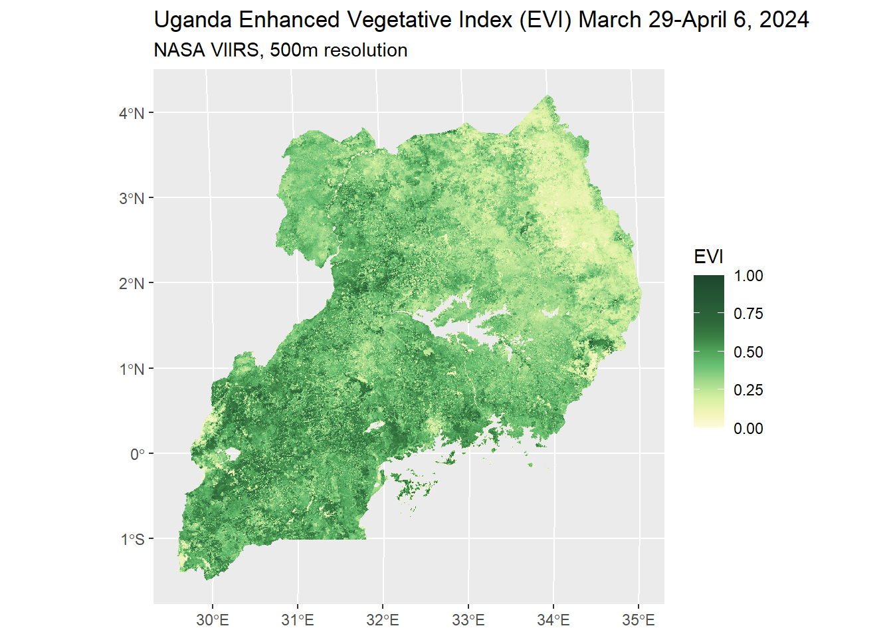

Several previous posts on this blog ([iterative workflows](https://tech.popdata.org/dhs-research-hub/posts/2024-08-01-ndvi-data/); [NDVI aggregation methods](https://tech.popdata.org/dhs-research-hub/posts/2024-08-16-ndvi-data-2/index.html); [multilevel modeling](https://tech.popdata.org/dhs-research-hub/posts/2025-11-21-diet-diversity-ndvi/)) have featured the Normalized Difference Vegetation Index (NDVI), which is an index frequently used as a measure of vegetation greenness and health.

There are many other indices and measures to describe vegetation or land cover on Earth's surface, however, and in this series we'll go into details about what these data are and how they might be appropriate for certain research goals. Various data and indices represent seasonal agricultural productivity, or be used to measure droughts, deforestation, or many other climate change-related phenomena. We will start with vegetative indices, that is, measures of greenness detected using surface reflectance. The next two posts will cover measures of moisture in the environment and then land cover/land use data.

# Greenness or Vegetation

First, we'll look more closely at measures related to vegetation, in that the primary method to produce the measure or index is a calculation of the density of greenness, or photosynthetic activity, of a pixel. Below is an image we've created of the Enhanced Vegetation Index of Uganda in 2024 using remotely-sensed data from NASA's VIIRS satellite, as an example of available vegetative index data. Click the word "Code" below to see the entirety of the code used to produce this image. The code below includes a workflow for adding projection metadata covered in our [blog post about VIIRS vegetative index data](https://tech.popdata.org/dhs-research-hub/posts/2025-03-31-viirs/).

Code

<pre class="downlit sourceCode r code-with-copy"><code class="sourceCode R"><a href="https://rdrr.io/r/base/library.html">library</a>(<a href="https://tech.popdata.org/ipumsr/">ipumsr</a>)
<a href="https://rdrr.io/r/base/library.html">library</a>(<a href="https://r-spatial.github.io/sf/">sf</a>)
<a href="https://rdrr.io/r/base/library.html">library</a>(<a href="https://dplyr.tidyverse.org">dplyr</a>)
<a href="https://rdrr.io/r/base/library.html">library</a>(<a href="https://tidyr.tidyverse.org">tidyr</a>)
<a href="https://rdrr.io/r/base/library.html">library</a>(<a href="https://zoo.R-Forge.R-project.org/">zoo</a>)
<a href="https://rdrr.io/r/base/library.html">library</a>(<a href="https://lubridate.tidyverse.org">lubridate</a>)
<a href="https://rdrr.io/r/base/library.html">library</a>(<a href="https://rspatial.org/">terra</a>)
<a href="https://rdrr.io/r/base/library.html">library</a>(<a href="https://fs.r-lib.org">fs</a>)
<a href="https://rdrr.io/r/base/library.html">library</a>(<a href="https://stringr.tidyverse.org">stringr</a>)
<a href="https://rdrr.io/r/base/library.html">library</a>(<a href="https://purrr.tidyverse.org/">purrr</a>)
<a href="https://rdrr.io/r/base/library.html">library</a>(<a href="https://github.com/Huber-group-EMBL/rhdf5">rhdf5</a>)
<a href="https://rdrr.io/r/base/library.html">library</a>(<a href="https://ggplot2.tidyverse.org">ggplot2</a>)
<a href="https://rdrr.io/r/base/library.html">library</a>(<a href="https://paleolimbot.github.io/ggspatial/">ggspatial</a>)

# Read in H5 files ----
 h5_files &lt;- <a href="https://rdrr.io/r/base/list.files.html">list.files</a>("data_local/evi", full.names = TRUE, pattern = "\\.h5$")
 tile_codes &lt;- <a href="https://rspatial.github.io/terra/reference/unique.html">unique</a>(<a href="https://stringr.tidyverse.org/reference/str_extract.html">str_extract</a>(h5_files, "h[0-9]{2}v[0-9]{2}"))

tiles &lt;- <a href="https://purrr.tidyverse.org/reference/map.html">map</a>(
  tile_codes,
  function(code) h5_files[<a href="https://stringr.tidyverse.org/reference/str_detect.html">str_detect</a>(h5_files, code)]
)

# Read in metadata from HDF files
tile_metadata &lt;- <a href="https://purrr.tidyverse.org/reference/map.html">map</a>(
  tiles,
  function(t) <a href="https://rdrr.io/pkg/rhdf5/man/h5_read.html">h5read</a>(t[1], name = "//HDFEOS INFORMATION/StructMetadata.0")
)

# Assign sinusoidal projection information from object tile_metadata
sinu_proj &lt;- "+proj=sinu +lon_0=0 +x_0=0 +y_0=0 +R=6371007.181 +units=m +no_defs"

# Gather upper and lower limits for downloaded tiles
ul &lt;- <a href="https://purrr.tidyverse.org/reference/map.html">map</a>(
  tile_metadata,
  ~ <a href="https://stringr.tidyverse.org/reference/str_match.html">str_match</a>(.x, "UpperLeftPointMtrs=\\((.*?)\\)")[, 2]
)

ul &lt;- <a href="https://purrr.tidyverse.org/reference/map.html">map</a>(<a href="https://stringr.tidyverse.org/reference/str_split.html">str_split</a>(ul, ","), as.numeric)

lr &lt;- <a href="https://purrr.tidyverse.org/reference/map.html">map_chr</a>(
  tile_metadata,
  ~ <a href="https://stringr.tidyverse.org/reference/str_match.html">str_match</a>(.x, "LowerRightMtrs=\\((.*?)\\)")[, 2]
)

lr &lt;- <a href="https://purrr.tidyverse.org/reference/map.html">map</a>(<a href="https://stringr.tidyverse.org/reference/str_split.html">str_split</a>(lr, ","), as.numeric)

# Save coordinate extents for tiles
tile_ext &lt;- <a href="https://purrr.tidyverse.org/reference/map2.html">map2</a>(ul, lr, function(u, l) <a href="https://rspatial.github.io/terra/reference/ext.html">ext</a>(u[1], l[1], l[2], u[2]))

evi_tiles &lt;- <a href="https://purrr.tidyverse.org/reference/map2.html">map2</a>(
  tiles,
  tile_ext,
  function(tile, ext) {
    # Load raster for the input tile. We select the EVI subdataset
    r &lt;- <a href="https://rspatial.github.io/terra/reference/rast.html">rast</a>(
      tile, 
      subds = "//HDFEOS/GRIDS/VIIRS_Grid_16Day_VI_500m/Data_Fields/500_m_16_days_EVI",
      noflip = TRUE
    )
    
    <a href="https://rspatial.github.io/terra/reference/crs.html">crs</a>(r) &lt;- sinu_proj # Attach sinusoidal projection defined above
    <a href="https://rspatial.github.io/terra/reference/ext.html">ext</a>(r) &lt;- ext # Attach this tile's extent
    
    r # Return the updated raster for this tile
  }
)

# Mosaic tiles together
evi_mosaic &lt;- <a href="https://purrr.tidyverse.org/reference/reduce.html">reduce</a>(evi_tiles, mosaic)

# Replace EVI values of less than -1 to missing
m &lt;- <a href="https://rdrr.io/r/base/matrix.html">matrix</a>(<a href="https://rdrr.io/r/base/c.html">c</a>(-Inf, -1, NA), nrow = 1)
evi_mosaic &lt;- <a href="https://rspatial.github.io/terra/reference/classify.html">classify</a>(evi_mosaic, m)

# Read in Uganda shapefiles and transform the projection to match the EVI data
ug_borders &lt;- ipumsr::<a href="https://tech.popdata.org/ipumsr/reference/read_ipums_sf.html">read_ipums_sf</a>("shapefiles/geo1_ug1991_2014.zip") |&gt; 
  <a href="https://r-spatial.github.io/sf/reference/valid.html">st_make_valid</a>() |&gt; # Fix minor border inconsistencies
  <a href="https://r-spatial.github.io/sf/reference/geos_combine.html">st_union</a>() |&gt; 
  <a href="https://r-spatial.github.io/sf/reference/st_transform.html">st_transform</a>(<a href="https://rspatial.github.io/terra/reference/crs.html">crs</a>(evi_mosaic))

ug_evi_crop &lt;- <a href="https://rspatial.github.io/terra/reference/crop.html">crop</a>(evi_mosaic, ug_borders)
ug_evi_mask &lt;- <a href="https://rspatial.github.io/terra/reference/mask.html">mask</a>(ug_evi_crop, <a href="https://rspatial.github.io/terra/reference/vect.html">vect</a>(ug_borders))

# Create color pallete for EVI 
evi_pal &lt;- <a href="https://rdrr.io/r/base/list.html">list</a>(
  pal = <a href="https://rdrr.io/r/base/c.html">c</a>(
    "#fdfbdc",
    "#f1f4b7",
    "#d3ef9f",
    "#a5da8d",
    "#6cc275",
    "#51a55b",
    "#397e43",
    "#2d673a",
    "#1d472e" 
  ),
  values = <a href="https://rdrr.io/r/base/c.html">c</a>(0, 0.1, 0.2, 0.3, 0.4, 0.5, 0.6, 0.7, 1)
)

#Create plot of EVI for Uganda
uganda_evi_plot &lt;- <a href="https://ggplot2.tidyverse.org/reference/ggplot.html">ggplot</a>() +
  <a href="https://paleolimbot.github.io/ggspatial/reference/layer_spatial.html">layer_spatial</a>(ug_evi_mask[[1]]) +
  <a href="https://ggplot2.tidyverse.org/reference/scale_gradient.html">scale_fill_gradientn</a>(
    colors = evi_pal$pal,
    values = evi_pal$values,
    limits = <a href="https://rdrr.io/r/base/c.html">c</a>(0, 1),
    na.value = "transparent"
  ) +
  <a href="https://ggplot2.tidyverse.org/reference/labs.html">labs</a>(title = "Uganda Enhanced Vegetative Index (EVI) March 29-April 6, 2024", subtitle = "NASA VIIRS, 500m resolution", fill = "EVI")

uganda_evi_plot</code></pre>
<button title="Copy to Clipboard" class="code-copy-button"><i class="bi"></i></button>

<figure class="figure">

</figure>

The table below is not an exhaustive list. We've chosen a select set of indicators to highlight that are widely used and vary enough from each other to be considered for different research goals. A [longer list of vegetation indices](https://www.earthdata.nasa.gov/topics/biosphere/vegetation-index) can be found on NASA's website.

The information in the table is designed to help you navigate which indicator might be most appropriate for your research question. Your choice might be guided by the spatial resolution, temporal frequency, spatial or temporal coverage, or specific component of the measure itself.

You will notice some indicators occupy multiple rows - in the cases that the same indicator was collected by different instruments (ie. satellites) over time, their resolution or frequency might have changed as technology in remote sensing has advanced. Below the table are additional details regarding each measure and suggestions or examples for best use cases.

| Index or measure | Instrument | Basic content | Temporal extent | Frequency | Resolution | Where to download |
|-----------|:---------:|:---------:|:---------:|:---------:|:---------:|:---------:|
| [NDVI](https://www.ncei.noaa.gov/products/climate-data-records/normalized-difference-vegetation-index) | AVHRR | Greenness and vegetation health | 1981 - present | 16-day | 0.05 degree (\~5km at equator) | [NCEI NOAA direct download](https://www.ncei.noaa.gov/data/land-normalized-difference-vegetation-index/access/) |
| [NDVI](https://modis.gsfc.nasa.gov/data/dataprod/mod13.php) | MODIS | Greenness and vegetation health | 2000-2025 | 16-day | 250m | [NASA Earthdata Search](https://search.earthdata.nasa.gov/search) - MOD13Q1 |
| [NDVI](https://www.ncei.noaa.gov/access/metadata/landing-page/bin/iso?id=gov.noaa.ncdc:C01677) | VIIRS | Greenness and vegetation health | 2012 - present | 8-day or 16-day | 500m | [NASA Earthdata Search](https://search.earthdata.nasa.gov/search) - VJ113A4N (8-day) or VNP13A1 (16-day) |
| [EVI](https://www.earthdata.nasa.gov/data/catalog/lpcloud-vnp13a1-002) | VIIRS | Greenness and vegetation health | 2012-present | 8-day or 16-day | 500m or 1km | [NASA Earthdata Search](https://search.earthdata.nasa.gov/search) - VJ113A4N (8-day) or VNP13A1 (16-day) |
| [EVI](https://www.usgs.gov/landsat-missions/landsat-enhanced-vegetation-index) | Landsat | Greenness and vegetation health | December 2024 - present | 2-3 days | 30m | [NASA Earthdata Search](https://search.earthdata.nasa.gov/search) - HLS Operational Land Imager Vegetation Indices Daily Global 30 m V2.0 |
| [VCF](https://www.earthdata.nasa.gov/about/competitive-programs/measures/vegetation-continuous-fields-esdr) | AVHRR | Percent of cell covered in tree, non-tree vegetation, and non-vegetation | 1982-2016 | annual | 0.05 degree (\~5km at equator) | [NASA Earthdata Search](https://search.earthdata.nasa.gov/search) - VCF5KYR |
| [VCF](https://modis.gsfc.nasa.gov/data/dataprod/mod44.php) | MODIS | Percent of cell covered in tree, non-tree vegetation, and non-vegetation | 2000-2021 | annual | 250m | [NASA Earthdata Search](https://search.earthdata.nasa.gov/search) - MOD44B |
| [LAI](https://www.ncei.noaa.gov/products/climate-data-records/leaf-area-index-and-fapar) | AVHRR | Canopy/leaf cover | 1981 to 10 days before the present | daily | 0.05 degree (\~5km at equator) | [NCEI NOAA direct download](https://www.ncei.noaa.gov/data/land-leaf-area-index-and-fapar/access/) |
| [LAI](https://modis.gsfc.nasa.gov/data/dataprod/mod15.php) | MODIS | Canopy/leaf cover | 2002 - present (2000 - present) | 4-day (8-day) | 500m | [NASA Earthdata Search](https://search.earthdata.nasa.gov/search) - MCD15A3H (MOD15A2H) |
| [LAI](https://www.ospo.noaa.gov/products/land/vegetation/lai/) | VIIRS | Canopy/leaf cover | 2012 - present | 8-day | 500m | [NASA Earthdata Search](https://search.earthdata.nasa.gov/search) - VNP15A2H |

## NDVI

### Measurement

As we have covered previously [in our introductory post on NDVI](https://tech.popdata.org/dhs-research-hub/posts/2024-07-02-ndvi-concepts/), the Normalized Difference Vegetation Index represents the amount of photosynthetic activity measured by a satellite on a pixel of Earth's surface. Photosynthetic plants absorb red light and reflect greens, but also reflect near-infrared light extremely well which satellite sensors can capture. The reflection of near-infrared light is what NDVI leverages: NDVI is measured using the difference between the near infrared (NIR) and red (R) light reflected back to satellite sensors, normalized by the sum of the near infrared and red bands of light.

$$
NDVI = (NIR - R) / (NIR + R )
$$

The possible values of NDVI range from -1 to 1, with values zero and under being bare ground, water, and other surfaces that reflect large amounts of red light relative to near infrared light, that is, having very little to no plants absorbing the red light for photosynthesis.

### Typical Uses

The NDVI is a widely-used measurement for vegetation health, and can be used to detect changes in vegetation cover, density, and stress over time.

Some noted weaknesses of NDVI are that it can be prone to containing outliers and spurious value changes in the data due to cloud cover, and the reflectance of different soil types may interfere with its ability to compare pixels from different regions. NDVI has been found to not perform well differentiating pixels that have a high vegetation density, such as tropical rain forest. Further, not all photosynthetic surfaces of plants are green [@huete_overview_2002; @schultz_performance_2016].

One option for research projects involving areas with low vegetative cover is the Soil Adjusted Vegetation Index (SAVI), which is the NDVI corrected for soil brightness. An option for areas of high vegetation density is the Enhanced Vegetation Index, described below.

### Example articles

-   Njatang et al 2023 used NDVI, CHIRPS precipitation data, and armed conflict data to analyze climate change and conflict's effect on child malnutrition in Sub-Saharan Africa [@njatang_climate_2023].

## EVI

### Measurement

The Enhanced Vegetation Index is similar to the NDVI, but with additional components to adjust for cloud cover and canopy background noise. $$
EVI = G * ((NIR - R) / (NIR + C1 * R – C2 * B + L))
$$ EVI is calculated from the above equation from near infrared light (NIR), red light (R), blue light (B), a canopy background value for the pixel (L), coefficients for atmospheric resistance (C1, C2), and a gain factor (G - usually 2.5).

### Typical Uses

The EVI might be a better choice over NDVI for an analysis focusing on areas of the world with frequent cloud cover and dense foliage (e.g. tropical rain forest) or smoke in the atmosphere (e.g. slash and burn agriculture). EVI is available through NASA starting in 2012, so it is not a viable measurement option for research questions involving a timeframe before 2012.

### Example article

-   Davies et al 2016 found that EVI was more resilient to atmospheric interference than other vegetative indices when measuring forest changes in Cambodia [@davies_detecting_2016].

## LAI

### Measurement

The Leaf Area Index is a measurement of the green leaf density of plant canopy, or the one-sided leaf area per horizontal ground area. There are multiple approaches, but the end result is a unit-less index value greater than zero [@weiss_review_2004; @fang_overview_2019]. Values greater than 1 indicate multiple layers of leaves in the same area.

-   Leaf Area (m^2^) / Ground Area (m^2^)
-   Integral of leaf area over the canopy height (m^3^/m^3^)
-   One-sided green broadleaf area per unit of ground area (m^2^/m^2^); one-half of the total conifer needle surface area per unit of ground area

### Typical Uses

The LAI is a reasonable choice to represent a variety of biological processes and activity of plant matter in an area, such as photosynthetic production, rainfall interception, or evapotranspiration [@bangelesa_is_2023]. For example, leaf area may be more important in measuring shade given by a canopy to moderate sunlight and heat.

### Example article

-   Bangelesa et al 2023 found an association between LAI and stunting in children under 5 in the Democratic Republic of the Congo [@bangelesa_is_2023].

## VCF

### Measurement

The Vegetation Continuous Fields data are produced by NASA to describe the composition of land cover within each pixel, divided into tree cover, non-tree vegetative cover, and non-vegetative cover, such that the sum of the three components is 100 percent.

The data are produced, like the other vegetative indices, using surface reflectance (or light captured by satellite reflected off Earth's surface), but also combined with training data to create the model for predicting global land coverage in the three categories.

### Typical Uses

The VCF data may be useful for research projects if the outcome may be correlated differently between tree and non-tree vegetative cover, which is difficult to determine using NDVI. VCF may be more useful than land cover data if the density of forest cover relative to non-tree vegetative cover is meaningful.

Because the VCF data are an annual-based measure, VCF might not be well suited to study change within the year, or specific deforestation events with a narrow time scale. For example, VCF would not be suited to measuring the loss of vegetative cover immediately after a fire, as some amount of vegetation would grow back over a period of months until the next measurement occurs.

### Example article

-   Johnson et al 2013 used VCF data to demonstrate a linkage between percent forest cover and reduced risk of diarrhea in young children, and that children living in areas with deforestation in the past 10 years were less likely to consume foods rich in vitamin A or meet dietary diversity guidelines [@johnson_forest_2013].

## Honorable Mentions

-   The [Normalized Difference Fraction Index](https://www.sciencedirect.com/science/article/abs/pii/S0034425705002385) has been demonstrated as a very accurate measure of deforestation and forest degradation, but it is not available at a global scale for download. Instead, one would need to download the component pieces of surface reflectance data and compute NDFI for the area of focus [@schultz_performance_2016; @souza_forest_2024].

# Looking ahead

The next post will feature measures of environmental moisture, which are helpful for identifying drought (or flooding) and plant stress due to a lack of water.
