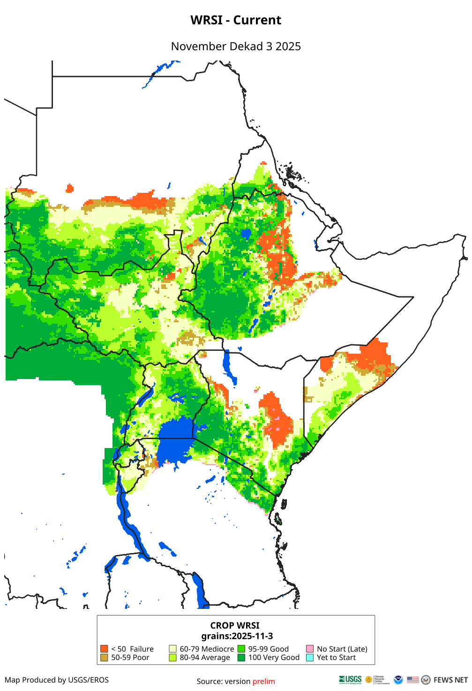
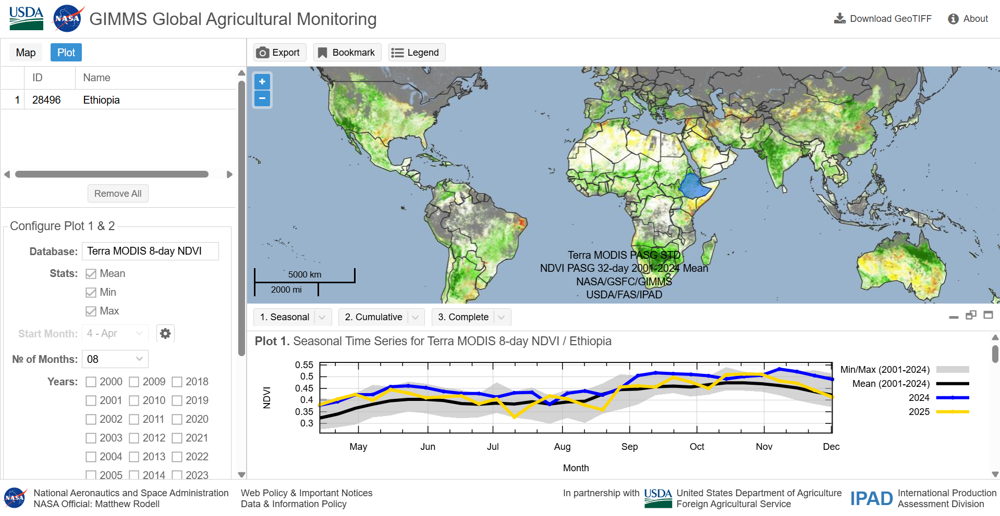
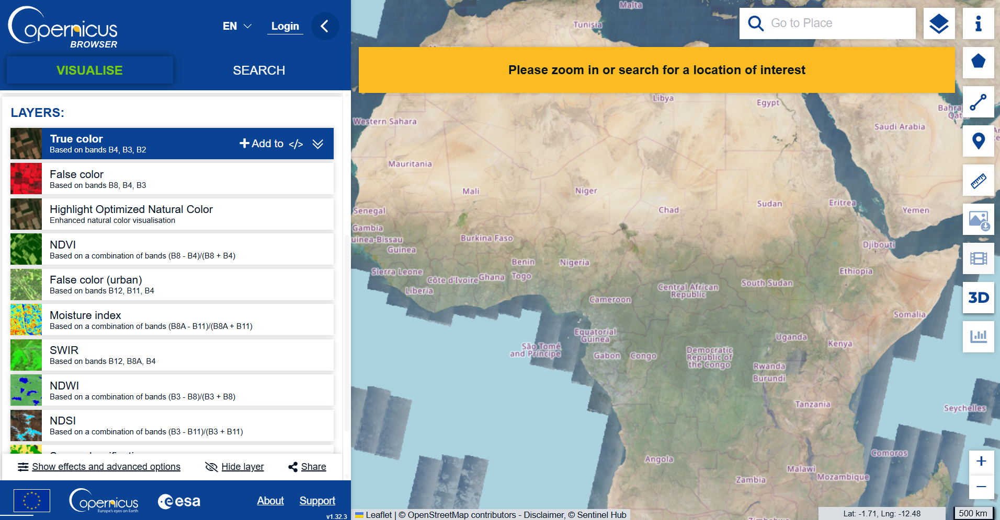

Our previous post in this series compared measures of vegetative health and greenness. This next installment discusses a number of indicators that describe the level of environmental moisture, either held in soil or vegetation. These data are particularly useful for research related to agricultural productivity. We will briefly explain the differences in the measures, where to download them, and appropriate research uses for each.

# Environmental Moisture Measures

Beyond greenness of foliage, remotely sensed data can be used to indicate vegetation stress as it relates to precipitation.

The table below contains a few key indicators you might come across related to precipitation, land cover, and agricultural production.

| Index or measure | Instrument | Basic content | Temporal extent | Frequency | Resolution | Where to download |
|-----------|:---------:|:---------:|:---------:|:---------:|:---------:|:---------:|
| [WRSI](https://www.usgs.gov/data/landscape-water-requirement-satisfaction-index-l-wrsi-1982-present-dekadal-time-scale) | MERRA2 (reanalysis of satellite data from NASA); CHIRPS | Extent to which rainfall meets crop water demands | 2001 - present | 10-day | 0.1 degree (\~10km at the equator) | [FEWSNET](https://earlywarning.usgs.gov/fews) |
| [SWI](https://earlywarning.usgs.gov/fews/product/62/) | FAO Digital Soil Map of the World, CHIRPS, and MERRA2 | Water retained in soil as percent of full water holding capacity | 2001 - present | 10-day | 0.1 degree (\~10km at the equator) | [FEWSNET](https://earlywarning.usgs.gov/fews) |
| [NDMI](https://www.usgs.gov/landsat-missions/normalized-difference-moisture-index) | Landsat (HLS) | Vegetation water content | 2013 - present | daily | 30m | [On-demand order ESPA USGS](https://espa.cr.usgs.gov/) |

## WRSI

### Measurement

The Water Requirement Satisfaction Index (WRSI) uses historic information of crops typically grown in a region and the soil type combined with remotely sensed precipitation and evapotranspiration data to approximate crop performance and/or water stress. The index generally ranges from 0 to 100, but can be greater than 100 when rainfall exceeds the crop water requirements. A value under 50 indicates significant drought or crop failure.

Note that the index is relative to a specific crop's water demand, and WRSI data can currently be downloaded only for regions in Africa as part of the [Famine Early Warning System project from the US Geological Survey (USGS)](https://earlywarning.usgs.gov/fews/).

{width="50%" height="auto"}

### Typical Uses

The WRSI is useful for analyses aiming to measure crop yields and agricultural production. This is particularly helpful in that any given region's crop harvest quality may differ from another region even with the same amount of precipitation if the soil holds less moisture or if one region's primary crop is more water-sensitive. The 10-day frequency of WRSI is a fine enough temporal resolution to assist in precise drought detection.

WRSI is usually calculated for one or two common crops for certain regions, so it is a representation of harvests at a regional level, but not necessarily pixel by pixel, for example, in the case that cultivators rotate crops or choose not to cultivate in a field for a particular season.

### Example article

-   Grace et al 2023 used the WRSI to measure seasonality of growing seasons, and found an association between growing season quality and reproductive health decision-making [@grace_investigating_2023].

## SWI

### Measurement

The Soil Water Index is a measure of the water retained in soil based on a number of inputs. The final calculation is the amount of water in the soil (SW) divided by the water holding capacity (WHC), multiplied by 100. The possible values are between 0 and 100.

$$
SWI = (SW/WHC)*100
$$ Soil water content at time i (SW~i~) is measured by the known soil water content in the previous time frame, plus precipitation in time i (PPT~i~) minus the potential evapotranspiration during time i (PET~i~).

$$
SW_i = SW_{i-1} + PPT_i - PET_i
$$

The WHC is determined using known qualities about the water retention qualities of different soil types, and the spatial extent of soil types comes from FAO's Digital Soil Map of the World.

### Typical Uses

The SWI could be a valuable indicator to measure disease vectors such as mosquitos spreading malaria, detecting floods in addition to drought, or to assist in measuring the water stress on vegetation that is not a specific crop, such as rangelands for pastoral uses.

### Example article

-   Zbiri et al 2019 categorized areas of Morocco according to NDVI and calculate drought indicators using the SWI [@zbiri_drought_2019].

## NDMI

### Measurement

Like NDVI, the Normalized Difference Moisture Index (NDMI) uses surface reflectance to measure vegetation quality using a normalized ratio of light bands. Instead of red light and near infrared (NIR), NDMI uses shortwave infrared (SWIR) and near infrared.

$$
NDMI = (NIR - SWIR)/(NIR + SWIR)
$$

Detecting the difference between NIR and SWIR indicates the water content within plant matter. The index ranges from -1 to 1, with zero indicating moderate moisture, values below zero indicating water stress or sparse vegetation, and values above zero indicating more vegetative cover and higher water content.

### Typical Uses

NDMI can be used for indicators of drought, wildfire risk, and to inform irrigation management. The index measures leaf moisture regardless of the type of vegetation. The weakness of NDMI is that it is difficult to distinguish low water content from sparse vegetative cover and is often used with other remotely sensed data such as NDVI to indicate greenness or density of vegetative cover.

### Example article

-   Moisa et al 2025 leveraged NDMI and NDVI data together with Land Use/Land Cover (which we will discuss in our next blog post) to assess climate change resilience outlooks in Ethiopia, noting that land converted from forest to cropland contained less moisture, suggesting future water resource challenges [@moisa_evaluating_2025].

# Earth Observation Platforms and Dashboards

Due to the importance of monitoring agricultural productivity in real time to identify potential for regional food insecurity, a number of online data exploratory platforms and dashboards exist[@nakalembe_framework_2025].

## Global Agricultural Monitoring (GLAM)

The [Global Agricultural Monitoring System](https://www.climatehubs.usda.gov/hubs/international/tools/gimms-global-agricultural-monitoring), a web-based interface for finding international crop cover data. GLAM is a joint effort between the USDA's Foreign Agricultural Service, UMD, SDSU, and NASA. The initiative assembles crop cover data from many sources, and produces crop production forecasts[@becker-reshef_monitoring_2010]. The [GLAM interface](https://glam1.gsfc.nasa.gov/) allows users to compare multiple geographies over time with flexible, custom plots. Users can choose the dataset (eg. Terra MODIS 8-day or NOAA VIIRS 8-day), the product (eg. NDVI or NDVI anomaly), the timeframe, and administrative geography level, and even display only data for specific crops (crop masks). In addition to producing seasonal, cumulative, and complete plots and maps, the interface allows you to download GeoTIFF files using your selections. New data is available every eight days to allow for real-time monitoring of agricultural production.

{width="100%" height="auto"}

## Sentinel Hub

[Sentinel Hub](https://apps.sentinel-hub.com/eo-browser/) (SH) is a geo-spatial data processing service that converts raw satellite imagery into analysis-ready data such as indices, composites, or other custom output using machine learning and aggregated to the area or time scale specified by the user[@kadunc_sentinel_2023].

Sentinel Hub is a paid service, that as of March 20th, 2026, is depreciated and replaced by [Planet Insights](https://insights.planet.com/). A free, browser-based version is available at the [Copernicus Browser](https://browser.dataspace.copernicus.eu/).

{width="100%" height="auto"}

## CropScape and Crop-CASMA

[CropScape](https://nassgeodata.gmu.edu/CropScape/) is a web browser-based interface created by a team at George Mason University to provide additional access to the USDA's Cropland Data Layer (CDL)[@han_cropscape_2012]. CDL contains annual layers of high-resolution crop coverage data for only the contiguous United States going back to 1997 (plus a recent addition of a separate Hawaii CDL), and is also available at the USDA's [National Agricultral Statistics Service Cropland Data Viewer](https://www.nass.usda.gov/Research_and_Science/Cropland/Viewer/index.php). Additionally, there is an [R package that allows you to access the CDL data via the CropScape](https://cran.r-project.org/web/packages/CropScapeR/CropScapeR.pdf) interface.

A related tool called [Crop-CASMA](https://nassgeo.csiss.gmu.edu/CropCASMA/), also from George Mason University, provides data on soil moisture and vegetative health to assist in real-time monitoring of crop productivity in the contiguous United States.

# Looking ahead

We've now covered vegetative indices and indicators of soil or vegetative moisture over two blog posts. The next installment of this series of three introductory posts will cover land use and land cover data sources. Stay tuned!
