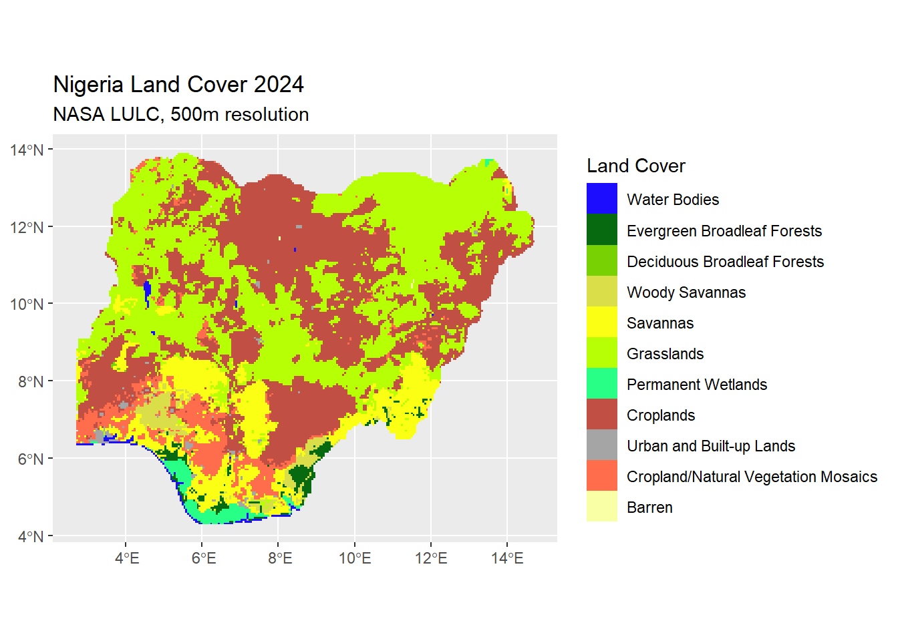

This post is our third in a series discussing and comparing spatial land cover data. The previous two posts have covered [vegetative indices](https://tech.popdata.org/dhs-research-hub/posts/2026-02-06-land-cover-intro/) and [environmental moisture data](https://tech.popdata.org/dhs-research-hub/posts/2026-03-02-land-cover-pt2/). Now we will describe land cover/land use data and where to find it.

# Land Cover

Obviously, vegetative cover is not the only type of surface on Earth. Datasets such as [Land Use/Land Cover from NASA](https://www.earthdata.nasa.gov/topics/land-surface/land-use-land-cover) (LULC) and [Global Dynamic Land Cover](https://land.copernicus.eu/en/products/global-dynamic-land-cover) from the Copernicus Programme describe the human lived environment using classification schemes that describe land in terms of impervious surfaces (urban or built up) or by ecosystem type (wetland, evergreen forest, savannah, permanent ice cover, etc). Below is a map using the LULC data for Nigeria in 2024. Click "Code" below to see the R code that created this map.

Code

<pre class="downlit sourceCode r code-with-copy"><code class="sourceCode R">#Read in necessary libraries
<a href="https://rdrr.io/r/base/library.html">library</a>(<a href="https://rspatial.org/">terra</a>)
<a href="https://rdrr.io/r/base/library.html">library</a>(<a href="https://dplyr.tidyverse.org">dplyr</a>)
<a href="https://rdrr.io/r/base/library.html">library</a>(<a href="https://tidyr.tidyverse.org">tidyr</a>)
<a href="https://rdrr.io/r/base/library.html">library</a>(<a href="https://stringr.tidyverse.org">stringr</a>)
<a href="https://rdrr.io/r/base/library.html">library</a>(<a href="https://r-spatial.github.io/sf/">sf</a>)
<a href="https://rdrr.io/r/base/library.html">library</a>(<a href="https://ggplot2.tidyverse.org">ggplot2</a>)
<a href="https://rdrr.io/r/base/library.html">library</a>(<a href="https://paleolimbot.github.io/ggspatial/">ggspatial</a>)

#Read in land cover data file for 2024
land_majority_lulc_2024 &lt;- <a href="https://rspatial.github.io/terra/reference/sds.html">sds</a>("data_local/lulc/MCD12C1.A2024001.061.2025216131527.hdf")[1]

#Read in shapefile of Nigeria
nigeria_borders &lt;- ipumsr::<a href="https://tech.popdata.org/ipumsr/reference/read_ipums_sf.html">read_ipums_sf</a>("shapefiles/geo1_ng2006_2010.zip") |&gt; 
  <a href="https://r-spatial.github.io/sf/reference/valid.html">st_make_valid</a>() |&gt; # Fix minor border inconsistencies
  <a href="https://r-spatial.github.io/sf/reference/geos_combine.html">st_union</a>() |&gt; 
  <a href="https://r-spatial.github.io/sf/reference/st_transform.html">st_transform</a>(<a href="https://rspatial.github.io/terra/reference/crs.html">crs</a>(land_majority_lulc_2024)) # Convert shapefile of Nigeria to projection of land cover

nigeria_borders_vector &lt;- <a href="https://rspatial.github.io/terra/reference/vect.html">vect</a>(nigeria_borders)

#Extract and mask land cover data to Nigeria
land_majority_lulc_2024_crop &lt;- <a href="https://rspatial.github.io/terra/reference/crop.html">crop</a>(land_majority_lulc_2024, nigeria_borders)
land_majority_lulc_2024_mask &lt;- <a href="https://rspatial.github.io/terra/reference/mask.html">mask</a>(land_majority_lulc_2024_crop, nigeria_borders_vector)

#Identify which land cover categories exist in these data
<a href="https://rspatial.github.io/terra/reference/unique.html">unique</a>(land_majority_lulc_2024_mask)
#&gt;    Majority_Land_Cover_Type_1
#&gt; 1                           0
#&gt; 2                           2
#&gt; 3                           4
#&gt; 4                           8
#&gt; 5                           9
#&gt; 6                          10
#&gt; 7                          11
#&gt; 8                          12
#&gt; 9                          13
#&gt; 10                         14
#&gt; 11                         16

#Set up a color palette for land cover classes
lulc_pal &lt;- <a href="https://rdrr.io/r/base/list.html">list</a>(
  pal = <a href="https://rdrr.io/r/base/c.html">c</a>(
    "#1c0dff", # 0 Water Bodies
    "#086A10", # 2 Evergreen Broadleaf Forest
    "#78D203", # 4 Deciduous Broadleaf Forest
    "#dade48", # 8 Woody Savannas
    "#fbff13", # 9 Savannas
    "#b6ff05", # 10 Grasslands
    "#27ff87", # 11 Permanent Wetlands
    "#c24f44", # 12 Croplands
    "#a5a5a5", # 13 Urban and Built-up
    "#ff6d4c", # 14 Cropland/Natural Mosaic
    "#f9ffa4" # 16 Barren or Sparsely Vegetated
  ),
  values = <a href="https://rspatial.github.io/terra/reference/unique.html">unique</a>(land_majority_lulc_2024_mask)
)
color_vec &lt;- lulc_pal$pal
<a href="https://rspatial.github.io/terra/reference/names.html">names</a>(color_vec) &lt;- lulc_pal$values

#Create vector of labels
land_classes &lt;- <a href="https://rdrr.io/r/base/c.html">c</a>("Water Bodies", "Evergreen Broadleaf Forests", "Deciduous Broadleaf Forests", "Woody Savannas", "Savannas", "Grasslands", "Permanent Wetlands", "Croplands", "Urban and Built-up Lands", "Cropland/Natural Vegetation Mosaics", "Barren")

# Convert the land cover data to a factor variable to map discrete values
land_majority_lulc_2024_mask_factor &lt;-
  <a href="https://rspatial.github.io/terra/reference/is.bool.html">as.factor</a>(land_majority_lulc_2024_mask)

#Create a plot of land cover
lulc_2024_graph_nigeria &lt;- <a href="https://ggplot2.tidyverse.org/reference/ggplot.html">ggplot</a>() +
  <a href="https://paleolimbot.github.io/ggspatial/reference/layer_spatial.html">layer_spatial</a>(land_majority_lulc_2024_mask_factor) +
  <a href="https://ggplot2.tidyverse.org/reference/scale_manual.html">scale_fill_manual</a>(
  values = lulc_pal$pal,
  labels = land_classes, 
  na.value = "transparent",
  na.translate = FALSE
) +
  <a href="https://ggplot2.tidyverse.org/reference/labs.html">labs</a>(title = "Nigeria Land Cover 2024", 
       subtitle = "NASA LULC, 500m resolution", 
       fill = "Land Cover")

lulc_2024_graph_nigeria</code></pre>
<button title="Copy to Clipboard" class="code-copy-button"><i class="bi"></i></button>

<figure class="figure">

</figure>

| Index or measure | Instrument | Basic content | Temporal extent | Frequency | Resolution | Where to download |
|-----------|:---------:|:---------:|:---------:|:---------:|:---------:|:---------:|
| [LULC](https://modis.gsfc.nasa.gov/data/dataprod/mod12.php) | MODIS (Terra+Aqua) | Land cover classification schemes up to 17 categories | 2001 - 2021 | annual | 500m | [NASA Earthdata Search](https://search.earthdata.nasa.gov/search) - MCD12Q1/MCD12C1 (new version) |
| [LULC](https://www.usgs.gov/centers/western-geographic-science-center/science/global-food-and-water-security-support-analysis) | Landsat (GFSAD) | Land cover classification schemes - various number of classes | 2007 - 2016 (varies by region) | multi-year | 30m - 1km | [NASA Earthdata Search](https://search.earthdata.nasa.gov/search) - GFSAD30 |
| [LULC](https://sites.bu.edu/measures/) | Landsat (GLanCE) | Land cover classification scheme with 7 categories | 2001 - 2019 | annual | 30m | [NASA Earthdata Search](https://search.earthdata.nasa.gov/search) - Global Land Cover Mapping and Estimation Yearly 30 m V001 |
| [GDLC](https://land.copernicus.eu/en/products/global-dynamic-land-cover) | Copernicus Sentinel-1 and Sentinel-2 | 11 classes of land cover with multiple forest classes | 2015 - 2020 | annual | 100m (10m for 2020) | [Copernicus Programme](https://land.copernicus.eu/en/products/global-dynamic-land-cover) |

## NASA LULC data types

### Measurement

NASA's Land Use/Land Cover data represent pixels of Earth's surface using several land use classification schemes. Land cover/land use data describe human's lived environment, in both biophysical (such as woody savannah) and socioeconomic features (urban or built up land).

LULC data is available in standardized schemes with global coverage, but also at finer spatial resolution with more specific land cover types for smaller regions. Surface reflectance is the key component of how land cover at a pixel level is determined, but other inputs are used, especially in regional data.

In addition to high-frequency LULC data with global coverage, a project out of Boston University called [Global Land Cover Estimation](https://sites.bu.edu/measures/) (GLanCE) produces global coverage at an annual level, but at much higher resolution (30m).

Lastly, NASA also produces a product called [Global Food-and-Water Security-support Analysis Data](https://www.usgs.gov/centers/western-geographic-science-center/science/global-food-and-water-security-support-analysis) (GFSAD), which contains high-resolution data on irrigated and non-irrigated cropland.

### Typical Uses

Land Use/Land Cover data have a wide variety of applications, such as studying climate change, land use change dynamics, deforestation, urbanization, and more. The categories distinguish between different types of ecosystems, which is not easily accomplished with some of the vegetative indices described in previous posts. These data distinguish human-built impervious surfaces from bare ground/no vegetative cover.

The wide scope of spatial resolution, temporal extent, and varying number of categories make the different LULC data flexible for many applications. The exceptions being change within a year or measurements regarding health of vegetation, which are better suited for vegetative indices with a finer temporal resolution (that is, more frequent data points).

### Example articles

-   Ganem et al 2025 uses regional LULC data to analyze land cover change in Brazil [@ganem_rainforests_2025].
-   Zaldo-Aubanell et al 2021 is a review article comparing different LULC approaches [@zaldo-aubanell_reviewing_2021].

## GDLC

### Measurement

Global Dynamic Land Cover (GDLC) contains land use/land cover data from the Copernicus Program, out of the European Space Agency, using Sentinel satellites. The GDLC contain 11 different land cover classes, and include layers with a specific focus on tropical forest types at high spatial resolution. Data inputs include the Digital Elevation Model, land training data, and agro-meteorological indicators.

### Typical Uses

Similar to LULC, GDLC can also be used to measure land cover change dynamics, deforestation, climate change, and urbanization. GDLC is less frequent than LULC and covers a narrower time extent, but often has a finer spatial resolution. You may consider using GDLC data for focused regional projects because of the small spatial resolutions, and the distinctions drawn between tropical vegetation types in their pantropical tree cover density data. The small time frame limits its use for understanding change over time, however.

## Honorable Mentions

-   [Google Earth Engine](https://earthengine.google.com/) (GEE): An open source online data platform that contains a spatial data archive from a variety of sources, as well as tools for interacting with those data. GEE contains both land cover data and imagery as well as weather and climate data.
-   [Livelihood Zones](https://fews.net/data/livelihood-zones) from FEWSNET: Livelihood zone maps are country-specific map layers produced by experts with local knowledge of the predominant economic activity (for food production and income) by location. The maps are developed using factors such as agroclimatology, elevation, landcover, land use, and market accessibility. Grace and Nagle 2015 used Livelihood Zones in a study analyzing the relationship between agricultural production and fertility.[@grace_using_2015]

# Looking ahead

Though this is the last of three in our series describing and comparing data sources of land cover and vegetation, in the near future we will follow with a post demonstrating how to use a select number of these data to measure deforestation after a few posts on other topics.
