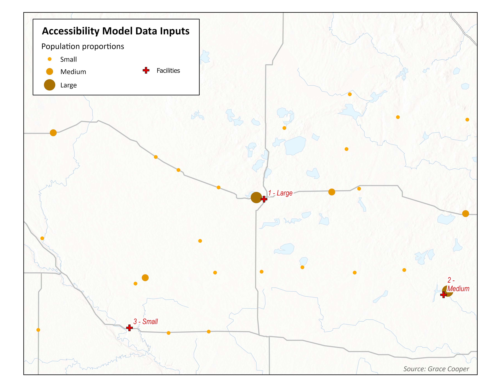
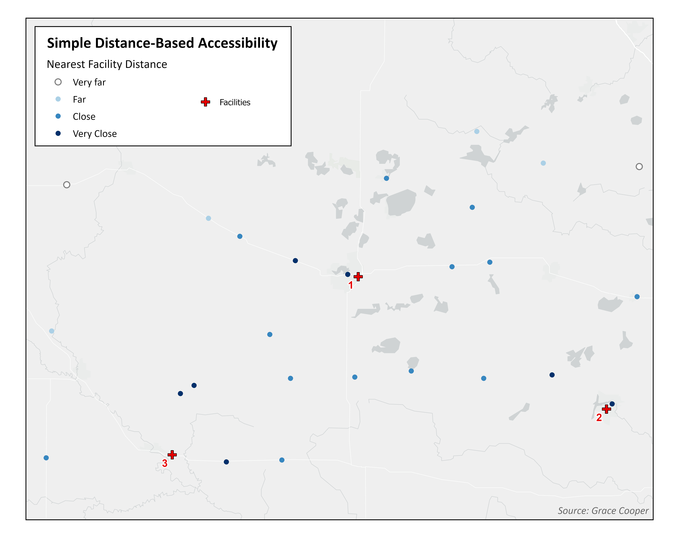
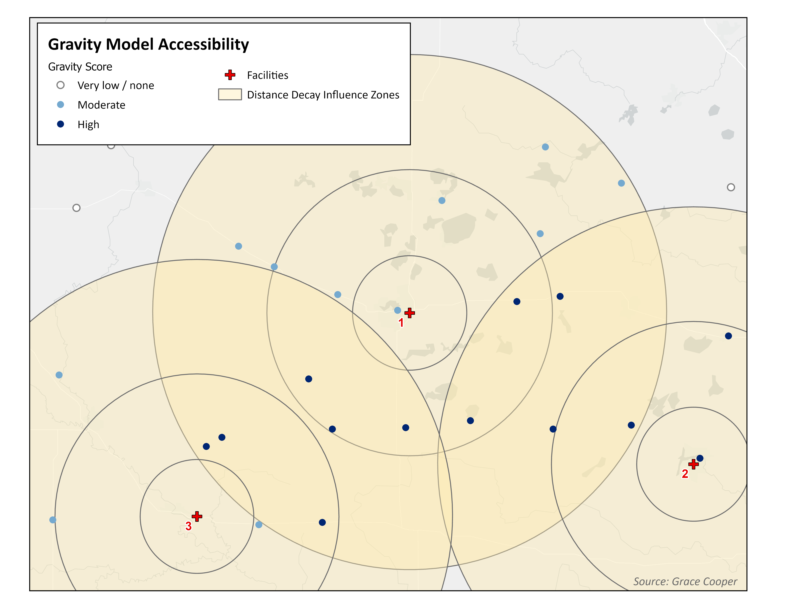
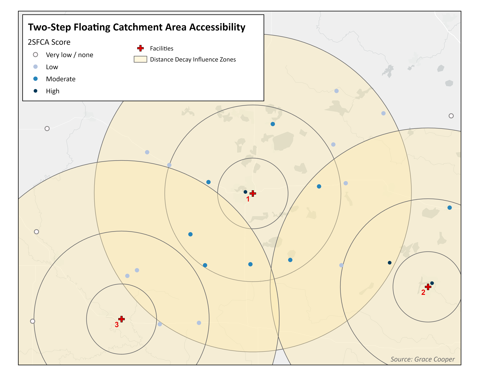

There are four core dimensions of healthcare access; spatial accessibility, availability of care, affordability of services, and quality of care [@widener_spatial_2018]. Rural populations in developing countries are particularly vulnerable to poor spatial accessibility to healthcare due to high poverty rates, low vehicle ownership, poor public transportation, and inadequate road infrastructures [@smith_geography_2000; @vadrevu_measuring_2016]

# Spatial Accessibility

The locations of health services relative to populations fundamentally shapes health outcomes. Beyond the travel time or distance between people and healthcare facilities, spatial accessibility is influenced by the demand (population in need of healthcare that a given facility must provide services for) and the supply (health facilities within a reasonable travel time for an individual to access it) [@demitiry_accessibility_2022; @joseph_measuring_1982]. A facility that is serving a densely populated area will have less availability of care for each individual due to higher wait times and potentially lower quality of care.

## Accessibility Frameworks

Models of spatial accessibility must consider how they define the location and number of people in a region (i.e. census counts located in centroids of administrative units, gridded population estimates - see our [post on measuring population density](https://tech.popdata.org/dhs-research-hub/posts/2024-08-30-pop-density/) for more discussion) and the health facilities providing care (e.g. hospitals, clinics, or pharmacies). Studies of spatial accessibility to healthcare measure travel impedance (i.e. the difficulty or cost of getting from one place to another) using one of two frameworks: cost-distance models and network-based models.

### Cost-Distance Framework

Cost-Distance Frameworks use least-cost-path analysis to estimate travel impedance, represented as a friction surface, using rasterized estimations (gridded data) of elevation, land use, and populations. The travel time from each grid cell to its target (i.e. a healthcare facility) is calculated as the total time it takes to cross each grid cell in between, following the least cost path [@ouma_access_2018; @weiss_global_2020]. These models use gridded land cover, elevation, and population datasets to estimate spatial accessibility; while this approach enables researchers to conduct studies in rural areas and/or less developed countries with sparse road network data and infrequent censuses, they essentially provide a simple metric of “time or distance to facility”, which does not account for the effects of supply and demand on healthcare availability, nor does it allow researchers to consider the effects of distance decay, multilevel healthcare, catchment sizes, or regional competition.

### Network-Based Framework

Network-Based Frameworks measure travel impedance based on the time it takes to travel along road networks. Census data are summarized at administrative unit levels to identify the locations of populations; they depend on the availability of highly detailed road network data and census data that is collected often and with large scale geographic identifiers such as census blocks [@mulrooney_comparison_2017]. This framework allows researchers to account for many factors that influence spatial accessibility, including supply and demand, regional competition for services, quality of care, multimodal transportation, and population density. These models use two major sources of input data: facility points and population points.

{fig-alt="A map depicting health care facilities with red crosses and population centers using yellow dots sized to indicate the density of population."}

#### Simple Metrics Models

Accessibility analysis using simple metrics are based on the distance or travel time from the population point to the nearest facility; measured as the straight-line distance (as the crow flies) or network distance (following road networks, speed limits, etc.). Simple metrics are easy to calculate and straightforward to interpret, however they ignore facility capacity (all facilities are considered equal, even if one has more doctors or beds available than another) as well as competition between facilities and among populations.

{fig-alt="A map depicting health care facilities with red crosses and population centers using blue dots with shading scaled to indicate the simple distance from a health care facility."}

#### Gravity Models

Classic gravity-based models are an improvement over simple metrics due to the fact that they enable researchers to account for distance decay and the interaction between supply and demand. Distance decay refers to the reduction in utilization of a service with greater distance between population and facility; people are more likely to visit a facility that is closer than one that is farther away, if the services provided and quality of care are equal. Spatial accessibility is also impacted by the relative supply of services available to a population (the demand for services). An area with high population density and few healthcare facilities has low spatial accessibility to healthcare services due to the effects of overcrowding hospitals and long wait times for appointments.

{fig-alt="A map depicting health care facilities with red crosses and rings of increasing distance radiating out from them.  The map also charts population centers using blue dots with shading scaled to indicate the gravity score distance from a health care facility."}

#### 2SFCA Models

While it is a type of gravity model, the 2SFCA model stands out as an ideal method to measure spatial accessibility for three reasons; it accounts for supply and demand, the basic model is adaptable to account for other components of accessibility, and it overcomes the Modifiable Areal Unit Problem (MAUP). MAUP is bias introduced through the use of arbitrary spatial units, such as census administrative units.\
The mathematical computation of the 2SFCA model involves an initial assessment of the capacity of facilities, followed by the population demand within catchment areas of facilities, and finally a summary of the provider to population ratio for all population points; in this way, the model accounts for supply and demand.

Each country in every region has a unique healthcare system with its own challenges to providing care. This model enables researchers to adapt it to their specific research question in the setting of their analysis; authors can adapt it to account for variable catchment sizes, multilevel healthcare systems, multimodal transportation analyses, and more). While simple metrics rely on the administrative data available, the 2SFCA model bases its calculation of distance on catchment sizes around facilities and populations, regardless of administrative boundaries, which greatly reduces the effects of the Modifiable Areal Unit Problem (MAUP).

{fig-alt="A map depicting health care facilities with red crosses and rings of increasing distance radiating out from them.  The map also charts population centers using blue dots with shading scaled to indicate the gravity score distance from a health care facility."}

### Comparison of accessibility results based on different models

#### Simple Metrics Models emphasize distance to a single facility

As you can see in the maps above, accessibility analyses can yield very different results depending on the model used. In this example, simple metrics lead us to believe the people closest to each facility experience the greatest accessibility to healthcare. While this is conceptually reasonable, spatial accessibility is a far more complex issue that cannot be adequately understood as the straight-line distance between a population point and a facility.

#### Gravity Models account for all facilities in range

A classic gravity model considers distance decay, which is represented by the distance decay influence zones in the Gravity Model map. The influence zones closest to a facility (the inner rings) apply greater weight toward the measurement of spatial accessibility for the population points they intersect than the ones that are farther away (the outer rings). Accessibility based on the classic gravity model accounts for availability of all facilities within a specific range of a population point. Therefore, areas of overlap between distance decay influence zones produce higher gravity scores because those populations have ‘access’ (as defined by the researcher) to more than one facility. There is considerable difference in the spatial accessibility map between the simple metric model and the gravity model. While simple metrics favor the few populations close to facilities, the gravity model assigns higher accessibility to populations in the center of the example maps, due to having more facility options.

#### 2SFCA Models measure availability of services based on supply and demand

The 2SFCA model paints yet another story about spatial accessibility in this example. Like the gravity model, the 2SFCA model uses distance decay influence zones to weight accessibility according to proximity to a facility. However it also considers the capacity of facilities, which can be measured in a number of ways (the number of doctors or beds are commonly used). As Figure 1 shows, Facility 3 is a smaller facility (i.e. it has a smaller capacity) and it contributes less to accessibility than the other two facilities. Therefore, while the center of the region experiences moderate accessibility due to basic distance decay effects, population points closer to larger facilities (1 and 2) experience higher accessibility due to greater capacity for care.

# Looking ahead

This blog post is one in a series of three posts that will dive into 1) what network-based models are and how they are conducted, 2) a detailed examination of the Two-Step Floating Catchment Area (2SFCA) model, and 3) example code to conduct a case study analysis of spatial accessibility to health using the Raster-Based 2SFCA model in Kenya.
