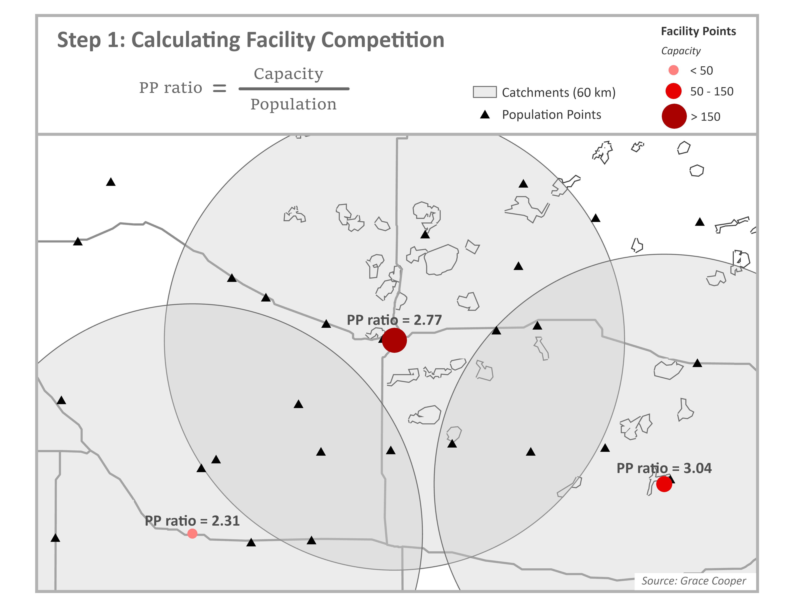
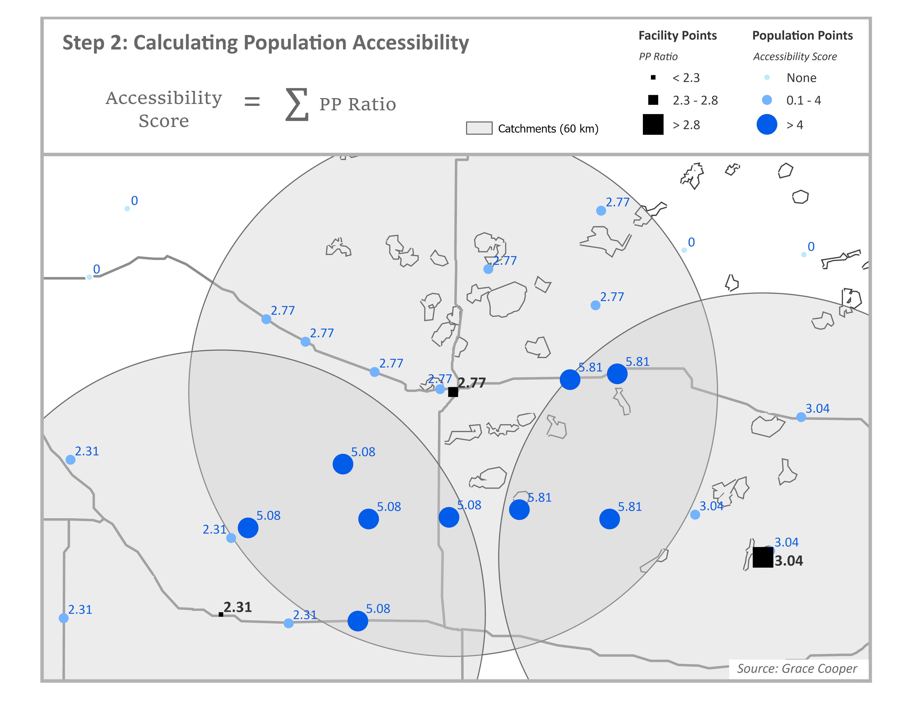
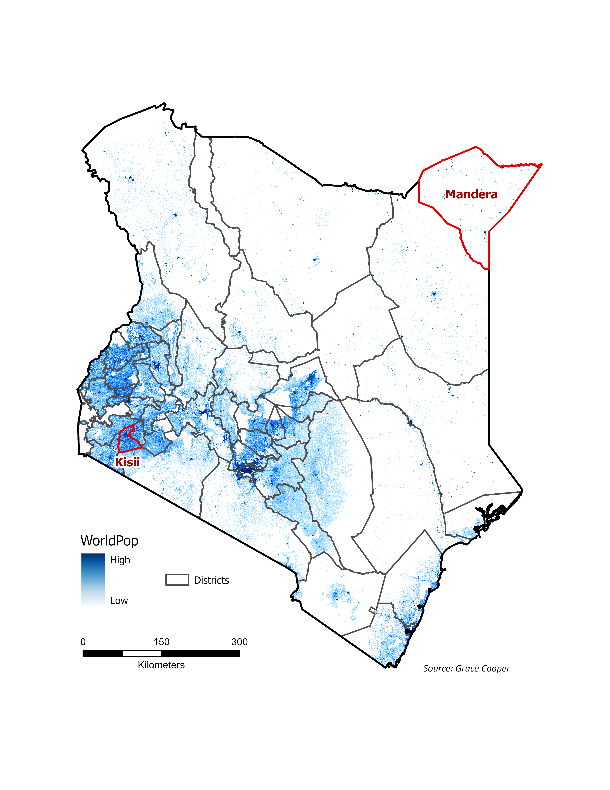
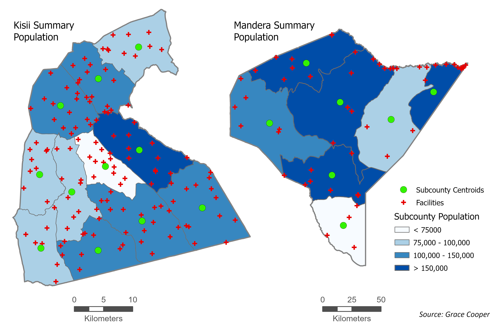
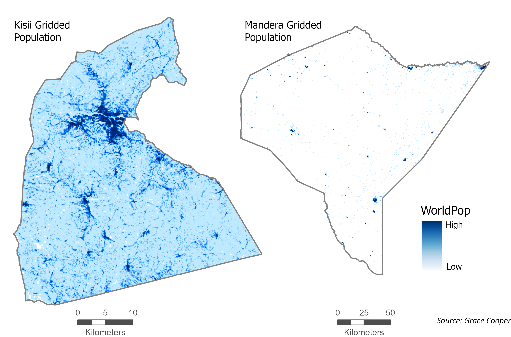

Spatial accessibility to health care, or the difficulty experienced by a person attempting to travel to a healthcare facility, is impacted by three components: the time it takes to get there, the mode of transportation available, and the supply and demand of healthcare services in the area. Though it tells us a great deal about the spatial barriers to health access, this last component, supply and demand, is often excluded from simple measurements of accessibility (such as the distance to a facility). In gravity models, such as the Two-Step Floating Catchment Area (2SFCA) model, supply and demand are represented as the provider to population ratio (PP Ratio), where the supply (the capacity of clinics and hospitals) is divided by the demand of services (the population in need within the same area).[@ouma_access_2018; @paez_demand_2019]

# The Two-Step Floating Catchment Area (2SFCA) Model

Spatial accessibility measured using a basic gravity model considers the provider size and distance between the population and provider. Spatial accessibility based on the 2SFCA model similarly depends on provider size and distance, but also accounts for competition for services (i.e. how many other people are competing for a single provider).[@luo_measures_2003]

## Step 1

Start by calculating the provider-to-population ratio (PP Ratio) for each facility. Through summation of the population within facility catchment areas (blue circles), we estimate the population (demand) to whom each facility is expected to provide services. The PP Ratio is calculated by dividing the facility capacity (supply), which is commonly estimated as the number of beds or doctors, by the population demand.

{fig-alt="Map depicting health facilities with icon sizes proportional to service capacity, circles indicating facility catchment areas, and nearby population points."}

## Step 2

Next calculate the accessibility score for each population point. For each population point, identify all facilities that are within the travel threshold of a population point through spatial overlay between facility catchment areas and population points. In the example below, we use a 60km radius as the facility catchment area. For each population point, sum the PP Ratios for all facilities whose catchment areas spatially intersect with the population point; this is the accessibility score. In the figure below, accessibility scores have been multiplied by 1,000 for readability. Assuming the capacity in this example comes from the number of beds available at each facility, the accessibility score represents the number of hospital beds available per 1,000 people.

{fig-alt="Map depicting health facilities in relation to nearby population clusters.  The size of the health facility icons are proportional to their PP ratio, and the population cluster icons are proprtional to their accessibility score."}

This framework is widely used to study spatial accessibility because it is conceptually intuitive. Although the accessibility score can be expressed in units of beds per population, it represents potential access rather than the actual allocation of beds. Final accessibility scores are typically interpreted relatively for this reason; describing how accessible services are to one population compared to others in the area. Not only does it account for the capacity of providers and the distance between providers and populations, it considers competition for services which does affect accessibility to services in reality.[@paez_demand_2019]

# Enhancements of the 2SFCA Model

The advantages of the 2SFCA model are in its adaptability; researchers can incorporate other factors into their analysis as needed. Depending on data availability, variants of the model can be used to account for continuous or hybrid distance decay, variable catchment sizes, regional competition, adjusted supply and demand, or multi-modal frameworks.

**Table 1. Published works using 2SFCA models by category**

```{=html}
<table>
  <tr>
    <th colspan="2">2SFCA Enhancement</th>
    <th>Model Name</th>
    <th>Citation</th>
  </tr>
  <tr>
    <td rowspan="15">Distance Decay</td>
    <td rowspan="5">Original (Binary)</td>
    <td>2SFCA</td>
    <td>Joseph and Bantock (1982)</td>
  </tr>
  <tr>
    <td>2SFCA</td>
    <td>Luo and Wang (2003)</td>
  </tr>
  <tr>
    <td><strong>2SFCA</strong></td>
    <td><strong>Mutono et al. (2022)</strong></td>
  </tr>
  <tr>
    <td>Optimized 2SFCA</td>
    <td>Ngui and Apparicio (2011)</td>
  </tr>  
  <tr>
    <td>2SFCA</td>
    <td>Yao et al. (2013)</td>
  </tr> 
  <tr>
    <td rowspan="6">Continuous</td>
    <td>Gravity-type Gaussian 2SFCA</td>
    <td>Dai (2010)</td>
  </tr> 
  <tr>    
    <td>Kernel Density (KD2SFCA)</td>
    <td>Dai and Wang (2011)</td>    
  </tr>  
  <tr>    
    <td>Kernel Density (KD2SFCA)</td>
    <td>Polzin et al (2014)</td>    
  </tr> 
  <tr>    
    <td>Hierarchical 2SFCA (H2SFCA)</td>
    <td>Tao et al (2020)</td>    
  </tr>
  <tr>
    <td><strong>Gravity-type Gaussian 2SFCA</strong></td>
    <td><strong>Tao et al (2025)</strong></td>
  </tr>
  <tr>
    <td><strong>Grid-to-level 2SFCA (GTL-2SFCA)</strong></td>
    <td><strong>Zhang et al (2021)</strong></td>
  </tr>
  <tr>
    <td rowspan="4">Hybrid</td>
    <td>Enhanced 2SFCA (E2SFCA)</td>
    <td>Bryant and Delamater (2019)</td>
  </tr>
  <tr>
    <td><strong>Multi-modal 2SFCA (MM2SFCA)</strong></td>
    <td><strong>Langford et al (2016)</strong></td>
  </tr>
  <tr>
    <td>Enhanced 2SFCA (E2SFCA)</td>
    <td>Luo and Qi (2009)</td>
  </tr>
  <tr>
    <td>Enhanced 2SFCA (E2SFCA)</td>
    <td>Vadrevu and Kanjilal (2009)</td>
  </tr>
  <tr>
    <td colspan="2" rowspan="6">Variable Catchment Size</td>
    <td>3SFCA</td>
    <td>Bell et al (2013)</td>
  </tr>
  <tr>
    <td>Nearest-Neighbor Modified (NN-M2SFCA)</td>
    <td>Jamtsho et al (2015)</td>
  </tr>
  <tr>
    <td>Variable (V2SFCA)</td>
    <td>Luo and Whippo (2012)</td>
  </tr>
  <tr>
    <td>Dynamic (D2SFCA)</td>
    <td>McGrail and Humphreys (2014)</td>
  </tr>
  <tr>
    <td><strong>Variable (V2SFCA)</strong></td>
    <td><strong>Su et al (2022)</strong></td>
  </tr>
  <tr>
    <td>Multiple Catchment Sizes (MC2SFCA)</td>
    <td>Tao et al (2014)</td>
  </tr> 
  <tr>
    <td colspan="2" rowspan="5">Regional Competition</td>
    <td><strong>Modified (M2SFCA)</strong></td>
    <td><strong>Delamater (2013)</strong></td>
  </tr>
  <tr>
    <td>Multinomial Logit (MNL 2SFCA)</td>
    <td>Demitry et al (2022)</td>
  </tr>
  <tr>
    <td>3SFCA</td>
    <td>Luo (2014)</td>
  </tr> 
  <tr>
    <td>Balanced (B2SFCA)</td>
    <td>Paez et al (2019)</td>
  </tr>
  <tr>
    <td><strong>Enhanced (E2SFCA)</strong></td>
    <td><strong>Wan et al (2012)</strong></td>
  </tr>
  <tr>
    <td colspan="2">Supply and Demand</td>
    <td>Supply-Demand Adjusted (SDA-2SFCA)</td>
    <td>Shao and Luo (2022)</td>    
  </tr>
  <tr>
    <td colspan="2">Multi-Modal Framework</td>
    <td>Multi-Modal (MGa2SFCA)</td>
    <td>Ni et al (2019)</td>    
  </tr>    
</table>
```

*Variations of the 2SFCA model. Studies completed using gridded population data highlighted in bold. Source: Grace Cooper.*

## Continuous distance decay aligns better with reality

Distance decay is the phenomenon where people are more likely to travel to places closer to them than those that are farther away, assuming they are ‘equal’ in other ways, such as capacity, quality of care, and services provided [@bryant_examination_2019]. Researchers apply distance decay to their 2SFCA models in one of three ways: binary, continuous, or hybrid. The original 2SFCA model assumes binary distance decay, meaning that the effect of distance on healthcare utilization is assumed to be constant within the catchment area and those who live outside of a facility catchment area are assumed to have zero access to healthcare [@joseph_measuring_1982; @luo_measures_2003; @mutono_impact_2022; @ngui_optimizing_2011; @yao_geographical_2013]. Since binary distance decay assumes the effect of distance is equal for all people within a catchment area, researchers developed enhanced versions of the model to more realistically account for the effect of distance on healthcare utilization. Models accounting for continuous decay replace the binary weight used in the original 2SFCA model (1 if a population center is within a catchment area and 0 if it is outside) with a continuous decay function. In calculation of the PP Ratio in step one, each population center is weighted by distance, rather than simply summing the population within a catchment equally. Calculation of accessibility in step two applies a decay function such as the Gaussian decay constant [@tao_modifiable_2025] to allow facilities closer to a population center to contribute more to accessibility than distant ones [@dai_black_2010; @dai_geographic_2011; @polzin_extended_2014; @tao_hierarchical_2020; @tao_modifiable_2025; @zhang_equity_2021]. Models using a hybrid approach apply a continuous decay weight within a maximum catchment area and assume zero accessibility outside of the catchment, like a binary model [@bryant_examination_2019; @langford_multi-modal_2016; @luo_enhanced_2009; @vadrevu_measuring_2016].

## Population density; rural catchments are bigger than urban ones

The 2SFCA can also be enhanced to account for variable catchment sizes. While the standard model applies the same fixed catchment size (such as 30 minute travel time) for every provider, regardless of whether they are located in a rural area with low demand or urban area with high demand, a variable catchment model expands catchment areas outward until the facility capacity is depleted. This means in dense urban areas, catchment areas will likely be small due to capacity being used up quickly within a small radius whereas in sparse rural areas, catchments become much larger to reach capacity. This enhancement is useful especially in studies that examine both urban and rural areas because densely populated areas do not need large service areas while facilities in sparsely populated areas must provide services to people farther away. [@bell_access_2013; @jamtsho_spatio-temporal_2015; @luo_variable_2012; @mcgrail_measuring_2014; @su_using_2022; @tao_hierarchical_2020]

## Competition between facilities

Regional competition is influential in studies concerned with how the capacity of nearby facilities will impact the choice of which facility to utilize, such as in urban areas. While the standard 2SFCA model implicitly accounts for regional competition in step one by summing up all people who can potentially use a certain facility, reducing accessibility in highly dense areas, it can be modified to further account for regional competition in multiple ways [@delamater_measuring_2012; @demitiry_accessibility_2022; @luo_integrating_2014; @paez_demand_2019]. In one study by Wan and others, the authors created a 3-step method that adds a selection probability to split demand across competing facilities for populations with overlapping catchment areas [@wan_relative_2012]. The standard 2SFCA model sums all population within the catchment area for a facility, even if some of the population overlaps with other facility catchments, which means it is counting the same population multiple times, effectively overestimating demand and ignoring competition between providers. The 3-step model solves this problem by estimating which facility populations are likely to use and only counting them once.

## Insurance availability and and health status of populations

Another extension of the 2SFCA model, the supply-demand adjusted (SDA-2SFCA) model, accounts for a more realistic measure of supply and demand based on insurance networks and healthcare needs [@shao_supply-demand_2022]. The authors argue the assumptions held by the standard 2SFCA model, that all providers are equally available and all people have the same needs for healthcare, are false. To combat this, they adjust for supply by splitting facility capacity according to insurance networks and, similarly, the population demand is weighted by healthcare needs according to demographic characteristics (such as age and gender) due to the fact that some groups use healthcare more frequently than others. This is followed by a separate 2SFCA calculation for each insurance group. While this method likely represents supply and demand of services more accurately than the standard model, it requires detailed information about health insurance coverage that is not widely available.

## Multiple modes of transportation

The standard 2SFCA model assumes a population will travel to a facility using a single mode of transportation (i.e. walking, biking, or driving); in rural areas, reality is rarely this simplistic. People often need to complete trips to the doctor using a combination of transportation modes. For instance, a mother and her child may need to take a long walk to the nearest bus stop, then use public transportation to get to the urban center, then complete their trip with another walk to the clinic. In another example, a family might get a ride in a car to a small urban center, then use bicycles or motorcycles to travel to the clinic in the next town that provides the specific services they need. A study by Ni and others attempts to solve this problem by including several transportation modes into both steps of the model [@ni_multi-mode_2019]. First, the authors conducted a travel behavior survey, according to distance, to estimate transportation mode probabilities; for instance, for longer distances people reported they were more likely to use a car, for medium distances, they often biked or used public transportation, and for shorter distances, they likely walked. In step one, the population demand is multiplied by the probability weight; the weighted demand is then summed across all travel modes. These same mode-specific probabilities are used to sum accessibility by travel mode, assuming each facility contributes accessibility through all travel modes according to the probability weight initially calculated. This study effectively accounts for multiple modes of transportation, however it requires additional survey information about common modes of transportation.

# Limitations of the 2SFCA Model

The 2SFCA model does have its limitations. It is a static spatial measure that does not allow travel time, supply of services, or population demand to change over time (i.e. throughout the course of the day). For instance, clinics are generally only open during business hours, which impacts availability for people who only have accessibility to a small clinic and cannot leave work during regular business hours. In addition, travel times in urban areas change throughout the day, such as during morning and afternoon rush hours.

## Overestimation of demand

As discussed previously, the 2SFCA overestimates demand for health care because it counts populations within the catchment areas of multiple facilities multiple times; it assumes each facility serves the entire population within its catchment area, even those populations who have access to other facilities. This produces a bias in provider-to-population ratios, potentially underestimating accessibility in areas with a high density of facilities [@hierink_differences_2022].

## Dependence on aggregate population data

Perhaps the biggest limitation to the model is its dependence on aggregate census data. Regions of the world with the poorest accessibility and health status may also be limited in the availability of detailed data. Most studies that implement the 2SFCA model utilize aggregate census population counts at small administrative unit levels, such as census tracts or wards. This produces spatial bias, assuming the demand for services is evenly distributed across the study area, related to the modifiable areal unit problem (MAUP), which is statistical bias created by the use of geographic data that are aggregated into spatial units, such as arbitrarily defined administrative units [@tao_modifiable_2025].

### Population data availability in less developed countries

The limitations of the model due to the use of aggregate population count data are exacerbated in less developed countries and areas that are highly rural, such as in sub-Saharan Africa (SSA). In many parts of SSA, administrative units with available population counts can be spatially very large, much too large for meaningful spatial analysis of human behavior. In addition, census data in less developed countries is often collected less frequently than in more developed countries, making the data available often more outdated than is acceptable for modern research. Aggregation of population data results in loss of spatial heterogeneity that is more complex with larger administrative units.

### Population Distribution in Kenya

Kenya’s population is concentrated in the central and southwestern regions of the country. The map highlights the locations of two districts in Kenya, in red, that will be used for visualization purposes to demonstrate how different population distributions can be; Kisii, in the southwestern corner of Kenya, is highly urbanized and relatively small in size compared to Mandera in the northeastern corner of the country, a large and highly rural district with very sparse population focused in small urbanized centers.

{fig-alt="Map depicting Kenya district boundaries and population density in shades of blue."}

### Aggregate population counts: how they are used in spatial analysis

Accessibility models that use aggregate census data for population inputs produce vastly different results from those that use gridded population data. In the 2SFCA model, researchers who use population counts aggregated to the subcounty level must estimate population locations using either the geographic center of the administrative unit (shown in the maps below) or the population-weighted center of the administrative unit, if smaller administrative units are available to calculate it. Kisii, a more densely populated district, has smaller administrative units which allows for more granular estimates of where people live. Mandera, much less densely populated, has larger subcounties and thus less accurate estimates of where people live using subcounty centroids. Visual inspection of these two cases reveals that accessibility models based on aggregate population counts will create an implicit bias toward urban areas and less accurate estimates of accessibility for rural populations.

{fig-alt="Map depicting aggregate population counts filling in entire sections in solid shades of blue within subcounty boundaries of Kisii and Mandera counties."}

### Gridded population data: fine-grained understanding of where populations exist

Accessibility models based on gridded population data, such as WorldPop, enable researchers to assess accessibility with much higher accuracy for both urban and rural areas. Through examination of the gridded population distribution in the Kisii district, it is clear that the most densely populated area is in the center of the district, similar to the distribution shown by aggregate population map. The gridded population distribution in Mandera district is very different from the aggregate population map. Most rural population points in the northern part of the district are along a large river on the northern boundary, a trend that is missed when population distribution is summarized using large subcounty units. These comparisons show that researchers dependent on census data to study spatial accessibility using a 2SFCA model are limited to study urban areas in more developed countries, due to the availability of small administrative units. This is a big limitation of the usefulness of the 2SFCA model that can be resolved with the use of gridded population data in its models.

{fig-alt="Map depicting population counts using blue scale at a high resolution within Kisii and Mandera counties of Kenya.  Kisii has higher population overall with several dense and expansive population clusters.  Mandera is sparsely populated with several small population centers."}

## Dependence on road network data to create facility catchments

The standard 2SFCA model has historically used road network data to create catchment areas around healthcare facilities, which requires complete road network data for the entire study area. Research in sub-Saharan Africa (SSA) often uses OpenStreetMap (OSM) for network analysis, however OSM data usually misses small (but important) roads in the most rural areas of SSA, and thus is not adequate for 2SFCA models. The alternative in these areas, when road network data is not adequately available, is to use least-cost path analysis to construct walk, bike, or driving speeds using a friction surface based on land cover data, river and wetland data, and roads data where available. Creating a catchment area around a facility based on a friction surface is complex due to the fact that raster analysis tools (such as Esri’s Distance Accumulation) must be adapted to create individual catchment areas for all facilities in an area. The standard methods to conduct a 2SFCA analysis rely on vector data (road networks, facility points, population points) that can be used with computational power readily available to most researchers and students using a laptop.

# The Missing Piece: a raster-based approach

The limitations described above outline the practical challenges faced by researchers completing a spatial accessibility analysis using the 2SFCA model in rural areas of less developed countries, mainly tied to lack of the available data types commonly used in the model. As it was built for urban areas with high-quality data, most models use road network data to build catchment areas and aggregate census data at very small administrative unit levels to define where people live. These types of datasets are often unavailable at the level of quality necessary for spatial accessibility analysis in less developed countries.

## Gridded population data

Gridded population datasets, also known as population density layers, as described in detail in a previous blog post, [Measuring Population Density](https://tech.popdata.org/dhs-research-hub/posts/2024-08-30-pop-density/), estimate the spatial distribution of people at high spatial resolutions. Many of them provide raster-based, global estimates of populations at 1km to 30m cell size resolution. The result is a raster image that describes the number of people who live in each grid cell. The most prominent global gridded population datasets produce updates to estimates annually or at 5-year intervals, providing researchers with recent estimates for cross-sectional analyses and extensive temporal availability for longitudinal studies. These datasets are ideal for spatial accessibility analyses due to the high spatial resolution of populations they provide, independence from administrative unit boundaries or census timelines, and availability in areas with sparse populations, where little other population data is available.

### Often underutilized in spatial accessibility models

There is a disconnect between the use of gridded population datasets to inform our understanding of where populations exist in rural areas of developing countries and the use of 2SFCA models to examine spatial accessibility to health services in the same areas. Gridded population data have been validated in numerous studies and are used widely in other areas of study, such as disaster assessment and risk management, land use change modeling, environmental change analyses, and socioeconomic analyses [@chen_multiple_2020]. Despite the clear advantage of using them, they are underutilized in studies that use the 2SFCA model for spatial accessibility analysis.

### Methods to use it are opaque or degrade the population data

In studies that do use gridded population data in 2SFCA models, the authors needed to use specific methods to enable the use of raster data as the input for population locations. Many studies relied on APIs to complete their analysis, as it requires high computational resources [@mutono_impact_2022; @ni_multi-mode_2019; @tao_modifiable_2025; @zhang_spatial_2019; @zhang_equity_2021]. Jamtsho and others converted gridded population data to points (the center of each grid cell became a point with population information), then clustered the points to nearby village point data to reduce the number of population centers in their analysis [@jamtsho_spatio-temporal_2015]. By aggregating the gridded data, the authors lost the location accuracy provided by the gridded population dataset. Luo and Qi used gridded population data in the U.S. by breaking it up into regions within Illinois to enable calculations on smaller portions [@luo_enhanced_2009]. This method is transparent and keeps the integrity of the original gridded population data, however it produces edge effects at region boundaries, assuming populations do not cross these boundaries to access healthcare.

## Use a friction surface, not network analysis

When road network data is not adequately available, one could use least-cost path analysis to construct walk, bike, or driving speeds using a friction surface based on available land cover data, river and wetland data, and/or roads data. Creating a catchment area around a facility based on a friction surface is complex due to the fact that raster analysis tools (such as Esri’s Distance Accumulation) must be adapted to create individual catchment areas for all facilities in an area. The standard methods to conduct a 2SFCA analysis rely on vector data (road networks, facility points, population points) that can be used with computational power readily available to most researchers and students using a laptop.

# Looking ahead

The 2SFCA model must be adapted to use gridded population data and a friction surface for calculation of catchment areas. Because these datasets are very large, they create an analysis that is computationally expensive and complex. The next blog post in this series will provide the workarounds researchers can use to combat these challenges, including a walk-through for how to complete a 2SFCA model using gridded population data and a friction surface.
