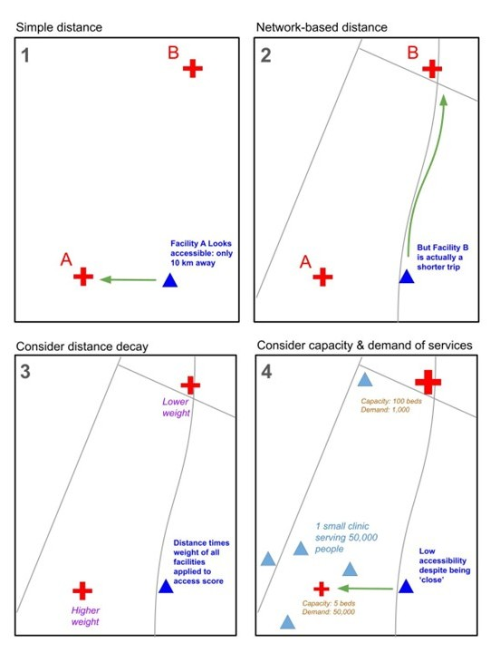
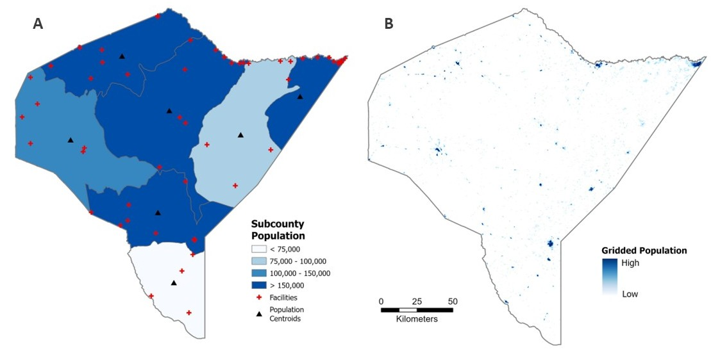
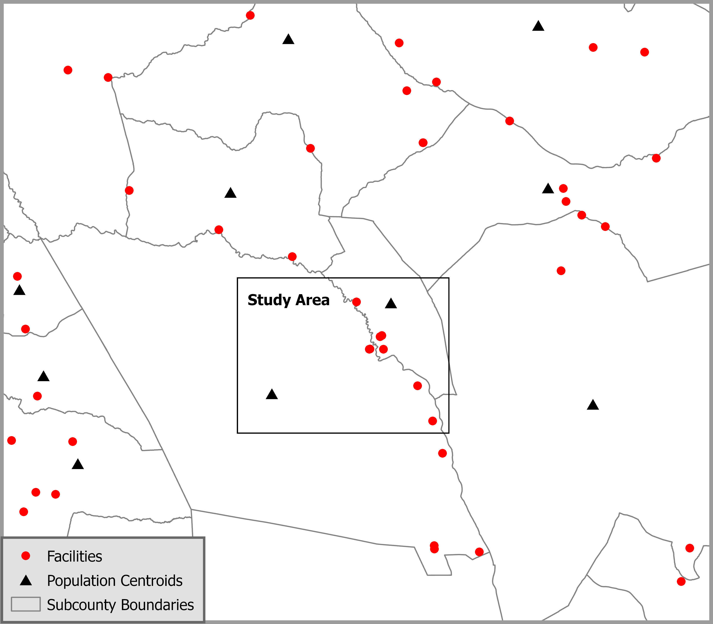
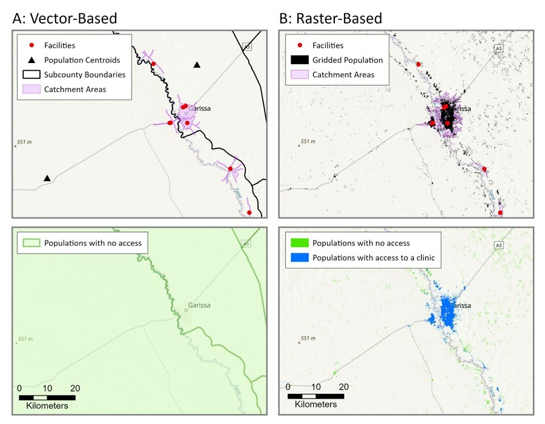
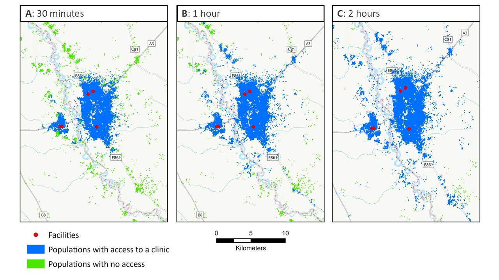

Spatial accessibility to healthcare, a known barrier to healthcare utilization [@bain_prevalence_2022] which leads to poor health [@yao_geographical_2013], is understudied in the regions that need it most, such as rural sub-Saharan Africa, due to lack of adequate road network and population data. Spatial accessibility models that account for more complex influences on spatial access, such as distance decay and supply and demand of services (i.e. gravity models such as the Two-Step Floating Catchment Area (2SFCA) model), typically depend on vector-based data that is less available in areas with the most vulnerable populations. Vector-based data include census population counts aggregated to administrative units and road network data. Global gridded population datasets (publicly available, high resolution population estimates), are becoming more widely used in social and population health studies [@chen_geographic_2017], however they continue to be underutilized in spatial accessibility to health models [@shao_supply-demand_2022; @tao_hierarchical_2020; @bryant_examination_2019]. This post describes an innovative method researchers can use to incorporate gridded population, land cover, and elevation data into a 2SFCA model for use in any region in the world, regardless of administrative data availability.

# Types of Spatial Accessibility Models

Spatial access to healthcare can be measured in several ways, from simple metrics to more complex models that factor in other components that influence access to healthcare, including distance decay and supply and demand.

Spatial access to healthcare can be measured in several ways, from simple metrics to more complex models that factor in other components that influence access to healthcare, including distance decay and supply and demand. We covered cost-distance, network, and gravity models in our first post in this series, [“Access to Healthcare Part 1: How It’s Measured”](https://tech.popdata.org/dhs-research-hub/posts/2026-03-25-health-care-distance/). We then went into more detail about Two-Step Floating Catchment Area (2SFCA) models in our post [“Access to Healthcare, Part 2: The 2SFCA Model”](https://tech.popdata.org/dhs-research-hub/posts/2026-05-15-distance-pt2/). Figure 1 depicts the four types of models over the same example area.

{fig-alt="Four panels showing the same map using four different spatial accessibility models: simple, network-based, gravity, and 2SFCA."}

# The Problem: Mismatch in Ideal Methods and Associated Data

Spatial accessibility models that account for distance decay and supply and demand more accurately describe access to healthcare services, however they are typically used with vector-based data. The vector data necessary to run these models at a spatial resolution appropriate for neighborhood-level analysis are not commonly available in low and middle income countries. Therefore, these populations are missed or misrepresented in healthcare access research focused on the spatial component of accessibility.

## Comparison of Raster and Vector Population Data Sources

Mandera is a rural district in northeastern Kenya. Population in Mandera is sparse with very low density, making it an ideal area to represent the spatial distribution of population data in the most rural regions of sub-Saharan Africa.

### Vector Data

Census population counts aggregated to the smallest available administrative unit are a common form of vector-based data used in spatial analysis of populations. In Kenya, the smallest administrative unit available to the public are subcounties and the most recent census was completed in 2019 (seven years old at the time of this writing). As you can see in Figure 2 (Panel A) below, subcounties are very large in this area, most of which are 50 to 100 kilometers wide. Populations typically only travel up to one or two hours to seek healthcare, which translates to about 5 to 10 kilometers walking distance, based on Tobler’s Law[@getis_waldo_2020]. We can conclude, then, that the spatial scale necessary to examine spatial accessibility to healthcare does not match the publicly-available, vector-based census data. Alternative data sources must be used in order to study these vulnerable populations.

### Raster Data

Gridded population layers, such as WorldPop, LandScan, Global Human Settlement layers (GHSL), or HRSL, estimate the number and location of populations at much higher spatial resolutions around the world (see Figure 2, Panel B). In most cases, these datasets model the spatial distribution of populations using dasymetric modelling methods to allocate census population counts to built-up areas based on aerial imagery such as night-time lights [@nagle_dasymetric_2014]. As you can see in Figure 2, Panel B, below, WorldPop gridded population represents much more accurately the locations of small urban centers in otherwise sparsely populated rural areas. WorldPop, among other gridded population data products, is available annually at a 100 meter spatial resolution. These datasets provide information about the locations of populations with greater spatial detail and temporal frequency, making them ideal for analyzing spatial relationships at neighborhood levels.

{fig-alt="Two maps of the same district, on the left shows subcounties with solid fill according to total population; on the right shows population density as clusters of blue."}

# The Solution: Incorporate Raster Data into a Network Framework

Raster-based data, such as gridded population data and gridded land cover and elevation data, can be used to identify where people live and define travel threshold areas around healthcare facilities. Network frameworks, such as the 2SFCA model, can be adapted to use raster-based data for improved spatial and temporal resolution of its inputs.

## Computing Travel Thresholds

Network framework models typically use road network data to define distance to facility or travel threshold areas (catchment areas), however these can alternatively be defined using a cost raster (cost surface or friction surface) which simulates the time it takes an individual to travel across a single grid cell. The method for calculating travel thresholds using a cost raster is described below.

## Accounting for Population Locations

Census population counts aggregated to administrative units (vector-based data) are common inputs for population in network framework models, however gridded population data can be incorporated into these models. As discussed, the census data are often too outdated for current research, and the reported geographic unit is often too large in less developed countries for meaningful accessibility analysis. Gridded population data products provide highly accurate estimates of population counts at very high spatial resolutions, enabling researchers to conduct meaningful accessibility analyses in less developed countries. The method for including gridded population data in the 2SFCA model is described below.

# Introducing the Raster-Based 2SFCA

I have developed an open-source, adaptable python-model using ArcGIS tools to complete an accessibility to healthcare analysis using the Two-Step Floating Catchment Area (2SFCA) model. Based solely on global datasets that are free to the public, this model enables researchers to produce high-resolution spatial accessibility analyses anywhere in the world. It does not discriminate based on census or road network data availability. The workflow consists of the following three coordinated scripts that require access to ArcGIS Pro with a spatial analyst extension, Python 3.x, and the arcpy python package.

## Access the Code on Github

The full working versions of all three scripts referenced below (1_create_cost_raster.py, 2_create_service_area_polygons.py, and 3_accessibility_analysis.py) are available on the Github repository called [accessibility-model-2SFCA](https://github.com/gracecooper107/accessibility-model-2SFCA.git).

## Cost Raster Creation

The script called 1_create_cost_raster.py builds a travel-time cost raster where each grid cell value represents the minutes it takes to travel across the cell on foot, accounting for land cover, infrastructure (roads), barriers (waterways and wetlands), and terrain slope (using Tobler’s hiking function). **The output is a single-band floating-point raster**.

### Input Data

-   Raster datasets (example data in links)
    -   [Digital Elevation Model (DEM)](https://portal.opentopography.org/raster?opentopoID=OTSRTM.082015.4326.1)
    -   [Land cover](https://esa-worldcover.org/en), reclassified to travel cost values to simulate minutes per meter it takes to walk across each land cover type
-   Vector datasets (where available)
    -   [Road networks](https://download.geofabrik.de/)
    -   [Waterways](https://download.geofabrik.de/)
    -   [Wetlands](https://download.geofabrik.de/)

### Steps

1.  Convert vector layers to raster.
2.  Mosaic all raster layers into a single base cost raster. Layers are stacked in order of increasing priority. Roads, wetlands, and waterways are given priority for cost assignment over land cover, where present.
3.  Derive slope from the DEM.
4.  Use Tobler’s hiking function to apply a slope penalty to the base cost raster.
5.  Convert the slope-based cost raster from minutes per meter to minutes per cell. This is an important step for facility catchment generation in the next script.

## Facility Catchment Generation

The script called 2_create_service_area_polygons.py generates a walking-time service area polygon for each health facility using the cost raster produced in the previous script. **The output is a feature class of service area polygons**, each representing the area reachable around each facility based on the input walking time specified in the model.

### Input Data

-   Facility locations (point feature class)
-   Cost Raster (output from 1_create_cost_raster.py)

### Steps

The script is built on a loop to complete the following processes on one facility at a time. This loop is necessary in order to produce facility catchments that are independent of each other. 

1. Clip the cost raster to a buffer around the facility (to limit processing extent). 
2. Run DistanceAccumulation, with a set maximum accumulation based on desired travel time (i.e. 1 hour, 2 hours, etc.) to compute cumulative travel time from the facility outward. 
3. Convert the reachable area (DistanceAccumulation output) to a polygon.

## 2SFCA Implementation

The script 3_accessibility_analysis.py implements the 2SFCA model to calculate a spatial accessibility score for each population point (i.e. grid cell centroid) in the study area. The model measures how well-served each location is by healthcare facilities, accounting for both the supply of services (facility capacity) and demand (surrounding population). The output is an accessibility raster; a surface representing the final accessibility score for all population grid cells in the study area.

### Input Data

-   [Gridded population raster](https://www.worldpop.org/datacatalog/)
-   Facility locations (point feature class)
-   Service area polygons (output from 2_create_service_area_polygons.py)

### Steps

1.  Compute the Provider-to-Population Ratio

  *For each facility:*

-   Sum the population living within its service area catchment polygon.
-   Calculate the provider-to-population ratio as the number of beds available (facility capacity) divided by the total population within the facility catchment area.

2.  Compute the Accessibility Score

  *For each population point:*

-   Sum the provider-to-population ratios of all facilities whose catchment polygon spatially intersects with that point. Population points with higher scores are served by more and/or higher-capacity facilities.
-   Convert to a raster with grid cell sizes that align with population points.

# Case Study in Garissa, Kenya

If you aren’t convinced yet that the raster-based method is better, this comparative spatial analysis should help solidify why it's better for spatial accessibility studies. Garissa is a small urban center in a rural region of Kenya that had a population of 164,000 in the 2019 Kenya Census and sits on the border of two subcounties along the Tana River. According to a study by Kisiangani and others[@kisiangani_persistent_2020], lack of transportation and distance from health facilities were listed as two of the major barriers to access and utilization of maternal, newborn, and child health services in Garissa.

{fig-alt="Map with red dots representing health facilities, black triangles representing population centers, and a black rectangle in the center demarcating the study area."}

Garissa is an ideal test case as an area often overlooked in spatial accessibility studies due to its low population density, rural surroundings, and location in a lower-income country. These important studies of spatial access to healthcare typically avoid areas with such poor data availability, or if they do conduct an analysis, it is usually based on inappropriate data.

In Garissa, researchers are faced with the following issues with common vector datasets:

-   Road network data, including OpenStreetMap (OSM) is sparse and incomplete.
-   Census data are infrequent (most recently from 2019: as of this writing, 7 years old)
-   For confidentiality reasons, the geographic locations of populations are only reported to the public for large administrative units. In this case, that means subcounties that are often 50 to 100 kilometers wide. Population locations must be approximated using subcounty centroids in vector-based models. Since Garissa is on the border of two subcounties, the estimated location of populations is spatially inconsistent with reality.

This study compared 60-minute walking accessibility to healthcare using 2SFCA logic following both the vector approach and the raster approach.

## Vector Approach

Travel thresholds are calculated using network analysis and subcounty centroids are used to identify population locations. It uses the 2019 Kenya Census counts aggregated to subcounty centroids and calculates a 60-minute walking threshold from facilities based on network analysis with OpenStreetMap (OSM) roads data. This approach does not detect any accessibility for Garissa (see Figure 4, Panel A) due to the fact that subcounty centroids, arbitrary estimates of population locations, do not overlap with facility catchment areas, poor calculations of catchments due to incomplete road network data. From this analysis, we can conclude that vector data does not allow researchers to capture accessibility measurements of small urban centers within rural areas.

## Raster Approach

Travel thresholds are calculated using the raster-based python script described above, based on a cost raster built on gridded land cover data, and a gridded population dataset is used to identify population locations. It uses 2019 WorldPop Unconstrained population estimates with 30 meter grid cell resolution and calculates a 60-minute walking threshold from facilities using least-cost-path analysis with a land-cover based cost raster. This approach detects accessibility to healthcare in the highest population density areas, closest to facilities, as expected, with reduced accessibility on the outskirts of the urban center with increasing distance from healthcare facilities (see Figure 4, Panel B).

{fig-alt="Maps comparing the accessibility model output between vector-based and raster-based input data." width=120% height=120%}

## How close does a facility need to be to be “accessible”?

The 2SFCA model requires an assumption of a maximum travel time (i.e. travel thresholds or catchment areas) to define accessibility, which is a fairly arbitrary number. Typical walking thresholds (i.e. the longest distance a person can or will walk to access healthcare) in the literature ranges from a 30 minute walk to a 2 hour walk. A key assumption of the 2SFCA model is that populations outside of any facility catchment areas experience no accessibility to healthcare. For this reason, researchers often run the 2SFCA model multiple times using various travel thresholds. In this case study, access to healthcare is measured based on three travel thresholds: 30 minutes, 1 hour, and 2 hour walking times (see Figure 5). Results show increased spatial accessibility to healthcare with increased travel threshold times. As Figure 5C shows, there are populations (in green) who live more than a 2 hour walk from a healthcare facility.

{fig-alt="Maps in three panels with increasing travel thresholds, showing more accessibility as the travel threshold increases." width=120% height=120%}

# Final Thoughts: Why this Approach Matters

The raster-based 2SFCA model enables researchers to conduct spatial accessibility analyses that incorporate supply and demand of services, as well as distance decay effects on access, in data-limited settings. The 2SFCA model can now be used in places where census and road network data are limited. This contribution helps researchers study previously-excluded vulnerable populations such as rural areas of sub-Saharan Africa. Ultimately this should lead to better representation of populations with the poorest health outcomes in health accessibility analysis.
